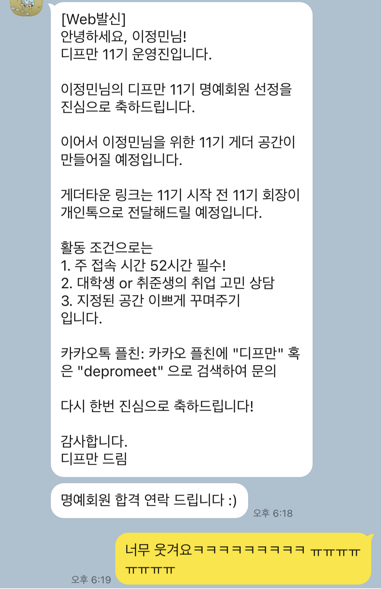
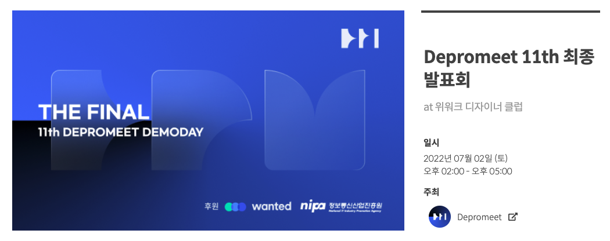

내가 디프만을 시작했던 게 8기, 현재 11기가 끝나가고 있다...! 8기부터 참여했던 사람이 아마 나밖에 없을 것 같기도... 어쩌다 고인물이 되었을까..? 이제 디프만 없이는 못 사는 사람이 된 걸지도... 🤔

디프만은 나에게 꿈의 동아리 같은 느낌이었다. 대학생 나부랭이였던 나에게 현직자와 함께 프로젝트를 해본다는 것은 상상조차 못할 일이었다. 부푼 꿈을 앉고 지원했으나 서류에서 탈락한 적도 있었기 때문에 더욱 더 벽이 높게만 느껴지기도 했다. 2학년이 끝나고 열심히 공부한 것을 바탕으로 8기에 또 지원하게 되었고, 결과는 합격이었다. 엄청나게 기뻤다. 당시 코로나가 크게 유행하기 전이었기 때문에 OT도 엄청나게 기대됐었다.


무려 8기 OT 때 찍었던 추억의 사진. 이 때가 2020년도..?

&nbsp;

## 디자이너와 프로그래머가 만났을 때
대학생 신분으로 혼자서 고군분투했던 때와 달리, 디프만에서는 백엔드, 프론트엔드, 디자인 파트 사람들과 함께 프로젝트를 진행했다. 말로만 들어봤던 회사의 개발자, 디자이너 분들과 함께 프로젝트를 진행한다는 것은 가슴 벅찬 일이었다. 나도 하루빨리 저런 멋진 사람이 되고 싶다는 생각을 많이 하곤 했다.

역시나 동아리는 뭐다? 술이다! 찐 사회인들과 함께 하는 술자리는 엄청나게 즐거웠다. 덕분에 많이 얻어먹기도 했다 ㅎㅎ 8기 중반부터 코로나가 심해지고 오프라인 모임이 중단되었는데, 그전까지 매주 술 마시며 친해졌던 사람들이 지금도 내 친한 지인의 반을 차지할 정도로 소중한 사람들이 되었다.

8기까지는 오프라인 모임을 염두에 두고 모집되었기 때문에 인원수가 상당히 적은 편이었다. 8기의 경우 디자이너가 15명, 개발자가 26명이었다. 지금 11기는.. 합쳐서 거의 80명인데....! 모집 인원이 엄청 늘었는데도 지원자는 점점 많아져 경쟁률은 매 기수 기하급수적으로 늘고 있다..! 일찍 들어가서 다행이야 🥲 지금 지원하라고 하면 아마 떨어지지 않을까..?ㅋㅋㅋ

&nbsp;

## 운영진을 두 번이나 하는 멍청이가 요기잉네
8기가 끝나고 9기에는 운영진으로 합류하게 되었다. 운영진으로 있으면서 프로젝트 참여도 하겠다고 했는데.. 이게 크나 큰 실수였다. 9기 활동기간과 취준이 겹치게 되었고, 나는 팀 운영도 제대로 못하고 프로젝트도 제대로 참여하지 못하는 결과를 낳게 되었다 😭 지금 생각하면 당시 운영진과 팀원들에게 큰 민폐를 끼친 것 같아 죄송스럽기만 하다. 내 상황을 알고 다들 이해해주시긴 했지만, 아쉬움과 후회는 남을 수밖에 없었다. 그나마 참여했던 활동은 디프만 웹사이트 배포..? 9기 이전까지는 웹사이트 관리가 제대로 되지 않았고, 새로 브랜딩을 진행해서 웹사이트를 만들어 배포했다.


9기 당시 웹사이트에 있었던 내 후기글 ㅎㅎ

9기가 끝나고 10기에서도 어쩌다 보니 운영진으로 합류하게 되었고, 프로젝트 참여는 하지 말아야겠다는 현명한 판단과 함께 팀 운영을 맡게 되었다 :) 하지만 모든 것은 어긋나는 법.. 백엔드에서 몇 분이 개인 사정으로 거의 탈주를 하신 바람에 API가 제대로 나오지 못했고, 프론트엔드까지 정신없이 진행되었다. 팀 운영을 맡고는 있지만, 개발에 참여하지 않는 사람으로서 이래라저래라 하는 게 맞는 건지, 어디까지 참견을 해야 하는지 정하는 게 참 어려웠다. 이건 아닌 거 같은데.. 싶었지만 괜히 닦달하는 걸로 보일까 봐 망설였던 것 같다. 지금 생각해보면 참 잘못된 선택이었던 것 같다. 😥 좀 더 적극적으로 이끌었다면 더 나은 결과물이 나올 수 있었지 않을까.. 그럼에도 불구하고 끝까지 프로젝트를 완성시켜 나간 10기 8조 조원들에게 너무 감사할 따름이다. 🥺 힘든 시간 동안 동료애가 끈끈해졌는지, 8조에서 11기 운영진이 세 명이나 나오는 기이한 현상도 벌어졌다ㅋㅋ

&nbsp;

## 나는야 게더 망령
디프만은 10기부터 적극적으로 게더를 도입했는데, 결과는 성공적이었다. 정기 모임이 있는 토요일이 아니더라도 게더에 삼삼오오 모여 떠들고 공부하는 사람들이 많이 생겨났고, 급기야 게더 꾸미기 이벤트를 열거나 따로 게더 건축가를 맡는 운영진이 등장하는 등 재미있는 사건들이 발생했다. 한창 취준으로 바빴기에, 디프만 게더에서 계속 공부하고 그랬던 것 같다 ㅎㅎ 굳이 누가 있는 게 아니더라고 게더에서 흘러나오는 모닥불 소리나 파도 소리를 들으면서 공부하면 집중이 잘 되는 느낌이었다.

그렇게 10기가 끝나게 되었고, 코로나가 완화되어감에 따라 11기는 오프라인으로 할 수도 있지 않을까..?! 하는 기대감이 만연했다. 디프만 사람들이랑 놀고는 싶은데.. 프로젝트는 또 부담된단 말이지.. 하는 생각으로 11기 회장님께 가볍게 툭 던져보았다.

*'혹시 게더 수용인원 남으면, 게더에만 이라도 들어가 있으면 안 될까요?'*

아이디어는 흔쾌히 받아들여졌고, 나는 그렇게 명예회원으로 11기에 참여할 수 있게 되었다.



새로 들어온 11기 분들은 역대급으로 재밌는 분들이 많으셨고, 온라인으로 진행되었음에도 불구하고 만나서 밥 먹고 술도 먹는 등 친목 활동이 활발히 이루어졌다. 게더에서는 주중이고 주말이고 낮이고 밤이고 항상 뽀모도로가 진행되곤 했다.


히히

&nbsp;

## 드디어 오프라인!!



11기도 온라인으로 진행되었지만, 최종 발표만큼은 오프라인으로 진행되었다!!! 이게 얼마만의 디프만 오프라인 모임 🥺

| | |
| - | - |
|  |  |


디프만은 내 인간관계의 대부분이라고 해도 과언이 아닐 정도로 인생의 큰 부분이 되어주었다. 앞으로의 인생에서는 또 어떻게 될지 모르겠지만 :) 적어도 개발자로서의 밑바탕을 많이 키울 수 있었던 보금자리와도 같은 공간이었다. 디프만은 워낙 프로젝트 중심의 기수제 동아리기 때문에 계속해서 활동할 수 있을지 미지수지만,, 그래도 디프만 사람들과 오래오래 함께 하고 싶다 :)


명예회원 4인방 모두 수고많으셨어요 🥰

마지막으로 [디프만 홈페이지 링크](https://www.depromeet.com/) 남기고 총총..

```toc
```