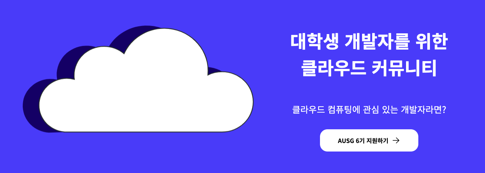
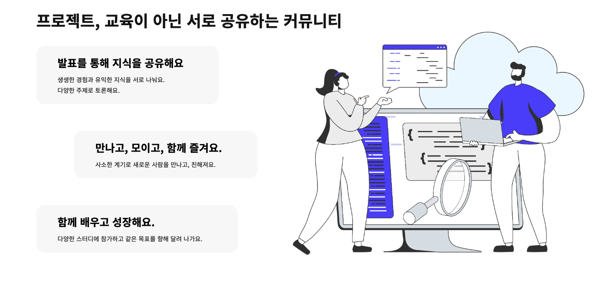
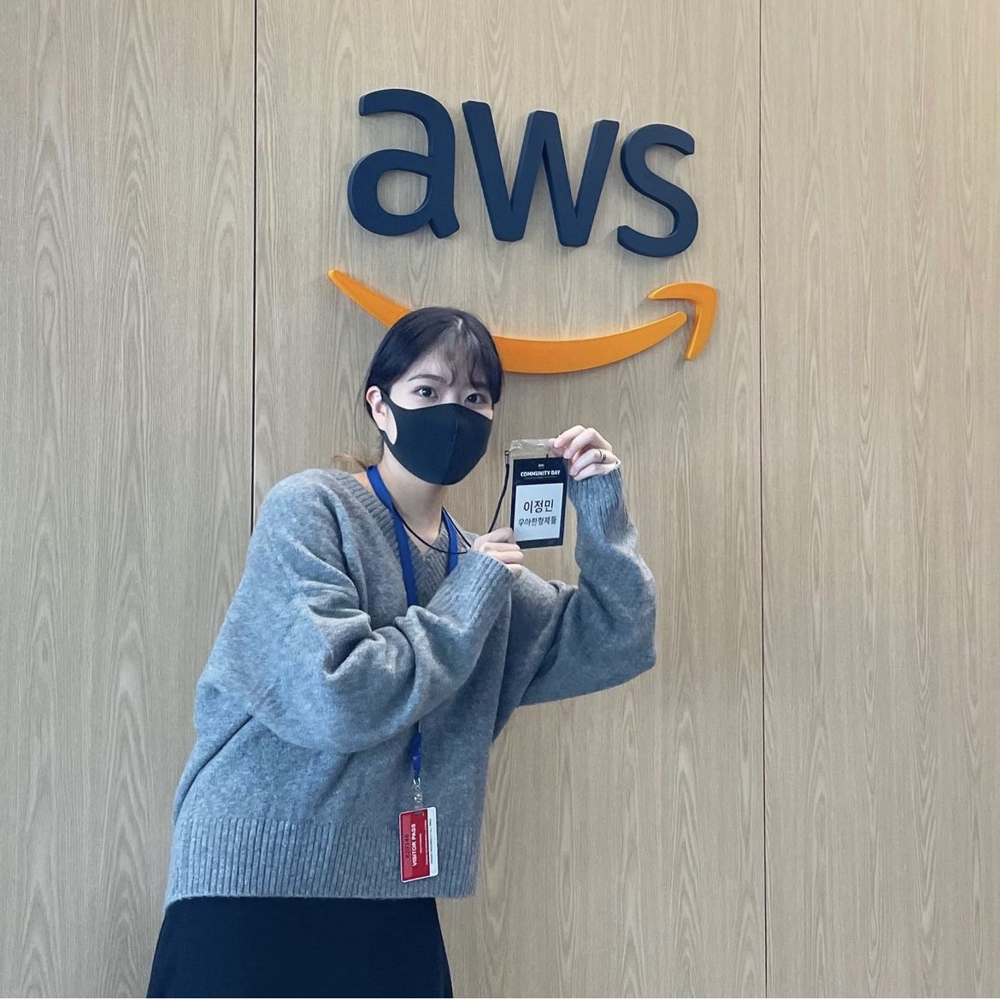
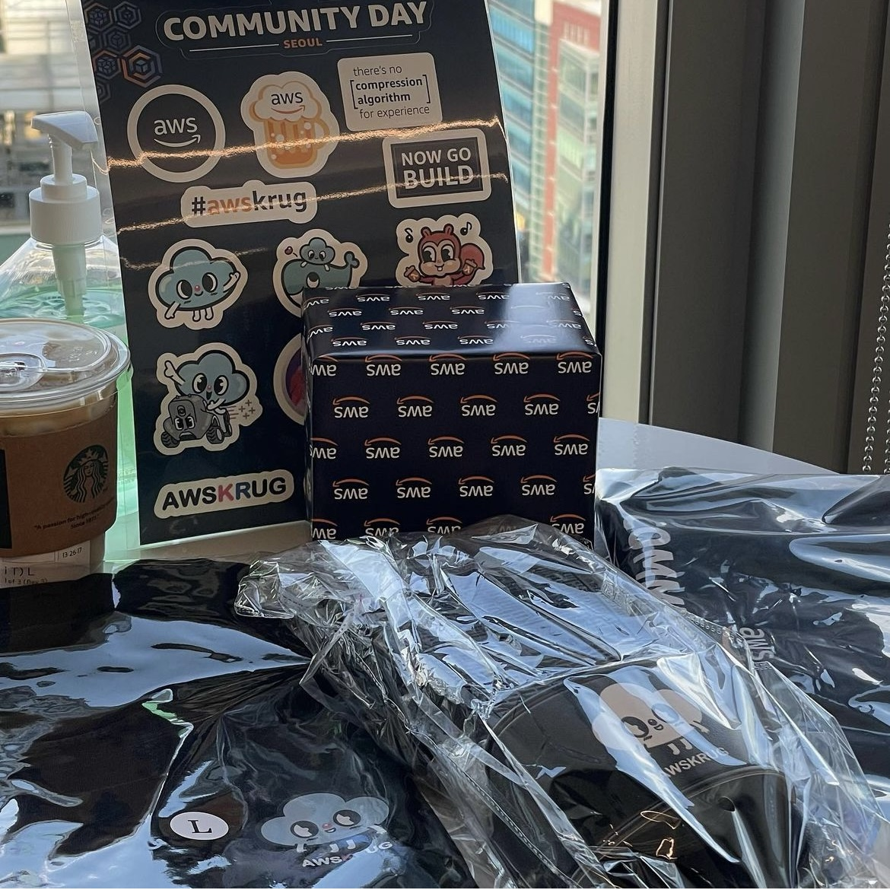
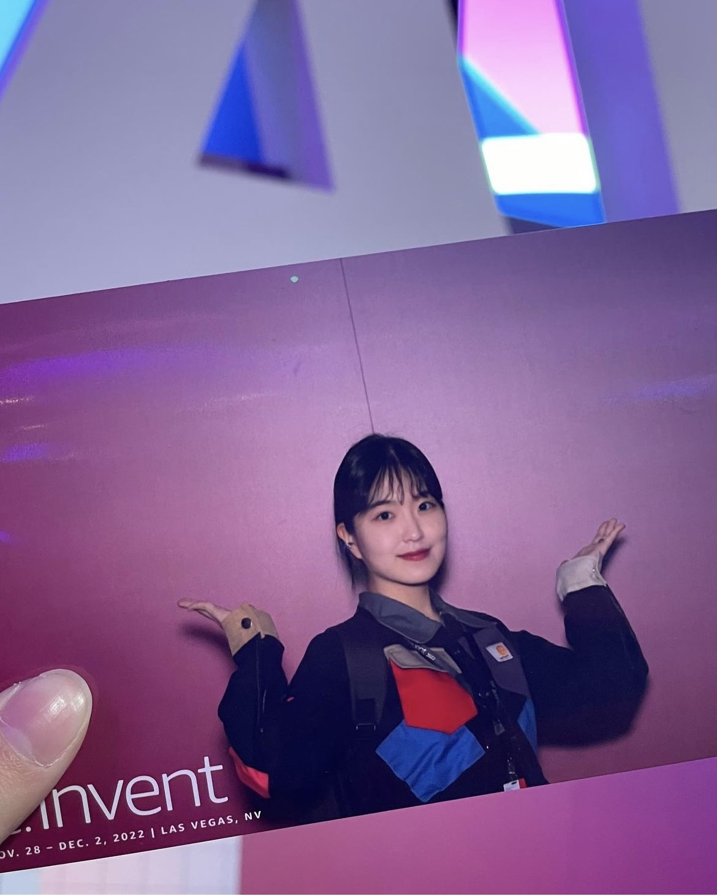
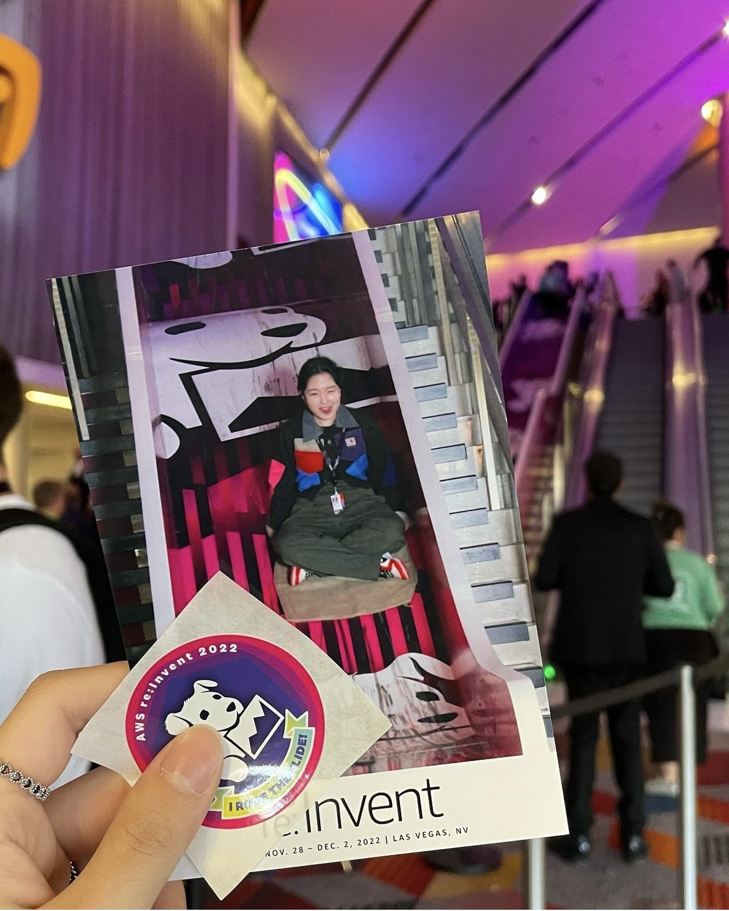
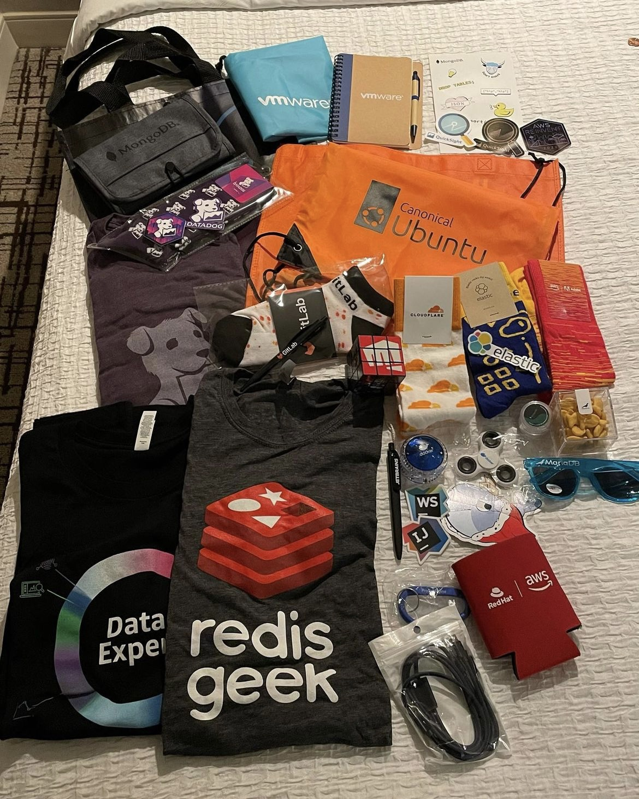
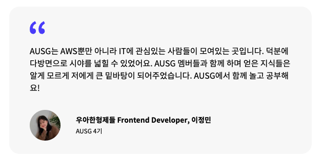

요즘 IT가 붐이긴 한가 보다! 아우쓱 지원자도 매 기수마다 기하급수적으로 늘어나고 있다 👀
나는 4기부터 활동하여 현재 6기 모집이 진행되는 현재까지도 ~열심히~ 활동하고 있는 일원이다 :)



&nbsp;

## AUSG?
아우쓱은 AWSKRUG University Student Group의 약자다. [AWSKRUG](https://awskrug.github.io/)는 AWS 한국 사용자 모임으로, [AUSG](https://ausg.me/)는 AWSKRUG 밑에 소속되어 있는 느낌이면서 대학생들끼리만으로 따로 구성되어 있는 그룹이다. 즉 AWS와 클라우드에 관심 있는 대학생들의 모임인 것인데...

&nbsp;

## 그렇다면 AWS나 클라우드에 대해 잘 알아야 하나요?
그렇진 않다! 사실 나도 하나도 모르고 들어갔기 때문에..ㅎㅎ 심지어 프론트엔드를 막 공부하기 시작할 때쯤 들어갔기에 개발에 대해서도 빠삭한 상태가 아니었다. 대학생 모임이기 때문에 실력이나 커리어보다는 열정을 많이 보는 것 같다. 그때의 열정 어디 갔을까

AUSG에 들어가고 싶었던 이유는 단 하나였다. 커뮤니티성 동아리였기 때문이다. 계속 활동하고 있던 디프만의 경우, 여타 IT 개발 동아리들과 마찬가지로 기수마다 참여 인원이 확실히 다르며 프로젝트 개발이 주가 되었다. 프로젝트 참여에 대한 부담이 주어질 수 있는 다른 동아리들과는 다르게, 보다 유연한 커뮤니티 느낌의 동아리였기에 즐겁게 활동할 수 있을 것 같다는 느낌이 들었다.

물론 이번 6기부터는 코로나가 풀림에 따라 정기적인 오프라인 모임이 진행될 예정이고, 그에 따라 프로젝트에 참여할 수도 있긴 하지만.. 그럼에도 기수의 극명한 구분 없이 모든 구성원들이 자유롭게 활동하고 이야기를 나누는 곳이라는 점은 다른 동아리와 비교했을 때 큰 차별점이라 생각한다.



커뮤니티를 지향하는 동아리답게, 번개도 많이 열리곤 한다. 클라이밍 번개, 등산 번개.. 종착지는 술집인 것 같지만 덕분에 소중한 추억들을 많이 쌓을 수 있었다 :)

그럼에도 불구하고 나는 성실하다고 할 수 있는 멤버는 아니었는데, 그 이유는...

&nbsp;

## 여기 대학생 동아리 맞나요?
너무 멋있는 사람들이 많았기 때문이다. 나는 말도 못 하는 감자.. 🥲 취준에 대한 강박이 아우쓱 때문에? 덕분에? 아무튼? 생겼던 걸지도 모르겠다..! 여기가 대학생 동아리가 맞나 싶을 정도로 내로라하는 기업들에서 개발자로 근무하고 있는 멤버들이 많았다. 물론 1기부터 해서 이전 기수 멤버들이 활동하고 있기 때문인 것도 맞지만, 그 사실은 나에게 엄청 큰 자극제가 되어 주었다. 분명 나랑 나이 차이가 얼마 안 나는데.. 다들 대학생인데.. 갓기업 개발자들이라고..?

그렇다고 지원을 겁낼 필요는 절대 절대 하나도 없다 ㅎ.ㅎ 같은 기수의 경우에는 대부분 평범(?)한 대학생들이다..! 기죽을 필요도 없고 그냥 한 데 어울려 재밌게 놀면 된다! 서로 회사에 인턴 자리가 날 때도 추천해주며 이끌어주기도 한다! 너무 좋은 동아리.. 🥺 [나도 아우쓱에서 만난 인연으로 인턴을 진행한 적이 있다.](https://www.jeong-min.com/2-megazone-cloud/)

&nbsp;

> 이후 내용은 2022년도 말에 추가된 내용입니다.

## 인생에서 잘한 일 중 하나는 AUSG에 들어간 것이 아닐까?

### AWS Community Day Seoul
코로나가 완화되고, AWS 커뮤니티 데이가 오프라인으로 열렸다. 유익한 발표도 듣고, 네트워킹도 할 수 있었던 좋은 시간이었다.

| | |
| - | - |
|  |  |

&nbsp;

### AWS re:invent 2022 Las Vegas
라스베가스에서 열리는 리인벤트에서 Grant 프로그램을 운영한다는 것을 AUSG에서 알게되었다. 주니어 또는 학생을 우대하여 모든 경비를 지원해주는 프로그램인데, 너무 감사하게도 Grant 프로그램에 뽑히게 되어 다른 아우쓱 멤버들과 함께 다녀오는 좋은 경험을 할 수 있었다.

| | |
| - | - |
|  |  |

| | |
| - | - |
|  |  |

&nbsp;

아우쓱이 아니었다면 이런 좋은 경험들을 할 수 있었을까? 내 인생에 큼지막한 획들을 그어준 AUSG에게 너무나도 감사함을 느끼고 있다.


```toc
```