> 사실상 PPT 만든 게 아까워서 쓰는 글.  
> 다시 발표자료를 봤을 때, 가치관이 달라진 부분도 있는 것 같다.  
> 한낱 1년차의 시점으로 만들어진 것이기에 공감 안 가는 부분 있을 수 있음 주의

&nbsp;

나는 디자이너 개발자 협업 동아리, 디프만에서 10기 운영진으로 활동했다. 디프만 10기는 참 많은 일들을 했다. 옥토퍼스 로켓과 함께 애자일 코칭을 진행하기도 하고, 핵클과 함께 A/B 테스트 및 운영 세션을 진행하기도 했다. 오픈부스와의 콜라보도 그 중 하나였다.

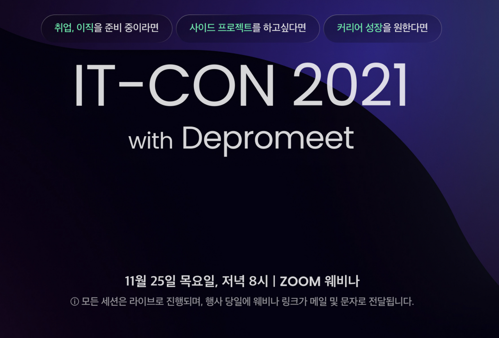

오픈부스는 온라인 박람회 플랫폼을 운영하는 스타트업으로, 디프만과 공동 컨퍼런스를 주최하고 싶다는 연락이 왔다. 오픈부스 측에서는 디자이너 2명, 개발자 2명으로 구성했으면 좋겠다고 전했다.

**"할 사람 없으면 제가 하죠, 뭐."**
그렇게 내가 하게 되었다.

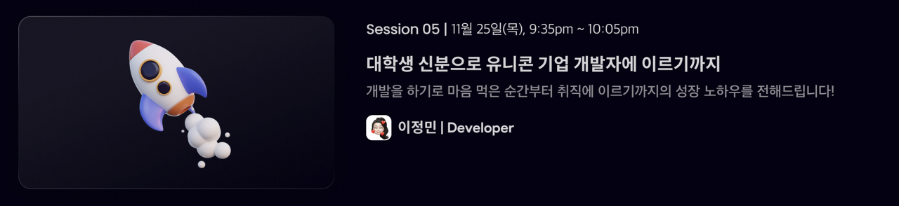

아무 생각없이 시작한 일이었는데, 생각보다 큰 이벤트였다. 페이지에 내 사진이 걸리고 티켓도 5,000원 상당의 가격으로 매겨졌다. 대단한 연사 멤버가 아닌데다 오천원도 부담스러울 수 있는 가격이라 생각했기에 큰 기대를 하지 않았다. 그럼에도 50명이 좀 넘는 사람들이 티켓을 구매했고, 나름 풍성한 컨퍼런스가 진행될 수 있었다.

&nbsp;

## 대체 무슨 주제로 발표를 해야하지?
 
가장 큰 고민이었다. 내노라하는 개발자도 아닌 내가, 개발자로서 얘기할 수 있는 게 대체 뭐가 있지? 개발 기술에 대해 화려하게 얘기하는 것은 불가능하다 생각했다. 그래서 내 이야기를 솔직히 전달해보기로 했다.

그렇게 결정된 발표 주제였다.

&nbsp;

## 대학생 신분으로 유니콘 기업 개발자에 이르기까지

시작은 자기 소개였다. 이름은 이정민, 컴퓨터공학과 4학년 재학중(지금은 졸업했다), 웹 프론트엔드 개발자, 디프만 8기 멤버이자 9-10기 운영진...

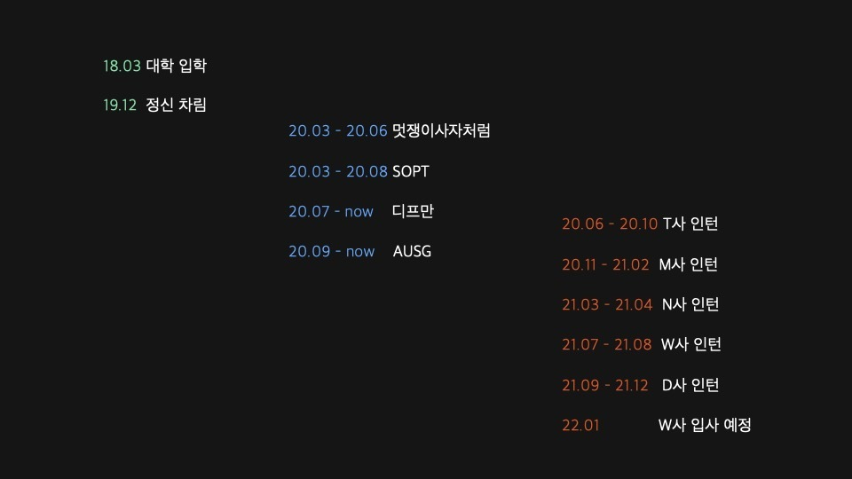

대학 입학 ~ 정신 차림까지의 기간과 인턴 기간이 맞먹는다는 게 나름 유머 포인트였다. 대학 입학 후 어떻게 정신을 차렸고, 어떤 활동들을 시작했고, 어떤 경험들을 했는지 짧게 나열해보고 이 과정에서 느낀 고민, 나누고 싶은 팁, 권장하는 마음가짐 등을 이어서 이야기를 풀어나가보려 했다.

&nbsp;

### 첫 번째 고민은 '나는 과연 개발이 맞는가'였다.

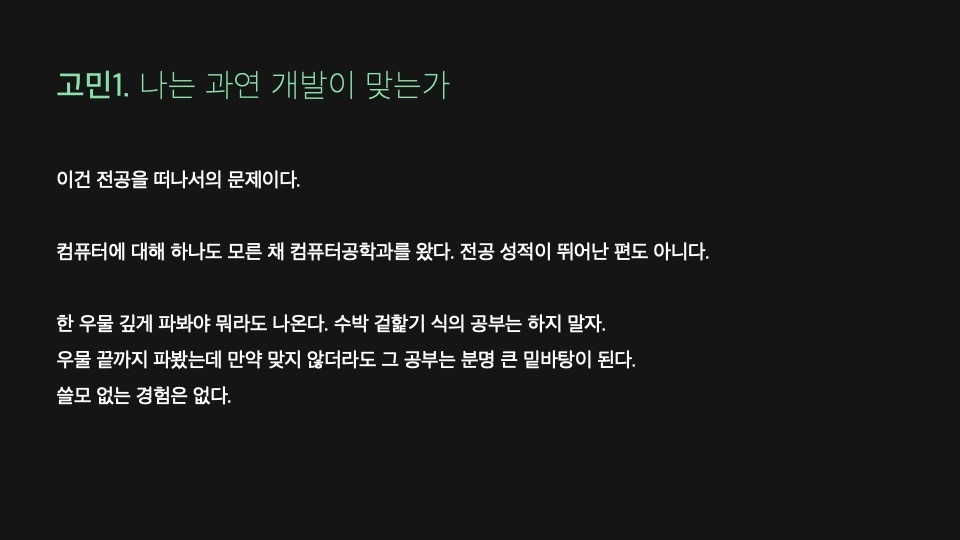

수능이 끝나고, 나는 아무 생각 없이 대학 원서를 작성했다. 그렇게 정말 아무것도 모르는 상태로 개발 공부를 시작하게 되었다. 그렇다보니 개발을 시작하고 초반에는, '나는 과연 개발이 맞는가'에 대한 고민이 수도 없이 들었다.

그런데 생각보다 전공자치고 정말 개발을 어렸을 때부터 할 줄 알아서 온 친구들은 잘 없었다. 그래서 그런지 이런 고민을 하는 지인들을 흔하게 볼 수 있었다. 하지만 이건 정말 전공을 떠나서의 문제인 것 같다. 타고난 개발자들도 있겠지만, 끊임없는 노력과 공부가 답이 아닐까 싶다.

하지만 아무것도 모른다고 너무 가볍게 이것 저것 손대는 것은 지양하는 게 좋지 않을까 싶다. 한 우물 깊게 파봐야 뭐라도 나오지 않을까? 얕게 이것저것 건드리기만 하다보면 남는 게 없을 수도 있지 않을까 싶다. 깊게 해보지 않는 이상 이게 진짜 나한테 맞는 건지 안맞는 건진 알 수 없으니 두려울 수도 있다. 하지만 만약 한 우물 깊게 파봤는데 결국 안 맞더라도, 그것 또한 나중에 큰 밑바탕이 되어줄 것이라 믿는다. 쓸모 없는 경험과 공부는 없는 것 같다.

&nbsp;

### 두 번째 고민은 '어떤 회사를 갈 것인가'였다.


물론 내가 다 잘한다면 어디든 갈 수 있겠지만, 내가 조금이라도 부족한 점이 있다면 그 부족한 점을 최대한 드러내지 않고 내 강점을 잘 살리는 것도 전략이라고 생각했다. 나의 경우 알고리즘 테스트보다는 구현 위주의 과제 테스트가 더 자신있었기 때문에 알고리즘 난이도가 꽤 높은 대기업이나 대규모 공채보다는 상시 채용이나 스타트업 경력 채용, 그리고 인턴 채용을 노렸다.

n년차 이상 모집이라고 되어있더라도 지원은 해 볼 수 있다. 실제로 면접까지 간 회사들도 많고, 최종 면접까지 간 회사들도 있었다. 거기서 묻는 기술 질문들과 과제 테스트들을 습득하는 것도 경험이라 생각했다.

&nbsp;

### 그래서 어떻게 역량을 기를 것인가가 큰 고민이었다.

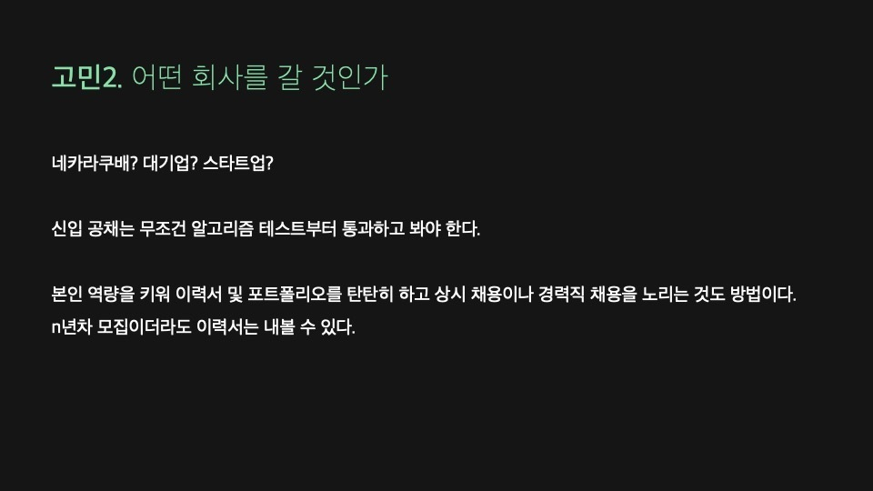

우선 뭐라도 많이 만들어보려고 노력했다. 노마드코더, 인프런 등 좋은 무료 인터넷 강의가 정말 넘친다. 나의 경우, 개발을 아무것도 모르는 상태에서 하려다보니 스스로 흥미를 느끼게끔 하는 게 중요했다. 그래서 클론 코딩을 많이 했다. '내가 쓰는 서비스가 이런 식으로 구현되는구나.'하며 재밌게 느껴졌다.

그렇게 강의나 책을 참고하여 프로젝트를 만든 후에는 다시 복기하며 스스로 처음부터 다시 만들어봤다. 이해를 완벽히 하지 않은 채 강의에서 시키는 대로 하면서 넘어갔던 부분들에서 막히게 되는데, 이 때 스스로 헤쳐나가는 과정에서 정말 큰 공부가 되었다. 또 혼자 개발하더라도 깃/깃허브를 사용하면서 다양한 깃 전략을 시도해보는 것도 좋은 공부가 될 수 있을 것 같다.

이 정도면 팀플에서 1인분은 할 수 있지 않을까?하는 생각이 들기 시작할 쯤, 커뮤니티나 대외활동을 찾아보기 시작했다. 개발은 혼자 하는 게 아니라 여럿이서 하는 거고, 서비스 개발의 경우 개발자끼리만 협업하는 것도 아니기 때문에 협업 경험을 쌓는 게 좋지 않을까 하는 생각이 들었다.

그렇게 시작한 IT 동아리에서 현업자들로부터 좋은 피드백과 팁들을 얻을 수 있었다. 다양한 활동들을 통해 시야가 넓어질 뿐만 아니라 좋은 인맥들을 얻을 수 있었다. 다양한 사람들을 만나면서 서로 취업이나 이직에 도움이 되기도 했고, 밖에서는 잘 알 수 없는 내부 회사 정보, 채용 정보를 얻을 수도 있다.

&nbsp;

### 이력서, 포트폴리오, 면접

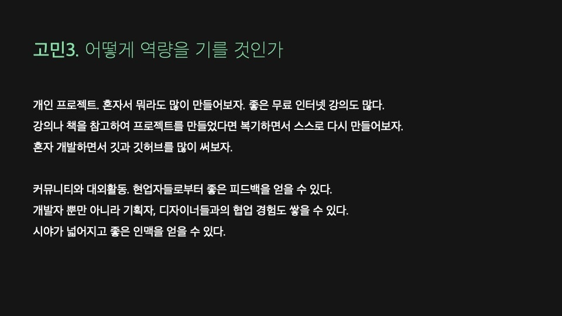

서류의 경우, 정말 제대로 아는 것만, 지원하는 파트에 대한 것만 적는 게 좋지 않을까 싶다. 0개 대충 하는 것보다 하나라도 제대로 아는 게 더 중요하다고 생각한다. 이것저것 해봤다고 다 적었다가 면접에서 답을 제대로 못하면 되려 좋지 못한 인상을 줄 수 있지 않을까 싶다.

프로젝트에 대해 기술할 때는 어떤 기술을 왜 썼는지, 구체적으로 팀에서 어떤 역할을 맡아서 진행했는지를 잘 녹여내면 좋을 것 같다.

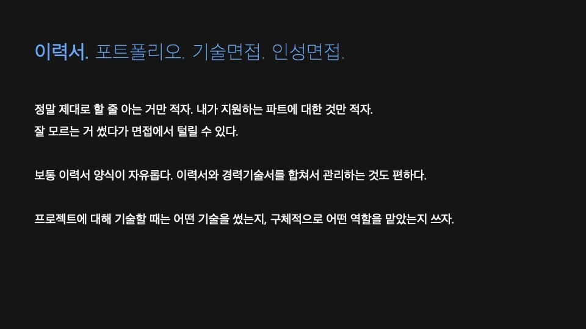

포트폴리오도 정말 중요하다. 깃허브만 잘 가꿔도 좋은 포폴이 되는 것 같다. 주변에 보면 깃허브를 통해 리쿠르팅이 오는 경우도 종종 있었다.

기술 블로그를 운영하는 것은 정말 추천한다. 배운 걸 작성하고 공유하는 것은 단순한 문서화를 넘어 커뮤니케이션의 능력으로 보여지기도 하는 것 같다.

단순히 어떤 기술에 대해 이론적으로 구구절절 설명하는 글이 아니라, **한 프로젝트에서 A라는 기술을 사용하여 어떤 기능을 구현했는데, 어떤 문제가 발생했고, 이 문제를 해결하고자 B라는 기술을 도입하여 어떻게 해결할 수 있었다** 라는 식으로 스토리를 녹여낸 글이라면 정말 매력적으로 보일 것 같다.

하지만 항상 글을 쓸 때마다 드는 생각이지만, 내가 잘못된 정보를 널리 퍼뜨리게 될까봐 걱정이 되기도 한다. 오픈된 매체에 글을 쓸 때는 경각심을 가져야 하지 않을까 싶다.

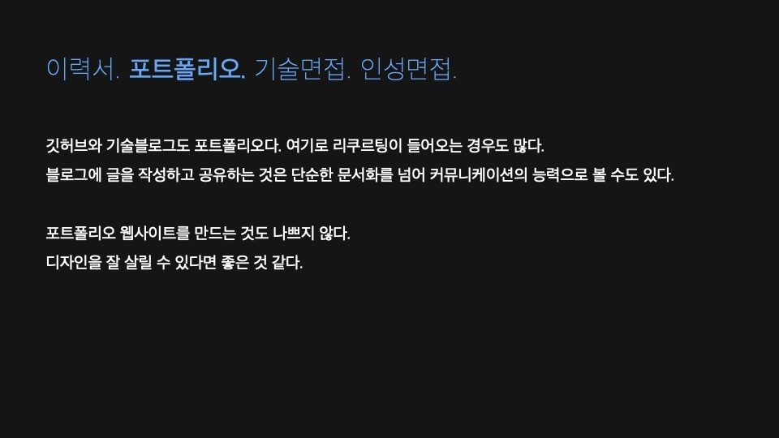

서류에 합격하면 면접을 보게 된다. 면접을 보다 보면 질문의 답을 어떻게 해야할지 모르는 순간이 분명 찾아온다. 하지만 이 때 어설프게 대답을 했다가 꼬리질문이 파고들게 되면 더 대답을 못하게 되고, 면접 흐름이 산으로 갈 수도 있다. 모르는 건 모른다고, 더 공부를 해봐야하는 부분이라고 깔끔하게 자르는 게 훨씬 좋다고 생각한다.

기술면접의 경우 사전 제출한 서류에 적은 기술과 모집공고에 쓰인 기술이 있다면 이에 대해 탄탄히 준비해야 한다. 그 기술이 어떤 기술인지에 대한 이론 뿐만 아니라, 왜 하필 그 기술을 선택했고 어떤 장단점이 있었는지까지 잘 답할 수 있다면 좋을 것 같다.

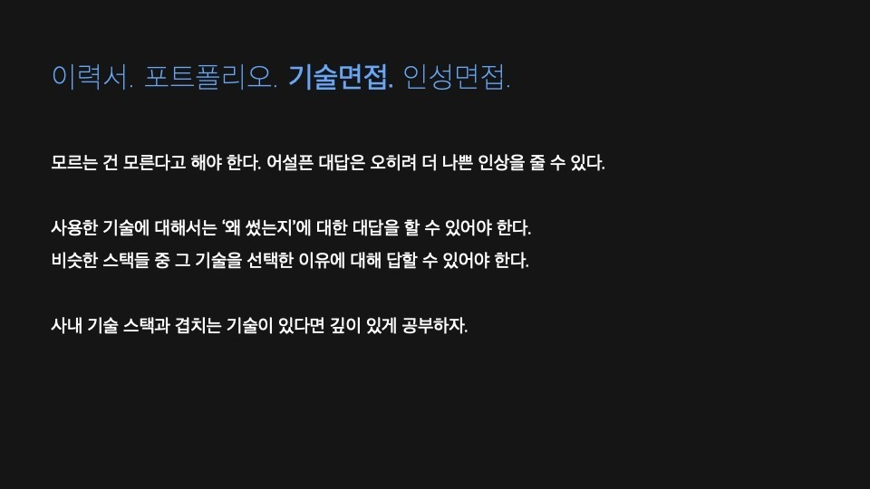

최종면접은 보통 인성면접, 컬쳐핏 면접이다. 지원하는 회사의 인재상을 파악하는 것이 무엇보다 중요하지 않을까 싶다. 회사와 관련된 블로그나 책이 있다면 읽어보면 좋을 것 같다.

왜 다른 회사들 말고 이 회사에 지원했는지, 이 회사에서 새롭게 시도해보고 싶은 게 뭐가 있는지를 깊게 고민해보면 좋을 것 같다. 이 회사에 지원한 이유가 명백하고, 그 이유와 회사의 지향점이 일치하고, 회사의 방향성과 맞는 아이템을 고민해 본 흔적도 보인다면 정말 매력적이지 않을까?

신입 인성면접에서 보통 공통적으로 보는 건 성장의지가 있느냐, 발전가능성이 크냐, 커뮤니케이션이 잘 되냐 인 것 같다. 본인의 능력을 객관적으로 어필하는 것과 자랑하는 것은 다르고, 배울 게 많고 공부하고 싶은 게 많다고 어필하는 것과 부족함을 보이는 것은 다르지 않을까 싶다. 스스로를 매력적으로 잘 어필하는 방법을 깨닫는 것은 참 어려운 것 같다.

발전가능성이라는 말, 참 애매한 말이다. 어떻게 내가 미래에 더 나은 사람이 될 것이라는 걸 보여줄 수 있는 것일까? 개인적으로는 공부기간이 짧고 경력이 짧을 수록 더 극대화되어 보이는 부분인 것 같다. 개발을 한달정도 했는데 0에서 10까지 성장한 사람, 개발을 10년 정도 했는데 9년차때쯤과 비교했을 때 50부터 55까지 성장한 사람. 후자가 당장은 아는 게 더 많을지라도, 발전가능성만 따져보자면 전자가 훨씬 높은 게 아닐까? 한달차에 10을 보여주었으니, 10년 후에는 100까지 보여줄 수 있을지도 모르니 말이다.

&nbsp;

### 정말 기회는 스스로 만들어나가야 하는 것 같다.


5번의 인턴을 경험했지만 그 5번의 기회가 저절로 온 것은 아니었다. 조금씩 기회를 호시탐탐 노리며 뭐라도 경험하려 했고, 그렇게 얻은 기회를 통해 인턴을 할 수 있었고, 그렇게 인턴을 하면서 얻은 경험을 통해 또 새로운 기회를 얻어 나갈 수 있었다.

그 과정 속에서 '이게 과연 도움이 될까?'싶었던 순간이 한 두번이 아니었지만, 언젠가 다 도움이 되고 또 다른 기회의 문이 되어주었다. 회사 스택이 마음에 안들었던 때도 있었는데, 후에 다른 회사에서 해당 스택이 도움이 되었던 적도 있었다. 어쨌거나 결국엔 다 도움이 되곤 했다. 우선은 해보자는 마인드가 중요한 것 같다.

&nbsp;

### 정말 쓸모없는 경험은 없는 것 같다. 

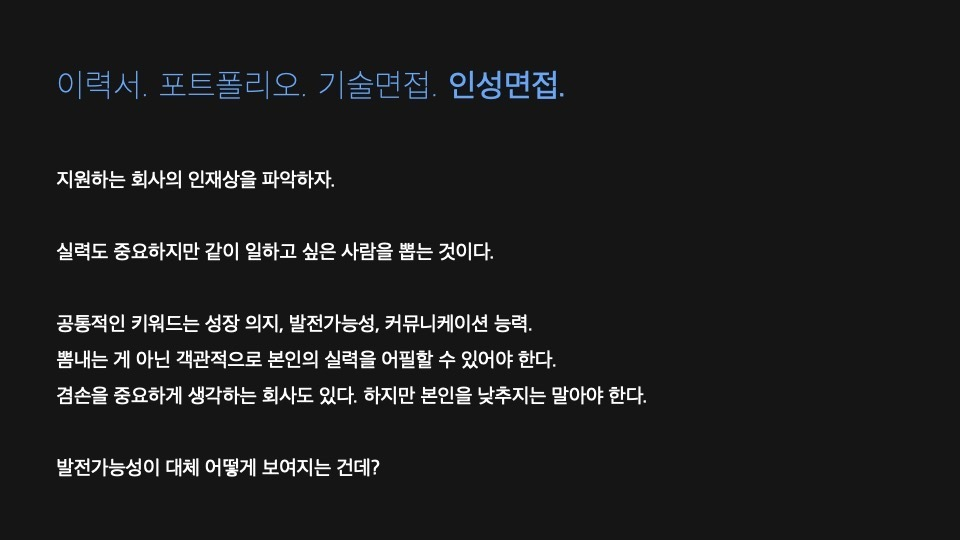

인턴 사이에 한 3개월 정도의 공백기가 있었는데, 이 때 크게 번아웃이 올 뻔 했다. 하지만 멈춰있을 수는 없었다. 뭐라도 경험해보자는 생각으로 관심있는 회사에 다 지원서를 냈다. 이 때 면접을 정말 많이 봤고 정말 많이 떨어졌다.

누구는 왜 붙지도 못할 회사들을 지원해서 자꾸 면접을 보냐고 생각할 수도 있겠지만, 이 때의 면접 경험은 추후 중요한 전환 면접에서도 큰 도움이 되어주었다. 결과가 어떻든, 과정을 통해 얻은 경험은 좋은 인사이트가 되어주고 무엇과도 바꿀 수 없는 자산이 되어준다고 생각한다.

&nbsp;

### 어떤 선택이든 후회가 따른다고 생각한다. 다만 후회가 적은 선택들을 해나가는 것이 최선일 뿐이다.

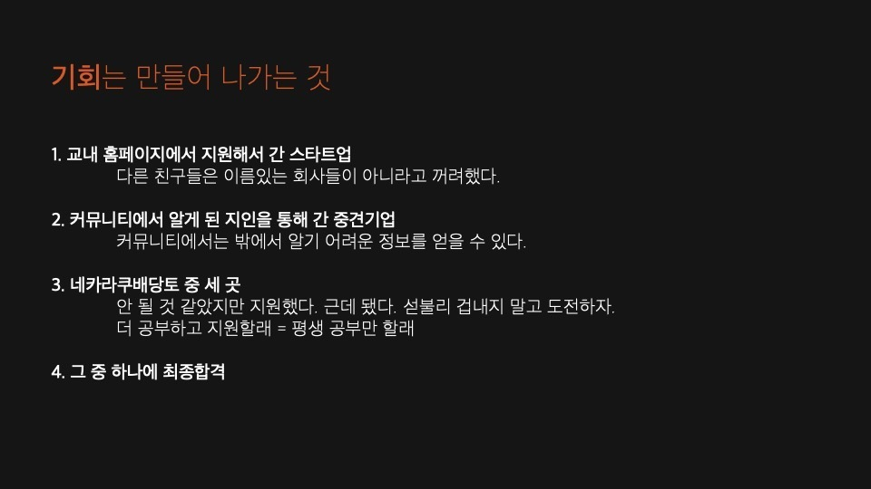

그러던 중 한 스타트업에 최종합격을 하게 되었는데, 합격의 기쁨도 잠시 연봉협상이 잘 되지 않았다. 빨리 취업을 하고 싶다는 마음이 너무 컸기 때문에 오퍼를 받아들이고 후에 연차를 쌓으면서 연봉을 올릴까도 고민했었다.

심란한 마음을 잠재우고, 내가 정말 원하는 게 뭔지 다시 한 번 곰곰이 생각해봤다. 나는 첫 회사이고 첫 취준인 만큼 나쁘지 않은 연봉에 나쁘지 않은 네임밸류를 원했다. 당장의 달콤함보다 후에 느낄 후회가 더 클 것이라 판단했고 결국 입사제안을 거절하고 다시 취준에 들어갔다. 당시에는 정말 힘들었지만, 돌이켜보면 만약 그때 취업을 했더라면 두고두고 후회했을 것 같다.

&nbsp;

### 너무 스스로를 탓할 필요는 없지 않을까 싶다.

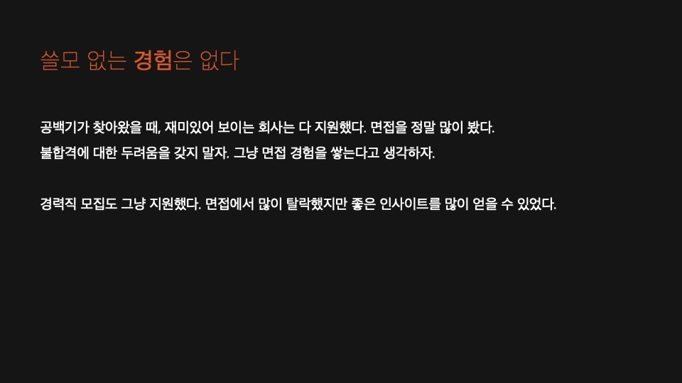

나도 그랬고 내 주변 사람들도 모두 그랬듯이 많은 취준생들이 부정적인 생각을 많이 하는 것 같다. 왜 나는 안 될까. 뭐가 문제일까. 이런 생각들은 스스로를 갉아먹는다. 물론 문제를 발견한다면 고쳐야겠지만, 너무 스스로를 탓할 필요는 없지 않을까 싶다. 다 때가 있는 법이고 맞는 곳이 있는 법이고 언젠간 취업하게 되는 것 같다. 내가 떨어진 곳에 남이 붙고 남이 떨어진 곳에 내가 붙는 게 취업이더라.

---

한 번 뿐인 인생, 과연 개발자로서 어떻게 살아가고 싶은지, 궁극적으로 어떤 사람이 되고 싶은지를 고민하며 살아가면 더 즐겁고 알차게 살 수 있지 않을까란 말을 끝으로 발표를 마쳤다. 내 문장들이 적어도 내 발표를 들어주신 분들께만이라도 공감을 얻을 수 있었다면 더 바랄 게 없을 것 같다 :)

취준을 하면서 제일 힘들었던 것은 행복을 정의하는 것이었다. 마냥 학생일 때는 지금은 1학년 내년엔 2학년.. 그냥 아무 걱정없이 하루하루를 즐겁게 살아갔는데, '이제 난 뭘해야 하지?'라는 의문과 함께 당장 눈 앞의 미래가 종잡을 수 없게 되자 하루하루가 허무하고 힘들었다.

대체 뭘 해야 행복할까? 왜 이렇게 아등바등 살고 있는 걸까? 라는 물음으로 스스로를 절벽에 몰아세우곤 했다. 그럴 필요까진 없었을 텐데. 나무를 보지 말고 숲을 봐야 했는데 말이다. 지금이라도 그렇게 살면 되지, 뭐 :)

```toc
```