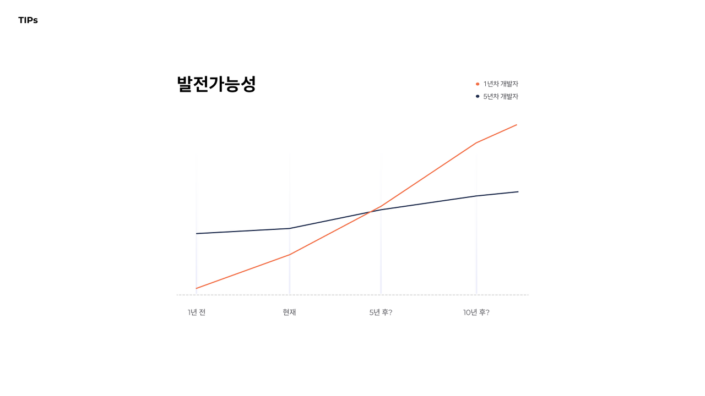

> 사실상 PPT 만든 게 아까워서 쓰는 글.  
> 다시 발표자료를 봤을 때, 가치관이 달라진 부분도 있는 것 같다.  
> 한낱 1년차의 시점으로 만들어진 것이기에 공감 안 가는 부분 있을 수 있음 주의

&nbsp;

경희대학교 컴퓨터공학부에서는 최근 TechKHU Concert라는 IT 테크 콘서트를 꾸준히 주최하고 있다. 경희대 컴공 졸업생들이 연사로 참여하여 후배들에게 조언과 팁을 제공하는 자리인데, 어쩌다 보니 내가 연사로 참여하게 되었다 🥲 (복학한 남자 동기들이 대부분 과장, 동장을 맡고 있다 보니 자연스레 제의가 들어왔다.)


엄청 예쁘게 만들어주신 카드 뉴스!!

사실 재학생 입장에서 어떤 이야기들이 도움이 될까를 고민을 해봤지만, 역시나 기술적인 이야기보다는 공부나 취업에 대한 이야기가 더 고프지 않을까 생각이 들었다. 그래서 이전에 [오픈부스 컨퍼런스에서 발표했던 내용](https://www.jeong-min.com/12-openbooth/)과 비슷한 이야기를 또 풀어낼 수밖에 없었다.

그때의 발표 내용을 다시 살펴보니, 조금 공격적인 말투도 있었던 것 같고 PPT 자체의 전달력이 조금 떨어진다고 느꼈다. 그리하여 대대적인 수정 작업에 들어가게 되었다.

그 당시의 발표 제목은 **대학생 신분으로 유니콘 기업 개발자에 이르기까지**였지만, 고민 끝에 조금 과격한 웃음 포인트를 넣어 **개망나니에서 개발자가 되기까지**라는 제목으로 수정했다.

(그리고 tmi이지만 피그마를 다룰 줄 안다면 발표자료 준비할 때 피그마 쓰는 것 강추..! 정말 최고,,🥺)


이야기를 시작하기에 앞서, 내가 지나온 시간들을 시각적으로 보여주고자 했다. 얼마나 많은 기간을 허비했는지, 그리고 얼마나 짧은 기간에 극적으로 노력을 했는지 더욱 실감 나게 표현이 된 것 같다.


"정신 차림"의 기간 동안 가장 큰 도움이 되어준 것은 '오픈소스SW개발'이라는 전공필수 과목이었다. 경희대 컴공이라면 들어야 하는 과목인데, 일반적인 컴공 전공과목과는 다르게 실무적인 내용을 많이 다루는 과목이다.

자바스크립트, 노드, 깃, AWS, 도커 등 일반적인 서비스 개발에 있어 배워두면 좋을 내용들을 배우게 되는데, 해당 과목을 통해 처음 웹 개발을 접하게 되었고 그때 재밌었던 경험을 바탕으로 진로를 잡아나갈 수 있었다. 혹시 이 글을 읽는 개발자 지망 경희대생이 있다면 저 과목을 꼭!!! 들어보시길 바랍니다 ㅎㅎ

아래의 고민들은 모두 실제로 내가 심각하게 고민했던 내용들이다. 나는 많이 방황했고, 학점도 좋지 않았고, 알고리즘 실력도 자신 없는 일개 학부생이었다.


어쨌거나 그런 고민들을 거쳐서 결국 취업을 하게 되었고, 그 과정에서 했던 생각들, 도움이 되었다고 느꼈던 팁과 마음가짐 등을 이야기하고자 했다.

### 첫 번째 생각, "나는 과연 개발이 맞는가?"


이어서 T자형 인재에 대한 이야기를 풀어나갔다. 코틀린, 노드, 파이썬 등등 나도 얕게 해 본 게 많긴 하지만, 어쨌거나 프론트엔드라는 중심을 잡아가며 공부했었기에 밑바탕 지식을 빠르게 습득할 수 있었다고 생각한다.


### 두 번째 생각, "어떤 회사를 갈 것인가?"


어쩌면 너무 속물적인 말일 수도 있겠지만, 후배들에게 진심 어린 조언을 해야 하는 입장에서 초봉 이야기를 하지 않을 수가 없었다. 나도 선배들에게 정말 많이 들었던 이야기다. 물론 회사도 중요하지만, 돈도 중요하다고,, 😂 맞는 말이긴 하다. 주변에 낮은 초봉으로 시작한 지인들에게 들은 바로는 지금의 높은 연봉을 받기까지 정말 피나는 노력을 했다고 한다.


### 세 번째 생각, "어떻게 역량을 기를 것인가?"


개인 프로젝트 경험이나 대외활동 경험은 필수적이지만, 인턴 경험은 필수적이진 않다고 이야기했다. 그럼에도 개인적으로 인턴을 여러 번 하면서 그 회사의 분위기도 엿보고 실무 경험도 간접적으로 쌓고 했던 경험들이 너무 좋았기 때문에, 성장과 경험을 목적으로 한다면 인턴이 정말 큰 도움이 될 수 있을 것 같다고 전달했다.

그다음으로는 이력서, 포폴, 면접에 대한 팁들에 대해 이야기했다.


파이썬, 루비, 코틀린.. 얕게 했던 것들을 나열해보자면 수도 없겠지만 그런 것들을 이력서에 쓰지는 않았다는 것과, 프로젝트도 프론트엔드에 관한 것들만 뽑아서 적었다는 것을 보여주고 싶었다.


그리고 이어서 발전 가능성에 대한 이야기를 덧붙였다. 확실히 시각적인 그래프를 사용하면 전달력이 더 좋아지는 것 같다.



최대한 많은 팁들을 나눠주고 싶었지만,, 알고리즘은 어쩔 수가 없었다. 나는 알고리즘에 약한 사람이기에,, 😢


어쩌면 운이 좋았다고 할 수도 있을 것 같다. 나는 이제껏 거친 인턴 채용 전형에서 난이도 높은 알고리즘 문제를 경험하진 않았다. 알고리즘에 약하다고 스스로 생각했고, 그래서 더욱더 프로젝트 경험과 실무 경험을 쌓으려고 애썼던 것 같다. 그렇다고 그게 알고리즘이 중요하지 않다는 건 절대 아니라는 말도 덧붙였다. 경시대회 수준의 엄청난 난이도의 알고리즘이 실무에 사용되는 일은 없을지 몰라도, 알고리즘을 잘 알고 있다면 복잡한 로직을 구현할 때 더욱 효율적으로 빠르게 구현할 수 있는 건 사실이라는 것과, 실제로 나는 알고리즘을 제대로 공부하지 않았던 걸 많이 후회하고 있다는 것,,,

그리고는 발표를 끝마치면서 몇 가지 마음가짐에 대한 조언들을 덧붙였다.

1. 기회는 만들어 나가는 것이다.
2. 쓸모없는 경험은 없다.
3. 후회 없는 선택을 하자.
4. 자만심은 멀리하되 자신감을 가지고, 겸손은 하되 자책하지는 말자.
5. 재미있게 살자.

```toc
```