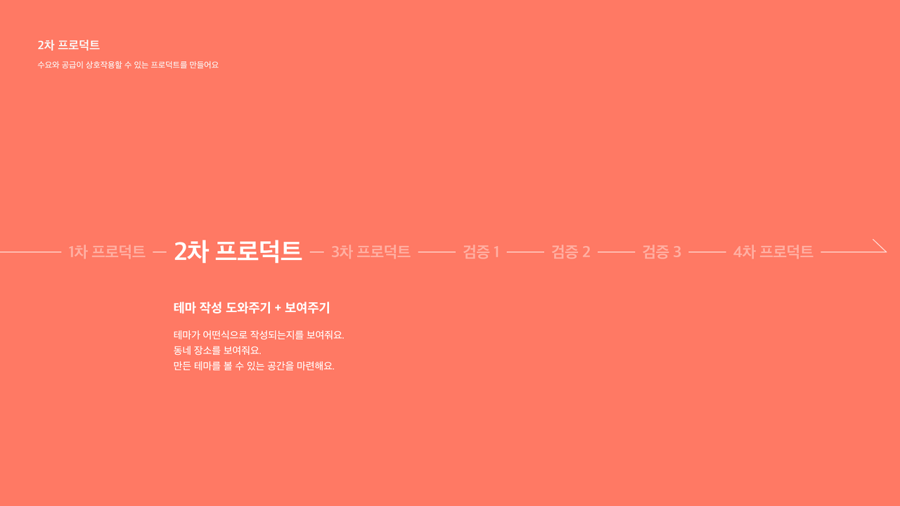
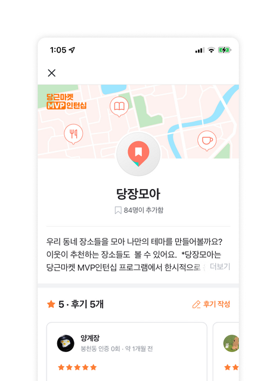
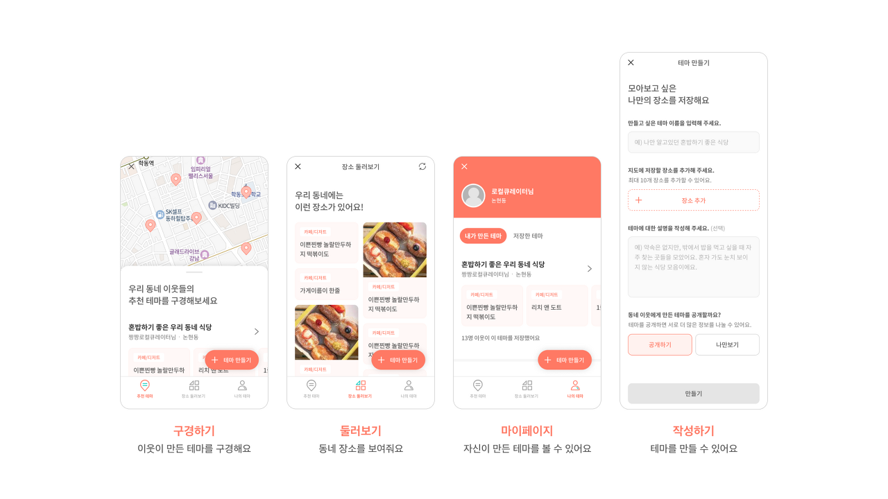
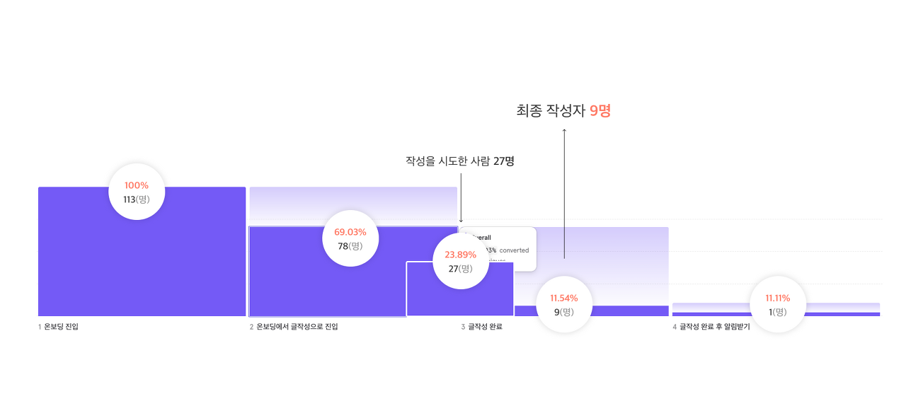

## 2차 프로덕트

### 수요와 공급이 상호작용할 수 있는 프로덕트를 만들어요



**" 테마 작성이 어려운 걸까? "**  
그럼 텍스트 필드에서 자세한 예시를 보여주고, 작성완료된 글이 어떻게 보이는지도 함께 보여주면 어떨까?

**" 저장할 만한 장소가 떠오르지 않는 걸까? "**  
그럼 동네 장소들을 여러 개 보여주면 어떨까?

**" 만든 테마를 볼 수 있는 곳이 없어서일까? "**  
그럼 만든 테마를 볼 수 있는 공간을 마련해주면 어떨까?

테마에 대한 **예시를 구체화한다면** 테마 작성이 쉬워지지 않을까?  
**동네 장소들을 보여준다면** 테마에 추가할 장소들을 떠올리기 쉬워지지 않을까?  
**만든 테마를 볼 수 있는 공간이 있다면** 테마를 만들고 싶어 하지 않을까?

이 가설에 대한 검증을 진행해보고자 테마 작성 기능을 개선하고, 엔터테인 요소인 둘러보기 기능을 추가했다.



우리는 이 검증을 거치기 위해 프로덕트를 우선적으로 만들어서 **당근마켓 생활서비스 내에 런칭**해보기로 했다. 당장모아 서비스는 **수요와 공급이 함께 보이고 상호작용이 되는 서비스**라는 것이 큰 특징이다. 그래서 앞서 만들었던 작성 기능에 이번 검증 요소들을 추가하여 전체적인 프로덕트를 만들어보기로 했다.



**추천 테마**에서는 이웃들이 만든 테마를 구경할 수 있고,  
**장소 둘러보기**에서는 동네 장소들을 둘러볼 수 있고,  
**나의 테마**에서는 자신이 만든 테마를 볼 수 있도록 했다.

각각의 페이지는 하단 탭 바를 통해 이동할 수 있고, 테마 작성의 경우 플로팅 버튼을 통해 진입할 수 있도록 구현했다.

&nbsp;

### 2차 프로덕트의 결과는...?



이번에도 결과는 많이 아쉬웠다. 여전히 작성하는 사람은 적었고 저장한 사람도 없었다. 이는 공급된 글이 없었기에 나온 결과라고 판단했고, **우선 공급을 해결하는 것**을 목표로 세웠다.

### 그렇다면 어떻게 해야 공급과 수요를 늘릴 수 있을까?

#### 1. 공급을 늘리기 위해
- 장소만 저장 가능하다면 테마 생산이 늘어날까? (장소 저장 기능)
- 처음부터 테마를 만들지 않고도 생각나는 장소들을 저장해놓을 수 있도록 하면 어떨까? (기본 테마 제공)
- 저장하고 싶어 할 만한 장소들만 보여주면 저장할까요? (둘러보기 개선)

공급을 늘리기 위해서는 유저가 많이 작성해줘야 하는데, 현재 작성하기의 프로세스는 상당히 어렵고 번거로운 게 사실이었다. 그래서 **우선 장소만 저장해놓고 테마를 후에 구체화할 수 있도록 해보면 어떨까** 하는 방안을 생각했고, 이를 위해 **장소 저장 기능**과 **기본 테마***를 제공하기로 했다. 또 **둘러보기**가 엔터테인 요소임에도 불구하고 매력도가 떨어진다고 판단해 함께 개선하기로 했다.

#### 2. 수요를 늘리기 위해
- 저장할 만한 테마를 보여주면 유저도 저장하지 않을까? (우리가 좋은 테마를 만들어서 보여주자!)

수요가 많이 일어나면 공급도 자연스레 늘 것이라 생각했고, 우리가 직접 좋은 테마들을 작성해서 수요를 늘려보고자 했다.

&nbsp;

### 그렇게 이 기능들을 추가한 3차 프로덕트 구체화를 시작하게 되었다

```toc
```