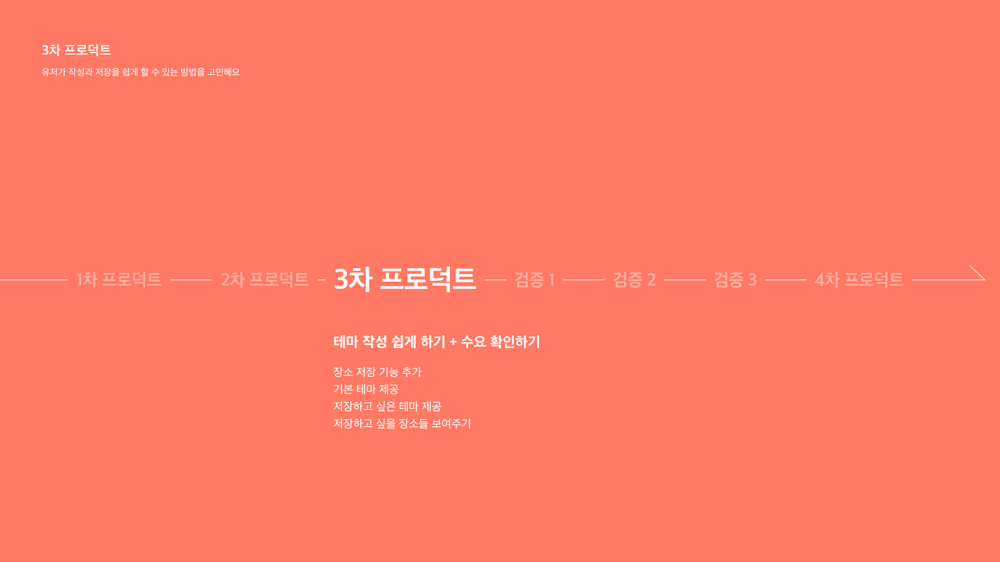
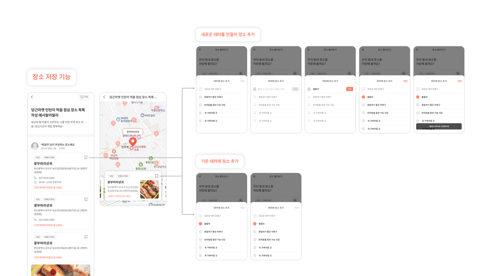
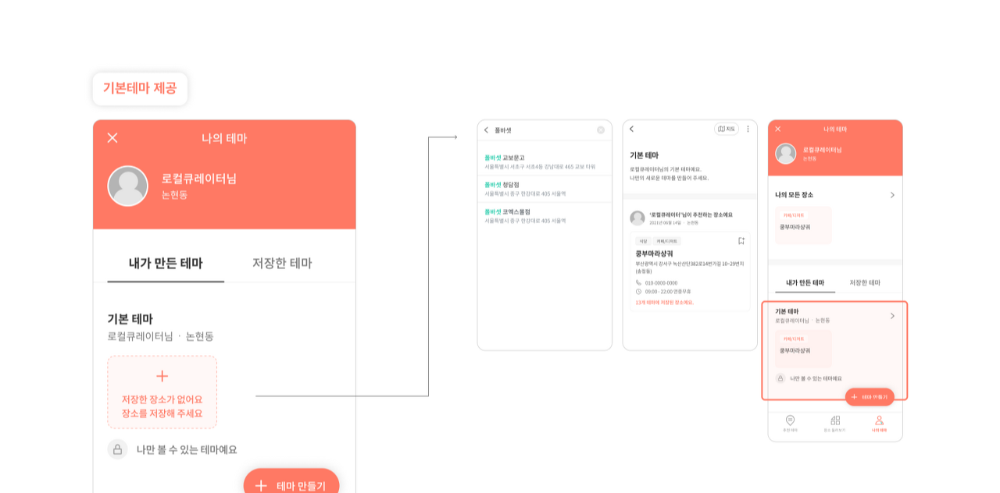
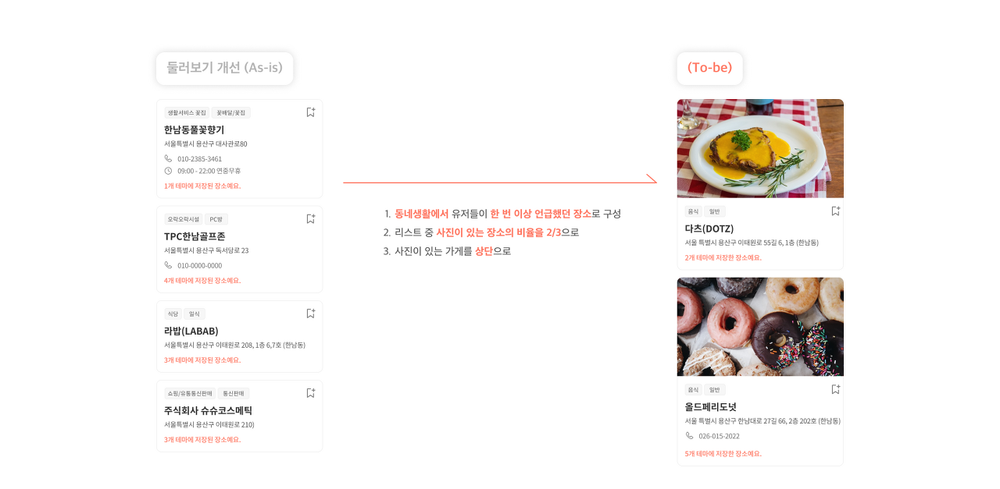
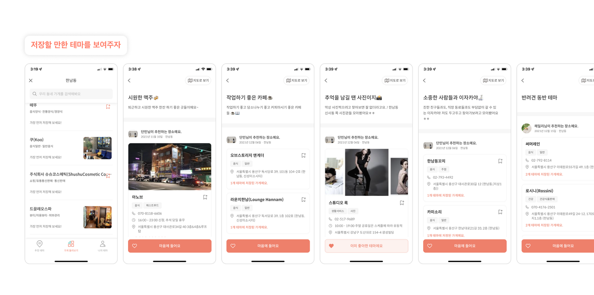
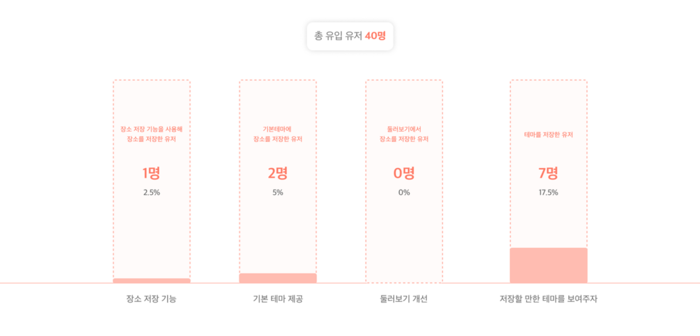
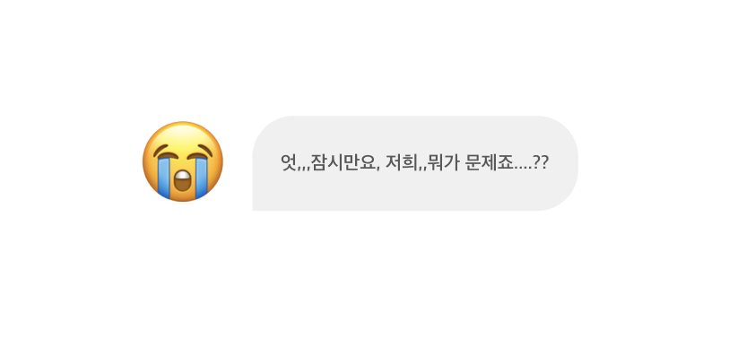

## 3차 프로덕트

### 유저가 작성과 저장을 쉽게 할 수 있는 방법을 고민해요



## 1. 공급을 늘리기 위해

### 1-1. 장소만 저장 가능하다면 테마 생산이 늘어날까? - 장소 저장 기능



장소만 저장할 수 있다면 테마 작성이 더 쉬워지지 않을까? 그래서 기존 장소 카드에서 바로 테마에 저장할 수 있도록 개선했다. 이때 **새로운 테마를 간단하게 바로 만들어 추가할 수 있는 방법**과 **기존 테마에 추가하는 방법** 2가지를 제공했다.

&nbsp;

### 1-2. 처음부터 테마를 만들지 않고도 장소들을 저장할 수 있도록 하면 어떨까? - 기본 테마 제공



기본 테마를 제공한다면 테마 작성에 대한 부담감을 덜어줄 수 있지 않을까? 우선적으로 기본 테마에 장소들을 쉽게 추가할 수 있게 되니, 테마를 떠올려야 한다는 부담감을 덜고 좀 더 테마 작성이 쉬워질 것이라 판단했다. 그래서 회원가입을 하면 **기본 테마를 비공개로 하나씩 제공**하고, 카드를 터치해서 바로 장소를 추가할 수 있도록 구현했다.

&nbsp;

### 1-3. 저장하고 싶을 만한 장소들을 보여주면 저장할까? - 둘러보기 개선



그래서 기존에 무작위로 보였던 둘러보기를 개선했다. **당근마켓의 동네생활** 탭에서 한 번 이상 언급된 장소들을 골라, 그 중 사진이 있는 장소들의 비율을 높이고 상단에 배치했다.

&nbsp;

## 1. 수요를 늘리기 위해

### 2-1. 저장하고 싶을 만한 테마를 보여주면 저장할까?



저장할만한 테마들이 많으면 자연스레 수요가 늘고, 그에 따라 공급도 늘지 않을까? 우선 우리가 공급을 하면, 우리가 만든 테마를 통해 테마 재생산이 일어날 것이라 기대했다.

그렇게 맥주가 시원한 술집, 일하기 좋은 카페, 동네 사진관 모음, 반려동물 동반 가능 식당 등 체적인 테마들을 총 **32개** 정도 작성해보았다.

&nbsp;

### 3차 프로덕트의 결과는...?



이번에도 결과는 좋지 않았다. 유입된 **40명의** 유저 중, 장소 저장 기능을 사용한 유저는 **1명**, 기본 테마를 사용한 유저는 **2명**, 둘러보기에서 장소를 저장한 유저는 **아무도 없었고**, 우리가 작성한 테마를 저장한 유저는 **7명**이었다.



여기서 우리는 두 가지 방향을 놓고 고민하기 시작했다.

&nbsp;

**"서비스를 더 발전시킬까요? 우리가 목표한 기능은 아직 남았잖아요."**  
**"음.. 그래도 서비스의 어디가 부족한지, 왜 유저가 안 쓰는지를 분석하고 개선하는 게 좋지 않을까요?"**

&nbsp;

결론적으로 프로덕션 개발에만 신경 쓰느라 처음부터 놓친 검증이 많았다고 판단했고, 이렇게 **테마에 대한 검증도 제대로 거치지 않은 상태에서 무작정 프로덕트만 더 디벨롭하는 게 맞는지**에 대한 의문이 들었다.

&nbsp;

### 그렇게 우리는 처음부터 다시 짚어가며 검증을 해보기로 했다.

```toc
```