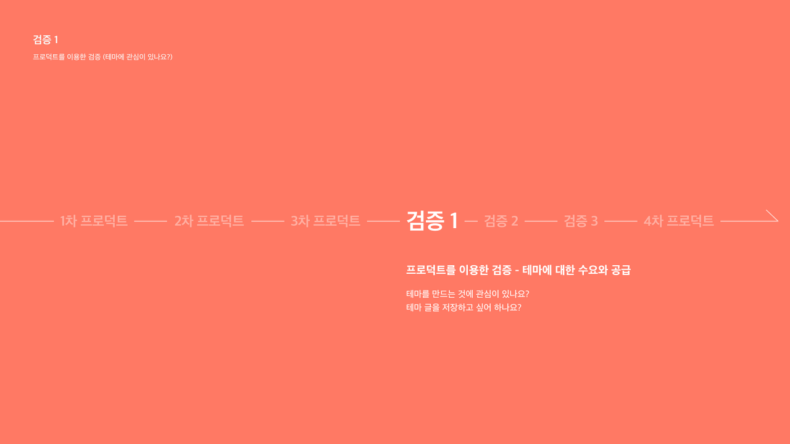
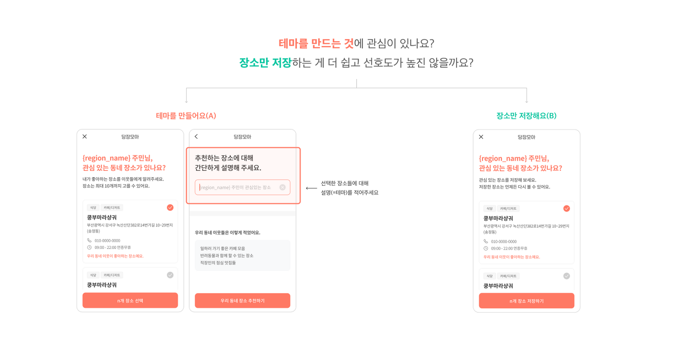
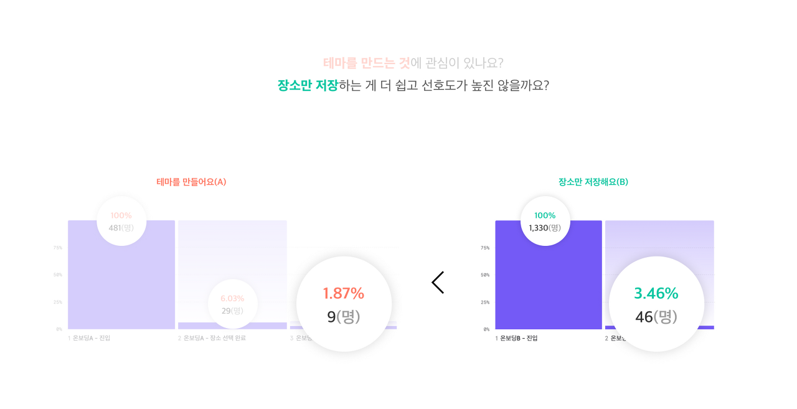
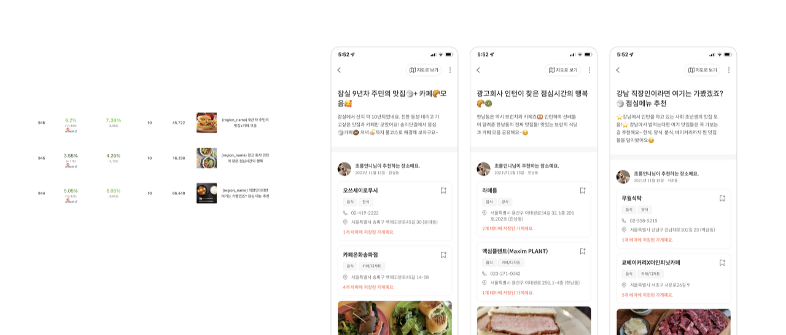
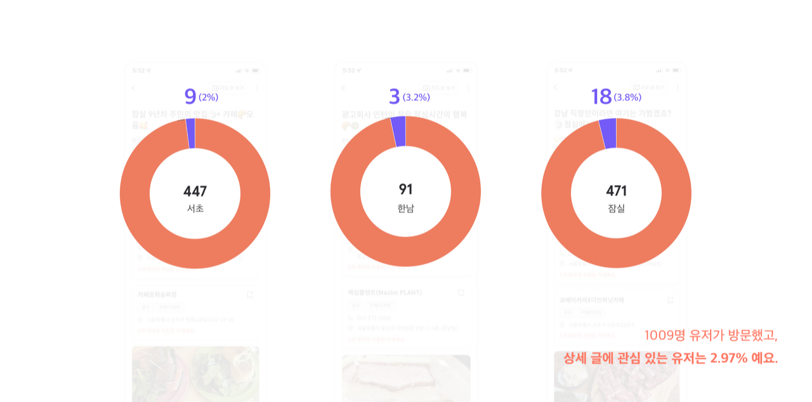
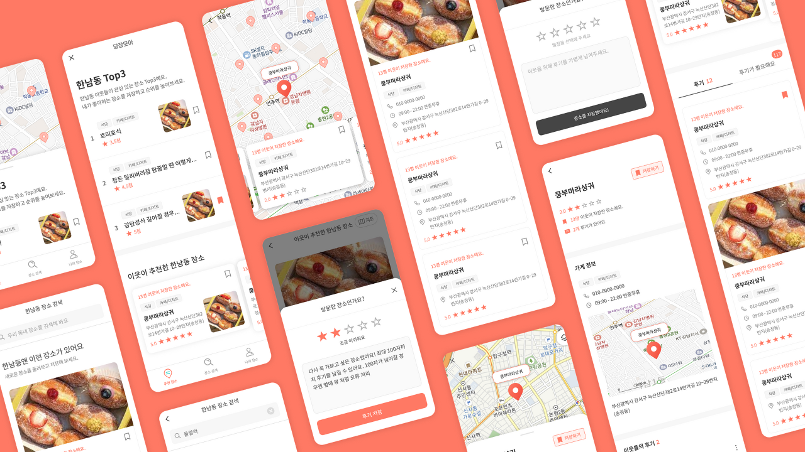
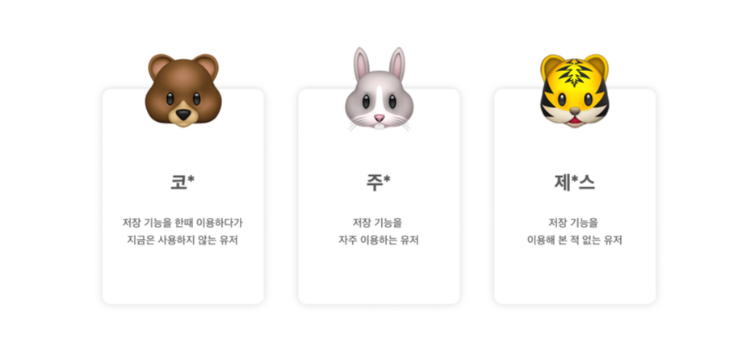

## 1차 검증

### 유저는 테마에 관심이 있는 걸까요? 프로덕트를 이용해서 검증해봐요!



유저는 테마에 관심이 있는 걸까?
1. 유저가 **테마를 만드는 것**에 관심이 있나?
2. 유저가 **테마 글을 저장**하고 싶은게 맞을까?

유저는 우리 서비스를 어떻게 생각할까?
3. 유저의 **의견을 직접** 들어보자!

이전에는 프로덕트의 개선을 통해 공급과 수요를 늘리려고했는데, 그게 아니라 **본질적으로 공급과 수요가 있는지부터 확인**하고자 했다. 그래서 이미 만든 프로덕트를 활용해서 공급과 수요를 나누어 검증하는 동시에, 유저테스트를 진행해서 현 프로덕트에 대해서 처음보는 유저가 어떻게 느끼는지 보고자 헀다.

&nbsp;

## 1. 유저가 테마를 만드는 것에 관심이 있나?



장소를 하나의 주제로 묶는 테마에 관심이 더 많은지, 장소 자체에 관심이 더 많은지를 파악하기 위해 **테마를 작성하는 것**과 **장소만 저장하는 것**을 각각 풍성피드에 띄워 **A/B테스트**를 진행했다.

### 검증1의 결과는...?



**장소 저장**을 한 유저 비율이 더 높았다.

&nbsp;

## 2. 유저가 테마 글을 저장하고 싶은게 맞을까?



이를 검증하기 위해 테마 상세글을 바로 풍성피드에 띄워보았다.

### 검증 2의 결과는 ...?



생각보다 낮았다. 심지어 비율로 따지면 앞서 우리 서비스내에서 저장한 사람들 수 보다 적었다.

&nbsp;

**"세상에,,, 유저들은 테마에 관심이 없나봐...!!!!!!"**  
**"테마에서 장소로 피봇할까...?"**

&nbsp;



당황스러운 마음에 뷰도 갈아 엎었다.

&nbsp;

**"잠시만, 우리 제대로 검증한 게 맞나?"**  
**"우리... 유저의 의견을 직접 들어볼까?"**

&nbsp;

## 3. 유저의 의견을 직접 들어보자!



당장모아를 사용해보지 않은 유저들 중, 기존 다른 지도 서비스에서 **장소 저장 기능을 사용하는지**의 여부에 따라 유저를 선별했다. 인터뷰를 진행하며 유저 테스트를 함께 진행했다.

### Q. 기존에 장소 저장 서비스를 이용하고 계신가요?
- 코* : 저장하긴 하지만 따로 정리는 하지 않아요.
- 주* : 엄청 애용하고 있어요.
- 제*스 : 사용하지 않아요.

### Q. 여러 장소를 묶는 '테마'에 흥미가 있으신가요?
- 코* : 작성하고 싶진 않지만 보고는 싶어요.
- 주* : 찐 로컬 유저가 제공한 정보라면 흥미가 있을 것 같아요.
- 제*스 : 맛집 지도라면 흥미가 있을 것 같아요.

### Q. 지금 떠올릴 수 있는 동네 가게들이 몇 개인가요?
- 코* : 20~30개 정도?
- 주* : 5~6개 정도?
- 제*스 : 10개 정도?

### Q. 당장모아를 방금 써보셨는데, 어떤가요?
- 코* : 테마가 재미있는 요소긴 하네요. 근데 귀찮을 수도 있을 것 같아요. 장소에 대한 이미지가 많이 없어서 가게에 대한 정보를 알기 어려워요.
- 주* : 설명, 이미지, 후기가 별로 없어서 믿을 수 있는 정보인지 모르겠어요. 유저에 대한 정보도 부족해 신뢰성이 떨어지는 것 같아요.
- 제*스 : 장소를 모아준다는 개념이 되게 좋은 것 같아요.

### Q. 어떤 점이 불편하게 다가왔나요?
- 코* : 장소만 저장하고 싶은데 어쨌거나 테마를 만들어야 하네요.
- 주* : 검색결과가 없는 장소들이 많아요. 내가 저장한 장소들에 대한 지도뷰도 제공되면 좋을 것 같아요.
- 제*스 : 딱히 없는 것 같아요.

### Q. 별점을 매긴다면?
- 코* : 8/10
- 주* : 3/10
- 제*스 : 7/10

### Q. 개선을 위해 제안해주실 내용이 있을까요?
- 코* : 장소와 테마의 개념이 확실히 분리되어야 할 것 같아요. 없는 POI에 대해 유저가 등록할 수도 있으면 좋을 것 같아요.
- 주* : 신뢰도를 높이기 위한 유저 및 장소 정보들이 추가되면 좋을 것 같아요.
- 제*스 : 거리순 필터링, 랭킹, 공유 기능이 있으면 좋을 것 같아요.

&nbsp;

### 유저 인터뷰로 얻은 인사이트

- **테마에 대한 수요**가 생각보다 많고, 테마 자체를 우리 서비스의 **차별성**이라고 생각한다.
- **POI의 정보 부족**과 등록되지 않은 장소들이 유저들의 허탈함을 유발한다.
- 유저에 대한 충분한 **신뢰도를 얻을만한 정보가 부족**하다.

&nbsp;

**"흠.. 우리 너무 섣부르게 피봇하지 말아요."**

유저 인터뷰를 통해 얻은 사용자들의 의견은 여전히 **우리 서비스의 차별성이 테마**라고 말해주고 있었다. 이쯤에서 우리가 프로덕트의 정확한 문제점과 원인을 확실하게 파악하고 있는가에 대한 의문이 들었고, 이 상태로 얼마 남지 않은 시간을 피봇에 투자하기 보다는, **세부적인 검증에 투자해서 유의미한 결론을 내는 것이 낫겠다**고 판단했다.

&nbsp;

## 그렇게 2차 검증이 이어지게 되었다.

```toc
```