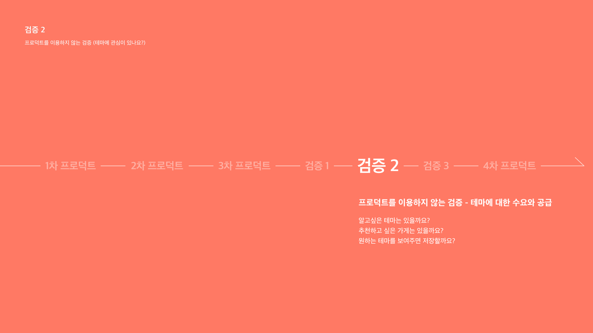
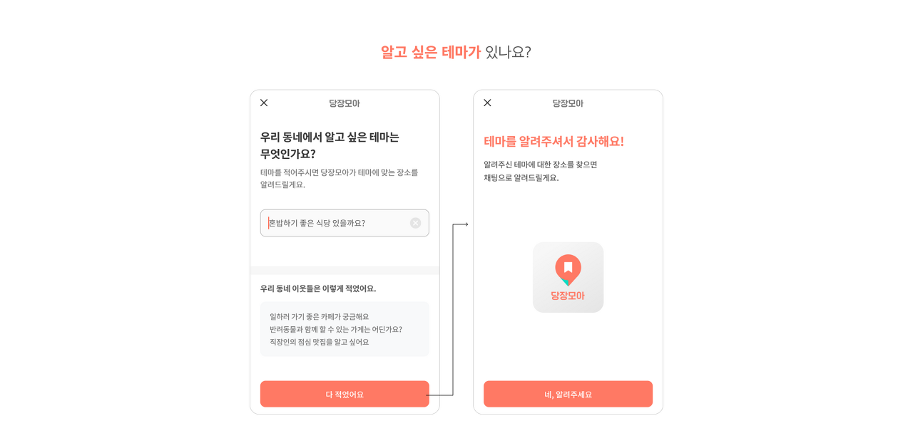
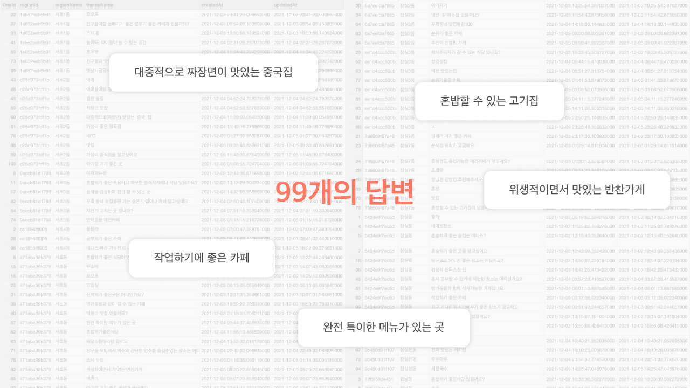
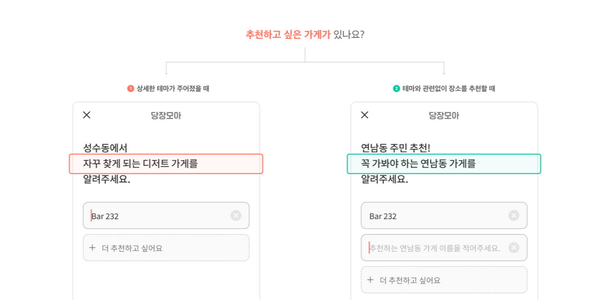
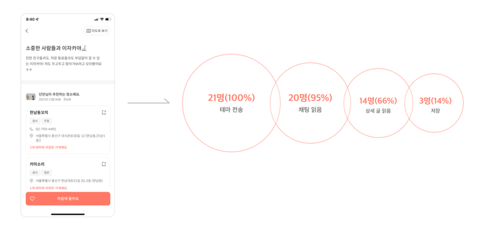
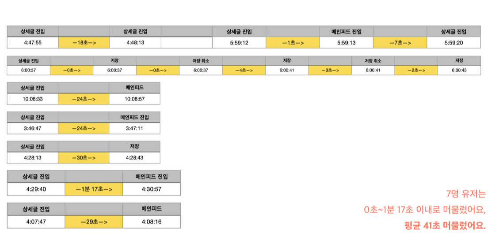
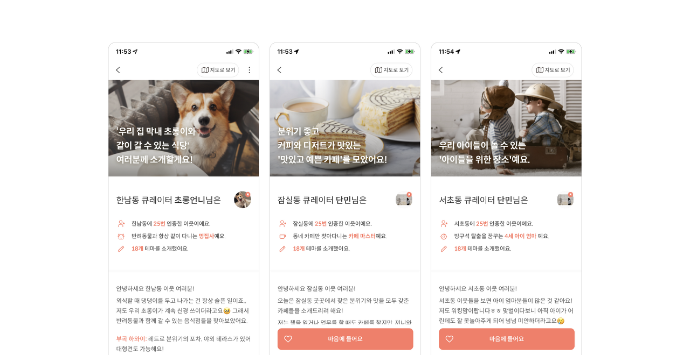
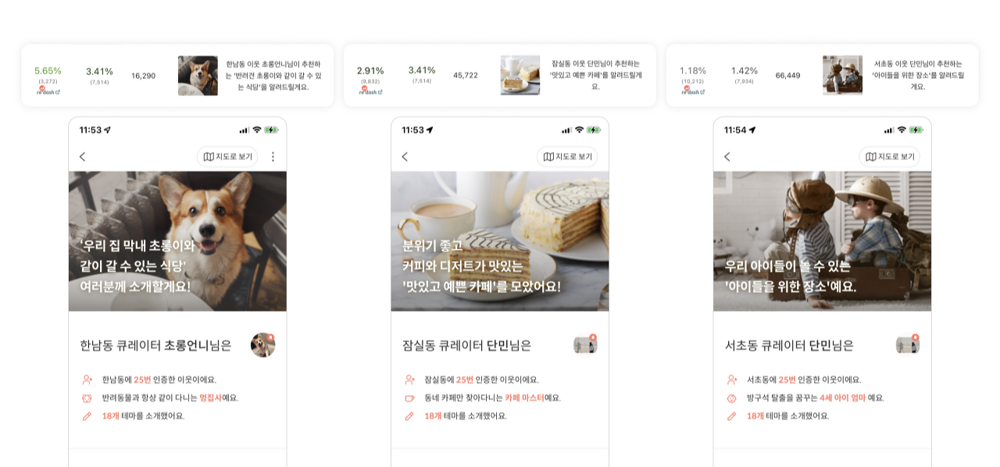
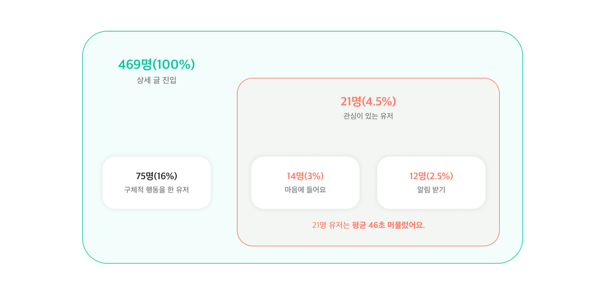
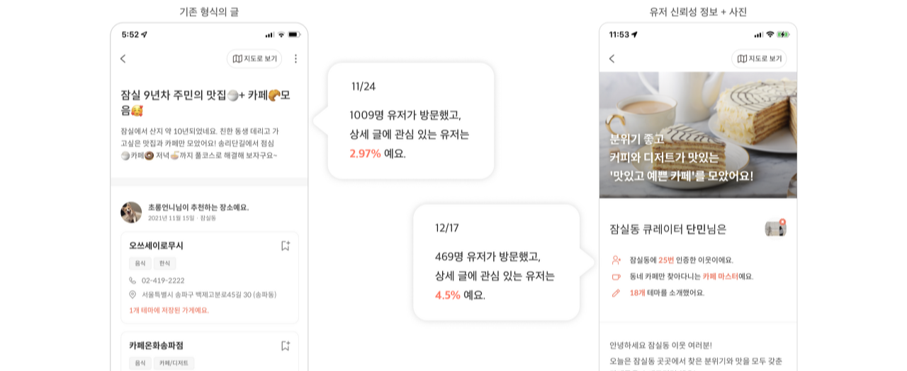

## 2차 검증

### 유저는 테마에 관심이 있는 걸까요? 프로덕트를 이용하지 않고 새로 검증해봐요!



**‘유저가 테마보다 장소 저장을 더 선호한다’는 검증에서 허점은 없었을까?**

단편적으로 봤을 때는 테마보다 장소를 저장한 비율이 더 높았다. 하지만 엄청난 차이는 아니었다. 둘 다 낮은 퍼센트였다.

단순히 테마냐 장소냐의 차이로 발생한 문제가 아니었을 수도 있다. 그렇다. 장소를 랜덤으로 보여줘 놓고 저장을 해보라고 했기에, 유저가 원하는 장소가 없었을 수도 있었다. 우린 **잘못된 방식으로 검증을 하고 있었다.** 다른 요소에 영향을 받지 않는 검증 방식을 찾아야 했다.

&nbsp;

**"테마에 대한 수요와 공급을 다시 확인해볼까?"**  
**"장소와 테마를 직접 테스트로 받아보자!"**

&nbsp;

## 검증 2 (수요) - 테마를 텍스트로 받아보기



우선, 사용자들에게 알고 싶은 테마가 있는지 물어봤다.



그 결과, **총 99개**의 답변을 받았고 그중 **58명**의 유저가 추후 테마에 대한 글이 작성되면 알림을 받아보고 싶다고 응답했다.

99개의 답변을 보던 중 특이한 점을 하나 발견했는데, 대부분의 답변이 **매우 상세한 테마를 궁금해한다**는 것이었다. 그냥 단순히 카페, 식당이 아니라 **작업하기 좋은 카페, 혼밥 할 수 있는 고깃집** 같이 상당히 구체적인 형식의 답변들이 대다수였다.

&nbsp;

### 수요에 대한 검증 2로 얻은 인사이트

1. **테마에 대한 수요는 확실**했다. 알고 싶어 하는 테마는 분명 많았다.
2. 유저가 알고 싶어 하는 테마는 대부분 **식당, 술집, 카페 등의 먹거리**로 한정적이었다.
3. 하지만 한정적인 카테고리 내에서도 **매우 상세하고 세분화된 테마**에 대한 니즈가 있었다.

&nbsp;

## 검증 2 (공급) - 장소를 텍스트로 받아보기



다음으로 사용자들이 추천하고 싶은 가게가 있는지를 물어보았다. 지금까지 테마 작성이 잘 일어나지 않았던 이유가 떠오르는 장소가 없어서일 수도 있겠다고 생각했기에 실제로 **사용자들이 답할 수 있는 장소가 한 번에 몇 개**인지 알아보고 싶었다.

또한 **테마가 글 작성에 있어 허들이 되지 않는가**에 대한 확실한 근거도 얻고 싶었기에 두 종류로 나눠서 검증을 진행했다. 하나는 **구체적인 테마가 주어졌을 때**, 다른 하나는 **단순히 동네 장소를 알려달라고 했을 때**로 나눠서 응답을 받았다.

그 결과, 상세한 테마가 주어졌을 때는 8.46%의 응답률을, 단순히 장소를 추천받았을 때는 6.19%의 응답률을 보였다. **테마가 작성에 있어 허들이 되지는 않는다**는 것을 확실히 확인할 수 있었다. 또한, 두 경우 모두 **1인당 평균 1.6~1.7개의 장소**를 제안하는 것을 볼 수 있었다.

&nbsp;

### 공급에 대한 검증 2로 얻은 인사이트


1. 테마는 글 작성에 허들이 되지 않는다.
2. 한 사람당 2개 이상의 장소를 떠올리는 것은 어렵다.
3. 하지만 겹치는 장소가 거의 없었다.
4. 유저가 원하는 장소와 당근 POI 장소를 비교했을 때 평균 65%의 장소만 존재했다.

&nbsp;

**"테마에 대한 선호와 공급은 확실히 있는 것 같은데... 그렇다면 왜 유저는 이때까지 저장을 안 했을까?"**  
**"유저가 원하는 테마, 유저가 원하는 정보가 아니었던 게 아닐까? 유저가 원하는 정보를 제공해보자!"**

&nbsp;

앞선 검증 결과로 테마에 대한 수요는 확실히 있다는 것을 확인할 수 있었다. 그렇다면 지금까지의 저장률은 왜 낮았을까? 우리는 **원하는 테마가 아니었기 때문에** 저장하지 않은 게 아닐까는 생각을 했다.

따라서 이번에는 **'알고 싶은 테마에 대한 정보를 알려주면 테마를 저장할 것'**이라고 가설을 세웠고, 앞서 글이 작성되면 알림을 받겠다고 한 유저들에게 해당 테마를 채팅으로 보내주는 방식으로 검증해보기로 했다.



그렇게 앞서 받은 99개의 테마 응답 중 몇 개를 작성하여 21명에게 채팅으로 보냈다. 그중 20명(95%)이 채팅을 읽었고, 그중 14명(66%)이 상세 글을 읽었으며, 그중 3명(14%)이 테마 저장을 눌렀다.



미리 달아둔 이벤트를 통해 14명의 유저들을 팔로 업해보았다. 상세 글 진입 후 다른 행동을 하지 않아 팔로업이 불가능했던 유저들이 7명이었고, 나머지 7명은 평균 41초 동안 상세 글에 머무른 것을 확인할 수 있었다.

팔로업 결과, 유저가 확실히 글을 읽으면서 오래 머문다는 것을 확인할 수 있었다. 하지만 여전히 저장률이 낮았고 이를 해결하고 싶었다. 앞선 유저 테스트와 인터뷰에서 언급됐던 내용을 바탕으로, **'장소에 대한 정보를 추가하고 테마 작성자에 대한 신뢰도를 높이면 저장률이 올라갈 것'**이라는 가설을 세우고 다시 한번 검증을 진행하기로 했다.

**"테마를 설명할 수 있는 사진도 넣고, 작성자에 대한 정보도 더 제공해보자!"**



테마 상단에 이미지를 넣어 시각적인 요소를 추가하고 작성자에 대한 정보도 추가해 신뢰도를 높이고자 했다. 테마 소개글도 상세하게 작성해서 장소 정보를 추가로 제공했다.

위의 세 가지 테마 글을 총 13명에게 채팅으로 전송했고, 그중 11명이 채팅을 읽었다. 그중 9명(69.2%)이 상세 글로 진입했고 그중 2명(15.3%)이 테마 저장을 눌렀다.

앞선 검증과 마찬가지로 유저들을 팔로 업했고, 총 5명의 유저가 **평균 12초 동안 상세 글에 머무른 것**을 확인할 수 있었다.

&nbsp;

**"실제 저장률이 큰 차이가 없네요. 머무르는 시간은 오히려 줄었어요."**  
**"모수가 적어서가 아닐까요? 채팅이 아닌, 풍성 피드에 다시 띄워보는 건 어때요?"**



그렇게 이번에는 적은 수의 유저에게 채팅으로 보내는 방식이 아닌 **풍성 피드로 띄우는 방식**으로 검증을 진행했다. 그렇게 **평균 3퍼센트의 클릭률**을 얻을 수 있었다.



**총 469명**이 상세 글로 진입했고 그중 75명(16%)이 장소 카드를 누르거나 지도 버튼을 누르는 등의 구체적인 행동을 했다. 그리고 21명(4.5%)이 테마 저장을 누르거나 알림 받기를 신청했다.
또한 **평균 46초**간 머물렀기에 모수가 작아서 유저들의 페이지 지속 시간이 낮았다는 우리의 생각을 확인할 수 있었다.

또한 이번 검증의 결과를 지난 검증 1의 결과와도 비교해보았다.



기존 형식의 상세 글보다 저장하는 유저가 1.53가 늘었다. **확실히 효과가 있는 개선이었다!**

우린 더욱더 많은 검증을 계속해서 해보고 싶었다. 그간 놓치고 있었던 게 많다는 것을 너무 늦게 깨달았다. 하지만 큰 문제가 있었다. 바로 MVP 인턴십이 끝나기까지 한 달도 채 남지 않았다는 것...!

&nbsp;

**"남은 2-3주 동안 뭘 해야 확실한 인사이트를 얻을 수 있을까요?"**  
**"짧은 검증들로는 확실한 정보들을 얻기 어려우니, 당장모아를 사용해 본 찐 유저들을 대상으로 인터뷰를 진행해보면 어때요?"**

&nbsp;

## 그렇게 우리는 마지막으로 찐 유저 인터뷰를 통한 세 번째 검증을 진행해 보기로 했다.

```toc
```