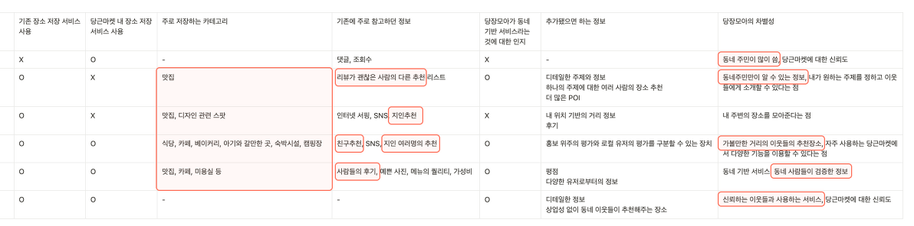

## 3차 검증

### 마지막으로 당장모아에 방문했던 찐 유저들의 이야기를 들어보고 싶어요. 우리 서비스에서 어떤 것이 더 필요할까요?


앞서 짧은 기간 동안 진행되었던 검증들에서는 얻기 어려웠던 좀 더 상세한 정보들을 얻기 위해 **당장모아를 사용한 찐 유저들을 대상으로 인터뷰**를 진행해보기로 했다.



그렇게 총 6명의 찐 방문 유저들을 인터뷰하게 되었다. 주로 저장하는 카테고리, 기존 장소 저장 서비스에서 참고하던 정보의 종류, 당장 모아에서 추가됐으면 하는 정보, 당장모아의 차별성 등에 대한 생각을 물어보았다.

&nbsp;

### 유저 인터뷰로 얻은 인사이트

1. 유저들이 생각하는 당장모아의 가장 큰 차별성은 **당근마켓의 신뢰도**와
2. **동네 이웃들이 제공하는 장소**라는 것이었다.
3. 그렇기에 보다 더 **구체적인 장소 정보와 이웃들의 후기가 필요**하다.
4. 하지만 **POI에 없는 가게와 정보들이 상당히 많다.**

&nbsp;

### 유저의 의견과 검증을 통해 느낀 인사이트를 기반으로 마지막으로 프로덕트를 개선해보자!


1. 동네에 저장할 장소가 많지 않다.
2. 동네에서 알고 있는 장소가 적다.
3. 이웃이 추천해주는 정보에 관심이 있다.

이러한 인사이트를 바탕으로 우리는 프로덕트의 방향을 마지막으로 조금 수정했다. 기존에는 나만의 지도를 만들기 위해 장소를 모으고 기록하는 용도를 바탕으로 했다면, **이웃에게 추천을 해주고 나도 추천을 받는 커뮤니티**의 형식을 최대한 녹여내보기로 했다.


그렇게 4차 프로덕트에서는 크게 네 가지 부분이 바뀌게 되었다.

#### 1. 장소는 ‘저장’하고 테마는 ‘좋아'하는 것

지금까지 유저들을 팔로업하고 인터뷰하면서, ‘저장'이라는 워딩이 주는 허들이 생각보다 높다는 것을 알 수 있었다. 대신 좋아한다는 것은 비교적 유저에게 쉽게 받아들여질 수 있었다. 그래서 테마를 저장한다는 워딩을 테마를 좋아한다로 바꾸는 동시에, 유저 인터뷰에서 나왔던 의견을 반영하여 테마와 장소를 조금 더 구분시켜주었다.

#### 2. 둘러보기의 목적변화

기존의 둘러보기는 테마를 쉽게 만들기 위해 장소추가를 목적으로 하는 공간이었다. 하지만 지금까지 유저들을 분석한 결과, 둘러보기에서 장소추가를 한 유저는 없었다. 그렇다면 차라리 동네의 다양한 장소들을 사용자들이 둘러볼 수 있도록 최대한 많은 장소를 보여주는 것이 좋겠다고 생각했고, 이웃들이 저장한 횟수를 각 장소에 대한 매력포인트로 강조했다.

#### 3. 추천 글 섹션

처음 들어와서 무엇을 먼저 할지 모르는 유저들을 위해, 검증2에서 만들었던 보다 상세해진 테마 글을 추천 글로 두어 상단에 고정시켰다.

#### 4. 장소별로 저장된 테마 확인

인터뷰 과정에서 장소에 대해 매력을 느끼는 요소 중 하나로 '본인이 좋아하는 장소를 추천한 유저의 추천'을 유저들이 꼽았다. 그래서 장소 상세페이지를 추가하여, 그 장소를 저장한 테마들을 한 눈에 확인할 수 있도록 했다.

이런 고민을 바탕으로 최종 개선하게 된 4차 프로덕트의 모습이다.  
(이미지를 클릭하면 유튜브로 이동합니다.)

[](https://youtu.be/WorMzungOjc)

&nbsp;

### 최종 인사이트

#### 1. 유저는 테마에 대해
유저는 테마에 분명한 관심이 있다. 단, 테마는 구체적이어야 한다.

#### 2. 유저는 동네에서 하나 이상의 장소를 떠올리는 것을 어려워한다.
로컬 큐레이터가 상세히 적어준 글일 경우 일반 유저의 글보다 관심이 많았다. 함께 만들어가는 지도 형식이라면 더욱 좋을 것 같다.

#### 3. 당근의 POI 정보는 아직 타 서비스에 비해 부족하다.
유저가 장소 정보를 사진과 함께 직접 등록할 수 있는 장치를 마련하면 좋을 것 같다. 장소에 대한 개별적인 리뷰도 보다 풍부해지면 당근의 강점을 살릴 수 있을 것 같다.

#### 4. 당근은 이웃이라는 강점이 있다.
많은 유저들이 '당근마켓에 대한 신뢰도'와 ‘이웃이 추천하는 정보'라는 점을 차별성으로 꼽았다. 다만, 유저들에 대한 신뢰도를 줄 수 있는 튼튼한 장치가 더 필요하다는 생각이 든다.

여기까지가 지난 3개월 간 당장모아를 개발하고 다양한 가설들을 검증하면서 얻은 최종 인사이트다.

&nbsp;

### 그동안 정말 즐거웠다 :) 당근마켓, 고마워요!

```toc
```