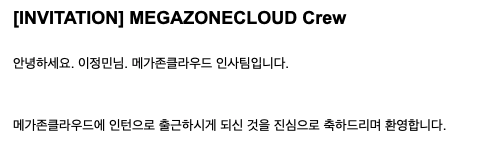

> 2020.11.02 - 2021.02.28 동안의 경험에 관한 글입니다.

&nbsp;

## AUSG에서의 인연을 시작으로

AUSG는 AWS University Study Group으로, AWSKRGU(AWS 한국 사용자 모임) 소속의 소모임이다. 나는 AUSG(아우쓱)에서 4기부터 활동 중인데, 그곳에서 메가존클라우드에 근무하고 계시는 프론트엔드 개발자 한 분과 알게 되었고 인턴 채용까지 이어지게 되었다.



&nbsp;

## CloudOne에서의 프론트엔드 개발

| | | |
| - | - | - |
|  |  |  |


CloudOne은 메가존클라우드의 CTC(Commecial Technology Center) 부소에 소속된 팀으로, SpaceONE이라는 Multi Cloud에 대한 오픈소스 CMP(Coud Management Platform)를 개발하고 있다.


&nbsp;

### 1. SpaceONE Storybook 구조 재정립 및 컴포넌트 리팩토링

SpaceONE의 콘솔 앱(대시보드)과 디자인 시스템은 모두 오픈소스로 구축되어있다.
- [spaceone-dev/console](https://github.com/spaceone-dev/console)
- [spaceone-dev/spaceone-design-system](https://github.com/spaceone-dev/spaceone-design-system)
SpaceONE의 프론트엔드 개발단에서는 atomic design을 사용하고 있었는데, 이 구조를 [Storybook](https://storybook.developer.spaceone.dev/?path=/story/atoms-badges--default-case)에서도 가져가다 보니 디자이너와 소통이 잘 되지 않는 문제점이 있었다. 이를 해결하고자 storybook의 구조를 다른 디자인 시스템에 관한 리서치를 통해 재정립하였고, Atom, Molecule, Organism으로 분리되어 있던 구조에서 컴포넌트의 사용목적에 따라 분리된 구조로 변경하였다.

`Data Display / Feedbacks / Foundation / Inputs / Layouts / Navigation`

구조 재정립 후, 컴포넌트 리팩토링 및 제작에도 참여하였다. 스토리북의 canvas 페이지에 mdx를 도입하는 작업, stories파일에서 기존의 Vue2 Options API에서 Composition API로 마이그레이션 하는 작업, 모든 stories파일을 javascript에서 typescript으로 마이그레이션하는 작업을 같이 진행하였다.

&nbsp;

### 2. SpaceONE Project Site 구축

SpaceONE을 소개하는 웹사이트를 리액트로 구축하는 작업을 맡아 진행했다. 이때 Next.js를 처음 사용해보았다. github API를 Next의 서버단에서 찔러 사용하는 식으로 SSR을 사용했다. 프로젝트 사이트의 경우 퇴사 전까지는 혼자서 개발을 주도했는데, 아무래도 서비스를 소개하는 사이트다 보니 디자인이 중요했고 덕분에 CSS 작업 속도를 엄청나게 기를 수 있었다.

배포의 경우 인프라와 백엔드 개발자분들이 진행해주셨지만, nginx를 붙여 docker와 kubernetes helm을 사용하는 등, 어깨너머로 조금이나마 경험해볼 수 있었던 시간이었다.

&nbsp;

### 3. SpaceONE 프로젝트(콘솔)에서 발생하는 이슈 해결

위의 두 가지 업무를 병행하다 보니 3개월이 훅 지나갔고, 남은 1개월 마저 설 연휴가 껴있었기에 정말 시간이 얼마 남지 않은 상황이었다. 프로젝트 사이트의 경우 새로 입사하신 프론트 개발자분께 인수인계하기 위해 몇 차례의 회의와 문서화를 진행하였다.

인수인계가 끝난 후, 뭔가 하나라도 더 컨트리뷰트 하고 싶은 마음에 콘솔(SpaceONE 프로젝트)을 한 번 건드려볼 수는 없을까 여쭤보게 되었고, 자잘한 이슈 및 마이너 한 페이지의 뷰 개선 정도를 맡게 되었다.

콘솔의 경우 백엔드가 마이크로 서비스 아키텍처로 구축되어 있었고, API용 노드 서버를 중간에 거치는 구조였다. 구조를 파악하는 과정에서도 다양한 지식들을 어깨너머로 공부할 수 있었다.

리뷰가 필수적인 PR 방식, squash와 fast forward 위주의 머지 전략, 매주 열리는 스프린트 회의, Jira 티켓을 통한 이슈 관리, confluence를 통한 문서정리 등은 어떻게 하면 더 질 좋고 주도적인 개발을 할 수 있을지에 대한 고찰을 끊임없이 하게 해 주었다. CloudOne에서 정말 좋은 팀 문화를 많이 경험할 수 있었다.

&nbsp;

## 행복했던 4개월, 그리고 퇴사
 
크리스마스와 새해가 끼여있었기 때문에 선물도 받을 수 있었다ㅎㅎ 역시 인생은 타이밍..!

| | |
| - | - |
|  |  |

메가존클라우드 근무와 함께 3-2를 병행했는데, 겨울방학이 끝날 때쯤 더 이상 재학생은 인턴을 받지 않기로 결정되었다는 소식을 듣게 되었다. 그렇게 2월까지 한 달 연장을 끝으로, 총 세 개의 오픈소스에 기여한 후 메가존클라우드를 떠나게 되었다.

| | |
| - | - |
|  |  |

자유로운 출퇴근, 자유로운 재택근무, 화목한 팀 분위기도 정말 많이 그리울 것 같다. 인턴으로 근무했을 당시에는 역삼의 메가존클라우드 건물 내에 자리가 위치하고 있었는데, 현재는 CloudOne이 빠져나와 더 좋은 건물로 옮긴 것으로 알고 있다. 언제 한 번 또 놀러 갈 수 있는 날이 오기를..🥺

| | |
| - | - |
|  |  |

| | | |
| - | - | - |
|  |  |  |

&nbsp;

## 이제는 내 힘으로
 
첫 번째 인턴은 단순히 학교 차원에서 이루어졌던 인턴이고, 두 번째 인턴은 지인을 통해 얻을 수 있었던 기회였다. 어떻게 보면 실제로 업무에 투입될 수 있었던 실력이 아니었음에도 기회가 닿아 경험할 수 있었던 것들이었다.

재학생은 더 이상 인턴을 받지 않기로 결정된 시점에서, 난 이제 뭘 해야 하나 하는 고민에 빠지게 되었다. 이제는 내 힘으로, 내 실력으로만 도전해야 했다. 그리고 퇴사가 며칠 안 남은 시점에서, 네이버 전환형 인턴에 합격하게 되었다.


```toc
```