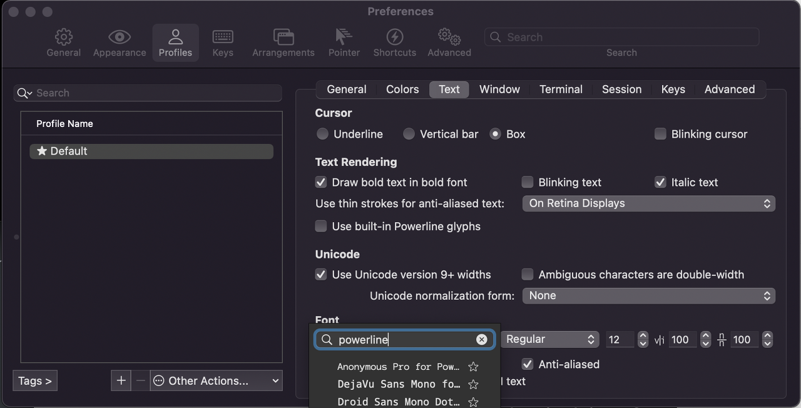
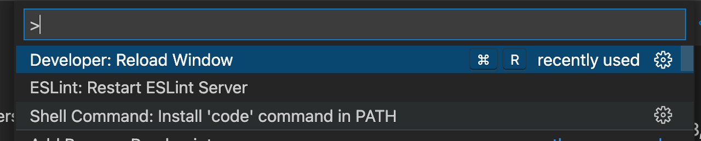
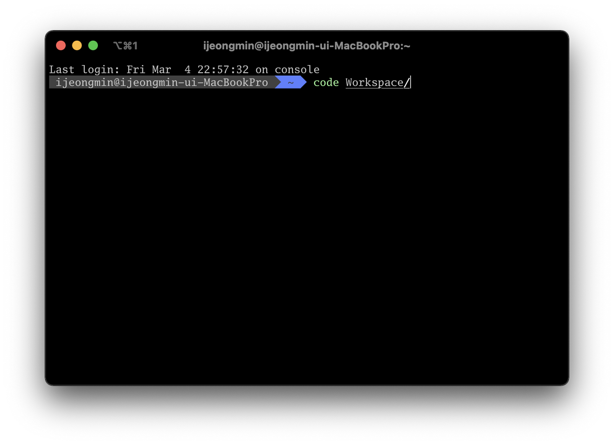

## 1. 기본 맥북 세팅
### 세 손가락 드래그
애플리케이션 창을 움직여 이동시키거나, 문서 내 글을 드래그할 때 클릭으로 하면 불편함이 많죠. 이걸 굳이 클릭해서 끌지 않아도, 간편하게 터치 & 드래그로 할 수 있는 방법이 있습니다.

**시스템 환경설정 > 손쉬운 사용 > 포인터 제어기 > 트랙패드 옵션**으로 들어가면 드래그 활성화 옵션이 있는데, **세 손가락으로 드래그하기**로 설정해주면 됩니다.

저는 세 손가락으로 드래그 활성화를 하고, 페이지를 쓸어 넘기거나 Mission Control을 사용할 경우 네 손가락을 씁니다.

### 앱 expose

**시스템 환경설정 > 트랙패드**로 들어가면 앱 Expose를 켤 수 있습니다. 현재 포커스 된 탭과 동일한 애플리케이션 내의 탭들만 노출시키는 기능으로, 큰 기능은 아니지만 유용합니다.

&nbsp;

## 2. 설치할 앱
~~이건 지극히 프론트를 하는 제 주관적인 의견입니다~~

크롬, 카카오톡, 노션, VScode, Zoom, Slack, Figma, Typora, iTerm2, GitKraken, Postman, Sequel Ace, RunCat, Magnet, MonitorControl

**1. 필수적인 앱**  
크롬, 카카오톡, 노션, VScode, Zoom, Slack, Figma, RunCat

**2. Typora**  
저는 맥북 내장 메모앱 보다는 타이포라를 주로 사용합니다. 마크다운이라 여러모로 편리하더라고요.

**3. GitKraken**  
무료 버전은 프라이빗 레포가 막혀있어서 유료로 사용하는 걸 추천드립니다. 깃 사용하다가 꼬인 적이 있다? 그럼 GUI 쓰시는 것도 추천드립니다. 다른 GUI 툴들도 많이 써봤는데, 깃크라켄이 제일 사용성이 좋다고 생각합니다.

**4. iTerm2**  
커스터마이징이 잘 되어서 그냥 쓰는 터미널입니다.

**5. Postman, Sequel Ace**  
서버 테스트도 해야하니까..

**6. Magnet**  
윈도우처럼 단축키로 앱 화면 위치를 제어할 수 있게 해줍니다. 앱스토어에서 구매할 수 있고 가격도 저렴합니다. 강추드립니다~

**7. MonitorControl**  
모니터 밝기를 제어할 수 있는 앱입니다. 듀얼 모니터 사용할 때 유용합니다.

&nbsp;

## 3. 기본 개발 환경 세팅 & 터미널 설정

**1. homebrew 구버전 삭제**  
```
which brew
```
위의 커맨드 실행시 /usr/local/bin/brew 가 출력되었다면 이미 설치되어 있는 것입니다.  
삭제하려면  
```
/bin/bash -c "$(curl -fsSL https://raw.githubusercontent.com/Homebrew/install/HEAD/uninstall.sh)"
``` 
를 실행해주세요.

**2. homebrew 설치**
```
/bin/bash -c "$(curl -fsSL https://raw.githubusercontent.com/Homebrew/install/HEAD/install.sh)"
``` 
실행 후 설치가 완료되면, `Add Homebrew to your PATH in /Users/<USER_ID>/.zprofile:` 이라는 문구와 함께 각각 `echo`, `eval`로 시작하는 커맨드가 두 개 안내될 것입니다. 모두 실행해주시면 됩니다.

후에 brew install로 node, yarn, zsh 을 깔아줍니다.

**3. ohmyzsh 깔고 커스터마이징**  
- ohmyzsh 설치  
    ```
    sh -c "$(curl -fsSL https://raw.githubusercontent.com/ohmyzsh/ohmyzsh/master/tools/install.sh)"
    ```
- 자동 완성 플러그인  
    ```
    git clone https://github.com/zsh-users/zsh-autosuggestions ${ZSH_CUSTOM:-~/.oh-my-zsh/custom}/plugins/zsh-autosuggestions
    ```
- 하이라이팅  
    ```
    git clone https://github.com/zsh-users/zsh-syntax-highlighting.git ${ZSH_CUSTOM:-~/.oh-my-zsh/custom}/plugins/zsh-syntax-highlighting
    ```

**4. 테마 설정**  
`vi ~/.zshrc` 입력 후  
```
ZSH_THEME="agnoster"
plugins=(
    git zsh-autosuggestions zsh-syntax-highlighting
)
```

5. 폰트 설정

```
git clone https://github.com/powerline/fonts.git
cd fonts
./install.sh
rm -rf fonts
```
폰트를 다운받고, 설치하고, 삭제하는 과정입니다.



iterm2 환경설정에서 Profiles에 들어가면 폰트 관련 설정을 할 수 있습니다. powerline을 검색하시면 방금 설치한 파워라인용 폰트들이 뜨는 것을 확인할 수 있습니다.

&nbsp;

## 4. VScode 설정

### 기본적으로 사용하는 익스텐션
- Code Spell Checker
- ENV
- ESLint
- Prettier
- GitLens
- Live Share
- Markdown All in One
- Material Icon Theme
- open in browser
- vscode-styled-components

이 외에도 개발하다가 필요한 걸 그때 그때 설치하곤 합니다.

### code 명령어 등록
`cmd + shift + p`를 누르면 `Install 'code' command in PATH`를 찾을 수 있습니다.




그럼 위와 같이 터미널에서 code 명령어를 사용할 수 있습니다 :)

```toc
```