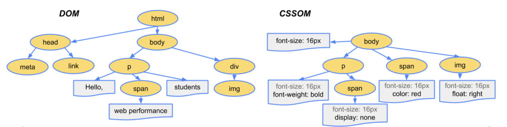
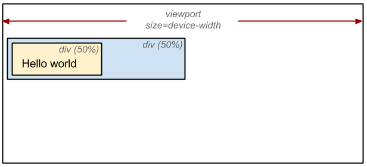

## 렌더링이란?
HTML, CSS, JS 문서가 브라우저에 출력되는 과정을 말합니다. 브라우저는 렌더링을 수행하는 렌더링 엔진을 가지고 있는데, 크롬은 블링크(Blink), 사파리는 웹킷(Webkit), 파이어폭스는 게코(Gecko)라는 렌더링 엔진을 사용합니다.

렌더링 순서는 다음과 같습니다.

1. HTML 파일과 CSS 파일을 파싱해서 각각 Dom Tree와 CSSOM Tree를 만든다. (Parsing)
2. 두 Tree를 결합하여 Render Tree를 만든다. (Style)
3. Render Tree에서 각 노드의 위치와 크기를 계산한다. (Layout)
4. 계산된 값을 이용해 각 노드를 화면상의 실제 픽셀로 변환하고 레이어를 만든다. (Paint)
5. 레이어를 합성하여 실제 화면에 나타낸다. (Composite)

&nbsp;

## 1. Parsing 파싱



우선 HTML을 파싱하여 DOM(Documnet Object Model) Tree를 만들게 됩니다. 파싱 도중 CSS를 만나면 파싱하여 CSSOM(CSS Object Model) Tree를 만듭니다.

파싱 도중 CSS를 만나는 경우로는,
1. HTML 마크업 내에 inline 스타일이 선언되어 있거나,
2. head 태그에서 외부 css 파일을 참조하거나,
3. head 태그에 style 태그가 정의되어 있거나 등이 있겠죠.

HTML과 CSS 파싱은 각각 다음과 같은 동일한 과정을 거칩니다.

1. **Bytes를 Characters로 변환**  
   브라우저가 원시 바이트를 읽어와서, 개별 문자로 변환합니다.
2. **Characters를 토큰화**  
   브라우저가 문자열을 W3C 표준에 지정된 고유 토큰으로 변환합니다.
3. **토큰을 노드로 렉싱**  
   토큰은 속성 및 규칙을 정의하는 객체로 변환됩니다.
4. **노드로 DOM 생성**  
   마크업에 정의된 여러 태그 간의 관계를 해석해서 트리 구조로 연결이 됩니다.

&nbsp;

## 2. Style 스타일


html과 css의 파싱이 완료되면 두 트리를 합쳐 실제로 화면에 그려질 Render Tree를 생성합니다. 렌더 트리에는 실제로 화면에 표시되는 요소들만 들어있으며, 각 노드에는 스타일이 적용되어 있습니다.

`visibility: hidden`의 경우 보이지는 않지만 요소가 공간을 차지하기 때문에 렌더 트리에 포함되는 반면,  
`display: none`의 경우 요소가 아예 표시되지 않기 때문에 렌더 트리에 포함되지 않습니다.


&nbsp;

## 3. Layout 레이아웃



렌더트리 내 노드들의 위치를 잡아주는 과정이 레이아웃입니다. 루트 노드부터 순회하면서 노드의 정확한 크기와 위치를 계산하여 캡처합니다. 모든 상대적인 측정값(%, rem 등)은 화면에서 절대적인 픽셀로 변환됩니다.

&nbsp;

## 4. Paint 페인트

위치가 잡힌 후, 위치를 건드리지 않는 css 속성들이 적용되는 과정이 페인트입니다. 레이아웃 단계에서 계산된 값을 이용해 각 노드를 화면상의 실제 픽셀로 변환합니다. 이때 하나의 레이어가 아닌 여러 개의 레이어로 관리됩니다. transform과 같이 별도의 레이어를 만들게 유도하는 css 속성을 만나면 레이어가 분리됩니다.

&nbsp;

## 5. Composite 합성

페인트 단계에서 생성된 레이어들을 합치는 과정이 합성입니다. 화면에서 웹 페이지를 볼 수 있게 됩니다.

&nbsp;

## 렌더링에서 발생하는 사이드 이펙트?

사용자가 웹 페이지에 처음 접속하면 렌더링 과정을 거쳐서 화면에 모든 요소가 그려지게 됩니다. 하지만 이후에도 사용자 인터렉션을 통해 화면 변경이 일어날 수도 있죠.

### 1. 리플로우 Reflow

자바스크립트로 돔을 변경하거나 CSS에서 위치 값에 영향을 주는 속성들을 변경하는 등 레이아웃에 영향을 미치게 되면  
`[ 레이아웃 -> 페인트 -> 합성 ]`의 과정이 재실행되는 리플로우가 발생합니다.

리플로우를 발생시키는 대표적인 속성들은 다음과 같습니다.
`position, width, height, margin, padding, border, border-width, font-size, font-weight, line-height, text-align, overflow`

### 2. 리페인트 Repaint

레이아웃에 영향을 미치지 않는 속성들을 변경할 때에는  
`[ 페인트 -> 합성 ]`의 과정이 재실행되는 리페인트가 발생합니다.

리페인트를 발생시키는 대표적인 속성들은 다음과 같습니다.
`background, color, text-decoration, border-style, border-radius`

```toc
```