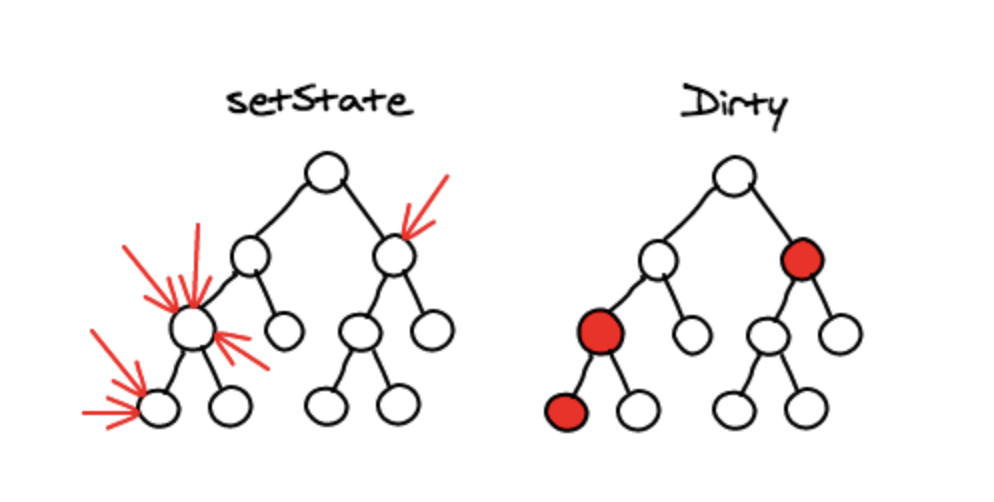
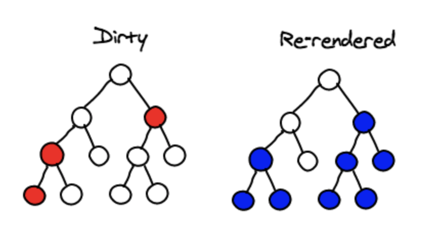
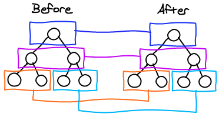

## DOM이란?

DOM(Document Object Model)이란, 웹 페이지를 이루는 태그들을 브라우저가 트리 구조로 만든 객체 모델입니다. HTML과 자바스크립트를 이어주는 역할로 볼 수 있습니다. 자바스크립트로는 Document라는 전역 객체를 통해 HTML 태그들을 조종할 수 있습니다.

기존의 웹 애플리케이션은 자바스크립트로 직접 DOM을 제어했습니다. 이렇게 돔을 직접 제어하는 방식이 아닌, 리얼 돔을 추상화한 자바스크립트 객체를 구성하여 사용하는 방식이 가상 돔의 개념입니다.

&nbsp;

## SPA의 등장

전통적인 웹 사이트는 인터렉션이 발생할 때마다 완전히 새로운 페이지를 서버에서 전송해 주었습니다. 그러나 점차 웹 사이트가 고도화됨에 따라 한 페이지에 해당하는 페이지 용량이 커져갔고, 매번 새로운 페이지를 전달하는 게 점점 버거워지게 되었습니다. 또한 기존의 웹 애플리케이션은 돔 전체를 직접 접근하여 조작해서 브라우저에 화면을 나타내는 방식이었고, 웹 어플리케이션의 규모가 커질수록, 돔에 직접 접근하여 변화를 주다 보니 성능 이슈가 발생했습니다.

돔 자체를 읽고 쓰는 것은 빠릅니다. 다만 돔에 변화가 일어나 브라우저에서 매번 리플로우/리페인트 되는 과정에서 성능이 저하되는 것입니다. [(리플로우/리페인트란?)](https://www.jeong-min.com/21-rendering/)

그렇게 등장한 것이 SPA(Single Page Application)입니다. 웹 사이트의 전체 페이지를 하나의 페이지에 담아 동적으로 화면을 바꿔가는 방식입니다.

SPA를 리얼 돔에 접근하는 방식(ex. 자바스크립트 + 제이쿼리)으로 구현할 경우, 돔 조작이 매우 빈번하게 일어날 것이고 브라우저의 성능 저하는 여전할 것입니다. 그래서 뷰의 변형이 아닌, 기존 뷰를 날리고 새로 렌더링 하는 방법이 나오게 되었습니다.

돔 조작이 빈번한 SPA에서 성능을 향상하는 방법이 바로 이렇게 Virtual DOM을 사용하는 것입니다. 리액트와 뷰와 같은 SPA 라이브러리의 경우, Virtual DOM이라는 패턴을 사용해 SPA를 구현합니다.

리얼 돔을 추상화한 가상의 객체 트리로 HTML 정보를 저장하고 있다가, 이 트리에 변경이 발생하면 모든 변화를 모아 리얼 돔과 비교하여 변경된 부분을 한 번에 빠르게 일괄 업데이트합니다. 따라서 리플로우가 적게 발생하게 됩니다. 작은 규모의 리플로우가 여러 번 발생하는 것보다 큰 규모의 리플로우가 한번 발생하는 것이 성능상으로 훨씬 뛰어납니다.

&nbsp;

## 리액트의 Reconciliation, Diffing 알고리즘

리액트는 Virtual DOM, 즉 React Element라고 불리는 객체 형태를 사용합니다. `ReactDOM.render()`를 통해 실제 브라우저에 DOM 형태로 렌더링 됩니다.

컴포넌트에서 리턴하는 JSX는 React Element를 리턴합니다. 즉, 자바스크립트 객체로 구성되어 있습니다. 해당 객체에는 리액트의 가상 돔임을 증명하는 Symbol 값과, 각각의 엘리먼트를 고유하게 구분하는 key값이 있습니다. 리액트는 이렇게 구성된 가상 돔과 리얼 돔을 디핑 알고리즘을 통해 비교하여 효율적으로 리렌더링합니다.

| | |
| - | - |
|  |  |

리액트 컴포넌트 내 상태가 변경될 경우, 리액트는 해당 컴포넌트를 dirty 체크하고 batch에 추가합니다. 그리고 리액트 엘리먼트와 리얼 돔 엘리먼트를 비교/순회하며 dirty 체크된 엘리먼트들을 처리합니다. 속성 값만 변한 경우에는 속성 값만 업데이트하고, 해당 엘리먼트의 태그 혹은 컴포넌트가 변경된 경우라면 해당 노드를 포함한 하위의 모든 노드를 언마운트(제거)한 뒤에 새로운 엘리먼트로 대체합니다. 이런 식으로 batch에 쌓인 모든 변경사항들을 처리한 후, 딱 한 번 리얼돔에 이 결과를 업데이트합니다.

두 임의의 트리 사이의 최소한의 수정 횟수를 찾는 것은 O(n^3)의 복잡도를 가집니다. 1000개의 엘리먼트를 그리기 위해 10억 번의 비교 연산을 수행해야 하는 것입니다. 그러나 리액트는 단순하면서도 강력한 휴리스틱을 사용하여 O(n) 복잡도의 휴리스틱 알고리즘을 구현합니다. 휴리스틱 알고리즘은 다음의 두 가지 가정을 기반으로 합니다.

1. 서로 다른 타입의 두 엘리먼트는 서로 다른 트리를 만들어낸다.
2. 개발자가 key prop을 통해, 여러 렌더링 사이에서 어떤 자식 엘리먼트가 변경되지 않아야 할지 표시해 줄 수 있다.

&nbsp;

## 휴리스틱이란?

모든 것을 순회하는 것은 비용이 너무 크니까 덜 중요한 것들은 제외하고 중요한 것들만 고려해서 최선의 값을 찾아내는 방법입니다. 리액트는 비슷한 컴포넌트는 트리 내에 동일한 계층에 위치할 것이라고 전제하고, 트리를 같은 계층끼리 비교합니다.



복잡성이 대폭 줄어들면서도, 트리의 컴포넌트가 다른 레벨로 이동하는 경우는 매우 드물기 때문에 큰 손실이 발생하지 않습니다.

그다음으로 해당 계층에 존재하는 노드의 수를 비교합니다.

**1. 노드의 수가 일치한다면?**

수가 일치한다는 것은 추가되거나 삭제된 노드가 없다는 것이죠. 해당 노드의 상태가 변경된 컴포넌트라면 dirty 체크가 되어 있을 것이고, 해당 노드의 하위 컴포넌트의 속성 값을 업데이트하면 됩니다. 전혀 다른 엘리먼트로 대체되었을 경우, 해당 엘리먼트를 버리고 새로운 엘리먼트로 대체합니다. 이때는 자식 노드들을 탐색하지 않아도 되겠죠.

**2. 노드의 수가 불일치한다면?**

같은 계층의 노드들이라면 리스트와 같은 선형적인 구조로 되어있을 것입니다. 이 때 누가 추가/삭제되었는지를 쉽게 파악하기 위해, 리액트는 key를 사용합니다. 리액트에서 리스트 형태로 컴포넌트를 렌더할 때, key값을 입력하기를 강제하는 것을 확인할 수 있습니다.

이 키값을 기반으로 Map 자료 구조를 이용해 쉽게 추가/삭제를 확인할 수 있게 됩니다. 같은 컴포넌트가 다른 위치에 있다면 리렌더링할 필요 없이, 위치만 바꿔주면 됩니다.

이러한 휴리스틱 알고리즘을 기반으로 리액트의 Diffing 알고리즘은 돔 트리를 빠르게 순회하며 변화를 반영시킵니다. React 16부터는 새로운 reconciliation 엔진, Fiber를 사용한다고 합니다. virtual DOM의 증분 렌더링을 활성화하는 것이 목표라고 하네요. [(살펴보기)](https://github.com/acdlite/react-fiber-architecture)

&nbsp;

### Reference
- https://calendar.perfplanet.com/2013/diff/
- https://ko.reactjs.org/docs/reconciliation.html
- https://ko.reactjs.org/docs/faq-internals.html#what-is-react-fiber

```toc
```