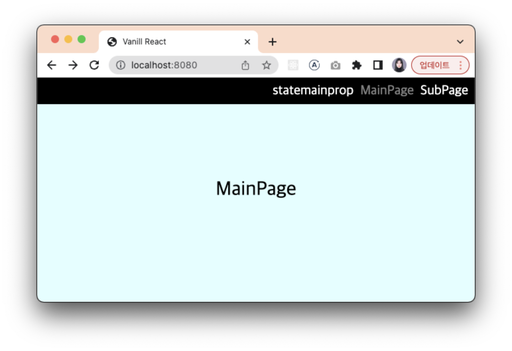
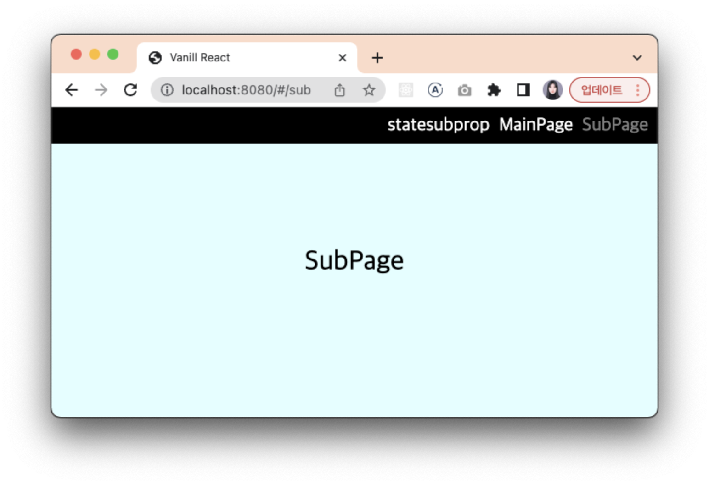

컴포넌트와 라우터가 만들어졌으니, 한번 애플리케이션을 띄워봅시다!

&nbsp;

### src/index.ts

```ts
import { initRouter, Route } from "./core/BrowserRouter"; // 또는 HashRouter
import Main from "./pages/Main";
import Component from "@/core/Component";
import "./scss/index.scss";
import Sub from "./pages/Sub";

const routes: Route[] = [
  { path: "/", page: Main as typeof Component },
  { path: "/sub", page: Sub as typeof Component },
];

const $app = document.querySelector("#app") as HTMLElement;

initRouter({ $app, routes });
```

&nbsp;

### src/pages/Main.ts

```ts
import Header from "@/components/Header";
import Component, { PropsType, StateType } from "@/core/Component";

export default class Main extends Component<PropsType, StateType> {
  didMount(): void {
    const $header = this.target.querySelector("header");
    new Header($header as Element, { propTest: "mainprop" });
  }

  template() {
    return `
      <div class='main-page'>
        <header></header>
        MainPage
      </div>
    `;
  }
}
```

&nbsp;

### src/pages/Sub.ts

```ts
import Header from "@/components/Header";
import Component, { PropsType, StateType } from "@/core/Component";

export default class Sub extends Component<PropsType, StateType> {
  didMount(): void {
    const $header = this.target.querySelector("header");
    new Header($header as Element, { propTest: "subprop" });
  }

  template() {
    return `
      <div class='main-page'>
        <header></header>
        SubPage
      </div>
    `;
  }
}
```

&nbsp;

### src/components/Header.ts

```ts
import Component from "@/core/Component";
import { router } from "@/core/BrowserRouter";

interface HeaderProps {
  propTest: string;
}
interface HeaderState {
  stateTest: string;
}

export default class Header extends Component<HeaderProps, HeaderState> {
  setup() {
    this.state = {
      stateTest: "state",
    };
  }
  didMount() {
    const { propTest }: HeaderProps = this.props;
    this.setState({ stateTest: this.state.stateTest + propTest });
  }
  template() {
    const { stateTest } = this.state;
    return `
    <div class='header'>
      ${stateTest}
      <div id='main'>MainPage</div>
      <div id='sub'>SubPage</div>
    </div>
    `;
  }

  setEvent() {
    this.addEvent("click", "#main", () => {
      router.push("/");
    });
    this.addEvent("click", "#sub", () => {
      router.push("/sub");
    });
  }
}
```

state와 props가 잘 동작하는지도 확인해보기 위한 코드도 함께 넣어주었습니다. 한 번 실행시켜 볼까요?

| 1. BrowserRouter의 경우 | |
| - | - |
|  |  |

| 2. HashRouter의 경우 | |
| - | - |
|  |  |

HashRouter의 경우 BrowserRouter와 다르게 `#`이 들어가있는 것을 볼 수 있습니다. 두 경우 모두 state와 props가 잘 보여지고 있네요!

지금은 `template()` 메서드로 string을 반환하여 UI를 그리고 있는데요, 때문에 클릭같은 이벤트도 `setEvent()` 메서드 내부에서 등록해주고 있는 것을 볼 수 있습니다.

다음 글에서는 jsx를 구현하여 더욱 효율적으로 엘리먼트를 그릴 수 있도록 해봅시다.

```toc
```