### JSX란?

React는 별도의 파일에 마크업과 로직을 넣어 기술을 인위적으로 분리하는 대신, 마크업과 로직을 모두 포함하는 “컴포넌트”라고 부르는 느슨하게 연결된 유닛으로 관심사를 분리합니다. JSX도 결국엔 표현식입니다. 컴파일이 끝나면, JSX는 JavaScript 객체로 인식됩니다.

이전 글에서, 우리는 마크업과 해당 엘리먼트 내의 로직을 따로 분리하여 코드를 작성했었습니다. JSX를 구현하여 이를 함께 포함할 수 있도록 해봅시다!

JSX를 구현한 후, 우리는 컴포넌트 내 렌더함수에서 다음과 같은 형태로 컴포넌트를 작성하게 될 것입니다.

```ts
// Main.ts
  render() {
    return jsx`
      <div class='main-page'>
        ${this.$header}
        <div onClick=${() => console.log('MainPage')}>MainPage</div>
      </div>
    `;
  }
  
// Sub.ts
  render() {
    return jsx`
      <div class='main-page'>
        ${this.$header}
        <div onClick=${() => console.log('SubPage')}>SubPage</div>
      </div>
    `;
  }
  
// Header.ts
  render() {
    return jsx`
      <div class='header'>
        <div onClick=${propFuncTest}>propFuncTest</div>
        ${stateTest}${propTest}
        <div onClick=${() => router.push('/')}>MainPage</div>
        <div onClick=${() => router.push('/sub')}>SubPage</div>
      </div>
    `;
  }
```
위의 구조가 동작될 수 있게끔 JSX를 구현해보도록 하겠습니다.  
(Header의 props로는 스트링 타입의 `propTest`와 함수 타입의 `propFuncTest`를 전달해주도록 하겠습니다.)

&nbsp;

## 1. jsx 함수 기본 구조

우선 jsx 함수는 스트링 배열과 ${}에 포함된 아규먼트를 받아서, 공정을 거쳐 최종적으로 엘리먼트를 반환하게 됩니다. 초기 template은 div 엘리먼트로 두도록 하겠습니다.

```ts
const jsx = (strings: TemplateStringsArray, ...args: any[]): Element => {
  if (!strings[0] && args.length) {
    throw new Error('Failed To Parse');
  }

  let template = document.createElement('div');
  
  ...
  
  return <HTMLElement>template.firstElementChild ?? template;
};
```
위 jsx 코드 예시에서, Main/Sub의 중간에 Header가 들어가기 때문에  
`Main/Sub의 jsx 호출 -> Header의 jsx 호출 -> Header의 jsx 처리 완료 -> Main/Sub의 jsx 처리 완료`  
의 순으로 동작하게 됩니다.

각각의 strings(왼쪽 이미지)와 args(오른쪽 이미지)를 확인해보면 다음과 같습니다.

| Main | |
| - | - |
| 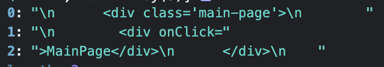 | 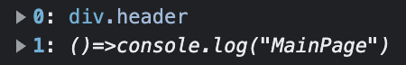 |

| Sub | |
| - | - |
| 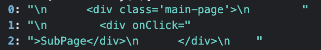 | 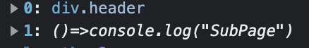 |

| Header | |
| - | - |
| 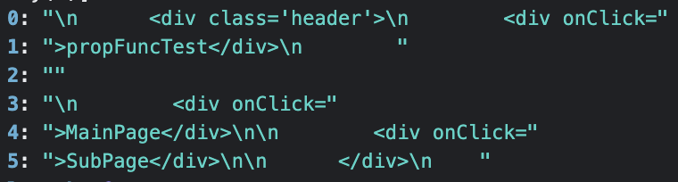 | 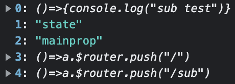 |

arg는 자식 컴포넌트, 이벤트 함수, state/props 등이 될 수 있겠죠.

&nbsp;

## 2. template.innerHTML

아규먼트가 들어올 때 string 배열이 나뉘어지기 때문에, 나중에 해당 아규먼트를 알맞게 할당해줄 수 있도록 표시를 하기 위한 프리픽스를 넣어주어 template에 값을 할당해줍시다.

```ts
const DIRTY_PREFIX = 'dirtyindex:';

const jsx = (strings: TemplateStringsArray, ...args: any[]): Element => {
  ...
  template.innerHTML = strings
    .map((str, index) => {
      const argsString = args.length > index ? `${DIRTY_PREFIX}${index}:` : '';
      return `${str}${argsString}`;
    })
    .join('');
  ...
}
```

| Main | Header |
| - | - |
| 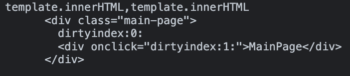 | 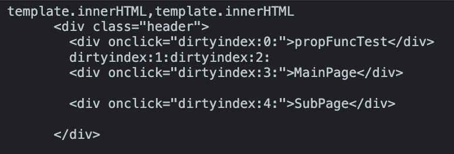 |

&nbsp;

## 3. 프리픽스 처리

그 다음 대체된 프리픽스를 원래대로 되돌려야 겠죠? document 객체 내 이터레이터를 사용하여 모든 node를 돌면서 확인하는 코드를 작성해줍시다.

```ts
const jsx = (strings: TemplateStringsArray, ...args: any[]): Element => {
  ...
  let walker = document.createNodeIterator(template, NodeFilter.SHOW_ALL);
  let node;
  while ((node = walker.nextNode())) { ... }
  ...
}
```
node에 들어오게 될 대상은 크게 다음 세 가지로 볼 수 있습니다.

1. 순수 텍스트로 이루어진 attribute
2. 내부에 attribute가 없는 노드
3. 내부에 attribute가 있는 노드

1과 2의 경우 `handleNoAttribute` 함수에서 처리해줍시다.

```ts
const jsx = (strings: TemplateStringsArray, ...args: any[]): Element => {
  ...
  while ((node = walker.nextNode())) {
    if (
      node.nodeType === Node.TEXT_NODE &&
      node.nodeValue?.includes(DIRTY_PREFIX)
    ) {
      handleNoAttribute(node, args);
      continue;
    }
  ...
}
  
function handleNoAttribute(node: Node, args: any[]) {
  if (
    node.nodeType !== Node.TEXT_NODE ||
    !node.nodeValue?.includes(DIRTY_PREFIX)
  )
    return;

  const texts = node.nodeValue.split(DIRTY_SEPARATOR_REGEX_G);

  const doms = texts.map(text => {
    const dirtyIndex = DIRTY_REGEX.exec(text)?.[1];
    if (!dirtyIndex) return buildDocumentFragmentWith(text);

    const arg = args[Number(dirtyIndex)];

    if (arg instanceof Node) {
      return arg;
    }

    return buildDocumentFragmentWith(arg);
  });

  for (const dom of doms) {
    node.parentNode?.insertBefore(dom, node);
  }
  node.nodeValue = '';
}
```

`handleNoAttribute`에 들어온 노드의 nodeValue를 프리픽스를 기준으로 쪼갠 texts를 확인해보면 다음과 같습니다.

| Header | Main |
| - | - |
| 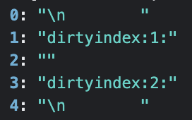 | 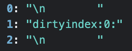 |

Header의 경우 state와 prop으로 구성된 순수 텍스트로 이루어진 어트리뷰트가, Main의 경우 자식 컴포넌트인 헤더가 `handleNoAttribute`에 들어온 것을 볼 수 있습니다.

texts를 돌면서 각각의 프리픽트 인덱스에 맞는 arg를 찾아 노드 타입일 경우에는 arg를 그대로 반환하고, 순수 텍스트일 경우에는 텍스트 노드를 생성해 반환해줍시다.

```ts
function buildDocumentFragmentWith(str?: string) {
  const df = document.createDocumentFragment();
  if (!str) return df;
  df.appendChild(document.createTextNode(str));

  return df;
}
```

그러고 난 후, 반환된 노드들(doms)을 돌면서 `insertBefore` 메서드로 노드를 삽입해줍시다. `insertBefore` 메서드로는 참조된 노드 앞에 특정 부모 노드의 자식 노드를 삽입합니다. 만약 주어진 자식 노드가 document에 존재하는 노드를 참조한다면, 자식 노드를 현재 위치에서 새로운 위치로 옮깁니다. (노드가 이미 부모를 가지고 있다면, 노드가 제거된 후 새로운 위치에 삽입됩니다.)

마지막으로 기존의 프리픽스 값을 제거해줍시다.

&nbsp;

## 4. attribute 치환

이제 거의 모든 노드들이 정상적으로 돌아왔습니다! 하지만 프리픽스로 남아있는 것이 있습니다. 바로 이벤트 함수와 같은 attribute들이죠.

이제 node가 모두 엘리먼트가 되었기 때문에, 타입을 강제해주고 나머지 로직을 작성해주었습니다.

```ts
const jsx = (strings: TemplateStringsArray, ...args: any[]): Element => {
  ...
  while ((node = walker.nextNode())) {
    ...

    node = <Element>node;

    let attributes: Attr[] = Array.from(node.attributes ?? []);

    for (let { name, value } of attributes) {
      if (name && value.includes(DIRTY_PREFIX)) {
        const match = DIRTY_REGEX.exec(value);
        if (!match) continue;
        value = args[Number(match[1])];

        replaceAttribute(name, value, node);
      }
    }
  }
  return template.firstElementChild ?? template;
}

function replaceAttribute(name: string, value: any, element: Element) {
  if (typeof value === 'function') {
    element.addEventListener(name.replace('on', '').toLowerCase(), value);
    element.removeAttribute(name);
  } else {
    console.log('This attribute is not a function');
  }
}
```

attribute를 확인해보면 다음과 같습니다.

| Header | Main |
| - | - |
| 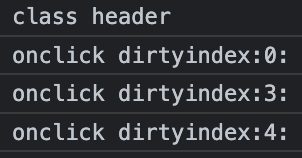 | 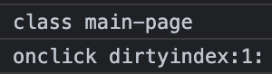 |

이 중에서 프리픽스로 대체된 것들을 args에서 찾아 바꿔 넣어줍시다. 이 때, 함수일 경우 제대로 이벤트 등록을 하기 위해 추가적으로 `replaceAttribute`를 거치도록 해주었습니다.

&nbsp;

## 5. 완성!!

아래는 전체 코드입니다.

```ts
const DIRTY_PREFIX = 'dirtyindex:';
const DIRTY_REGEX = /dirtyindex:(\d+):/;
const DIRTY_SEPARATOR_REGEX_G = /(dirtyindex:\d+:)/g;

function replaceAttribute(name: string, value: any, element: Element) {
  if (typeof value === 'function') {
    element.addEventListener(name.replace('on', '').toLowerCase(), value);
    element.removeAttribute(name);
  } else {
    console.log('This attribute is not a function');
  }
}

function buildDocumentFragmentWith(str?: string) {
  const df = document.createDocumentFragment();
  if (!str) return df;
  df.appendChild(document.createTextNode(str));

  return df;
}

function handleNoAttribute(node: Node, args: any[]) {
  if (
    node.nodeType !== Node.TEXT_NODE ||
    !node.nodeValue?.includes(DIRTY_PREFIX)
  )
    return;

  const texts = node.nodeValue.split(DIRTY_SEPARATOR_REGEX_G);

  const doms = texts.map(text => {
    const dirtyIndex = DIRTY_REGEX.exec(text)?.[1];
    if (!dirtyIndex) return buildDocumentFragmentWith(text);

    const arg = args[Number(dirtyIndex)];

    if (arg instanceof Node) {
      return arg;
    }

    return buildDocumentFragmentWith(arg);
  });

  for (const dom of doms) {
    node.parentNode?.insertBefore(dom, node);
  }
  node.nodeValue = '';
}

const jsx = (strings: TemplateStringsArray, ...args: any[]): Element => {
  if (!strings[0] && args.length) {
    throw new Error('Failed To Parse');
  }

  let template = document.createElement('div');
  template.innerHTML = strings
    .map((str, index) => {
      const argsString = args.length > index ? `${DIRTY_PREFIX}${index}:` : '';
      return `${str}${argsString}`;
    })
    .join('');

  let walker = document.createNodeIterator(template, NodeFilter.SHOW_ALL);
  let node;
  while ((node = walker.nextNode())) {
    if (
      node.nodeType === Node.TEXT_NODE &&
      node.nodeValue?.includes(DIRTY_PREFIX)
    ) {
      handleNoAttribute(node, args);
      continue;
    }

    node = <Element>node;

    let attributes: Attr[] = Array.from(node.attributes ?? []);

    for (let { name, value } of attributes) {
      console.log(name, value);
      if (name && value.includes(DIRTY_PREFIX)) {
        const match = DIRTY_REGEX.exec(value);
        if (!match) continue;
        value = args[Number(match[1])];

        replaceAttribute(name, value, node);
      }
    }
  }

  return template.firstElementChild ?? template;
};

export default jsx;
```

실제로 엘리먼트에는 많은 속성들이 있고, 지금 구현된 코드로는 작동하지 않을 속성들도 있을 것입니다. 그래도 기본적인 기능은 돌아가는 코드를 작성했기 때문에, 필요에 따라 로직을 추가해 사용하신다면 좋을 것 같습니다!

```toc
```