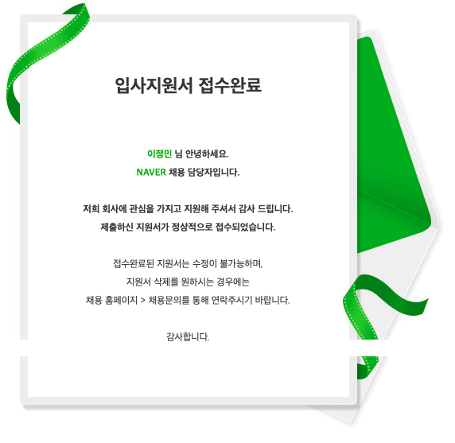
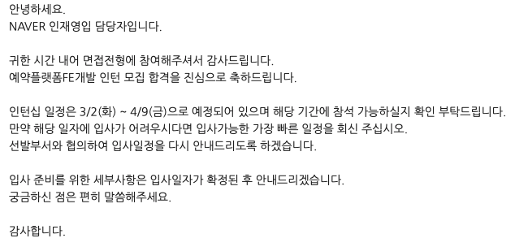
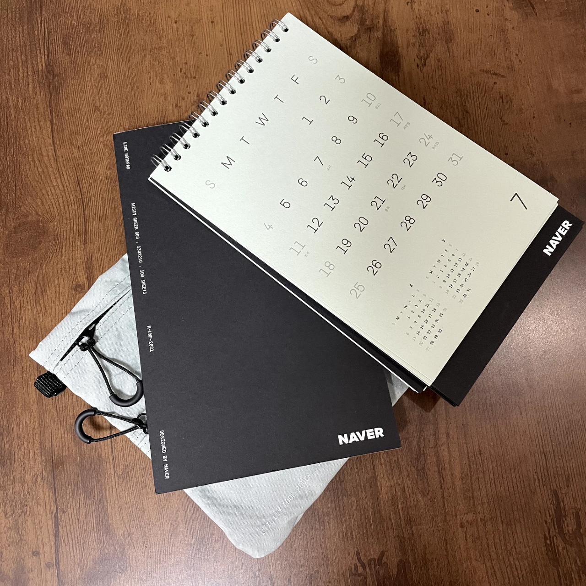
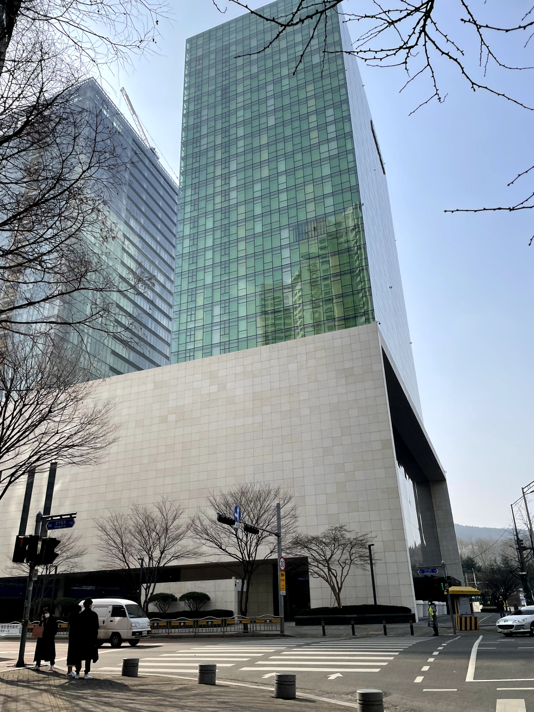
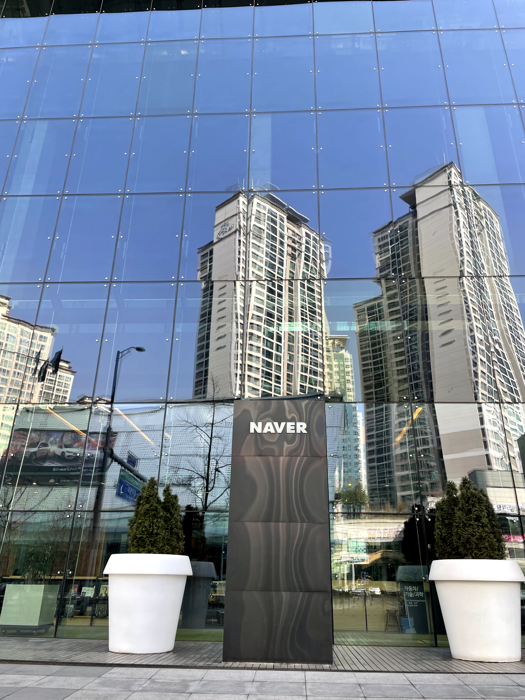
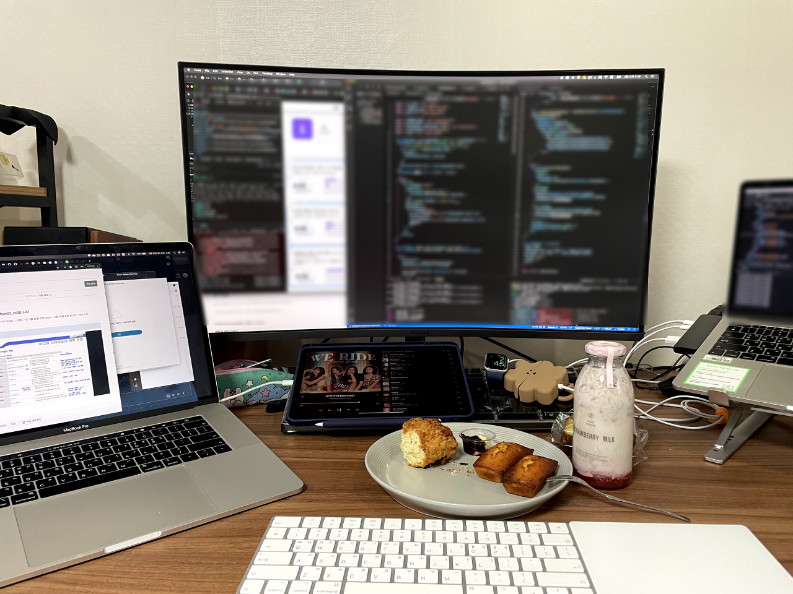
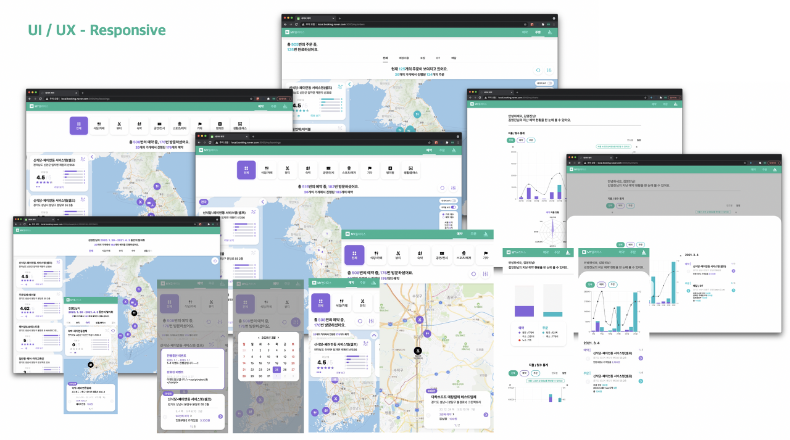

> 2021.03.02 - 2021.04.09 동안의 경험에 관한 글입니다.
> 6주 동안 진행되었던 네이버 전환형 인턴입니다 :) 

&nbsp;

## 퇴사가 결정되고..
 
3-2의 경우 메가존 클라우드 근무와 학업을 병행했는데, 겨울방학이 끝날 때쯤 더 이상 재학생은 인턴을 받지 않기로 결정되었다는 소식을 듣게 되었다. 하지만 나에게 휴학은 존재하지 않는 선택지였다. 코로나로 모든 대학 강의가 비대면으로 진행되는 꿀 기간을 놓칠 수 없었기도 했고, 적어도 취업계를 낼 수 있는 4-2 전까지는 혹시 몰라서라도 빨리 끝내 놔야 한다는 생각이 컸다. 그렇게 2월 말 퇴사가 확정되면서 다른 회사를 알아보기 시작했다.

그러던 중, 우연히 모집기간이 하루 남은 네이버 채용연계형 인턴 모집공고를 보게 되었고, 하루 남은 걸 발견한 것도 인연이다 싶어 서류를 제출하게 되었다. 해당 공고는 **서류 - 코딩 테스트 - 1차 면접 - 5주 인턴 - 2차 면접 - 최종 합격**의 절차로 진행된다고 안내되어있었다. 서류를 제출한 지 한 달 뒤 합격 결과를 받게 되었고, 이어서 온라인 코딩 테스트를 치게 되었다. 코딩 테스트 난이도는 상당히 무난한 편이었다. 카카오의 지옥 같은 난이도에 비해서는 정말 천사 같았다랄까..?



그렇게 코딩 테스트도 무난히 통과하여 1차 면접까지 보게 되었다. 어떻게든 최대한 공부를 해가야겠다는 생각으로 면접 날짜를 가능한 뒤인 3주 뒤로 잡았고, 낮에는 업무 밤에는 공부를 반복하는 나날을 보내게 되었다.

역시 면접은 그 자체로 큰 자산이 되는 것 같다. 면접을 준비하는 과정에서도 엄청난 양의 지식을 쌓게 될 뿐만 아니라, 면접을 보면서도 새로운 지식들을 쌓게 된다. 면접에서 떨어지더라도 좋은 경험이었으니 좌절하지 말기로 자신과의 약속을 한 뒤 면접을 보았고, 면접이 끝난 뒤에도 계속해서 업무와 공부를 진행했다.

사실 면접은 망한 느낌이었다. 두 개념을 바꿔 답한 것도 있었고, 간단한 건데 답을 제대로 못했던 것도 있었다. 그래서 면접이 끝나자마자 바로 영화관으로 달려가 훌훌 털어내려 했다.

&nbsp;

## 인턴 합격
 
그런데 1주 뒤, 합격을 축하한다는 메일을 받게 되었다. 세상에, 어째서? 이건 분명 엄청난 기회였다. 최선을 다해 열심히 해야겠다고 다짐하게 되었다.



무엇보다 기뻤던 것은, 전환형 인턴이라는 것이었다. 이전 두 번의 인턴은 정직원 전환을 고려한 인턴이 아니었기에 내 실력에 대한 의심이 계속해서 들었다. 하지만 전환형 인턴에 합격하다니, 전환을 염두하고서도 한 번 같이 일해 볼 만한 사람이 되었구나 하는 생각에 너무나도 뿌듯했다. 좀 더 개발자에 가까워진 것 같은 기분이었다.



아쉬웠던 것은 6주간 전면 온라인으로 진행된다는 것.. 네이버의 분위기를 피부로 느끼고 싶었는데 너무나도 아쉬웠다.

| | | |
| - | - | - |
|  |  |  |

&nbsp;

## 네이버 예약팀

그렇게 네이버 Glace CIC 소속 스마트 플레이스 서비스의 예약팀에서 6주간 근무하게 되었다. 6주라는 짧은 기간 동안 어떻게 하면 좋은 면모들을 많이 보여줄 수 있을지 고민이 많았다.



전환을 위한 과제를 6주 동안 완성시키는 것이 업무 아닌 업무였고, 예약/주문 내역 POI 탐색 및 데이터 시각화를 주제로 과제를 진행했다.

Next.js와 Typescript를 사용하여 웹을 구축했고, Recoil, GraphQL, Apollo를 사용하여 로컬 및 api response에 대한 상태들을 관리했다. 그리고 Rechart로 데이터 시각화까지 구현했었다.

다양한 기술들을 사용하면서, 특히 평소 관심 있었던 UI/UX에 큰 공을 들였다.



&nbsp;

## 하지만.. 탈락


퍼포먼스와 퀄리티가 좋았다고 생각했는데, 아쉽게도 전환 면접으로 이어지지 못했다.  
하지만 당시 멘토님께서,

_6주간의 결과물이라고 믿기지 않을 정도로 좋은 성과를 보여주었다._  
_만일 전환으로 이어지지 못하더라도 정민님의 능력이 부족해서가 아니라,_  
_핏 차이로 받아들이고 낙담하지 않으셨으면 한다.'_

라는 말씀을 해주셨기에 덕분에 잘 털어내고 다시 일어설 수 있었다.

&nbsp;

## 이제 뭘 해야 하지?

네이버 전환이 실패로 돌아가자, 이제 정말 뭘 해야 하나 싶었다. 그렇게 내 공백기가 시작되었다. 어쩌면 공백기라기보다는 성장기에 가까웠을지도 모르겠다. 약 5개월 동안 다른 여러 회사에 수없이 지원하고 탈락했다. 정말 엉엉 운 적이 셀 수 없이 많을 정도로 힘든 기간이었다. 하지만 수많은 실패 속에서 많은 성장을 이룰 수 있었던 것도 사실이다. 그렇게 얻은 경험으로 결국 한 회사에서 최종 합격을 할 수 있었던 것이니까 :)

```toc
```