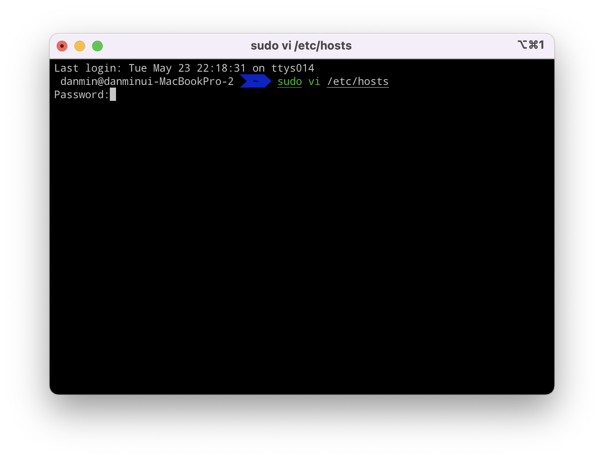
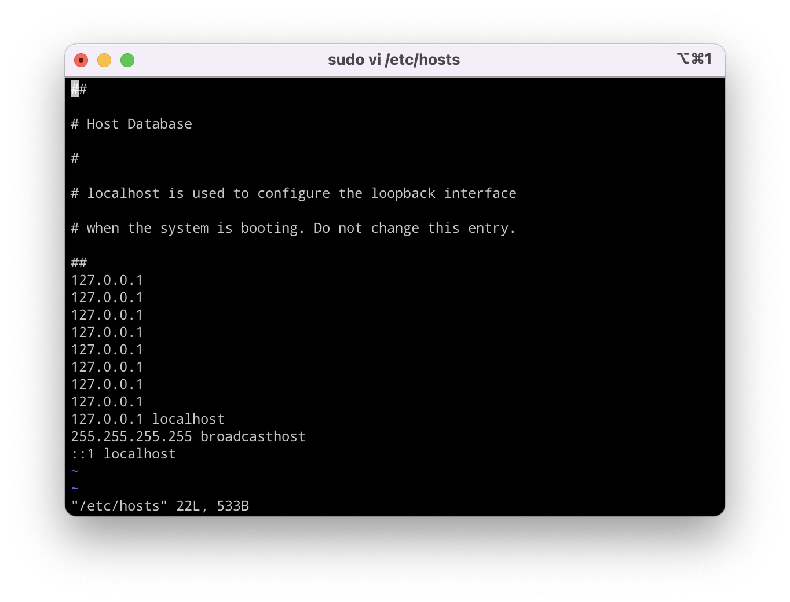

## hosts 파일이란?
hosts 파일은 운영체제가 호스트 이름을 IP 주소에 매핑할 때 사용하는 파일이다.

우리가 주소창에 url을 입력하면 DNS를 통해서 해당 도메인의 실제 IP 주소로 접속하게 되는데, 이 때 DNS를 통하지 않고 원하는 IP 주소로 접속하고자 할 때 hosts 파일을 수정하는 방법을 이용할 수 있다.

개발을 하다보면 로컬 환경에서 도메인 테스트를 해야 하는 경우가 생긴다. 이 때 원하는 도메인을 로컬 IP 주소를 바라보게끔 hosts를 수정할 수 있다.

&nbsp;

## sudo vi /etc/hosts
> vscode를 사용한다면 `code /etc/hosts`를 입력해도 된다.


터미널에서 위 명령어를 입력하고 비밀번호를 입력하자. 그러면 아래와 같은 파일이 뜰 것이다. 나는 이미 수정된 내용이 있다.


1. `i` 입력
2. hosts 파일 수정
3. `^C` 입력
4. `:wq` (저장 후 종료) 입력

&nbsp;

## 요즘은 이런 거 해주는 앱도 있더라
[Gasmask](https://github.com/2ndalpha/gasmask)와 같은 앱을 사용하는 것도 좋은 방법이다. 기존 hosts 파일을 직접 건드리지 않고 설정할 수 있다는 것과 hosts 파일을 여러 개 만들 수도 있다는 것이 가장 큰 장점인 것 같다.

```toc
```