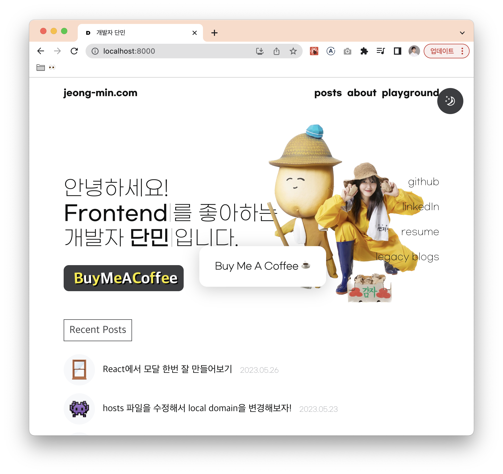
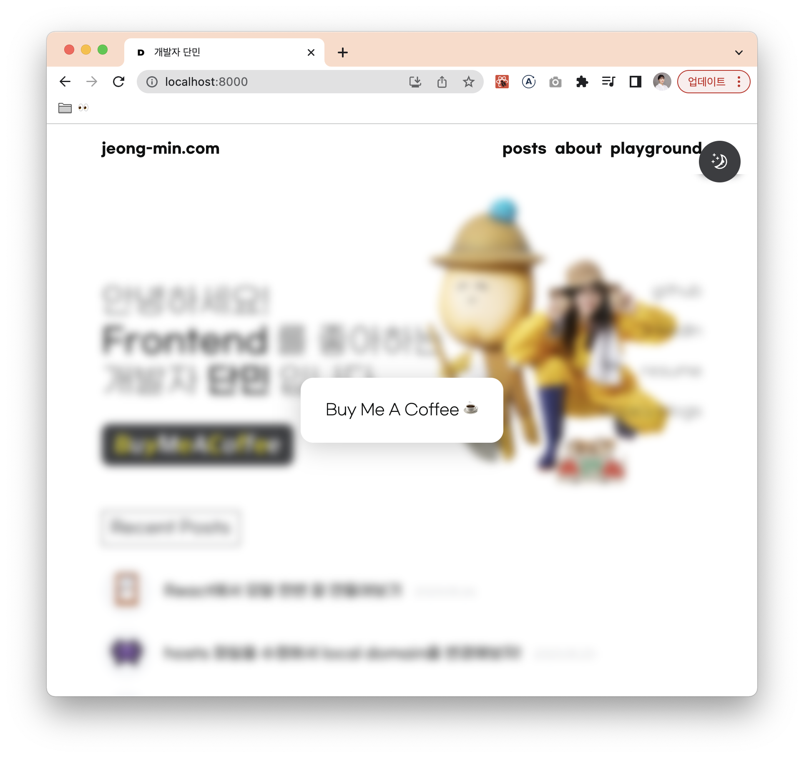
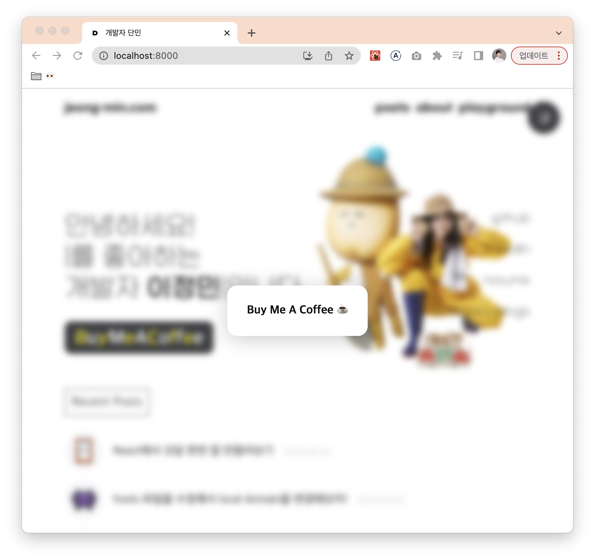
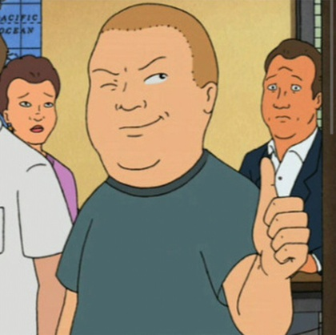

~삐까뻔쩍 나도 한번 잘살아보자🎵~

웹사이트를 만들다 보면 피할 수 없는 그것... 바로
### 모달 창 만들기..!


드롭다운이 아닌 일반적인 모달의 경우 화면 전체를 채우게끔 구현을 해야 하는데, 이 때 사용할 수 있는 몇 가지 팁을 정리해보려 한다.

현재 내 블로그에 있는 `Buy Me A Coffee` 컴포넌트를 예시로 들어보도록 하겠다.

&nbsp;

## 일단은 모달을 만들어보자

```ts
const BuyMeACoffee: React.FC = () => {
  const [isModalOpened, setIsModalOpened] = useState(false);

  return (
    <>
      // 버튼을 클릭하면 모달이 열림
      <S.Button onClick={() => setIsModalOpened(true)}>
        <S.Text>
          {'BuyMeACoffee'.split('').map((char, index) => (
            <p key={index}>{char}</p>
          ))}
        </S.Text>
      </S.Button>

      {isModalOpened && (
        <S.Modal>
          <S.Title>Buy Me A Coffee ☕️</S.Title>
        </S.Modal>
      )}
    </>
  );
};
```

버튼을 클릭하면, 다음 사진처럼 모달이 열리게 된다.


자.. 그렇다면 닫히는 건 어떻게 해야 할까? 보통 모달은 모달 바깥을 클릭하면 닫히곤 한다.

&nbsp;

## 모달 밖을 클릭하면 모달이 닫히게 하고 싶어!

여기에는 두 가지 방법이 있다.

### 1. ref 사용하기
ref를 사용해서 클릭 이벤트가 컴포넌트 내부에서 발생한 것이 아니라면 close를 해주는 방법이다.

```ts
const BuyMeACoffee: React.FC = () => {
  const [isModalOpened, setIsModalOpened] = useState(false);

  const modalRef = useRef<HTMLDivElement>(null);

  useEffect(() => {
    const closeModal = (e: MouseEvent) => {
      if (isModalOpened && modalRef.current && !modalRef.current.contains(e.target as Node)) {
        // 이벤트가 발생한 노드가 모달 컴포넌트 내부에 존재하지 않는다면 close
        setIsModalOpened(false);
      }
    };

    // 이벤트 리스너를 document 전체에 붙여줌
    document.addEventListener('mousedown', closeModal);

    return () => {
      document.removeEventListener('mousedown', closeModal);
    };
  }, [isModalOpened]);

  return (
    <>
      <S.Button onClick={() => setIsModalOpened(true)}>
        <S.Text>
          {'BuyMeACoffee'.split('').map((char, index) => (
            <p key={index}>{char}</p>
          ))}
        </S.Text>
      </S.Button>

      {isModalOpened && (
        <S.Modal ref={modalRef}>
          <S.Title>Buy Me A Coffee ☕️</S.Title>
        </S.Modal>
      )}
    </>
  );
};
```

&nbsp;

### 2. Wrapper를 추가하기
모달을 감싸면서 화면 전체를 덮는 Wrapper를 추가하여 onClick 이벤트를 걸어주는 방법이다.

나는 어차피 모달 뒤에 배경을 넣어주고 싶었기에 Wrapper(ModalBackground)를 만든 후 이벤트를 걸어주었다.

```ts
const BuyMeACoffee: React.FC = () => {
  const [isModalOpened, setIsModalOpened] = useState(false);

  return (
    <>
      <S.Button onClick={() => setIsModalOpened(true)}>
        <S.Text>
          {'BuyMeACoffee'.split('').map((char, index) => (
            <p key={index}>{char}</p>
          ))}
        </S.Text>
      </S.Button>

      {isModalOpened && (
        <S.ModalBackground onClick={() => setIsModalOpened(false)}>
          <S.Modal>
            <S.Title>Buy Me A Coffee ☕️</S.Title>
          </S.Modal>
        </S.ModalBackground>
      )}
    </>
  );
};
```



그런데 문제가 있다. Background에 흐림효과를 넣어준 것을 볼 수 있는데, 최상단에 fixed 되어있는 헤더와 테마전환 버튼이 가려지지 않고 있다.

이는 모달 컴포넌트 자체가 더 안쪽 뎁스에 존재하기 때문에 발생하는 것으로, z-index를 아무리 높게 주어도 해결되지 않는다.

&nbsp;

## 모달을 최상단에 두고 싶어!

이를 위해 [`ReactDom`이 제공하는 방법](https://ko.legacy.reactjs.org/docs/portals.html)이 있다. createPortal을 사용하면 상단의 돔 노드로 렌더링할 수 있다.

> 참고: 포탈을 사용해서 상위의 DOM 트리에 두었다 할지라도,    포탈은 여전히 React 트리에 존재하기 때문에 기존과 동일하게 context 기능과 이벤트 버블링이 동작한다.

```ts
const BuyMeACoffee: React.FC = () => {
  const [isModalOpened, setIsModalOpened] = useState(false);

  return (
    <>
      <S.Button onClick={() => setIsModalOpened(true)}>
        <S.Text>
          {'BuyMeACoffee'.split('').map((char, index) => (
            <p key={index}>{char}</p>
          ))}
        </S.Text>
      </S.Button>

      {isModalOpened &&
        createPortal(
          <S.ModalBackground onClick={() => setIsModalOpened(false)}>
            <S.Modal>
              <S.Title>Buy Me A Coffee ☕️</S.Title>
            </S.Modal>
          </S.ModalBackground>,
          document.body,
        )}
    </>
  );
};
```

위와 같이 수정하면, 기대했던 대로 CSS가 적용되는 모습을 볼 수 있다.



그런데 여전히 문제가 있다. 사진으로는 확인이 어렵지만, 실제로 저 코드에서는 배경 뒤의 화면을 스크롤할 수 있다.

&nbsp;

## 모달의 백그라운드에서 스크롤을 막고 싶어!

이는 아주 간단하다. 최상단 요소에 css 한 줄만 추가해주면 된다.

```css
.scroll-locked {
  overflow: hidden;
}
```
위의 className을 모달이 열리고 닫힐 때 추가/삭제 해주도록 하자.

```ts
const BuyMeACoffee: React.FC = () => {
  const [isModalOpened, setIsModalOpened] = useState(false);

  const html = document.querySelector('html');

  const openModal = () => {
    setIsModalOpened(true);
    html?.classList.add('scroll-locked');
  };

  const closeModal = () => {
    setIsModalOpened(false);
    html?.classList.remove('scroll-locked');
  };

  return (
    <>
      <S.Button onClick={openModal}>
        <S.Text>
          {'BuyMeACoffee'.split('').map((char, index) => (
            <p key={index}>{char}</p>
          ))}
        </S.Text>
      </S.Button>

      {isModalOpened &&
        createPortal(
          <S.ModalBackground onClick={closeModal}>
            <S.Modal>
              <S.Title>Buy Me A Coffee ☕️</S.Title>
            </S.Modal>
          </S.ModalBackground>,
          document.body,
        )}
    </>
  );
};
```

> Gatsby에서는 document에 바로 접근할 경우 SSR로 인해 빌드 에러가 발생한다. 따라서 다음과 같은 코드로 작성해주었다.
```ts
const [html, setHtml] = useState<HTMLHtmlElement | null>(null);

useEffect(() => {
  setHtml(document.querySelector('html'));
}, []);
```

이제 원하는 대로 동작하는 모달을 완성했다!



```toc
```