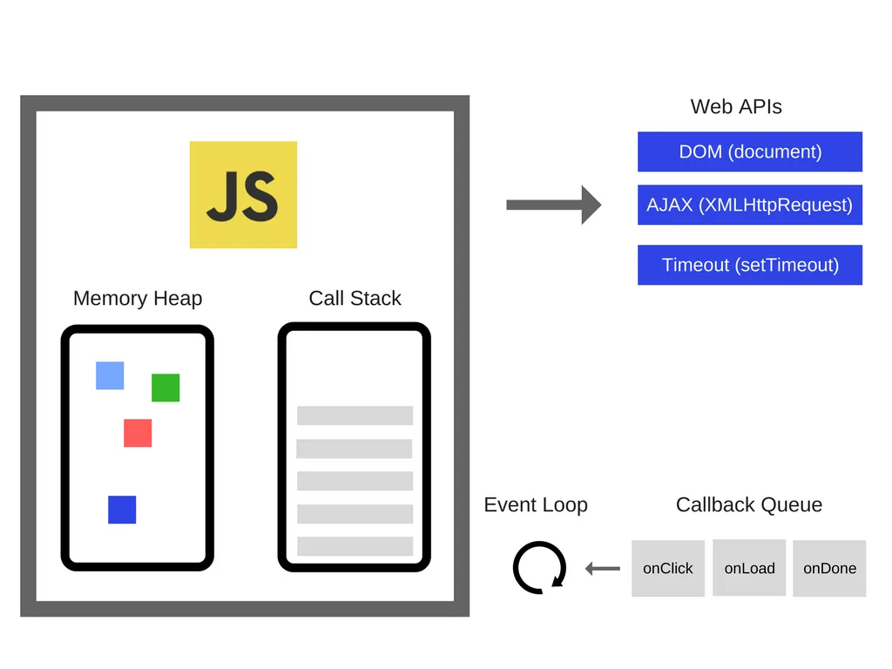
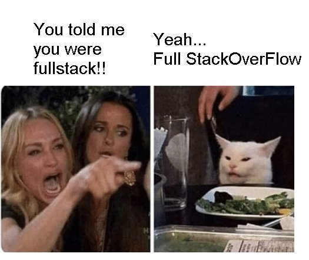

[지난 글](https://www.jeong-min.com/36-RAF/)에서 `requestAnimationFrame`에 대해 알아보았다. 어떤 독자는 해당 글을 읽으면서 한 궁금증이 떠올랐을지도 모른다.

'왜 `setTimeout`은 타이머 주기를 보장하지 않는 거지?'


이를 알기 위해서는 이벤트 루프에 대해 알아야 하는데, 우선 자바스크립트가 어떻게 동작하는지부터 알아보자.

&nbsp;

## 자바스크립트의 동작
자바스크립트 엔진은 하나의 콜 스택을 가지는 싱글 스레드 모델로 동작한다. 하지만 현실에서 자바스크립트는 웹 브라우저나 노드js와 같은 멀티스레드 환경에 임베디드되어 실행되기 때문에 자바스크립트와 웹api, 이벤트 루프 등을 분리하여 말하기는 어렵다. 따라서 자바스크립트를 작동시킬 때는 싱글 스레드와 멀티 스레드의 타이밍이 따로 존재한다고 말할 수 있다. 일반적으로 프로그램은 코드를 위에서 아래로 순차적으로 실행하지만, 이벤트 루프를 통해 이벤트가 발생할 때마다 해당 이벤트에 대한 작업을 처리할 수 있다. 이를 통해 비동기 작업을 효율적으로 처리할 수 있고, 블로킹되는 작업 없이 다른 작업을 계속 수행할 수 있게 된다.

&nbsp;

## 자바스크립트의 이벤트 루프
즉, 이벤트 루프는 싱글 스레드 환경에서 비동기 작업을 처리하기 위한 메커니즘이다. 
> 스레드는 프로세스 내의 실행 단위이며, 프로세스는 메모리 상에서 실행중인 작업을 말한다.
자바스크립트는 이벤트 기반의 비동기 프로그래밍을 위해 이벤트 루프를 사용한다. 웹 페이지에서 사용자의 클릭, 키보드 입력, 마우스 움직임 등의 이벤트가 발생하면 이를 브라우저의 이벤트 루프가 감지하고 처리한다. 이벤트 루프는 이벤트를 순차적으로 처리하며, 이벤트 핸들러 함수를 호출하여 해당 이벤트에 대한 작업을 수행한다. 이를 통해 웹 페이지는 사용자와의 상호작용에 따라 동적으로 동작할 수 있다.

&nbsp;

## 자바스크립트 런타임
자바스크립트 런타임은
- 자바스크립트 엔진 (메모리 힙 + 콜 스택)
- 웹api
- 이벤트 루프
- 콜백 큐
로 구성된다.

- 메모리 힙: 메모리 할당이 이루어지는 곳으로 선언한 변수와 함수들이 들어간다.
- 콜 스택: 실제 실행되는 코드를 순서대로 실행하는 곳이다.



콜 스택에서 비동기 함수가 실행되면, 브라우저에서 제공하는 웹 api를 호출하게 되고, 웹 api는 콜백함수를 콜백 큐에 추가한다. 그렇게 선입선출로 콜 스택으로 넘어가 실행된다. 이렇게 콜 스택이 비어있을 때 콜백 큐의 첫번째 콜백을 넘겨주도록 콜 스택을 체크해주는 역할을 하는 것이 이벤트 루프다. 만일 스택이 할당된 공간보다 많은 공간을 차지하게 되면 스택오버플로우 에러가 발생한다.



> 웹 브라우저에서 자바스크립트를 실행시키는 경우, 엔진 워크단계에서 브라우저 엔진은 렌더링 등의 작업들은 백그라운드에서 멀티 스레드로 처리하고 js코드나 메모리에 영향을 끼치는 작업을 수행할 때에는 싱글 스레드로 처리한다. 모던 브라우저의 구조를 살펴보자면, concurrency를 위한 싱글스레드 부분과 parallelism을 위한 멀티스레드 부분이 있다. 

> concurrency한 부분을 보자면, 체크 큐에서 콜백 큐에 실행시켜야 할 명령어가 있는지 검사하고, 있다면 꺼내서 런 시키고 존재하지 않는다면 다시 엔진워크 단계로 돌아간다. parallel한 부분을 보자면, 웹 api 스레드는 각자 해야할 일을 수행 후 콜백 큐에 콜백 함수를 적재시키는데, 이 콜백 큐에 대한 서브 스레드로 네트워크, 타이머, 메세지, 돔이벤트의 네 가지의 스레드가 존재한다.

자바스크립트는 싱글 스레드 기반으로 동작하는 스크립트 언어지만, 이렇게 비동기적인 처리를 지원하기 때문에 빠르게 동작할 수 있다.

&nbsp;

## setTimeout 예시
```ts
console.log(1);
setTimeout(console.log, 5000, 2);
console.log(3);
```
의 동작을 살펴보자.

1. `console.log(1)`이 수행되면 콜 스택에 추가 되고, 실행되어 출력된 후, 콜 스택에서 제거된다.
2. `setTimeout`이 수행되면 콜 스택에 추가 되고, 실행되어 web API의 timer 스레드에 작업이 넘겨진다.

즉, 5초 간 기다리는 작업을 timer 스레드라는 서브 스레드에서 수행하는 것이다. 덕분에 메인 스레드에서는 5초 간의 블로킹이 일어나지 않고 다음 코드를 수행할 수 있다. 자바스크립트가 호출 스택이 하나인 싱글 스레드임에도 여러 가지 일을 동시에 처리하는 것처럼 동작할 수 있는 이유이다. 이를 concurrency라고 한다.

3. 그리고 나서 `console.log(3)`이 적재되고 실행된 후 제거된다.
4. 5초 후 timer 스레드에서는 콜백 큐로 `console.log(2)`를 옮긴다.
5. 이벤트 루프가 콜백 큐에 있던 `console.log(2)`를 콜 스택에 추가하고, 실행된 후 제거된다.

이벤트 루프는 항상 루프를 돌면서 콜 스택과 콜백 큐를 확인한다. 그러다 콜 스택이 빈 상태가 되면, 콜백 큐에 있는 함수를 하나씩 콜 스택으로 올려준다.

&nbsp;

## setTimeout은 타이머 시간을 보장하지 않는다
위의 예시에서 봤듯이, 이벤트 루프는 큐에 들어온 작업을 스택으로 이동시켜 실행하고, `setTimeout` 함수는 정해진 시간이 지나면 해당 콜백 함수를 큐에 추가한다. 그러나 이때 타이머의 정확한 시간은 보장되지 않는다.

`setTimeout` 함수가 정확한 타이머를 보장하지 않는 이유는 여러 가지 요소들이 상호작용하기 때문이다.

1. **이벤트 루프의 처리 시간**  
   위에서 설명한 호출 스택에 이미 다른 작업이 존재하거나 이벤트 루프의 다른 처리가 있을 경우, `setTimeout`의 정확한 타이머를 보장할 수 없다.
2. **시스템 리소스 및 환경 요인**  
   운영 체제나 실행 환경에 따라 타이머 정확성이 영향을 받을 수 있다. 자바스크립트 엔진은 시스템의 다른 프로세스나 작업과 리소스를 공유하므로, 이에 따라 `setTimeout`의 실행 시간이 다소 차이가 생길 수 있다.
3. **브라우저의 최소 지연 시간**  
   대부분의 브라우저는 `setTimeout`의 최소 지연 시간을 가지고 있다. (일반적으로 4ms에서 10ms 사이의 값이 최소 지연 시간으로 사용된다.) 따라서 `setTimeout`의 지연 시간을 0으로 설정하더라도 실제로는 최소 지연 시간 이상의 시간이 지난 후에 콜백 함수가 실행될 수 있다.

이러한 요소들로 인해 `setTimeout`의 정확한 타이머 보장이 어려울 수 있다. 만약 정확한 타이밍이 필요한 경우에는 `requestAnimationFrame`을 사용하는 것이 더 적합할 수 있다. `requestAnimationFrame`은 브라우저의 리플로우 주기에 맞춰 실행되므로, 애니메이션 및 시각적인 업데이트와 같은 작업에 더 적합하다.

```toc
```