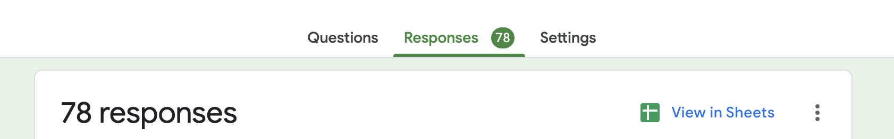
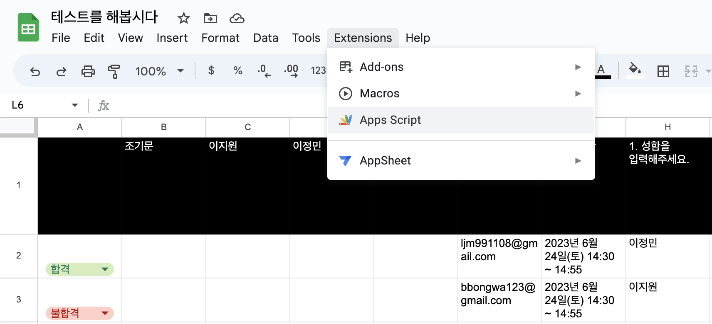
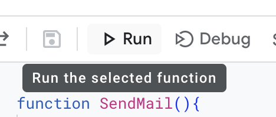

현재 IT 동아리를 운영 중에 있는 나.
> [SIPE](https://sipe.team/) 많관부탁드립니다 😉😉
구글폼으로 서류 원서를 접수받고, 서류 결과 메일을 보내야하는 상황에 다다르는데..

&nbsp;

### 이거, 한 사람 한 사람 메일을 다 따로 보내야 하는 건가?


&nbsp;

하지만 개발자로서 그런 노가다를 하는 것은 용납할 수 없는 일.


결국 [구글에서 제공하는 API](https://developers.google.com/apps-script/reference/mail/mail-app)를 발견해내고야 말았다. 링크를 들어가보면 메일 말고도 다양한 API를 제공하는 것을 볼 수 있다.

&nbsp;

### 1. 구글폼 상단의 `View in Sheets`를 클릭하면 응답을 스프레드시트로 확인할 수 있다.


&nbsp;

### 2. 스프레드시트 메뉴의 `Extensions > Apps Script`를 클릭하자.


&nbsp;

### 3. 코드를 작성하자!
```js
function SendMail() {
  try {
    // 현재 활성화된 스프레드시트 가져오기
    const activeSS = SpreadsheetApp.getActiveSpreadsheet();
    // 현재 선택된 시트 가져오기
    const activeSheet = activeSS.getActiveSheet();

    for (let index = 2; index < 100; index++) {
      const name = activeSheet.getRange('H' + index).getValue(); // 이름
      const email = activeSheet.getRange('F' + index).getValue(); // 이메일
      const pass = activeSheet.getRange('A' + index).getValue(); // 합격여부
      const date = activeSheet.getRange('G' + index).getValue(); // 면접일자

      const subject = '[SIPE] 1기 서류 결과를 안내드립니다.'; // 메일 제목
      let body;

      if (email !== '') {
        if (pass === '합격') {
          // 합격자
          body = '';
        } else {
          // 불합격자
          body = '';
        }

        MailApp.sendEmail({
          name: 'SIPE',
          to: email,
          subject,
          body,
        });
        console.log(name, email, pass, '메일 전송 완료');
      } else {
        console.log('F' + index + '에 메일 주소 없음. 발송 중단 처리');
        break; // 셀에 있는 내용을 다 발송하여 루프 중단
      }
    }
  } catch (err) {
    console.log('발송 실패 - ' + err);
  }
}

```



이제 상단의 Run만 누르면 메일이 발송되는데, 정말 배포도 아닌 코드 실행이 이렇게 긴장되는 건 처음이었다. 이렇게 많은 수의 사람들에게 동시에 메일을 보내는 것도 처음인데다, 누군가에게는 불합격 소식을 전할 수밖에 없었기에 너무 죄송스러운 마음이 들기도 했다.


&nbsp;

여튼 무사히 한 고비를 넘겼고, 이제 시작인 우리 SIPE 팀.. 성공적인 하반기가 될 수 있길 기도해본다.


```toc
```