> 2021.07.05 - 2021.08.31 동안의 경험에 관한 글입니다.

&nbsp;

## 정직원이 하고 싶어!
 
네이버 인턴이 끝나고, 이제 인턴은 더 하고 싶지 않았다. 소속되지 않은 불안감은 생각보다 힘들었고, 정직원으로서 당당하게 스스로를 개발자라고 소개하는 날이 하루빨리 찾아왔으면 했다.

4월부터 6월까지의 공백기 동안 수많은 도전과 실패를 겪었다. 신입뿐만 아니라 경력 채용 공고에도 서류를 많이 넣었는데, 생각보다 합격률이 높았다. 면접도 1차 면접이나 짧은 전화면접의 경우 무난하게 통과할 수 있었다.

하지만 지원했던 대부분의 회사들이 2-3년 차 경력직을 원하고 있었기 때문인지 심화 기술면접에서 줄줄이 떨어졌다. 좌절감과 실망감도 들긴 했지만, 새로운 질문과 문제들을 경험할 수 있었다는 즐거움이 더 컸다. 내가 경력직만큼의 실력을 갖고 있는 건 당연히 아니었으니 말이다.

면접만 거의 열몇 번을 봤고 그만큼 데이터를 많이 쌓을 수 있었다. 그러던 중 한 스타트업에서 최종 합격을 하게 되었다. 하지만 예상외로 연봉협상 과정이 원만히 이루어지지 않았고, 결국 오퍼를 거절하게 되었다. 당시에는 너무 힘들었다. 이제 끝인가 했더니 다시 시작이었다. 그렇게 바라던 최종 합격이었지만 결국 내 손으로 놓아주게 되었다.

&nbsp;

## 또 인턴?
 
정직원 공고 말고, 인턴 공고를 지원한 곳도 한 군데 있었다.  
바로 우아한형제들.

인턴은 더 이상 하고 싶지 않았지만, 그래도 배민은 못 참지.

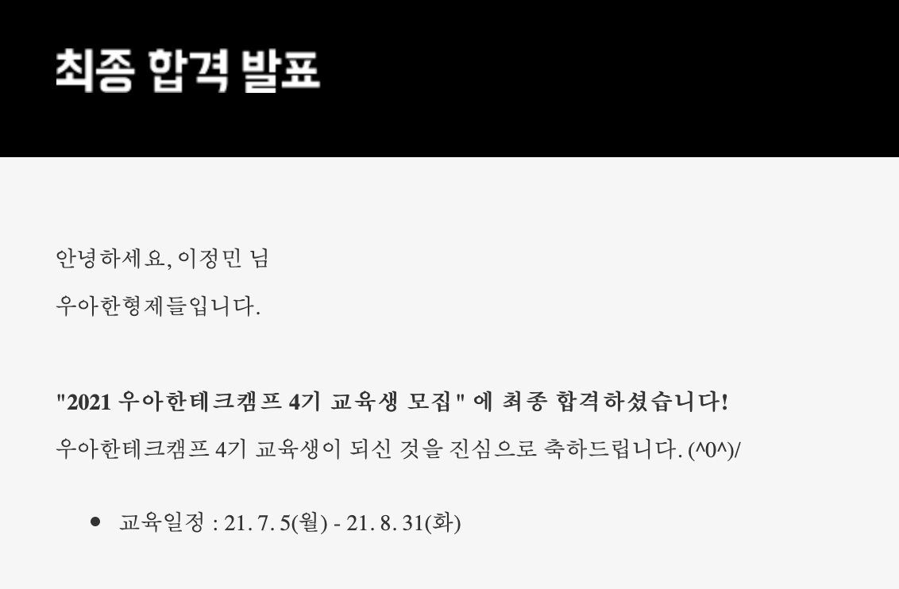

그렇게 서류, 1차 코테, 2차 코테, 면접을 거쳐 우테캠 4기에 최종 합격하게 되었다. 정직원을 노린 도전이 모두 실패했기 때문에, 선택지는 우테캠 밖에 없었다.

> 1차 코테에서는 쉬운 난이도의 알고리즘 문제들이 주어졌다.
> 몇몇 문제는 알고리즘 개념이 아닌 JS 메서드만 알아도 풀 수 있을 정도..?
> 
> 2차 코테는 구현 테스트였다. 바닐라 JS로 기능을 구현하는..
> 컴포넌트 같은 거 안 만들고 완전 돔 API를 남발하는 식으로 작성했는데 붙었다.
> 주어진 기능을 일단 다 구현하는 게 중요했는 듯..?
>
> 면접은 100% 인성면접이었다. 밝고 씩씩한 모습을 보여주려 노력했다 ㅎ.ㅎ

그때부터 마음가짐을 고쳐먹었다.  
**'왜 빠른 취업을 갈망하고 있지? 굳이 그럴 필요 있나? 그냥 이 과정들을 재밌게 즐겨보자!'**

우테켐 내내 그러한 마음가짐으로 프로젝트를 진행했다. 합격이나 전환과 같은 어떤 결과만을 바라보고 살았더니 스스로를 갉아먹을 뿐이었다. 전환을 바라기보다는 우테캠 과정에서 최대한 행복과 재미를 많이 얻어가고자 했다. 매 프로젝트마다 나는 '스트레스받지 말고 재밌게 해요 우리!'를 외쳤다.

&nbsp;

## 우테캠이 어떤 곳이냐면...

돈 받으며 하는 인턴이 맞긴 하다. 하지만 인턴스럽진 않다. 회사에 소속되어 업무를 맡아 일을 하는 게 아니라, 인턴 신분으로서 교육을 받는 과정이라고 하는 게 더 맞는 말인 것 같다. 하지만 교육이라고 하기에도 애매한 게, 모든 걸 우리 스스로 해야 했다.

두 달 동안 네 번의 프로젝트를 진행하게 되는데,
- 첫 번째는 오직 바닐라와 익스프레스로,
- 두 번째는 바닐라지만 CRA를 곁들여서,
- 세 번째는 리액트로,
- 네 번째는 자유롭게,
이런 식으로 레벨을 높여 진행된다.

매 프로젝트마다 필수 과제와 도전 과제가 주어지는데, 사실 필수 과제도 꼭 해야 할 필요는 없는 그런 자유로운 분위기다. 하지만 나는 모든 프로젝트를 도전 과제까지 완벽하게 해내고 말겠다고 다짐했고, 그 다짐을 지켜냈다. 이 과정들을 재밌게 즐기기 위해서는, 뽕을 뽑아야 한다고 생각했다. 이때가 아니면 또 언제 이런 걸 해볼까 싶었다.

&nbsp;

## 첫 번째 프로젝트: 회원가입/로그인

첫 번째 프로젝트는 두 명이서 일주일 동안 짧게 진행되었다. 회원가입/로그인을 바닐라로 간단히 만드는 프로젝트였다.

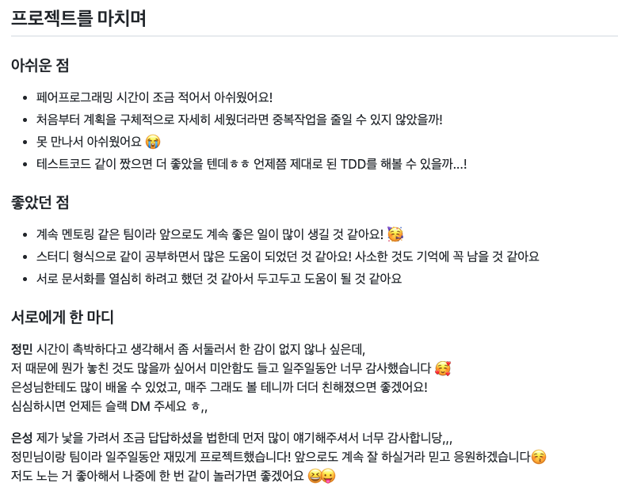

실제로 은성님과는 우테캠이 끝난 이후 더 친해졌고, 우리 집에 놀러 와서 술도 한 잔 하는 사이가 됐다ㅋㅋㅋㅋ

&nbsp;

## 두 번째 프로젝트: 우아마켓

두 번째 프로젝트는 두 명이서 2주 동안 진행되었다. 중고채팅앱~~당근마켓~~을 바닐라로 만드는 프로젝트였다. 바닐라로 리액트와 유사한 컴포넌트 & CSR 방식을 구현하여 진행했다. 리액트를 쓰고 싶어서 미치는 줄 알았다 ㅎ.ㅎ

채팅 구현이 도전과제였는데, 시간 내에 못할 것 같다는 강열님의 의견을 무시하고 데모 며칠 전에 혼자 구현해갔다ㅋㅋㅋ _한다고 하면 되는 거야~~_

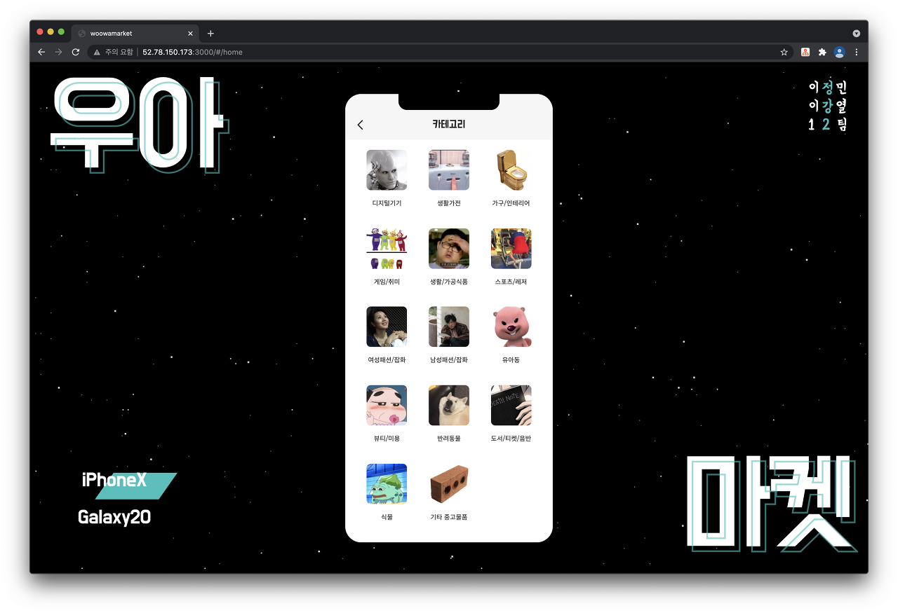

위의 첨부사진으로도 알 수 있듯이, 진짜 미친 듯이 재밌게 진행했다. 같은 팀이었던 강열님은 지금도 절친한 사우지간이다. 오프라인으로 만나 아침부터 밤까지 카페에 죽치고 앉아서 개발만 했다. 근데도 죽이 잘 맞아서 너무 즐거웠다. (나만의 착각이려나...?)

개발하다가 뜬금없이 노래 부르고 드립 날리고ㅋㅋ 지금 생각해도 너무 재밌었다. 언제 또 그런 협업을 해볼 수 있을까..🥲

&nbsp;

## 세 번째 프로젝트, 우아한 가계부

세 번째 프로젝트도 두 번째와 동일하게 두 명이서 2주간 진행되었다.

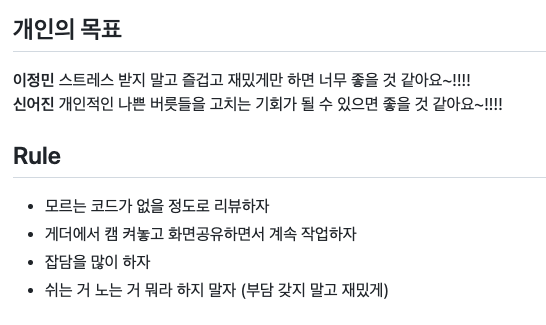
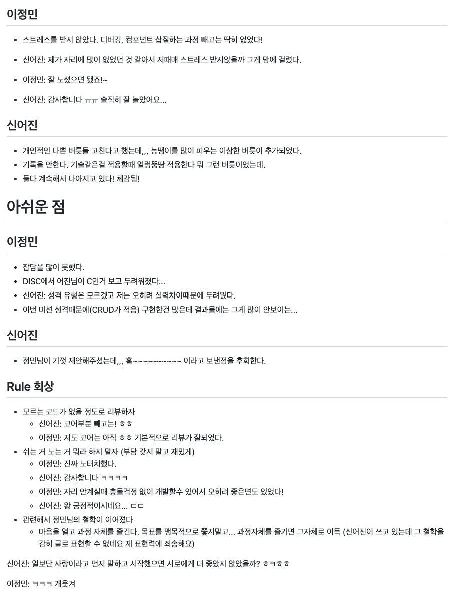

당시 어진 님이 개인적인 사정으로 프로젝트에 오랜 시간 참여하지 못하셨다. 근데 이렇게 말하는 것도 웃긴 게, 애초에 근무시간은 9시부터 6시인가 그랬다ㅋㅋ 모두가 초과근무를 하는 분위기라 그랬지, 아무도 힘들게 하라고 하진 않았다.. 어진 님은 초과근무를 하지 않으셨을 뿐.. 미안해하셔서 오히려 내가 더 미안했다. 오히려 밤 시간 동안, 내가 시도해보고 싶었던 부분들을 충돌 없이 진행할 수 있어서 좋았다. (오히려 좋아!)

당시 기존에 구현했던 컴포넌트를 뜯어고치고 디핑 알고리즘을 추가하는 등 새로운 시도를 했는데, 그 과정에서의 삽질로 인한 스트레스를 제외하고는 즐거움뿐이었다. 어쨌거나 삽질 끝에 구현하긴 했으니..!

| | | |
| - | - | - |
| 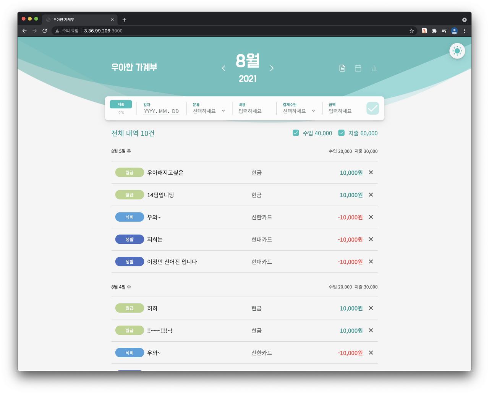 | 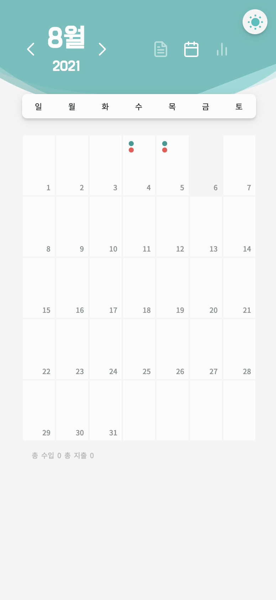 | 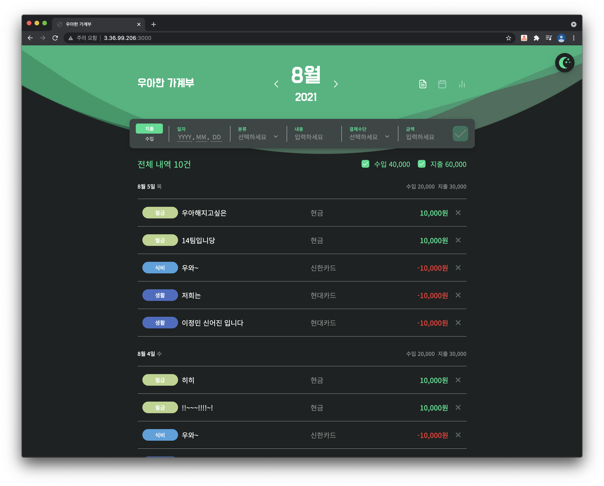 |

&nbsp;

## 네 번째 프로젝트, ET네 만물상

마지막 프로젝트는 네 명이서 3주 동안 진행되었다. 배민 문방구를 참고하여 만들어보는, 마지막 프로젝트인 만큼 팀 규모도 프로젝트 규모도 컸다.

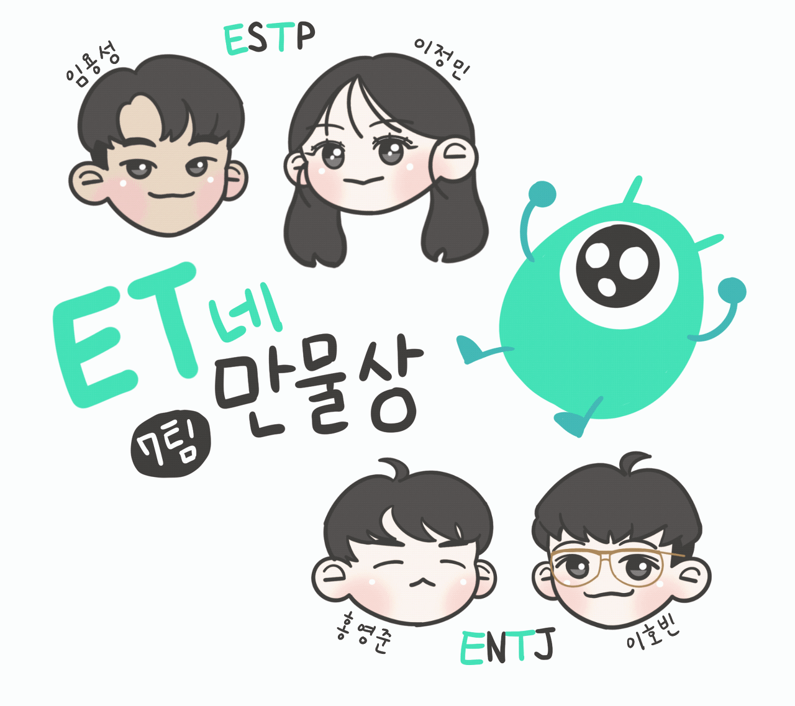

우연히도 ESTP 두 명과 ENTJ 두 명이었기에, 겹치는 E와 T를 활용하여 서비스명을 지었다.

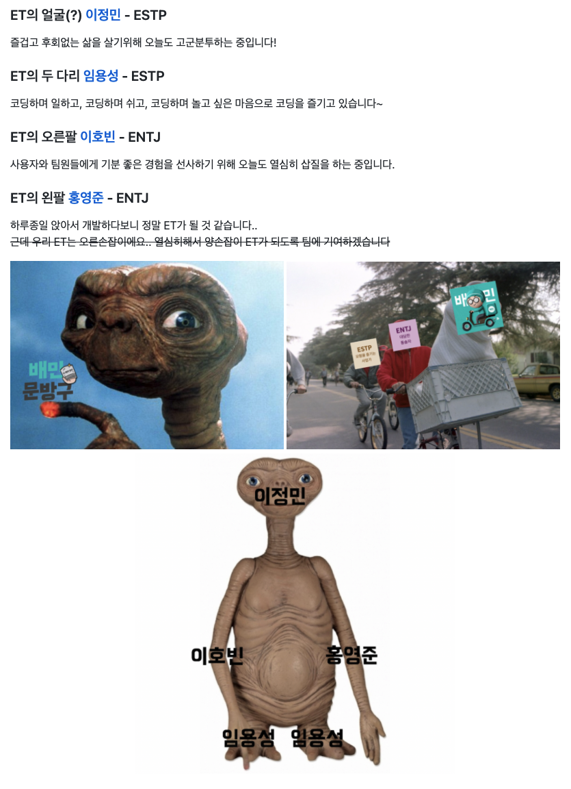

기술 스택에 드디어!! 제한이 없었기 때문에, React부터 시작해서 ReactQuery, Recoil, NestJS, typeORM, ElasticSearch까지 다양하게 사용하여 구현했다. 게다가 운이 좋게도, 백엔드에 빠삭하신 용성님 덕에 정말 많은 것을 배울 수 있었다.

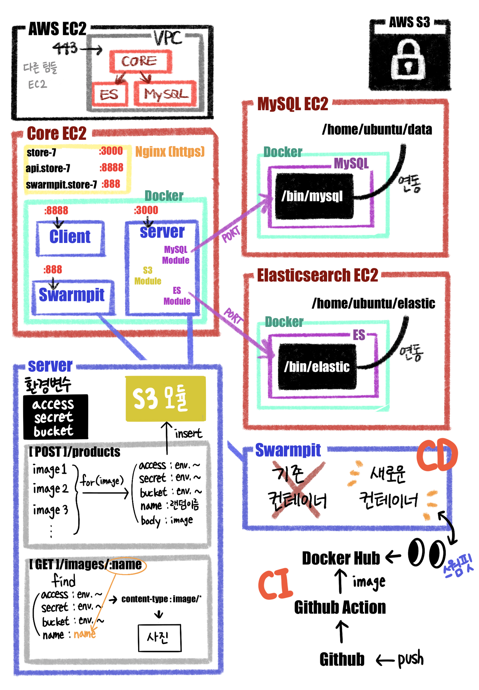

당시 고등학생 신분으로 멀리 계셨던 용성님을 제외하고 셋이서 자주 만나 밥도 먹고 음주도 하고 그랬다._(아쉬워요 용성님...😢 )_ 이때 급격하게 친해진 호빈 님과 영준 님은 현재도 절친한 사우지간이 되었다 :)

&nbsp;

## 캠프가 끝나고...

실제로 정말 스트레스받지 않고 즐겁게 2개월을 보냈다고 자신 있게 말할 수 있다. 나는 모든 프로젝트를 만족스럽게 완성했다. (굳이 따지자면 문서화 같은 부분이 아쉽긴 했지만, 구현과 완성도에 초점을 맞췄으니 어쩔 수 없었다 생각한다.) 전환이고 뭐고, 그냥 재밌고 뿌듯했다.

오히려 캠프가 끝나고 전환 면접을 진행하는 과정에서 우아한형제들에 가고 싶다는 생각을 정말 많이 했다. 자소서와 면접을 준비하는 과정에서 우형의 문화들을 더 많이 접하게 되었고, 잘 맞겠다고 느꼈다. 전환 과정을 밟으면서 우형에 대한 욕심이 커져갔다. 전환까지 돼서 많이 배우고 싶다고 생각했다.

**그런데 전환이 됐다.**
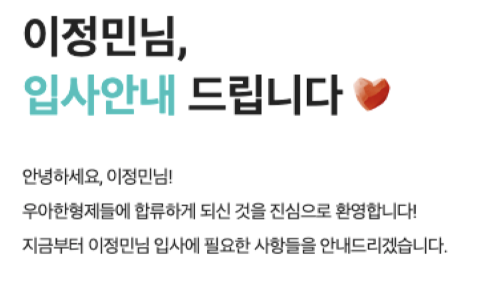

이어진 서류 전형과 두 번의 면접에서 운 좋게도 좋은 평가를 받아 최종 합격까지 이어지게 되었다. (기술 질문을 물었다는 동기들도 꽤 있었는데, 나는 둘 다 완전 인성면접이었다. 역시 면바면...)

믿기지가 않았다. 정직원은 상상 속 유니콘인 줄 알았는데, 내가 이제 정직원이라고?

최종 합격 결과를 당근마켓에서 인턴으로 일하던 동안 회의 시간에 받았는데, 회의하다가 양해를 구하고 잠시 나가 소리를 지르고 왔다.😂

여하튼 최종 합격은 되었지만, 아직 막 학기와 (뜬금없지만) 당근마켓 3개월 인턴이 남아있었기에, 모든 게 정리된 후 1월 4일에 입사하기로 결정했다.

돌이켜보면 어떻게 그렇게 재밌게 열심히 했나 모르겠다. 살짝 평생의 열정을 그때 다 쓴 것 같기도...ㅎ

```toc
```