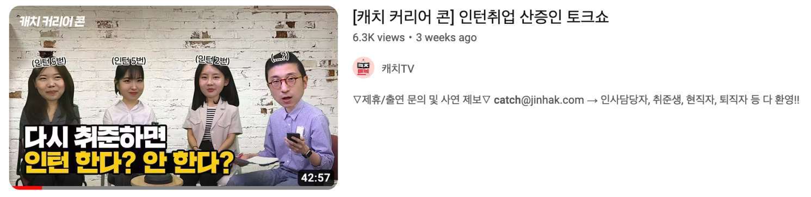

&nbsp;

우리 회사는 구성원으로서 외부 기고/연사 활동을 진행할 경우 승인을 받아야 하는데, 꽤나 큰 행사라고 생각되어 절차가 까다로워지지 않을까 걱정이 들기도 했다. 근데 오히려 재하님께서 매우 긍정적인 응원의 말씀을 해주셔서 너무나도 감사했다.

그렇게 해당 제안을 반갑게 받아들여서, 나는 멘토로서 프로그램에 참여하게 되었다.

&nbsp;

## 리얼 인턴

리얼 인턴은 진학사 캐치에서 6/13일부터 2주간 진행된 캐치 커리어 콘이다. 연사로서 줌 라이브 강의를 찍게 되었는데, 커리어 콘이 시작되는 날 방송되는 유튜브 라이브에도 참석하게 되었다.

| | |
| - | - |
|  |  |

&nbsp;

연사자 프로필용 사진을 요청받아서 (제주도에서 열심히 찍어서) 공유드렸는데...


> 100% 합격이라뇨... 🤦‍♀️🙅‍♀️🙅‍♀️🙅‍♀️

그래도 덕분에(?) 맘에 드는 프로필 사진을 건질 수 있었다 :)

&nbsp;

## 1. 캐치TV 라이브 토크콘서트

진학사 캐치에서는 [캐치TV](https://www.youtube.com/@catch_tv)라는 유튜브 채널을 운영하고 있는데, **인턴 취업 산증인 토크**를 주제로 촬영을 하게 되었다. 해당 촬영은 진학사 본사에서 진행되었는데, 문제는 내가 서울 방을 빼고 제주도 본가에 내려와있었던 것이다. 그렇게 캐리어를 끌고 촬영을 하러 가는 험난한 여정이 시작되었다.


> 6/12 : 제주 -> 김포 -> 잠실, 팀 워크샵 및 회식  
> 6/13 : 잠실 -> 종로, 유튜브 촬영, 종로 -> 김포 -> 제주

| | |
| - | - |
|  |  |

제대로 된 장비가 갖춰진 곳에서 촬영을 하는 건 처음이라 신기했다. 함께 참여한 다른 연사자 두 분, 그리고 캐치TV의 철수님과 짧지만 즐거운 시간을 보냈다 :)

해당 녹화는 유튜브 라이브로 진행되었는데, 이후 편집본이 채널에도 올라온 것을 확인할 수 있었다.



[~~난 절대 끝까지 못 봐...😇~~](https://www.youtube.com/watch?v=gM-ObLvTtnU)

&nbsp;

## 2. 현직자 LIVE 클래스

내가 맡은 본 역할은 6/21에 줌 라이브 강의를 하는 것. **인턴만 5번! 우형 개발자의 취업 여정**이라는 타이틀로 강의를 진행하게 되었다. 


강의는 크게 4단락으로 구성했다. 5번의 인턴 경험에 대해 소개하고, 그 중 내가 정직원으로 있게 해준 우테캠에 대해 더 자세하게 설명한 뒤, 나름의 팁들을 알려주고, 현재 실무에 대한 이야기를 조금 풀어냈다.

강연 30분, 질의응답 30분으로 진행하면 된다고 해서 질문이 없을까봐 걱정했는데, 생각보다 많은 분들이 참여해주셨고 질문도 끊임없이 해주신 덕에 강의 시간을 꽉꽉 채울 수 있었다. 크게 도움이 되는 답변을 많이 못 해드린 것 같아 죄송스럽기도 하다. 🥲

위 두 개의 영상 모두 [캐치 VOD 클래스](https://www.catch.co.kr/CatchClass/Vod)에서 시청할 수 있다. (~근데 회원가입이 너무 빡센..~)

여튼 진학사 덕에 너무나도 좋은 경험을 할 수 있었다. 좋은 인연으로 남아 좋은 기회로 또 만날 날이 오기를 :)

```toc
```