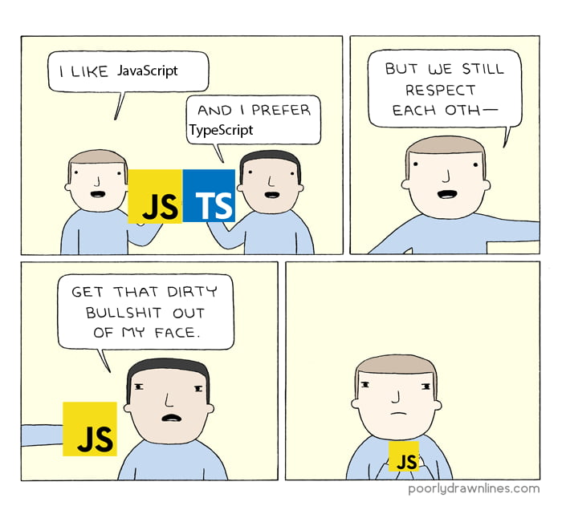

타입스크립트는 자바스크립트의 상위 집합 언어로, 정적 타입을 지원하여 코드의 안정성과 생산성을 향상시켜준다. ~~이젠 더 이상 자바스크립트를 쓸 수 없는 몸이 되어버린..~~


그 중에서도 제네릭(Generic)은 타입스크립트의 핵심 기능 중 하나다. 오늘은 제네릭의 개념, 사용법, 그리고 실제 활용 방법에 대해 알아보자!

&nbsp;

## 제네릭이란?

제네릭은 타입스크립트에서 코드의 일반화(generic)를 가능하게 해주는 기능이다. 제네릭을 사용하면 함수, 클래스, 인터페이스 등을 다양한 타입에 대해 작동하도록 만들 수 있다. 

제네릭을 사용하면  
1. 컴파일 시점에서 타입 체크를 할 수 있어 런타임 에러를 사전에 방지할 수 있고, **(타입 안정성)**  
2. 한 번 작성한 제네릭 코드를 다양한 타입에 대해 재사용할 수 있고, **(재사용성)**  
3. 제네릭을 통해 일반적인 동작을 정의하고, 구체적인 타입은 사용하는 곳에서 결정할 수 있다. **(추상화)**

그렇다면 실제로 어떻게 제네릭을 사용하는지 살펴보자!

&nbsp;

### 1. 함수 제네릭

함수를 정의할 때, 입력값과 반환값에 대해 제네릭 타입을 지정할 수 있다.

```ts
const reverse = <T>(items: T[]): T[] => {
  return items.reverse();
};

const numbers = [1, 2, 3, 4, 5];
const reversedNumbers = reverse(numbers); // [5, 4, 3, 2, 1]

const names = ['Alice', 'Bob', 'Charlie'];
const reversedNames = reverse(names); // ['Charlie', 'Bob', 'Alice']
```

프로미스(Promise)나 콜백(callback) 함수에서도 제네릭을 유용하게 사용할 수 있다.

```ts
const fetchData = <T>(url: string): Promise<T> => {
  return fetch(url)
    .then((response) => response.json())
    .then((data: T) => data);
};

fetchData<{ id: number; name: string }>('/api/users/1')
  .then((user) => {
    /**
     * user: {
        id: number;
        name: string;
      }
     */
    console.log(user.id, user.name);
  })
  .catch((error) => {
    console.error('Error:', error);
  });

```

&nbsp;

### 2. 클래스 제네릭

클래스를 정의할 때, 인스턴스 변수에 대해 제네릭 타입을 지정할 수 있다.

```ts
class Box<T> {
  private item: T;

  constructor(item: T) {
    this.item = item;
  }

  getItem(): T {
    return this.item;
  }
}

const numberBox = new Box<number>(42);
console.log(numberBox.getItem()); // 42

const stringBox = new Box<string>('Hello, world!');
console.log(stringBox.getItem()); // 'Hello, world!'
```

배열, 맵, 집합 등과 같은 컬렉션 데이터 구조에서 제네릭을 사용하여 다양한 타입의 요소를 저장하고 처리할 수 있다.

```ts
class Collection<T> {
  private items: T[] = [];

  addItem(item: T): void {
    this.items.push(item);
  }

  getItems(): T[] {
    return this.items;
  }
}

const numberCollection = new Collection<number>();
numberCollection.addItem(1);
numberCollection.addItem('Apple'); // Error: Argument of type 'string' is not assignable to parameter of type 'number'.

const stringCollection = new Collection<string>();
stringCollection.addItem('Apple');
stringCollection.addItem(1); // Error: Argument of type 'number' is not assignable to parameter of type 'string'.
```

&nbsp;

### 3. 컴포넌트 제네릭

컴포넌트에서도 제네릭을 사용하여 타입 안정성을 확보하고 재사용성을 높일 수 있다.

```tsx
const ListComponent = <T extends ReactNode>({ data }: { data: T[] }) => (
  <ul>
    {data.map((item, index) => (
      <li key={index}>{item}</li>
    ))}
  </ul>
);

const stringList: string[] = ['Apple', 'Banana', 'Orange'];
const numberList: number[] = [1, 2, 3];

const RenderListComponents = () => {
  <>
    {/* data: string[] */}
    <ListComponent data={stringList} />

    {/* data: number[] */}
    <ListComponent data={numberList} />

    {/* Error: Type 'number[]' is not assignable to type 'string[]'. */}
    <ListComponent<string> data={numberList} />
  </>;
};

```

&nbsp;

**" 어라, 저 extends는 뭔가요? "**


&nbsp;

## 제네릭 제약(Constraints)

제네릭을 제한해서 사용할 순 없을까? 이럴 때 사용할 수 있는 것이 **제네릭 제약**이다. 제네릭 제약은 extends 키워드를 사용하여 설정된다. `T extends SomeType`에서 `T`는 `SomeType` 타입 또는 `SomeType`을 상속하는 타입으로 제한된다.

제네릭 제약은 제네릭 타입을 특정 타입으로 제한하기 위해 사용되는 기능이다. 제네릭을 사용하여 범용적인 코드를 작성하면서도, 특정 타입에 대해서만 동작하도록 제약을 걸 수 있다. 이를 통해 코드의 타입 안정성을 더욱 높일 수 있다.

```tsx
const getProperty = <T, K extends keyof T>(obj: T, key: K): T[K] => {
  return obj[key];
};

const person = { name: 'Alice', age: 30 };
getProperty(person, 'name'); // 'Alice'
getProperty(person, 'age'); // 30
getProperty(person, 'address'); // Error: Argument of type '"address"' is not assignable to parameter of type '"name" | "age"'.
```

제네릭 제약을 사용하여 key의 타입이 obj의 키로 제한하는 것을 볼 수 있다.

&nbsp;

타입스크립트의 제네릭은 코드의 재사용성과 유연성을 높여주는 강력한 기능이다. 제네릭을 통해 타입 안정성을 강화하고, 재사용 가능한 유연한 코드를 작성할 수 있다.



```toc
```