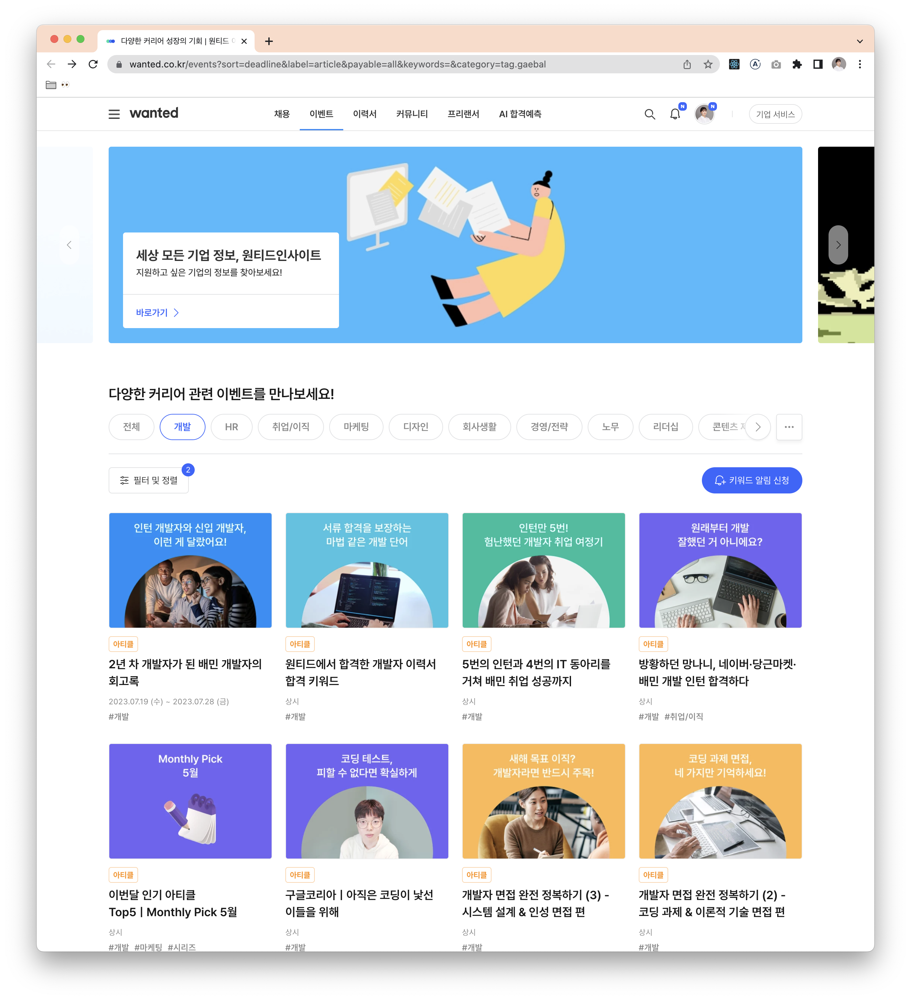
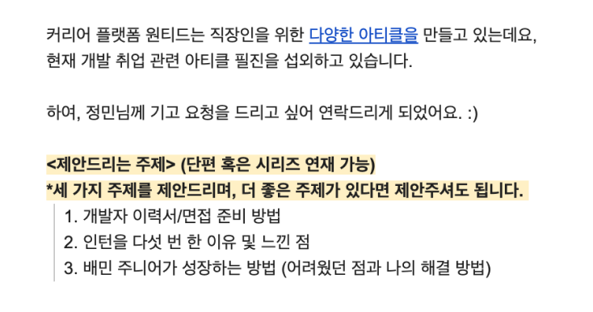
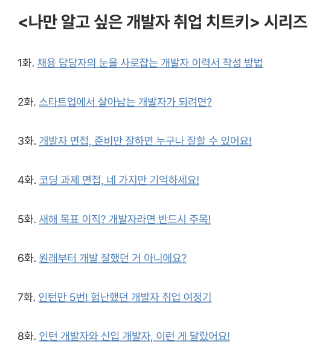
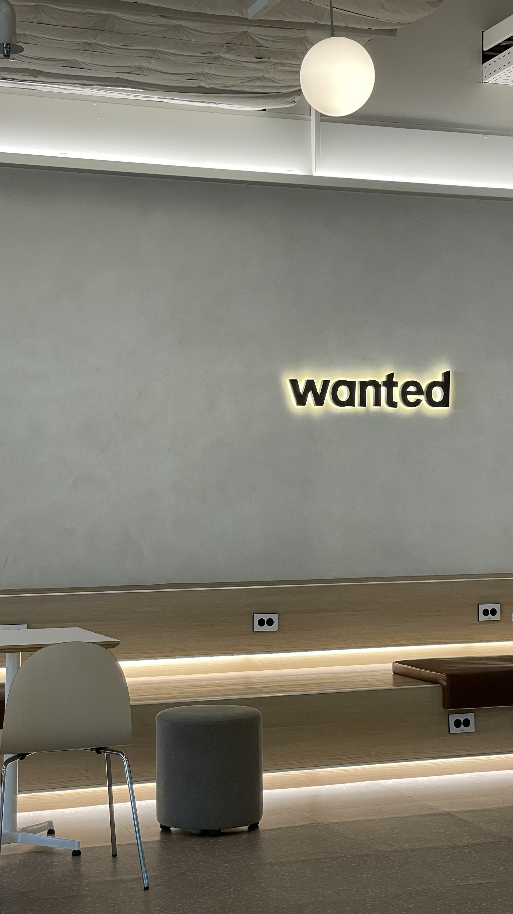
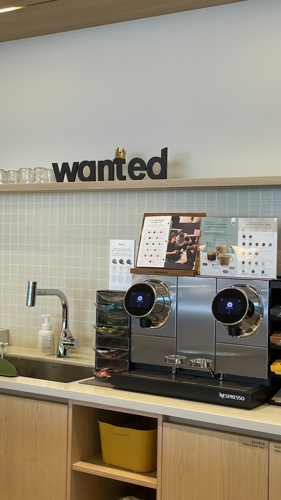
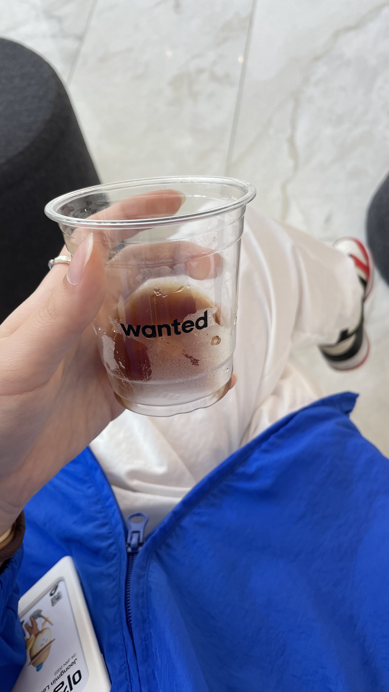
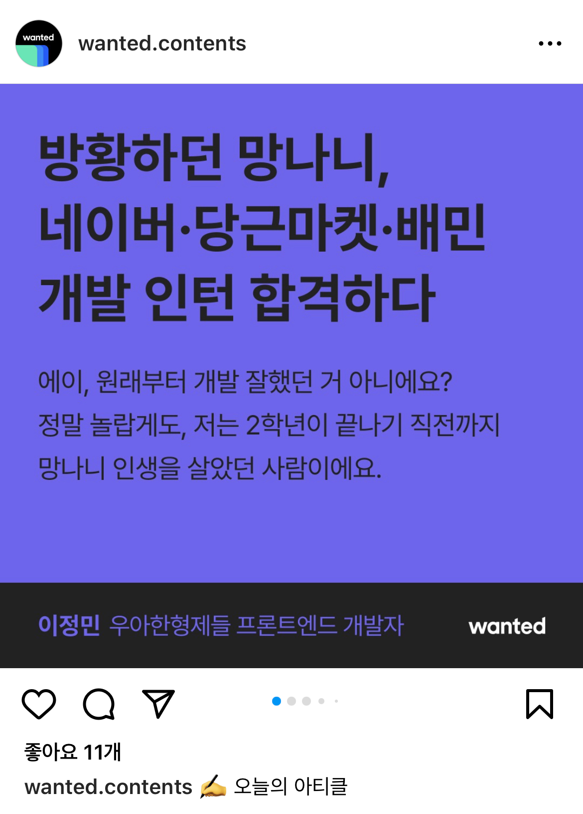
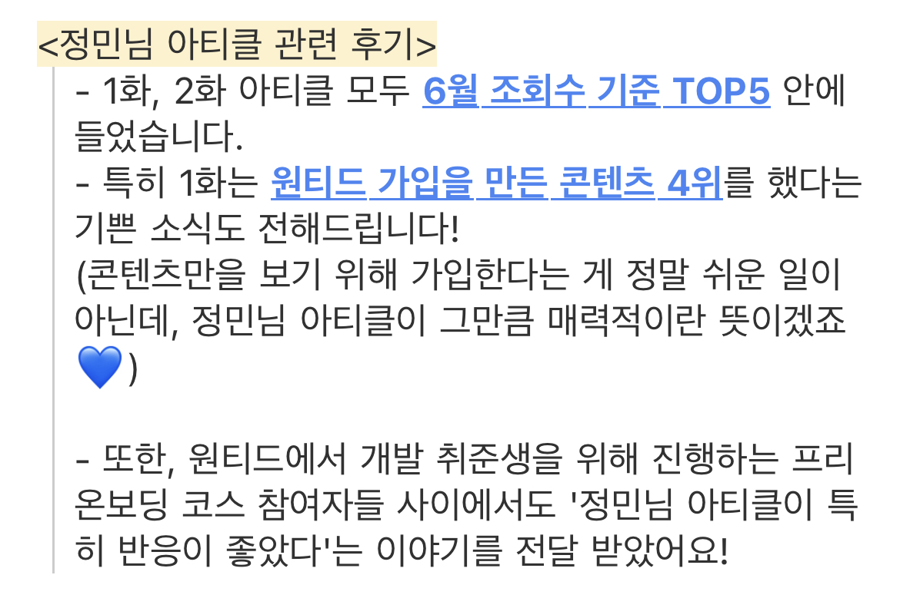

## 원티드 아티클

원티드를 한번쯤은 채용 사이트로 접해 본 경험이 있으리라 생각한다. 나도 취준 때 원티드를 정말 많이 사용하곤 했다. 원티드는 커리어 플랫폼으로 현재 여러 서비스를 제공하고 있는데, 직장인을 위한 다양한 아티클을 만드는 것도 그 중 하나다.



> 원티드의 이벤트 탭에 들어가면 다양한 카테고리의 아티클을 볼 수 있다. 이미 내 아티클들이 올라가 있는 걸 볼 수 있다 😇

&nbsp;

## 개발 취업 관련 아티클 필진으로 섭외되다

| | |
| - | - |
|  |  |

어느 날 원티드의 콘텐츠 에디터 분께서 연락을 주셨고, 세 가지 주제로 시리즈 연재를 하게 되었다. 그렇게 지난 6월 5일, 6월 26일, 7월 19일에 각각 글이 한 편씩 발행되었고, 현재 **나만 알고 싶은 개발자 취업 치트키** 시리즈의 6, 7, 8화로 올라가있다.

&nbsp;

## 미팅하면 빠질 수 없는 회사 구경

놀랍게도 롯데타워에 같이 입주해있었던 원티드..! 덕분에(?) 퇴근 후에 빠르게 미팅 장소로 갈 수 있었다 :)

| | | |
| - | - | - |
|  |  |  | 

> 회사에 커피 머신과 간식 창고가 있다니 부러워.. 🥲

&nbsp;

| [1화](https://www.wanted.co.kr/events/article_23_06_05) | [2화](https://www.wanted.co.kr/events/article_23_06_26) | [3화](https://www.wanted.co.kr/events/article_23_07_19) |
| - | - | - |
|  |  |  | 

> 혹~시나 관심 있으신 분들은 위의 링크로! 🤭

| | |
| - | - |
|  |  |

> 사실 내가 엄청난 경력이 있는 것도 아니고 연차가 오래된 것도 아니기 때문에, 이런 글을 써도 되는 게 맞나 싶은 생각이 수백 번 들었지만, 누군가에게는 조금이라도 도움이 되었길 바랄 뿐이다 🥲

```toc
```