개발을 하다보면 다이어그램을 작성해야 할 때가 종종 있다. ERD를 그릴 때 뿐만이 아니라, 다이어그램은 도메인 또는 아키텍처를 더 쉽게 파악할 수 있도록 돕는 도구가 되어주기도 한다.

draw.io, ppt, figjam, excalidraw, cloudcraft, eraser.io 등 다이어그램을 그릴 수 있도록 해주는 서비스는 다양하다. 하지만 나는 직접 그리는 게 아닌, 더 쉽고 체계적으로 작성할 수 있는 무언가가 필요했다..!

&nbsp;

## 마크다운으로 다이어그램을 그릴 수 있다고?


누구든 쉽게 작성할 수 있는 마크다운. 애초에 지금 이 글도 마크다운 파일로 작성되고 있는데..! 머메이드는 마크다운 문법으로 다이어그램을 그려주는 라이브러리다. 즉, UI를 직접 그리지 않고 텍스트로 다이어그램을 표현할 수 있다는 것!

더더욱 좋은 점은, mermaid 문법은 컨플루언스, github, gitlab, vscode([플러그인](https://marketplace.visualstudio.com/items?itemName=bierner.markdown-mermaid) 필요)에서도 지원이 된다. 나의 경우 현재 회사에서 컨플루언스를 사용하고 있는데, 컨플루언스에서 머메이드 Preview를 제공하고 있어 회의록 및 문서 작성시 더더욱 좋은 경험을 할 수 있었다.

> 더이상 다이어그램을 캡처하지 않아도 된다구..?!


[Mermaid Live Editor](https://mermaid.live/)를 활용하면 더욱 쉽게 머메이드 다이어드램을 작성할 수 있다 :)

&nbsp;

머메이드로 정말 정말 다양한 다이어그램을 작성할 수 있다. 몇 가지만 간단하게 살펴보도록 하자!

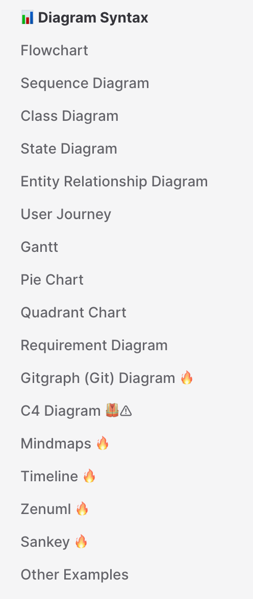

&nbsp;

## 1. Flowchart

플로우차트는 노드(도형)와 엣지(화살표, 선)로 구성된다. 어떤 관계나 프로세스의 흐름을 표현하는 데 알맞다.

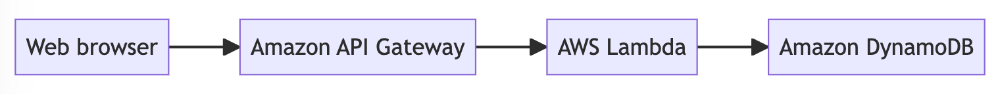

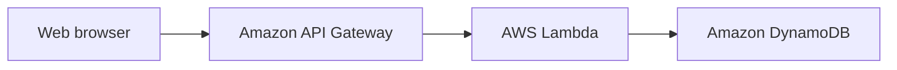

&nbsp;

### 방향도 바꿀 수 있다.

- TB - Top to bottom
- TD - Top-down/ same as top to bottom
- BT - Bottom to top
- RL - Right to left
- LR - Left to right

&nbsp;

### 노드의 모양도 바꿀 수 있다.

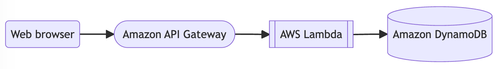

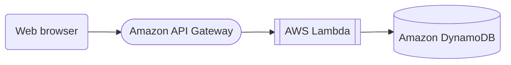

&nbsp;

### 선도 바꿀 수 있다.

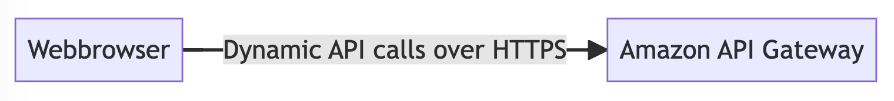

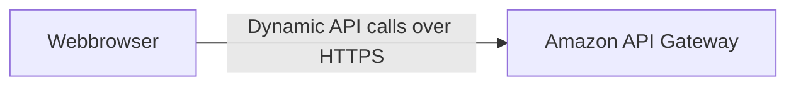

&nbsp;

### 서브 그래프를 구성할 수도 있다.

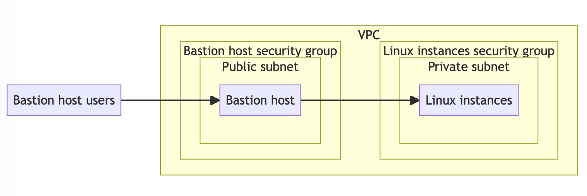

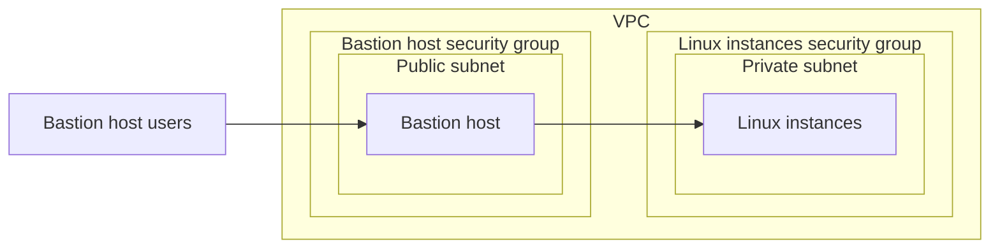

&nbsp;

## 2. Sequence Diagram

시퀀스 다이어그램은 프로세스가 서로 어떻게, 어떤 순서로 작동하는지 보여주고자 할 때 알맞다.

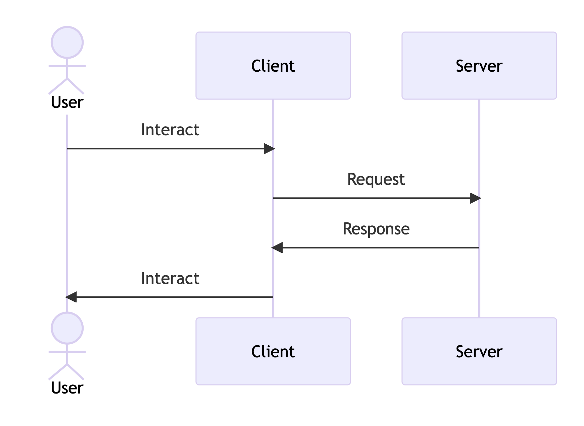

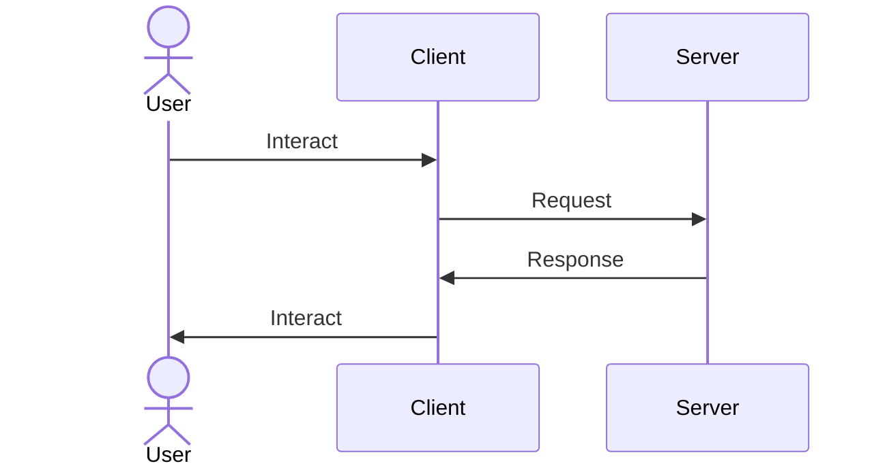

&nbsp;

## 3. Class Diagram

통합 모델링 언어(UML)의 클래스 다이어그램은 시스템의 클래스, 속성, 연산(또는 방법) 및 개체 간의 관계를 표시하여 시스템의 구조를 설명하는 정적 구조도의 한 종류다.


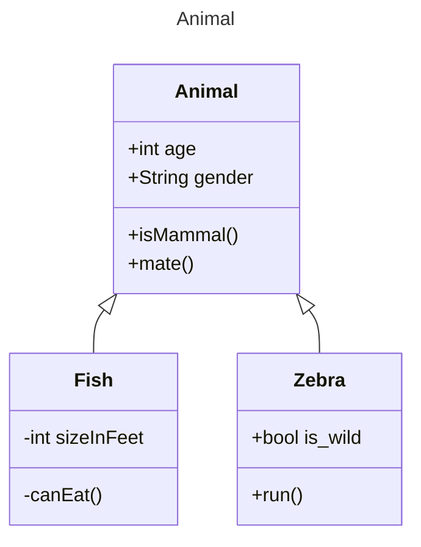

&nbsp;

클래스를 정의하고, 클래스의 멤버를 정의하고, 관계를 나타낼 수 있다.

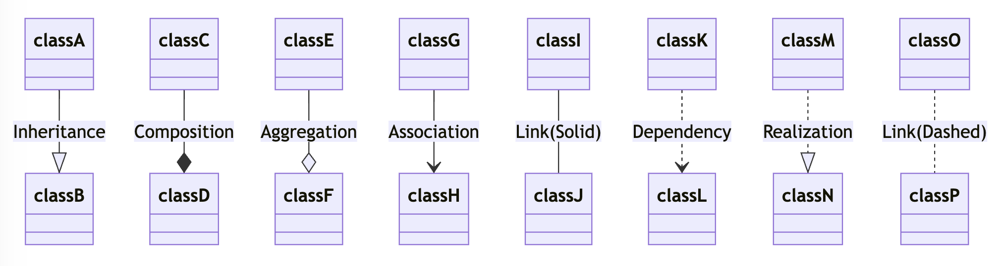

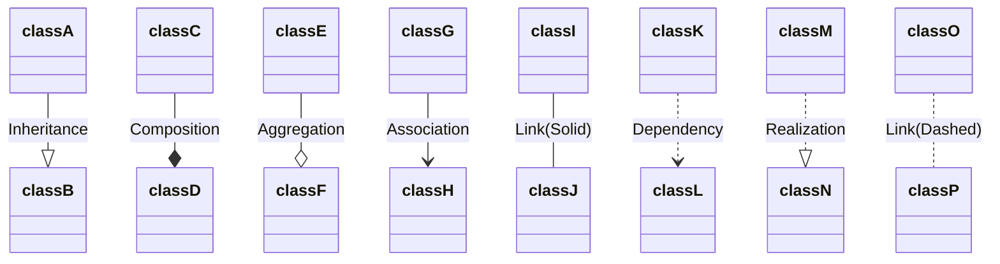

&nbsp;

## 4. ERD (Entity Relationship Diagram)

데이터베이스를 설계할 때 주로 쓰곤 하는 ERD도 머메이드를 사용하면 간편하게 그릴 수 있다.

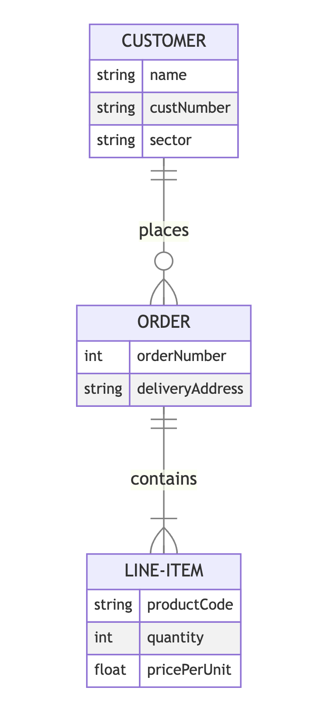

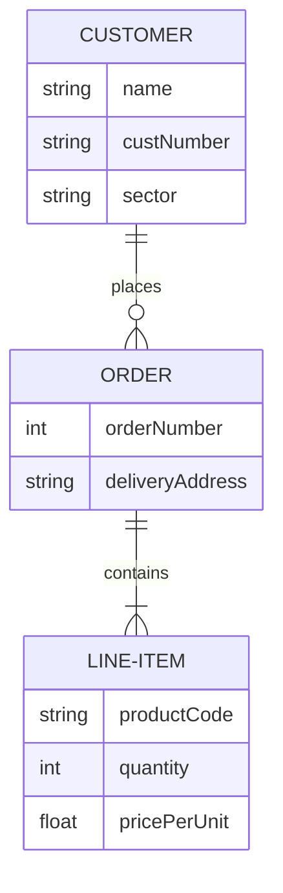

&nbsp;

이외에도 정말 다양한 문법들이 존재하는 머메이드! 더 많은 내용은 [공식문서](https://mermaid.js.org/intro/)에서 살펴보길 바란다.

```toc
```