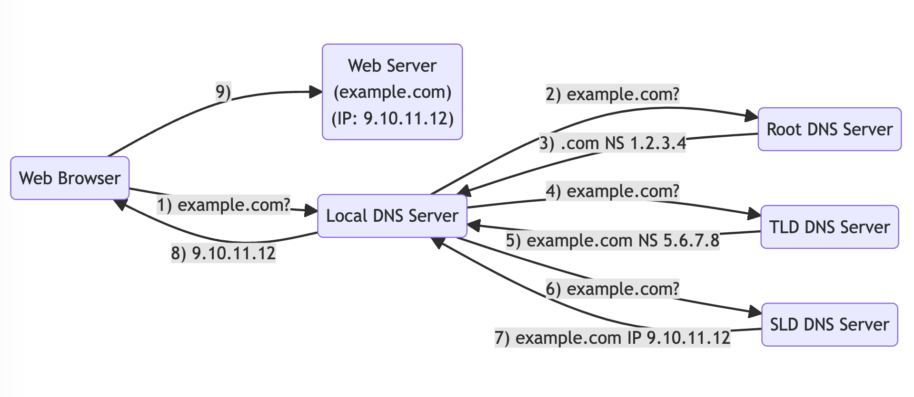

## 그냥 도메인 주소만 입력하면 뚝딱 되는 건 줄 알았지?


우리가 `www.google.com`을 입력하고 화면이 뜰 때까지, 그 뒤에선 수많은 일들이 바삐 일어나게 된다. 우리에게 친숙한 호스트네임을 IP 주소로 변환해주는 DNS(Domain Name System)이 있기에 가능한 일이다. 즉, DNS는 인터넷의 중추로 볼 수 있다.

DNS는 계층적인 이름 구조를 가지는데, `com`, `google.com`,  `www.google.com` 은 모두 도메인 이름의 계층이다.

&nbsp;

## DNS 관련 용어를 알아보자

- Domain Registrar: 도메인 이름을 등록하는 곳이다. 대표적으로 AWS의 Route 53와 GoDaddy가 있다.
- DNS Records: A, AAAA, CNAME, NS 등 다양한 종류가 있다.
- Zone File: 모든 DNS 레코드를 포함한다.
- Name Server (DNS Server): DNS 쿼리를 실제로 해결하는 서버다.
- TLD (Top Level Domain): 최상위 도메인으로 `.com`, `.in`, `.org` 등이 있다.
- SLD (Second Level Domain): 2단계 도메인으로 `amazon.com`, `google.com` 등이 될 수 있다.

&nbsp;

> **FQDN (Fully Qualified Domain Name)을 살펴보자면**  
> `http://www.sub.example.com.` 에서  
> - Root: 마지막 `.`  
> - TLD: `.com`  
> - SLD: `example.com`  
> - Sub Domain: `sub.example.com`  
> - Domain Name: `www.sub.example.com`  
> - Protocol: `http`  

&nbsp;

## DNS의 동작을 살펴보자



웹 브라우저에서 example.com을 요청했을 때 일어나는 일을 플로우차트로 그려본 것이다. 순서를 살펴보기 전에, 각 DNS 서버들을 훑고 넘어가보자!

위에서 DNS 서버가 DNS 쿼리를 실제로 해결하는 서버라고 설명했다. 하지만 도메인 수는 이 세상에 너무나도 많기 때문에 DNS 서버는 계층화되어 단계적으로 처리하게 된다.

- 로컬 DNS 서버: 보통 회사에 의해 할당되고 관리되거나, 인터넷 서비스 제공자에 의해 동적으로 할당된다.
- 루트 DNS 서버: ICANN에 의해 관리된다.
- TLD(최상단 도메인) DNS 서버: IANA에 의해 관리된다. (예시에서는 .com 도메인 서버)
- SLD(2단계 도메인) DNS 서버: Domain Registrar에 의해 관리된다. (예시에서는 example.com 도메인 서버)

&nbsp;

그렇다면 위 플로우차트를 한번 살펴보도록 하자.

1. `웹브라우저`: 로컬 DNS 서버야, 혹시 example.com 알아?
2. `로컬 DNS 서버`: 본 적 없는데? 루트 DNS 서버야, 혹시 example.com 알아?
3. `루트 DNS 서버`: 본 적 없는데, .com은 알고 있어. 1.2.3.4로 가봐.
4. `로컬 DNS 서버`: TLD DNS 서버야, 혹시 example.com 알아?
5. `TLD DNS 서버`: example.com이 어떤 레코드인지는 모르겠는데, example.com이라는 서버는 알고 있어. 5.6.7.8로 가봐.
6. `로컬 DNS 서버`: SLD DNS 서버야, 혹시 example.com 알아?
7. `SLD DNS 서버`: 알고 있어. example.com은 A 레코드고, 9.10.11.12로 가면 돼.
8. `로컬 DNS 서버`: '좋아. 이제 이걸 TTL 시간 만큼 캐싱해야겠다.' 웹브라우저야, 9.10.11.12 여기 있어.
9. `웹브라우저`: 야호!

&nbsp;

## 그래서, DNS 레코드가 대체 뭔데?

DNS 레코드는 도메인의 DB에 저장하는 데이터이며, 레코드는 웹사이트가 호스팅되는 방식과 웹사이트에서 엑세스 가능한 항목을 정의한다. 즉, 레코드를 통해 특정 도메인으로 라우팅하는 방법을 정의하게 된다.

각 레코드는 다음과 같은 정보들을 포함한다.
- 도메인/서브도메인 이름 - example.com
- 레코드 타입 - A, AAAA
- 값 - 123.456.789.123
- 라우팅 정책 - 쿼리에 응답하는 방식
- TTL - DNS 리졸버에서 레코드가 캐싱되는 시간

레코드 타입에도 다양한 종류가 있는데, A, AAAA, CNAME, NS 정도만 알아보도록 하자.

&nbsp;

### A 레코드

가장 일반적인 형태의 레코드로, 호스트네임과 IPv4를 매핑한다. 즉, `www.example.com`을 1.2.3.4로 바로 연결한다.

### AAAA 레코드

A 레코드와 유사하지만, 호스트네임과 IPv6를 매핑한다.

### CNAME 레코드

호스트네임을 다른 호스트네임과 매핑한다. 즉, `www.example.com/blog`를 `www.example.com`이 아닌 `blog.example.com`으로 연결되도록 할 수 있다. 웹사이트의 서로 다른 버전 간 리디렉션이나, 동일한 사이트의 서로 다른 하위 도메인 간 리디렉션을 설정할 수 있다. 즉, 그 대상은 A 또는 AAAA 레코드가 될 수도 있다.

### NS 레코드

도메인 이름의 네임서버를 식별한다. NS 레코드는 도메인 이름을 확인하는 데 사용하는 네임서버를 알려주므로 거의 모든 DNS 구성에서 필수적인 부분이다.

&nbsp;

## TTL은 뭔데?

Time to Live. 위에서 설명했듯 DNS 리졸버에서 레코드가 캐싱되는 시간이다. 클라이언트가 웹 서버에 접속할 때 DNS 요청을 보내면 A 레코드, IP 주소, TTL을 회신받게 된다. TTL은 클라이언트에게 이 결과를 캐시하도록 요청하게 되고, 이후 같은 호스트네임으로 접속할 경우 결과를 캐시에 저장했기 때문에 클라이언트는 DNS에 쿼리를 다시 요청하지 않아도 된다.

### TTL을 너무 높게 설정한다면?

DNS 트래픽은 적어지지만 클라이언트가 오래된 레코드를 받을 가능성이 있다. 레코드 변경에 어려움이 발생한다.

### TTL을 너무 짧게 설정한다면?

DNS 트래픽 양이 많아져서 비용이 많이 들 수 있다. 하지만 최신 레코드를 빨리 받을 수 있기 때문에 레코드 변경이 쉬워진다.

&nbsp;


> 이렇게 어려운 걸 대체 누가 다 만든 거야
..싶지만..! 적어도 DNS가 뭐하는 친구인지는 꼭 알고 가도록 하자!


> 이건 그냥 캐시하니까 생각난 짤 ㅎ.ㅎ

```toc
```