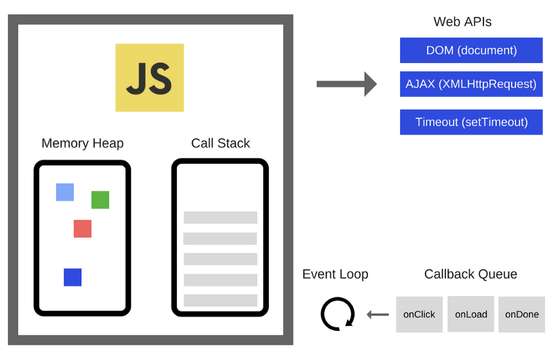

자바스크립트 엔진과 런타임에 대해 이야기하기 전에, 자바스크립트 자체가 무엇인지 이해하는 것도 중요하다! 자바스크립트는 웹 개발에서 가장 널리 사용되는 프로그래밍 언어 중 하나로, 웹 브라우저에서 실행되는 스크립트 언어다. 실제로 자바스크립트는 웹 브라우저뿐만 아니라 다양한 환경에서 실행될 수 있으며, 이때 코드가 실행되는 환경을 "런타임(runtime)"이라고 한다. 특히 자바스크립트 엔진과 브라우저 런타임은 웹 개발에서 핵심 역할을 하는 주요 구성 요소다. 이 두 가지는 웹 애플리케이션의 동작과 성능에 중요한 영향을 미친다.

&nbsp;

## 자바스크립트 엔진

자바스크립트 엔진은 자바스크립트 코드를 해석하고 실행하는 핵심 구성 요소다. 가장 널리 사용되는 자바스크립트 엔진 중 몇 가지를 살펴보도록 하자.

1. **V8 (Google Chrome, Node.js)**  
   V8은 Google에서 개발한 자바스크립트 엔진으로, Chrome 브라우저와 Node.js에서 사용된다. V8은 JIT(Just-In-Time) 컴파일러를 사용하여 빠른 실행 성능을 제공한다.

2. **SpiderMonkey (Mozilla Firefox)**  
   Mozilla Firefox에서 사용되는 엔진이다.

3. **JavaScriptCore (Apple Safari)**  
   Safari 브라우저에서 동작하는 엔진으로, Nitro라고도 불린다. 모바일 기기 및 macOS의 Safari 브라우저에서 사용된다.

4. **Chakra (Microsoft Edge, Internet Explorer)**  
   Microsoft의 Edge 브라우저와 이전 버전의 Internet Explorer에서 사용되는 엔진이다.

자바스크립트 엔진마다 코드를 해석하고 실행하기 위한 내부 동작 및 최적화 방법을 다를 수 있으며, 이로 인해 브라우저 간의 성능 차이가 발생할 수 있다.


&nbsp;

## 자바스크립트 런타임

자바스크립트 런타임에도 다양한 종류와 버전이 있으며, 각각의 런타임은 자바스크립트 코드를 실행하는 환경과 규칙을 정의한다.

1. **브라우저**  
   웹 브라우저에서 실행되는 자바스크립트 코드를 처리하는 환경이다. 브라우저 런타임은 DOM(Document Object Model) 조작, 이벤트 처리, AJAX 요청 등과 같은 웹 브라우저 관련 기능을 제공한다.

2. **Node.js**  
   서버 측 자바스크립트 실행을 가능하게 하는 환경으로, 브라우저 외부에서 자바스크립트를 실행할 수 있게 한다. Node.js는 파일 시스템 액세스, 네트워크 통신, 데이터베이스 액세스와 같은 서버 측 작업을 처리할 수 있다.

3. **React Native**  
   모바일 앱 개발을 위한 환경으로, 자바스크립트와 React 라이브러리를 사용하여 iOS와 Android 앱을 개발할 수 있게 해준다.

4. **Electron**  
   데스크톱 애플리케이션 개발을 위한 환경으로, 웹 기술을 사용하여 크로스 플랫폼 데스크톱 앱을 개발할 수 있게 해준다.

자바스크립트 런타임은 코드를 실행하고 관리하는 역할을 한다. 런타임은 자바스크립트 코드를 해석하고 실행하며, 필요한 환경 및 라이브러리에 접근할 수 있도록 해준다.

&nbsp;

## 자바스크립트 엔진은 싱글스레드인가요, 멀티스레드인가요?


> ???: 근데 스레드가 뭐죠?  
> 프로세스는 메모리 상에서 실행중인 작업을 뜻하는데, 이러한 프로세스 내의 실행 단위를 스레드라 한다.

자바스크립트 엔진은 하나의 콜 스택을 가지는 싱글스레드다. 하지만 실제로 자바스크립트의 작동은 웹 브라우저나 node.js와 같은 멀티스레드 환경에 임베디드되어 실행되기 때문에, 자바스크립트와 웹api, 이벤트루프 등을 분리하여 말하기는 어렵다.

즉 자바스크립트 엔진(V8 등)이 싱글스레드로 동작하고, 런타임환경(브라우저 등)이 멀티스레드를 제공한다고 볼 수 있다!

우리는 프론트엔드 개발자니까 *(아마?)* 브라우저 런타임에 대해서 좀 더 자세히 알아보도록 하자!

&nbsp;

## 브라우저 런타임

브라우저 런타임은 브라우저 내에서 자바스크립트 코드를 실행하는 환경을 제공한다. 이 환경은 브라우저의 핵심 구성 요소 중 하나로, 웹 페이지의 DOM(Document Object Model)에 접근하고 수정하며, 이벤트 처리, 네트워크 요청, 쿠키 및 웹 스토리지와 같은 웹 기능을 관리한다.

브라우저 런타임의 구성 요소를 살펴보자!

1. **DOM (Document Object Model)**  
   웹 페이지의 구조를 표현하고 조작하기 위한 표준 인터페이스다. 자바스크립트는 DOM을 사용하여 HTML 요소에 접근하고 조작할 수 있다.

2. **BOM (Browser Object Model)**  
   브라우저의 창, 역사, 위치 정보와 같은 요소에 접근하기 위한 인터페이스다.

3. **이벤트 처리**  
   자바스크립트는 웹 페이지에서 발생하는 이벤트(마우스 클릭, 키보드 입력 등)를 처리하고 반응할 수 있다.

4. **AJAX 및 네트워크 요청**  
   브라우저 런타임은 웹 서버와 데이터를 비동기적으로 교환하기 위한 기능을 제공한다. 이는 웹 애플리케이션의 동적 데이터 로딩에 중요하다.

5. **쿠키와 웹 스토리지**  
   사용자 데이터를 로컬에 저장하고 관리하기 위한 방법을 제공한다.


그렇다면 자바스크립트는 브라우저 환경에서 어떻게 비동기 작업을 처리하는 걸까?

&nbsp;

## 자바스크립트의 런타임 모델



자바스크립트의 런타임 모델은 코드의 실행, 이벤트의 수집과 처리, 큐에 대기 중인 하위 작업을 처리하는 이벤트 루프에 기반하고 있다. 각각의 구성요소를 한 번 살펴보자!

1. **자바스크립트 엔진**  
   자바스크립트 코드를 해석하고 실행하는 역할을 한다. 자바스크립트 엔진은 메모리 힙과 콜 스택 두 가지 주요 컴포넌트로 구성된다.

2. **메모리 힙 (Memory Heap)**  
   동적으로 할당된 메모리를 저장하는 곳이다. 객체, 배열, 함수와 같은 자바스크립트 데이터 구조는 메모리 힙에 저장되며, 이러한 데이터는 가비지 컬렉션(Garbage Collection)에 의해 관리된다.

3. **콜 스택 (Call Stack)**  
   함수 호출을 추적하는 자료 구조다. 자바스크립트는 함수 호출을 스택에 추가하고 완료되면 스택에서 제거한다. 이렇게 스택에 쌓이는 함수 호출은 순차적으로 실행되며, 이것이 자바스크립트의 실행 컨텍스트를 관리하는 중요한 부분이다.

4. **웹 API**  
   브라우저 환경에서 제공되는 비동기 작업을 처리하기 위한 인터페이스 집합이다. 이 API들은 브라우저 기능을 활용하여 비동기 작업을 수행하며, 주로 네트워크 요청, 타이머 설정, DOM 조작 및 이벤트 처리와 관련된다. 대표적인 웹 API에는 setTimeout, fetch, XMLHttpRequest, addEventListener 등이 있다.

5. **이벤트 루프 (Event Loop)**  
   자바스크립트의 비동기 동작을 관리하는 핵심 메커니즘 중 하나이다. 자바스크립트는 비동기 함수(타이머 콜백, 이벤트 핸들러 등)를 호출하고 해당 작업이 완료될 때까지 대기하지 않고 계속 실행된다. 이벤트 루프는 비동기 작업이 완료되면 콜백 함수를 콜 스택에 넣어 실행될 수 있도록 관리한다.

&nbsp;

즉, 비동기함수 실행 과정은 다음과 같다.

1. 콜 스택에서 비동기 함수가 실행되면, 자바스크립트 엔진은 브라우저에서 제공되는 웹api에게 비동기 작업을 위임한다.
2. 웹 api는 해당 비동기 작업을 수행한 후, 콜백함수를 이벤트루프를 통해 콜백 큐에 넘겨준다.
3. 이벤트루프는 콜 스택이 비어있을 때, 콜백 큐의 콜백함수를 콜 스택으로 넘겨준다.
4. 콜백함수가 실행되고 콜 스택에서 제거된다.

싱글스레드 언어임에도 멀티스레드 환경에서 동작하기 때문에 블로킹이 일어나지 않고 여러 가지 일을 동시에 처리하는 것처럼 동작할 수 있다. 자바스크립트는 하나의 콜스택을 가지는 싱글스레드 기반으로 동작하는 스크립트 언어임에도, 이벤트 루프를 통한 비동기적인 콜백 작업이 가능하기 때문에 빠르게 동작할 수 있다.

```toc
```