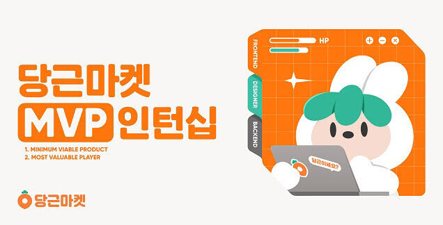
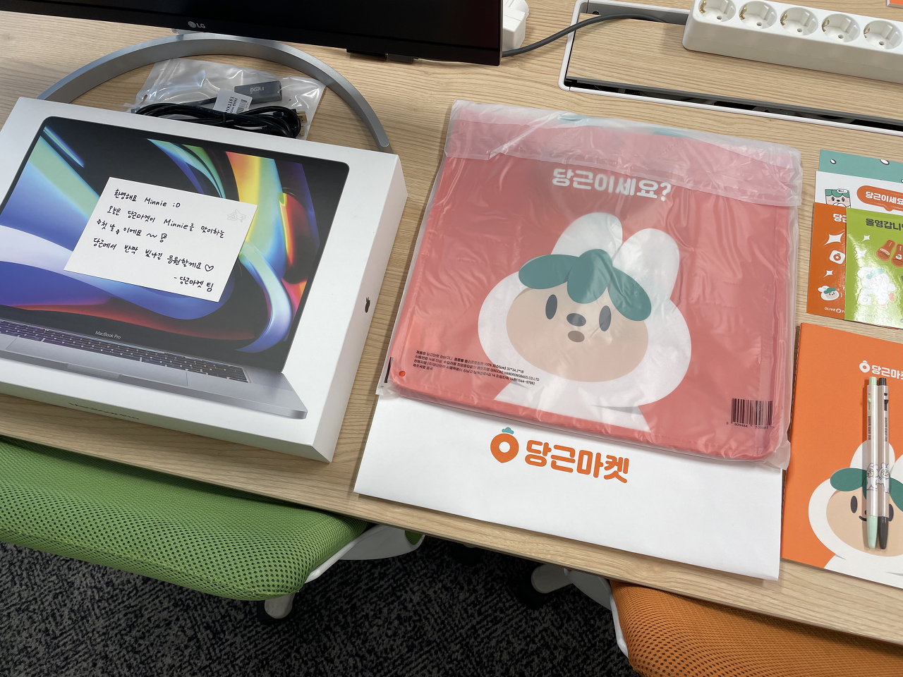
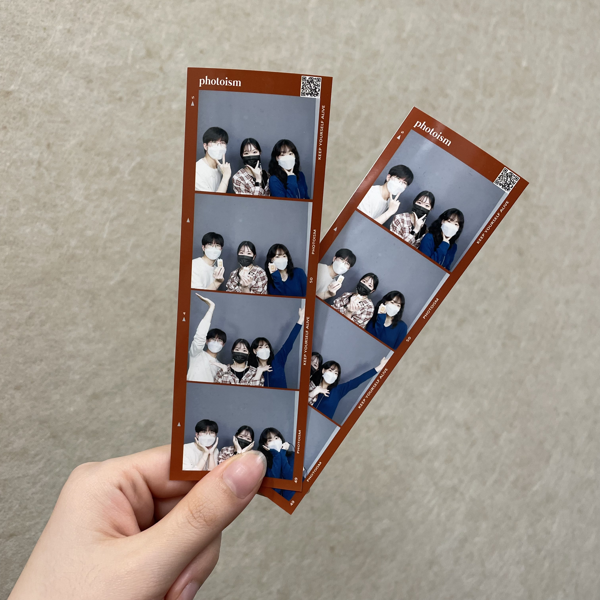

> 당장모아는 11~12월 동안 '당근마켓'앱 내 '생활서비스'에 런칭되었던 서비스다.
> 서초동, 잠실동, 한남동 대상으로 오픈을 진행했다. 

&nbsp;

## MVP [ ˌem viː ˈpi ]

- Minimum Viable Product : 최소 실행 가능 제품
- Most Valuable Player : 최우수 선수


 
**❝당근마켓 앱 내에 미니 서비스 MVP(Minimum Viable Product)를 런칭할 개발과 디자인 분야의 MVP(Most Valuable Player) 분들을 찾아요"**

솔깃했다. MVP 인턴십이라니? 미니 서비스란 어떤 걸까? 어떤 도전과제가 주어질까? 당근마켓이 제시한 아이디어로 미니 서비스를 직접 만들어 당근마켓 내에서 런칭해볼 수 있다니! 서비스에 대한 유저의 실제 반응을 분석하고 개선해볼 수 있다니! 당근마켓 팀원들로부터 피드백과 조언을 받을 수 있다니! 지원을 안 해 볼 수가 없었다.

- 0주 차에는 오리엔테이션 및 팀 구성,
- 1-7주 차에는 서비스 MVP 개발 및 디자인,
- 8주 차에는 서비스 MVP 출시,
- 9-11주 차에는 유저 데이터 분석 및 개선,
- 12주 차에는 최종 발표.
세 달이 짧게만 느껴질 것 같은 린한 일정표였다. 막 학기 3개월을 당근마켓과 함께 빡세게 보내고 한 주 딱 쉬고 정직원 시작, 얼마나 완벽한 일정인가!

내가 MVP 인턴십으로 얻고자 했던 건 두 가지였다.

1. **이제껏 B2B 위주의 서비스를 경험했기 때문에 B2C를 경험해 보는 것.**  
   당근마켓 플랫폼 특성상 일반 유저들을 대상으로 하는 서비스를 런칭할 확률이 높다고 생각했다.

2. **혼자서 처음부터 끝까지 프론트엔드를 담당해 보는 것.**  
   MVP 인턴십의 경우 디자이너 1명 백엔드 1명 프론트엔드 1명으로 팀이 이루어지기에 혼자서 프론트엔드의 모든 것을 담당해야 한다. 개발 공부 초반에는 혼자 공부했기에 개인 프로젝트를 많이 했지만, 그 이후로는 대부분 팀 단위의 프로젝트를 진행했었다. 실서비스 개발을 처음부터 끝까지 혼자 해보면서 스스로의 능력치를 다시 확인해 보고 싶었다.



그렇게 당근마켓 MVP 인턴십을 시작하게 되었다.

&nbsp;

## 우리는 미니, 레일라, 루디

나는 1팀으로 배정되었고 1팀은 프론트엔드인 나 Minnie, 디자이너인 Leila, 백엔드인 Rudy로 구성되었다. 팀 별로 사무실을 배정받고 여러 세팅들을 하기 시작했다. 세 달이 지나면서, 우리는 어느새 끈끈한 한 팀이 되어 있었다. 아이디어가 피봇 되기도 하고 기획이 엎어지기도 하면서 함께 장벽들을 넘어왔고, 세 번의 문화의 날을 함께 보내면서 속 깊은 이야기를 나누기도 했다.



우리는 한 달 만에 '당장모아'라는 서비스를 런칭했고, 약 두 달 동안 계속해서 유저 반응을 보며 서비스를 개선해 나갔다. 너무 뿌듯하고 너무 자랑스럽다. 이 세 달 간의 여정은 계속해서 글로 만나볼 수 있을 것이다.

```toc
```