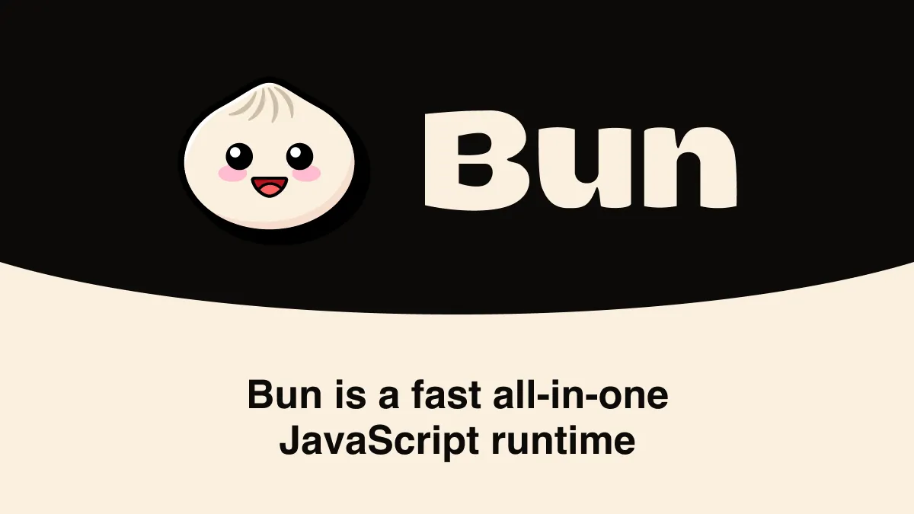
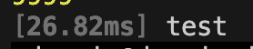
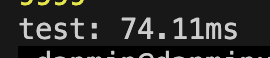
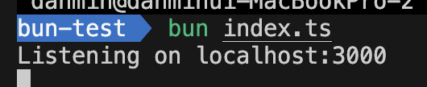
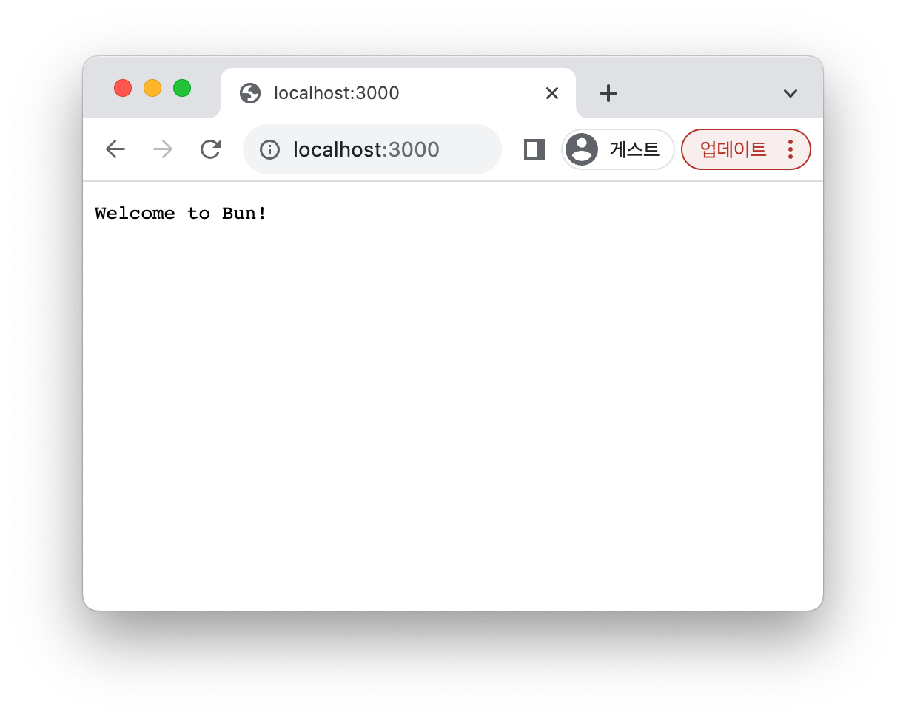
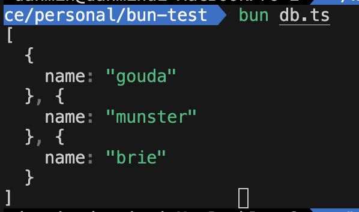

| Bun is an all-in-one toolkit for JavaScript and TypeScript apps.



Bun은 자바스크립트 런타임이자 패키지 매니저이자 번들러이자 테스트 러너이다. ~~만두 귀여워~~

Bun을 다른 JS 런타임들과 비교해보고, 간단하게 사용도 해보자!


&nbsp;

## 그래서 Bun이 뭔데?

즉, Bun은 bundler, transpiler, task runner, npm client를 모두 포함하는 새로운 자바스크립트 런타임이다. 즉, JS/TS 프로젝트를 번들링하고, 트랜스파일링하고, 설치하고, 실행시킬 수 있다는 것이다.

Bun의 기능들을 한 번 살펴보자.
- Fetch, WebSocket, ReadableStream과 같은 web API들을 제공한다.
- 모든 파일을 트랜스파일하기 때문에, TS와 JSX도 동작한다.
- Node.js의 모듈 resolution 알고리즘을 구현하기 때문에, npm 패키지들을 사용할 수 있다.
- 엄청 빠른 SQLite3 클라이언트를 제공한다.
- Node.js API의 상당수를 구현하기 때문에, 노드 모듈이 잘 동작한다.


&nbsp;

## 새로운 패키지 매니저

Bun은 기존의 패키지 매니저들에 비해 훨씬 빠르다. 왜냐고?

**1. Symlinks**
> 심볼릭 링크: 절대 경로 또는 상대 경로의 형태로 된 다른 파일이나 디렉터리에 대한 참조를 포함하고 있는 특별한 종류의 파일

Bun은 심링크를 사용하기 때문에, 각 프로젝트의 패키지들이 중앙 집중식으로 연결된다. 즉, 이후 후속 프로젝트의 모듈을 다시 다운로드 받을 필요가 없다는 것이다.

**2. Binary lockfile**  
바이너리 파일은 JSON 또는 Yaml 기반의 lockfile보다 더 빨리 읽히고 파싱된다.

**3. Zig**  
Bun은 저수준 언어인 Zig로 개발되었다. Zig는 대부분의 패키지 매니저들에 사용된 JS보다 훨씬 빠르다.

&nbsp;

## 새로운 JS 런타임

자바스크립트가 처음 만들어졌을 때, 자바스크립트는 브라우저에서만 실행되었다. 이후 자바스크립트를 읽고 컴퓨터에서 실행될 수 있도록 하는 자바스크립트 엔진이 만들어졌다. 엔진마다 지원하는 JS 스펙, 성능 등의 차이가 있다. ([js 엔진이 궁금하다면?](https://www.jeong-min.com/49-js-runtime/))

자바스크립트 런타임은 브라우저 밖에서 자바스크립트를 실행하기 위한 도구로, 대표적으로 V8 엔진을 사용하는 Node.js가 있다. Node.js가 만들어졌을 때는 Fetch API, ES 모듈 등의 JS 표준이 존재하지 않았고, 이후 속도, 웹 표준, TS, JSX 면에서 더 견고한 Deno가 만들어졌다. Deno는 Rust로 만들어진 Node.js의 후속 모델이라고 볼 수 있다.

그리고 2022년, Bun이 등장했다. Bun은 Zig로 개발된 런타임으로, 웹 표준을 수용하면서 Node.js API와의 호환성을 목표로 한다. CommonJS, Node.js API, Node.js 모듈 일부를 완벽하게 지원한다.

Bun은 V8 엔진을 사용하는 Node.js와 Deno와는 다르게, javascriptCore 엔진을 사용하며 Zig로 개발되었기 때문에 더욱 빠른 런타임을 제공한다.

그리고 사실 실행 시간의 상당 부분은 자바스크립트 엔진 자체보다는 런타임의 API에서 소요되는데, Bun의 경우 Node.js와 Deno보다 훨씬 빠른 I/O 구현을 하기 때문에 훨씬 빠르다.

&nbsp;

### 한 번 속도 테스트를 해보자!

다음 코드를 각각 bun과 node로 실행시켜보자.
```js
console.time("test");
for (let i = 0; i < 10000; i++) console.log(i);
console.timeEnd("test");
```

Bun의 경우 26.82ms가 걸렸고,


Node의 경우 74.11ms가 걸렸다.


&nbsp;

## Bun을 써보자!

우선 Bun을 설치해주자.

```
curl -fsSL https://bun.sh/install | bash
```

&nbsp;

새로운 폴더를 만들어서
```
bun init
```
을 해주면, `index.ts`, `package.json`, `READMD.md`, `tsconfig.json` 파일이 생성된다.

&nbsp;

타입 에러를 방지하기 위해, `bun-types` 패키지를 devDependency로 설치해주자.
```
bun add -D bun-types
```
그러면 tsconfig의 `compilerOptions`에 속성이 추가된다.
```json
"types": [
  "bun-types" // add Bun global
]
```

&nbsp;

`index.ts` 파일을 다음과 같이 작성해보자.
```ts
const server = Bun.serve({
  port: 3000,
  fetch(request) {
    return new Response("Welcome to Bun!");
  },
});

console.log(`Listening on localhost:${server.port}`);
```

 


&nbsp;

### 빌트인 SQLite3

다른 JS 런타임과 다르게, bun에는 SQLite3가 내장되어있다.

```ts
import { Database } from "bun:sqlite";
// DB 파일 생성
const db = new Database("db.sqlite3");
// DB 테이블 생성
db.run("CREATE TABLE IF NOT EXISTS cheeses (name VARCHAR(100));");
// 테이블에 값 추가
db.run("INSERT INTO cheeses VALUES ('gouda'), ('munster'), ('brie');");
// 테이블 쿼리
const result = db.query("SELECT * FROM cheeses;").all();

console.log(result);
```



&nbsp;

### Bun으로 React 앱을 만들고 싶다면?

리액트는 라이브러리고, 번은 라이브러리를 실행할 수 있다. 하지만 번은 프레임워크가 아니기 때문에, Vite와 같은 프레임워크를 사용해야 SSR과 핫 리로딩 등의 기능이 있는 앱을 구축할 수 있다.

CRA를 사용한다면
```
bun create react-app
```

Vite를 사용한다면
```
bun create vite
```
를 실행하도록 하자.

&nbsp;

어쨌거나 모든 공부의 답은 공식문서!
정말정말 정리가 잘 되어있으니 한 번 읽어보는 것도 추천한다.

[👉귀여운 번 보러가기👈](https://bun.sh/)


```toc
```