## 그 시작은..

디프만 출신 세 명이 모여 수다를 떨다가 나온 이야기.

> 😮 "디프만 또 하실 거예요?"

> 😮‍💨 "커뮤니티는 너무 좋은데, 사이드 프로젝트가 부담스럽긴 해요.."

> 🤔 "그쵸? 저도.. 사이드 프로젝트 안 하는 동아리는 없나?"

> 😏 "음.. 그냥 저희가 만들어서 해볼까요?"

&nbsp;

## SIPE의 시초

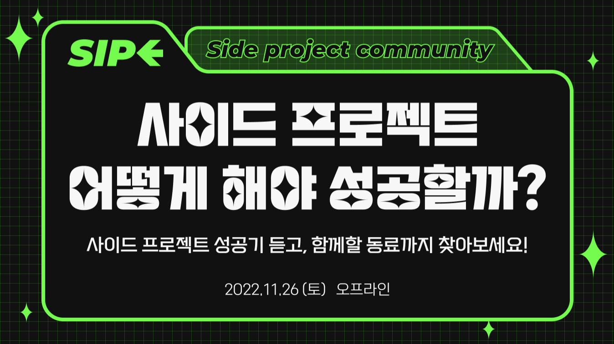

원래 사이프는 일회성으로 진행되었던 [이벤트](https://festa.io/events/2732)였다.  
사이드 프로젝트에 관심이 있거나, 해본 사람들이 모여 이야기를 나누는 행사였고,  
안그래도 일회성으로 끝나고 말았던 아쉬움이 있던 와중, 새로운 커뮤니티를 만들어보자는 의견이 나왔기에  
기존 사이프를 한층 더 발전시켜보기로 결정되었다.

&nbsp;

## 지속가능한 커뮤니티가 되려면?

사이드 프로젝트라는 공통의 목적 없이도 지속가능한 커뮤니티를 만들기 위해서는  
어쨌거나 또 다른 연결고리가 필요했다.

그래서 **미션**이라는 제도를 도입하게 되었다!  
미션의 주제로는 사이드 프로젝트도 가능하고, 더 가벼운 스터디나 회고 같은 것들도 가능하도록 설정하였다.

그렇게 사이프는,  
**스터디, 회고작성, 사이드 프로젝트 등 다양한 방식으로 성장하고 싶은**  
**현직 개발자들이 모여 함께 학습하고 소통하는 IT 커뮤니티**라는 컨셉을 가지게 되었다.

우리는 사이프를 통해 성장하는 경험 뿐만 아니라,  
소중한 인생 친구를 만드는 경험도 하게 해주고 싶다는 마음이 컸다.

> "좋은 사람들이 가득 모여 있다는 확신을 주는 커뮤니티가 되어보자!"

그래서 다양한 방식으로 네트워킹을 할 수 있는 세션들도 준비했다.

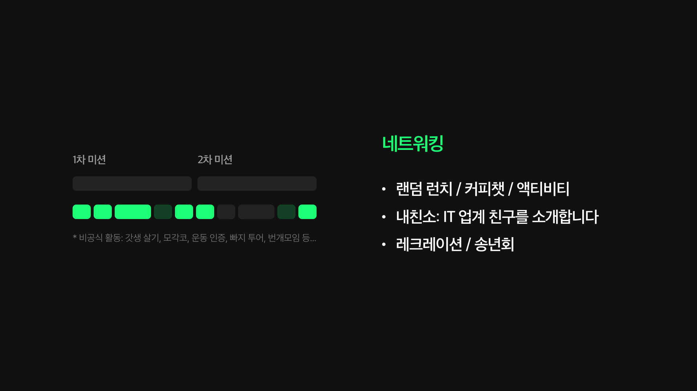

&nbsp;

## 이제 시작이다!

커뮤니티의 컨셉이 구체화되자마자 [웹사이트](https://sipe.team/) 만들기에 뛰어들었다.  
제주도로 워케이션을 떠난 와중 열심히 만들었던 기억이 아직도 생생하다 🏝️

그리고 시작된 서류모집!  
디프만, 아우쓱, 넥스터즈 등 다른 커뮤니티 활동을 한 경험을 바탕으로 큰 어려움 없이 다양한 커뮤니티에 동아리 홍보를 할 수 있었고,  
그 결과 1기 모집임에도 불구하고 80명 가까이 되는 분들이 지원해주셨다. 🥹  
이렇게 많은 수의 사람들에게 동시에 메일을 보내는 게 처음이라 너무나도 떨렸다.  
([이때의 경험을 기록해두었던 6월의 글🤭](https://www.jeong-min.com/38-apps-script/))

> *"무사히 한 고비를 넘겼고, 이제 시작인 우리 SIPE 팀.. 성공적인 하반기가 될 수 있길 기도해본다."*
다행이 성공적인 하반기로 끝날 수 있어서 너무나도 감사하다 💚

&nbsp;

## 면접 아니에요! 커피챗이에요!

말로는 인터뷰였지만, 우리가 뭐라고 다른 분들을 평가하냐는 생각이 컸다. 😅  
그래서 면접이 아닌, 커피챗 느낌을 드릴 수 있도록 애썼던 것 같다.  
간식도 포장해서 나눠드리고, 인터뷰 공간은 은은한 조명과 재즈 음악으로 채워두었다.  
덕분에 딱딱한 분위기가 아닌, 정말 웃고 떠드는 커피챗 느낌으로 인터뷰가 진행되었다.  
(정말 더웠던 6월 25일과 26일. 인터뷰하러 잠실까지 오셨던 모든 분들께 너무나도 감사드려요 🥹)

&nbsp;

## 드디어 시작된 SIPE 1기

### 1회차: OT

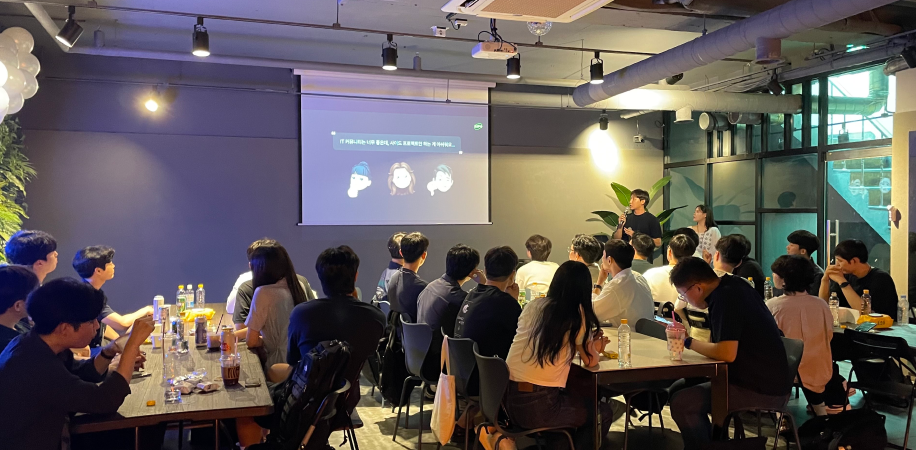

그렇게 7월 8일, 사이프 1기가 시작되었다! 🥳  
OT는 파티룸을 대관해서 진행했고, 캔맥주도 잔뜩 준비해서 신나고 즐거운 시간이 될 수 있도록 했다! 🍻

그렇게 1차 미션 때는 아래와 같은 9개의 팀들이 만들어지게 되었다.

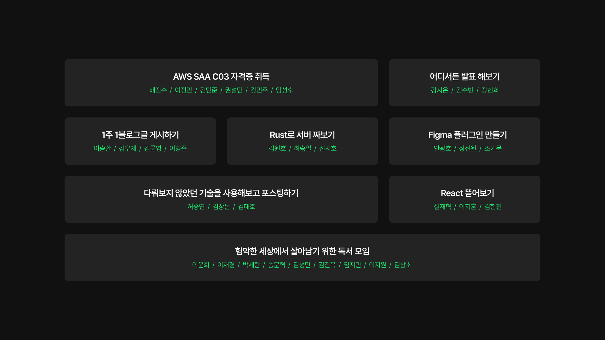

&nbsp;

### 2회차: 사이프챗

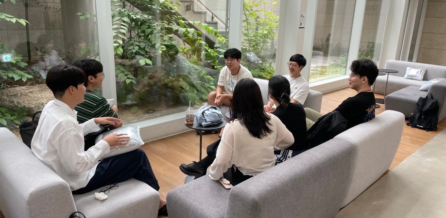

팀끼리 미션을 진행하는 시간을 가진 후, 미션이 아닌 관심사별로 모여 소통할 수 있는 시간을 가져보았다.  
커리어, 인생, 기술 등 다양한 관심사를 바탕으로 유익한 인사이트를 주고 받을 수 있는 시간이었다. 🤭

&nbsp;

### 3회차: 액티비티

미션 팀끼리 모여 활동을 진행한 뒤, 
스케이팅, 클라이밍, 카페 탐방 등 다양한 주제로 나뉘어 액티비티 시간을 가져보기도 했다.  
(나는 석촌호수 코 앞에 살면서 롯데월드 아이스링크를 처음 가보는 쾌거(?)를 이루었다 ⛸️)

&nbsp;

### 4회차: 내친소

**"내 친구를 소개합니다"**  
라는 컨셉을 바탕으로, 서로에게 소개시켜주고 싶은 IT 업계 친구를 초대하는  
**너 (I)T야?** 를 개최하게 되었다.  
운영진 3명으로는 무리겠다는 결론을 바탕으로 컨퍼런스 TF를 내부적으로 따로 모집해서 진행하게 되었다.

외부인들도 많이 부르는 행사인 만큼, 좋은 인상을 심겨주고자 간식과 굿즈도 이것저것 많이 준비했었다. 💪


행사 준비, 게임 준비, 뒤풀이 인솔 및 정산까지 너무나도 고생 많았던 TF원들, 감사해요 🥹  
덕분에 너무나도 성공적으로 끝났던 사이프의 첫 번째 행사!

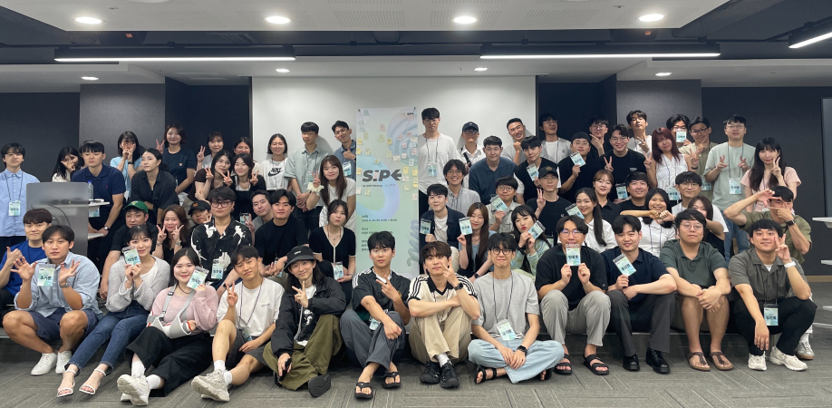

&nbsp;

### 5회차: 나들이

매일 책상 앞에 앉아 미션만 진행하면 재미 없으니까! 🤭  
팀원들과 오손도손 모여 나들이를 떠나는 재미난 세션도 준비했었다.

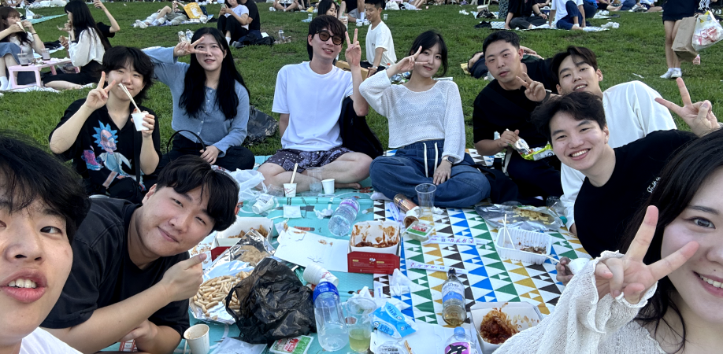

한강에 모여 좋은 사람들과 함께 완벽한 날씨와 즐거운 수다를 즐겨본 게 얼마만인지! 🥹

&nbsp;

### 6회차: 1차 미션 발표

정규활동의 반이 정말 눈 깜짝할 새에 지나갔다 😳

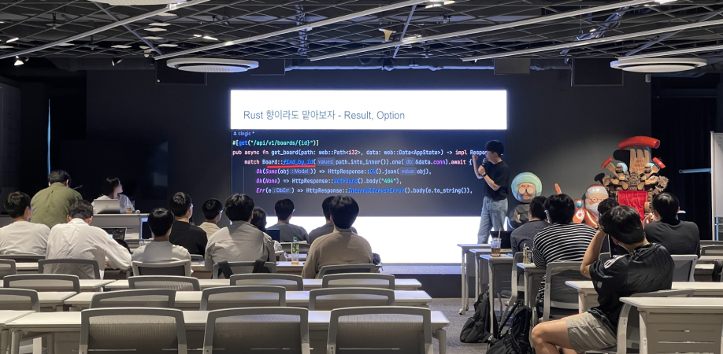

미션을 멋지게 완수해낸 팀도 있었고, 아쉬운 결과를 낸 팀도 있었지만  
그 모두가 열심히 3개월을 달려왔다는 사실은 명확히 알 수 있었다.

&nbsp;

### 7회차: 2차 미션 시작

시범적이고 자유로운 컨셉을 가진 1기인 만큼,  
2회차는 1회차와 달리 **개발이 아니어도 괜찮은 미션**을 가져가게 되었다.

그렇게 2차 미션 때는 아래와 같은 5개의 팀들이 만들어지게 되었다.

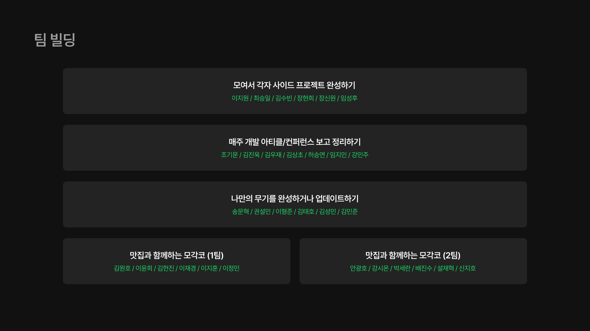

&nbsp;

### 8회차: 두 번째 사이프챗

지난 사이프챗에서 유익한 인사이트를 많이 나눌 수 있었다는 긍정적인 반응을 바탕으로 두 번재 사이프챗을 진행하게 되었다.  
이번에는 직군별, 관심사별로 총 두 번의 챗을 진행했다.

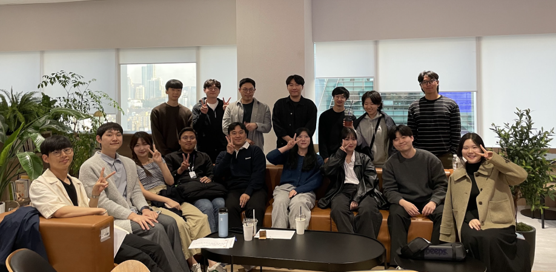

직군별로 모여서는 기술, 회사, 커리어, 성장 노하우와 같은 조금은 무거울 수 있는 이야기를 심도 있게 다루었고,  
관심사별로 모여서는 여행, 취미, 인생 등 가볍진 않지만 너무 무겁지도 않은 이야기들을 나누었다.

&nbsp;

### 9회차: 두 번째 나들이

지난 나들이를 통해 팀원들과 깊은 우정을 쌓을 수 있어 좋았다는 의견이 많았다.  

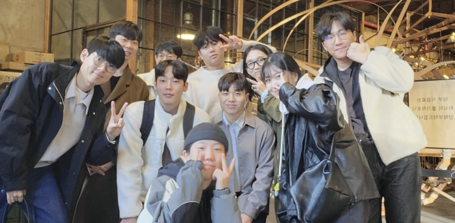

모각코(모여서 각자 코딩) 팀은 성수 카페 나들이,

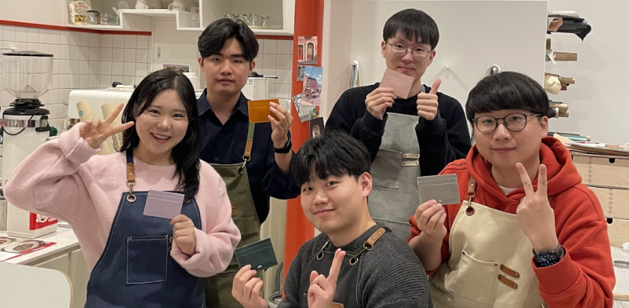

모각사(모여서 각자 사이드) 팀은 가죽 공예 원데이 클래스 나들이,

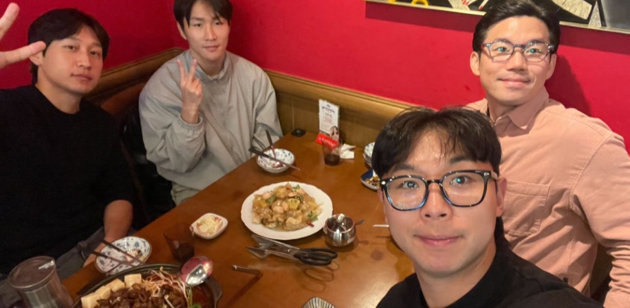

아티클(아티클 컨퍼런스 정리) 팀은 석촌 카페 나들이,

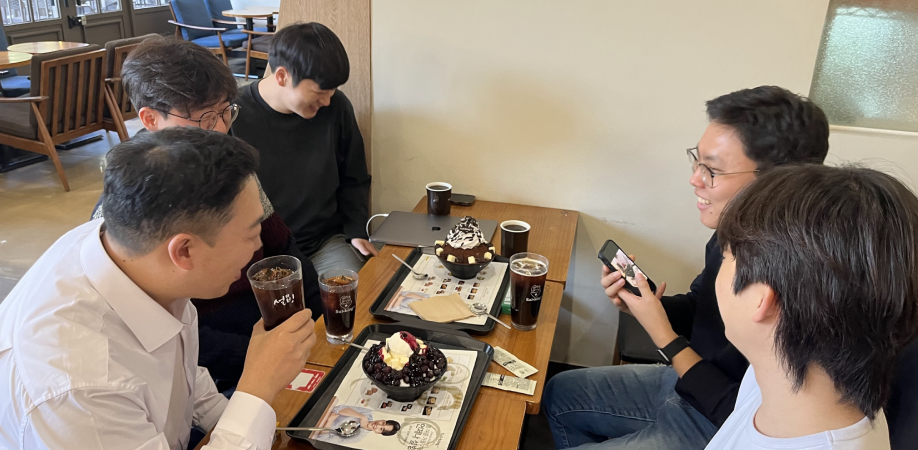

나무만(나만의 무기 만들기) 팀은 빙수 먹고 빼빼로 교환하는 귀여운(?)🤭 나들이를 다녀왔다고 한다.

&nbsp;

### 10회차: 사담콘

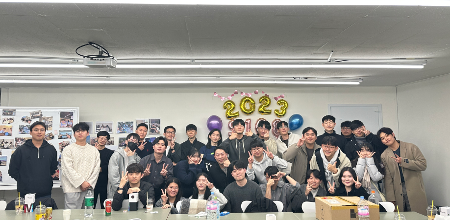

사이프에서 컨퍼런스를 열면 좋겠다는 의견을 바탕으로,  
사이퍼들의 이야기(談)를 나누는 **사담콘**을 진행하게 되었다!

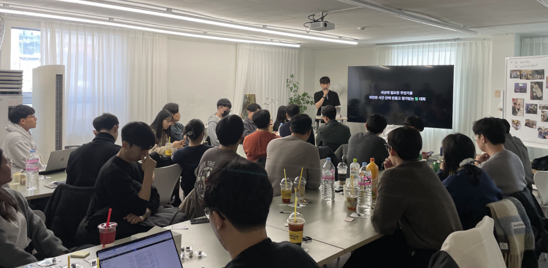

소수의 외부 인원을 초대해 더욱 풍성한 행사를 진행할 수 있었다.  
기술 컨퍼런스가 주였지만, 기술 외에도 가지각색의 다양한 경험에 대한 발표가 많아 정말 알찼다!

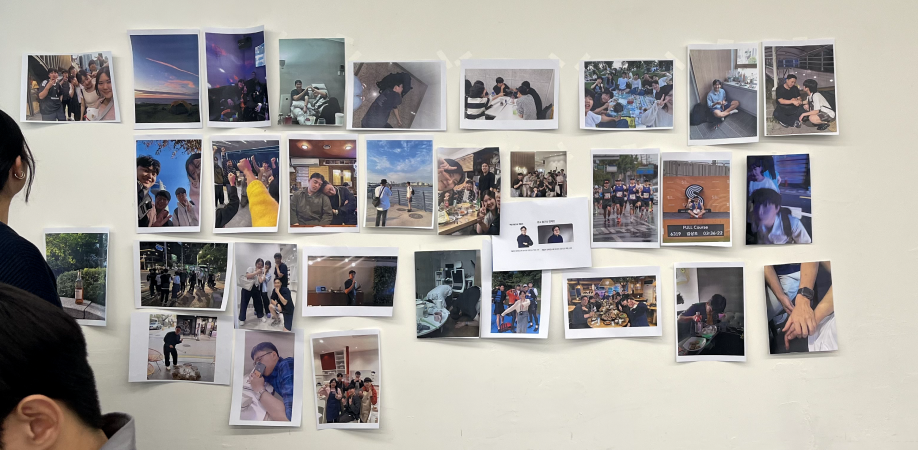

한쪽 벽면을 사진으로 꾸몄는데, 짧은 시간동안 정말 많은 추억을 만들었구나 싶었다. (몽글몽글🥹)

&nbsp;

### 11회차: 2차 미션 발표 & 수료식

그리고 정규 활동의 마지막 날을 맞이하게 되었다!  
발표가 끝나고 수료증도 모두 받았지만,  
다들 아쉬웠는지 떠나지 않고 음료와 간식을 사와서 2시간이나 넘게 이야기를 나누었다.

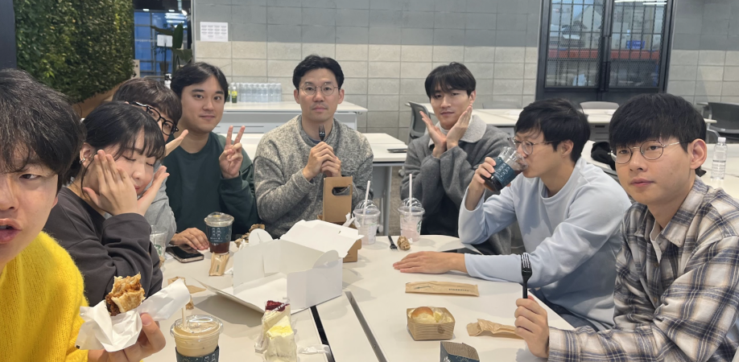

우당탕 사이프 1기를 함께해준 사이퍼들, 너무 고마워요!  
여러분 덕분에 첫 시작을 성공적으로 이끌 수 있었어요! 🥰

&nbsp;

## 글을 마치며

사이프는 정말 앞으로도 내 인생의 큰 부분으로 남을 것 같다.  
커뮤니티를 직접 만든 것도 정말 잊지 못할 경험이고,  
이전까지는 얼굴도 몰랐던 사람들이 모여 둘도 없는 친구가 되었다는 것도 정말 감격스러운 부분이다.

내가 만든 동아리에서 사람들이 즐겁고 행복하게 성장하고 네트워킹하는 모습을 보며,  
나도 많은 것을 느끼고 배울 수 있었다.

다가올 2기도 너무 기대된다! 2기 운영진 화이팅이에요 💪

```toc
```