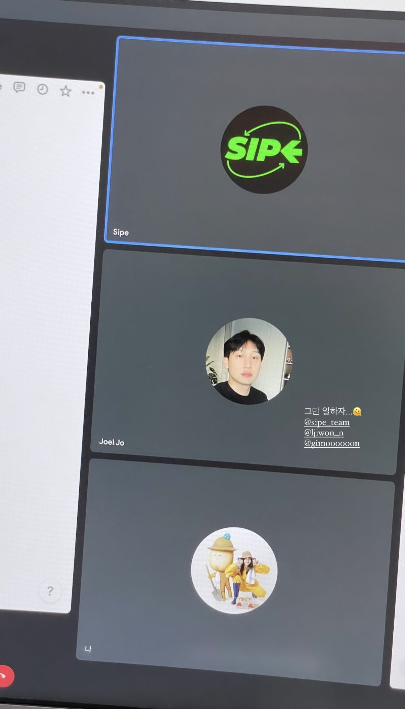
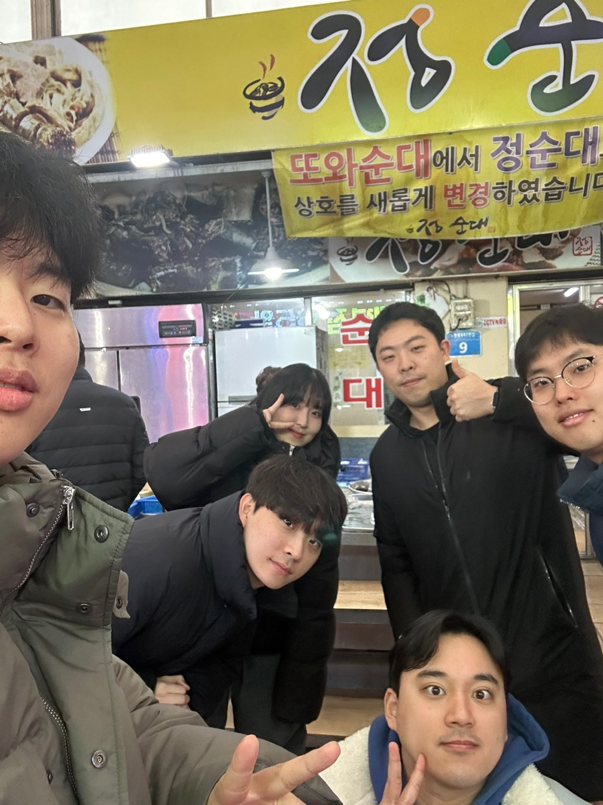

[지난 회고](https://www.jeong-min.com/9-2022-retrospect/)에서 말했듯, 2022년인 인생 권태기 그 자체였다. 그랬던 만큼, 2023년은 재밌고 뿌듯하게 살아보는 것이 목표였다. 그렇게 실제로 도파민이 넘치다 못해 폭발하는 한 해를 완성할 수 있었다.


&nbsp;

## 회사에선 말이죠..

### 운영도구개발팀

1년동안 함께했던 웹프론트개발그룹 직속팀이 사라지고, 나는 기존 팀원의 일부와 함께 새로 만들어진 운영도구개발팀에 들어가게 되었다. 운영도구개발팀은 배민 관련 업무 효율을 증대하기 위해 만들어진 팀으로, 운영에 필요한 도구를 만들어 제공함으로써 생산성을 높이는 팀이다. 새로운 팀에서 여러 운영도구와 여러 물류어드민을 함께 개발하면서 컨텍스트 스위칭 능력을 많이 기를 수 있었고, 다른 실 및 팀과의 협업이 잦았기에 커뮤니케이션 능력도 많이 기를 수 있었던 것 같다.


> 나도 물류센터에서 일해봤다!

그럼에도 아직 배우고 성장해 나가야 할 부분이 산더미라고 느끼고 있다. 3일 뒤면 3년차가 되는 시점에서, ~~나는 정말 아무것도 할 줄 아는 게 없는데 시간만 야속하게 흐른다는 생각이 들지만~~ 이젠 정말 어리광만 부릴 게 아니라 도전적으로 부딪혀 나아가는 실행력을 더 길러야겠다는 생각이 든다.


> 응애에요..

&nbsp;

### 웹프론트개발그룹 운영진 2기

사내 모든 프론트엔드 개발자들은 웹프론트개발그룹에 소속되어 있는데, 프론트엔드 개발자의 역량 강화 및 커뮤니케이션을 위한 목적으로 2022년부터 운영진이 꾸려지게 되었다. 나는 2023년 한 해 동안 2기 운영진으로서 활동했다.


매달 우아한 프론트 런치/티타임과 우각코(우아하게 각자 코딩)를 열고,

&nbsp;


격월로 FE 밋업을 열면서 라디우수타라는 새로운 코너를 만들어보기도 하고,

&nbsp;


사내 프론트엔드 개발자 구성원분들을 위한 굿즈도 직접 만들어보기도 하고, (내가 직접 손으로 그리고 피그마로 작업해서 만든 아주 뿌듯한 결과물 🥹)

| | |
| - | - |
|  |  |

> 불편하고 밋밋했던 사원증에서 편하고 예쁜 사원증으로 탈바꿈!

&nbsp;


구성원분들께 따뜻한 감동을 안겨드리고자 다양한 이벤트도 기획해보고, (처음 전사 채널에 올려본 메시지..)

&nbsp;


행복한 연말 파티도 크게 열어보는 등 정말 알찬 한 해라고 자부할 수 있었다!

사내 운영진으로 활동하면서 퍼실리테이터로서의 역량도 많이 기를 수 있었던 것 같다. 정말 할 수만 있다면 계속해서 운영진으로 활동하고 싶은 마음,, 🥹 함께 열심히 달려온 경민님, 태규님 감사해요 🫶

&nbsp;

### 우아한타입스크립트

작년에 진행했던 사내 프로젝트였던 우타스 집필이 드디어 세상에 드러났다! 🥹

| | |
| - | - |
|  |  |

말도 많고 탈도 많았기에 정말 출판이 될 수 있을까 걱정이 많았는데, 이렇게 실물로 보게 되어 너무나도 감격스러웠다.

&nbsp;

### 우아한테크토크


별건 아니지만,, 우아한형제들에서는 현재 전사적으로 Copilot을 도입하여 사용하고 있는데, 과연 체감상 얼마나 생산성이 향상되었는지, 효율적인 활용법이 있는지 등 편하게 이야기를 나누는 자리에 진행자로 초대되어 좋은 시간을 나눌 수 있었다. 덕분에 처음 뵙는 사우님들과도 안면을 트고 여러 인사이트를 나누는 좋은 경험을 할 수 있었다. 앞으로도 기회만 닿는다면 사내 활동에 더욱 더 참여하고 싶은 바람이다!

&nbsp;

### 한여름밤의 와인 클래스

| | |
| - | - |
|  |  |

배민아카데미에서 주최한 와인 클래스에 운 좋게 당첨되어 고오급진 페어링을 즐겼다. 와인에 대해서도 많이 배울 수 있었다. 와인, 칵테일, 위스키에 대한 지식이 많이 늘었는데, 생각해보니 와인 클래스가 그 시작이 아니었나 싶다.

&nbsp;

### 우아톤

매년 열리는 사내 해커톤, 드디어 참석해보았다! 끊임없는 간식, 맥주, 치킨, 피자 등으로 이게 해커톤인지 사육톤인지 헷갈릴 정도였다🐷 비록 상은 못 받았지만 즐거웠던 시간이었다!

| | |
| - | - |
|  |  |

&nbsp;

## 제가 동아리를 만들었단 말이죠?

### 사이프

[사이프 회고글은 여기에서..]()

때는 바야흐고 2023년 2월 10일, 디프만에서부터 알게 된 지원님 기문님과 셋이서 ~~술을 먹다가~~ 놀다가 동아리를 한 번 같이 만들어 보는 게 어떻겠냐는 이야기가 나왔다.

| | |
| - | - |
|  |  |

> 우당탕탕 삼총사

그리고 우리는 3월 19일에 첫 공식 회의를 시작하는 엄청난 행동력을 시작으로, 매주 1회 이상의 회의를 진행하며 2주만에 [공식 사이트](https://sipe.team/)를 개발하고 [공식 SNS](https://www.instagram.com/sipe_team/)를 만들었고, 5월 19일에 본격 모집을 시작해서, 7월 8일 OT를 시작으로, 12월 16일 송년회를 끝으로 1기 활동을 무사히 끝마치게 되었다.

2023년은 사이프로 채웠다고 해도 과언이 아닐 정도로, 정말 내 인생에 있어서도 큰 부분을 차지한 기간이었다. 사이프에서 원래 알고 있었던 사람들과는 더 깊은 관계를, 처음 알게 된 사람들과는 둘도 없는 관계를 꾸려나갈 수 있었다. 좋은 사람들을 만난 것 이상으로, 정말 인생 친구들을 많이 만들었다는 생각이 드는 한해였다.


같이 빠지도 가고,


한강도 가고,

| | |
| - | - |
|  |  |
국내 여행도 가고,

| | |
| - | - |
|  |  |
등산도 가고,


내 생일 파티도 보내고,


병문안도 가고,


크리스마스 파티도 보내고,

| | |
| - | - |
|  |  |
연말 여행도 가고!

> 그리고 다가오는 1월 말에는 함께 아이슬란드를 갈 예정이다 🤭

나와 함께 해준 모든 사람들에게 너무나도 감사하다 💚

&nbsp;

## 밖으로도 나돌아 다녔답니다

정말 감사하게도, ~~왜인지 모르겠지만~~ 여러 곳에서 나를 불러주셨다. 진학사 캐치([회고글]()), 원티드([회고글]()), 제로베이스 덕에 나 스스로도 많은 성장을 할 수 있었다. 하지만 이런 활동을 할 때마다, 점점 더 빛 좋은 개살구가 되어가는 건 아닐까 하는 걱정이 드는 것도 사실이다. 걱정을 채찍 삼아 더욱 성장해 나가야겠다는 다짐을 매번 하고 있지만, 쉽진 않은 것 같다 🥲


> 운도개 팀원들의 생일 축하편지. 셀럽이라고 놀림 받는 것도 익숙하다 😂

&nbsp;

## 힐링도 중요하다구요

### 제주도 워케이션 (5월)

석촌고분 집의 1년 계약을 끝으로, 나는 제주도 집으로 내려가게 되었다. 그렇게 엄마와의 2달간 제주살이를 보내게 되었다. 제주도민으로 살았던 2달동안 숨은 맛집들을 어마무시하게 찾아냈다 🤤

- [제주살이 하이라이트](https://www.instagram.com/stories/highlights/18333253651079278/)
- [제주살이 하이라이트2](https://www.instagram.com/stories/highlights/18285006328187403/)
- [제주 가본 곳 리스트](https://naver.me/5nPdaMw6)

&nbsp;

### 동유럽 여행 (10월)

2주간의 긴 휴가를 내고, 엄마랑 둘이서 동유럽 패키지를 가게 되었다.

[헝가리](https://www.instagram.com/stories/highlights/17973618950414134/) - [크로아티아](https://www.instagram.com/stories/highlights/17949541937695580/) - [슬로베니아](https://www.instagram.com/stories/highlights/18011490340807610/) - [오스트리아](https://www.instagram.com/stories/highlights/17973699569429872/) - [체코](https://www.instagram.com/stories/highlights/17871940619988917/) 순으로 동유럽을 돌았다.
> (예쁜 사진 정말 많이 찍었는데 정리할 자신이 없어 하이라이트로 대체..😇)

여러 관광명소도 기억에 남지만, 역시나 여행은 즉흥적으로 들어갔던 카페, 음식점이 제일 기억에 남는 법인 것 같다. 엄마랑 소중한 추억을 많이 남길 수 있었던 행복한 시간이었다👩‍👧💕

&nbsp;

## 행복했다!

2023년은 정말 다채로운 한 해였다. "이보다 더 재밌게 살 수 있을까?" 싶을 정도로 즐거웠다. 행복이란 무엇인지, 삶이란 무엇인지 항상 고민이 많았는데, 그에 대한 해답을 얻었다고 할 수 있을 정도로 행복했다. ~~하지만 그만큼 도파민도 넘치고 혈중 알코올 농도도 넘치고 지방도 넘치는..~~ 2024년엔 좀더 건강을 챙겨보려 한다. 많이 걷고 꾸준히 운동하고 공부하는 좋은 습관들을 만들어 나가보려 한다. 올해의 목표는 건강하고 예쁜 몸으로 더 행복하게 살기!


```toc
```