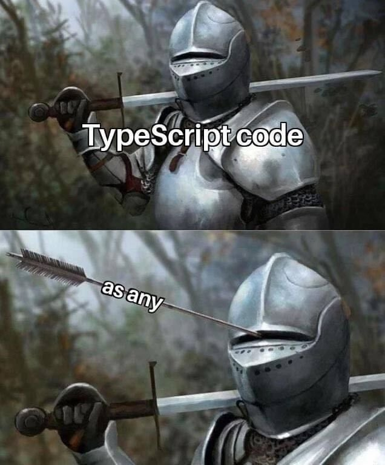

## 이것도 필요하고 저것도 필요하고 다 필요한 속성인데..?

싶을 때 우리는 종종

**"일단 다 optional 처리하고 조건부 렌더링 해버리자!"**  
또는  
**"그냥 as 써버려!"**  
..가 되어버리는 것 같다.


> 애써 무시하기 스킬을 획득하셨습니다.

하지만 그렇게 짜게 되면 optional 속성에 대해 불필요한 값들도 조건부 렌더링에 추가하게 되는 불상사가 일어나곤 한다.

~~현실에선 일어나지 않을 코드이지만,~~ 위 상황에 대한 연출을 위한 간단한 코드로 한번 예시를 들어보도록 하겠다!

&nbsp;

서로 다른 상황에서 사용되는 동일한 인터페이스를 만들어야 한다고 해보자. 예를 들어, 내가 작성한 포스트와 남이 작성한 포스트를 다르게 노출시켜야 한다고 해보자.

```tsx
// PostList.tsx
const myPosts = posts.filter(({ createdBy }) => createdBy === user.id);
const otherPosts = posts.filter(({ createdBy }) => createdBy !== user.id);

return (
  <div>
    {myPosts.map((post) => (
      <Post
        key={post.id}
        post={post}
        handleDelete={handleDelete}
      />
    ))}
    {otherPosts.map((post) => (
      <Post
        key={post.id}
        post={post}
        isNotMine={true}
      />
    ))}
  </div>
)
```
```tsx
// Post.tsx
return (
  <div>
    {
      !isNotMine && (
        <DeleteButton onDelete={handleDelete} />
      )
    }
  </div>
)
```

위와 같은 구조를 만든다고 할 때, Post 컴포넌트의 props를 어떻게 설계할 것인지 꽤나 고민이 된다.


우선은 두 가지 상황에 대한 대처가 필요하다.

```ts
interface Post1 {
  post: Post;
  onDelete: () => void;
}

interface Post2 {
  post: Post;
  isNotMine: true;
}
```

&nbsp;

## 1. 아묻따 optional 처리

일단 다 optional 처리를 하는 방법이 있겠다.

```ts
interface Post {
  post: Post;
  onDelete?: () => void
  isNotMine?: true;
}
```

하지만 이렇게 작성할 경우, `isNotMine`과 `onDelete`가 모두 옵셔널이기 때문에 Post 컴포넌트의 조건부 렌더링에서 불필요한 옵션이 추가될 수 있다.

```ts
// Post.tsx
return (
  <div>
    {
      !isNotMine && handleDelete && (
        <DeleteButton onDelete={handleDelete} />
      )
    }
  </div>
)
```

🤔 `isNotMine === false`인 경우에는 `handleDelete`가 꼭 있다는 걸 강제할 수는 없을까?

&nbsp;

## 2. 아묻따 as 처리

타입스크립트를 사용할 때 지양해야 할 것 첫 번째는 바로 any.  
그리고 두 번재는 바로.. 타입 단언문.



> 하지만 타입이 정말x13513235 확실할 경우, 타입 단언문은 종종 유용하게 사용되기도 한다!

as를 사용한다면 타입 에러는 임시방편으로 막을 수 있다.

```tsx
// Post.tsx
return (
  <div>
    {
      !isNotMine && (
        <DeleteButton onDelete={handleDelete as () => void} />
      )
    }
  </div>
)
```

하지만 사용부에서 실수할 가능성은 여전히 남아있다.

```tsx
// PostList.tsx
return (
  <div>
    {myPosts.map((post) => (
      <Post
        key={post.id}
        post={post}
        handleDelete={handleDelete}
        isNotMine={true} // 실수 잡지 못함
      />
    ))}
    {otherPosts.map((post) => (
      <Post
        key={post.id}
        post={post}
        isNotMine={true}
        handleDelete={handleDelete} // 실수 잡지 못함
      />
    ))}
  </div>
)
```

🤔 더 안전하고 깔쌈한 방법 어디 없나?

&nbsp;

## Union과 never을 사용하자!

```ts
interface MyPost {
  post: Post;
  isNotMine: never; // 없어야 하는 속성
  onDelete: () => void;
}

interface OtherPost {
  post: Post;
  isNotMine: true;
  onDelete: never; // 없어야 하는 속성
}

type Post = MyPost | OtherPost;
```

두 상황에 대해, 없어야 하는 프로퍼티를 never로 두고, 두 인터페이스를 union으로 결합한다면..!


이제 모든 게 해결될 것이다!

```tsx
// Post.tsx
return (
  <div>
    {
      !isNotMine && (
        <DeleteButton onDelete={handleDelete} />
      )
    }
  </div>
)
```

```tsx
// PostList.tsx
return (
  <div>
    {myPosts.map((post) => (
      <Post
        key={post.id}
        post={post}
        handleDelete={handleDelete}
        isNotMine={true} // Types of property 'isNotMine' are incompatible
      />
    ))}
    {otherPosts.map((post) => (
      <Post
        key={post.id}
        post={post}
        isNotMine={true}
        handleDelete={handleDelete} // Types of property 'handleDelete' are incompatible
      />
    ))}
  </div>
)
```


> 편-안

```toc
```