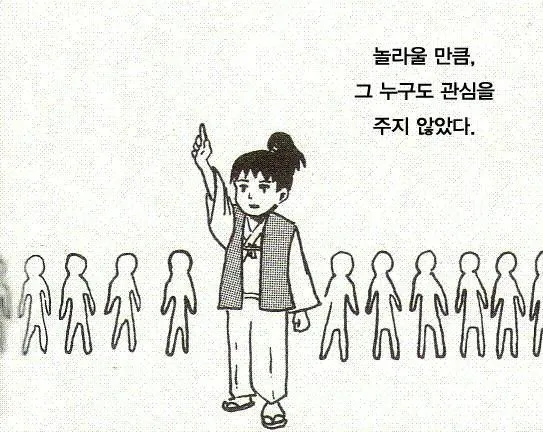
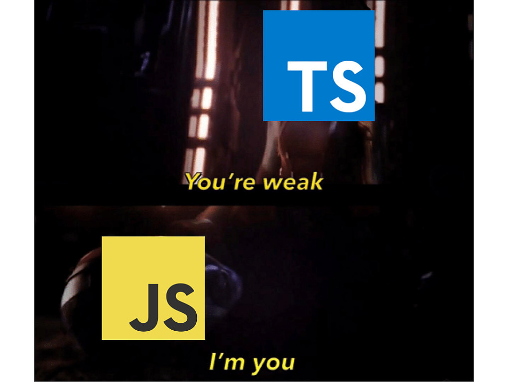

공부를 해보겠다고 책이나 독스를 읽어 내려가다 보면, 무념무상이 되곤 한다.


> 타입 가드.. 그렇구나.. 타입 좁히기.. 그렇구나.. 타입 서술어.. 그렇구나..

그러다 문득 든 생각,  
🤔 **실제로 개발할 때 써본 적은 없는 것 같은데? 이거 왜 쓰는 거지?**

&nbsp;

## 반환 타입을 굳이..?

우리는 생각보다 타입스크립트의 기능 중 정말 일부만을 사용한다.  
**반환 타입이 타입 서술어인 함수**를 사용하는 일은 거의 없다 보니, `is`와 같은 문법은 잊혀지곤 한다.



그렇다 할지라도, 기능이 있는 데에는 다 이유가 있는 법!  
is를 어떻게 요리해볼 수 있을지 한 번 알아보도록 하자.

&nbsp;

## 생각보다 타입스크립트는 멍청하다

```ts
type Person = {
  name: string;
  age: number;
};

type Developer = {
  name: string;
  age: number;
  language: string;
};

function isDeveloper(param: Person | Developer) {
  return (param as Developer).language !== undefined;
}
```

위와 같은 코드가 있다고 할 때, `isDeveloper` 함수를 통과한 값은 어떻게 타입이 추론될까?

😯 통과했으니 당연히 Developer 타입으로 추론되지 않을까?

는 큰 오산이다.

```ts
function returnLanguage(param: Person | Developer) {
  if (isDeveloper(param)) {
    // Error: Property 'language' does not exist on type 'Person | Developer'.
    return param.language;
  }
}
```

> TS: ? 니가 `Person | Developer`라며


&nbsp;

위와 같은 상황을 마주하면, 당황스러운 마음에 as를 써버리곤 한다.

```ts
function returnLanguage(param: Person | Developer) {
  if (isDeveloper(param)) {
    return (param as Developer).language;
  }
}
```


이럴 때 잊혀졌던 is 친구를 한 번 불러보는 건 어떨까?

```ts
function isDeveloper(param: Person | Developer): param is Developer {
  return (param as Developer).language !== undefined;
}

function returnLanguage(param: Person | Developer) {
  if (isDeveloper(param)) {
    // param: Developer
    return param.language;
  }
}
```

&nbsp;

이런 것까지 하나하나 다 알려줘야 해? 라는 생각이 들 수 있지만..  
자바스크립트는 그럴 수 있어!



```toc
```