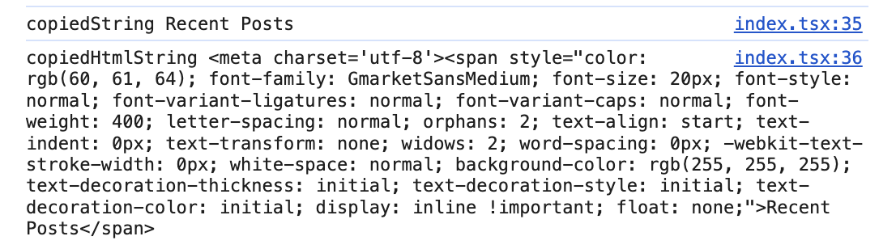
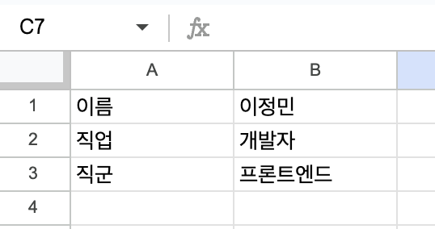
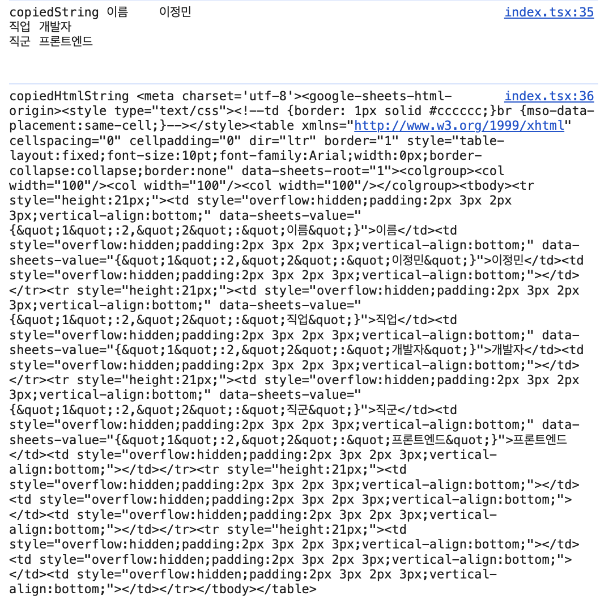
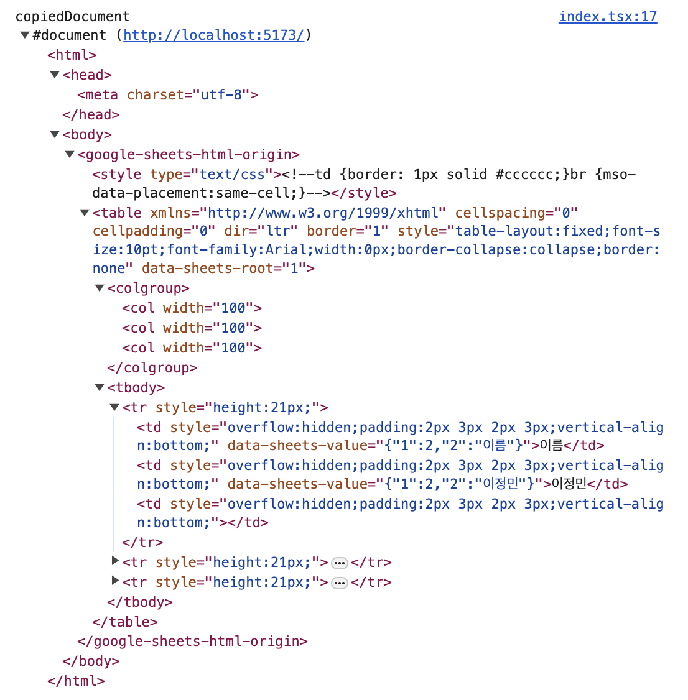
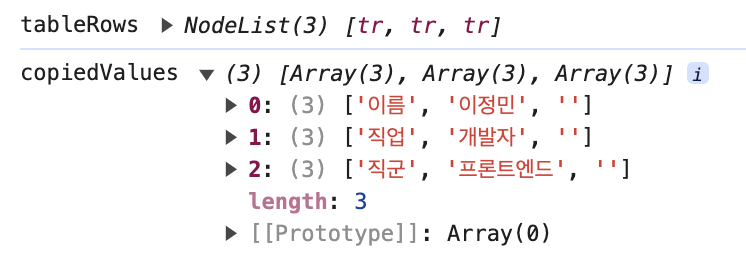

## 엑셀이나 구글 스프레드 시트를 input에 그대로 복붙할 수는 없을까?

엑셀 또는 스프레드 시트 파일을 서버에 업로드하기 전에,  
프론트에서 한 번 validation을 한다든가 하는 전처리 과정을 진행해볼 수도 있다.  
그렇다면 엑셀이나 구글 스프레드 시트를 복붙해 넣을 수 있는 input과 뷰가 필요한데,  
과연 엑셀과 스프레드 시트 파일은 어떤 형태로 클립보드에 저장될까?


> 복붙 가보자고~

&nbsp;

## input의 onPaste 속성

> input에는 onInput만 있는 줄 알았지?

HTMLElement의 paste 이벤트의 이벤트 타입은 Event를 상속받는 ClipboardEvent이다.  
우리가 자주 사용하는 input 이벤트와 한 번 비교해보자!

```ts
const handleOnInput = (e: React.FormEvent<HTMLInputElement>) => {};
const handleOnInput = (e: React.ClipboardEvent<HTMLInputElement>) => {};
```

&nbsp;

## 1. 어떻게 복사한 값을 가져올 수 있을까?

`ClipboardEvent`의 `clipboardData`의 `getData` 메서드를 활용하면 포맷에 따른 값을 가져올 수 있다.


```tsx
export const ExcelInput = () => {
  const handlePaste = (e: React.ClipboardEvent<HTMLInputElement>) => {};

  return (
    <div>
      <input onPaste={handlePaste} />
    </div>
  )
}
```

위와 같이 작성된 컴포넌트를 만들고,  
다음과 같은 화면에서 `Recent Posts`를 복사해서 위 컴포넌트에 붙여넣어 본다고 해보자.


```ts
const handlePaste = (e: React.ClipboardEvent<HTMLInputElement>) => {
  const copiedString = e.clipboardData.getData('text');
  const copiedHtmlString = e.clipboardData.getData('text/html');
  
  console.log('copiedString', copiedString);
  console.log('copiedHtmlString', copiedHtmlString);
};
```

그럼 다음과 같은 결과가 출력된다.



&nbsp;

그렇다면 아래와 같은 시트를 복붙해본다면?!





### 🤩 테이블 형태로 뽑아 쓸 수 있겠구나!!

&nbsp;

## 2. 어떻게 string을 뜯어 고칠 수 있을까?

하지만 `copiedHtmlString`의 타입은 string이다.  
마음껏 주무르려면 방법이 필요한데..🤔  
그럴 때 필요한 것이 DOMParser!

`DOMParser`는 XML 또는 HTML 소스 코드를 string에서 DOM Document로 파싱해주는 친구다.

```ts
const handlePaste = (e: React.ClipboardEvent<HTMLInputElement>) => {
  const copiedHtmlString = e.clipboardData.getData("text/html");
  const parser = new DOMParser();
  const copiedDocument = parser.parseFromString(copiedHtmlString, "text/html");

  console.log("copiedDocument", copiedDocument);
};
```



아주 멋진 HTML Document를 볼 수 있게 되었다!  
그렇다면 나머지 코드를 작성해 볼 수 있겠다!

&nbsp;

## 3. 2차원 배열에 셀 데이터를 집어넣자!

```ts
const [copiedValues, setCopiedValues] = useState<string[][]>();

const handlePaste = (e: React.ClipboardEvent<HTMLInputElement>) => {
  const copiedHtmlString = e.clipboardData.getData('text/html');
  const parser = new DOMParser();
  const copiedDocument = parser.parseFromString(copiedHtmlString, 'text/html');

  const tableRows = copiedDocument.querySelectorAll('tr');
  tableRows.forEach((row) => {
    const cells = [...row.querySelectorAll('td')]
      .map((node: HTMLTableCellElement) => node.textContent)
      .filter((x): x is string => x !== null);

    setCopiedValues((prev) => {
      return [...(prev ?? []), cells];
    });
  });

  console.log('tableRows', tableRows)
};

useEffect(() => {
  if (copiedValues) {
    console.log("copiedValues", copiedValues);
  }
}, [copiedValues]);
```



이제 `copiedValues`를 `<table>`안에서 잘 주무르면..


```toc
```