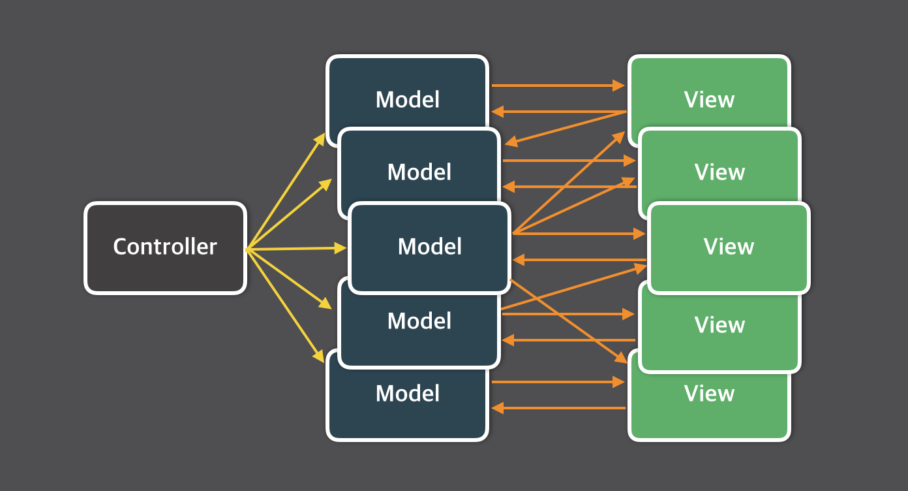
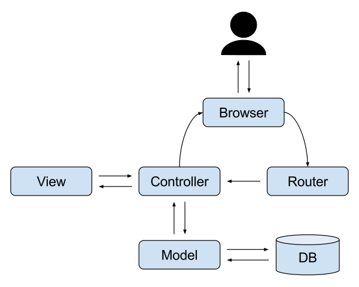

> 길이 길어질까봐 상세한 설명은 생략된 부분이 많으니, 궁금한 내용은 더 검색해주세요! 😉

&nbsp;

## 리액트 상태 관리, 왜 하는데?

### 1. 단방향 바인딩

양방향 바인딩을 하는 앵귤러나 뷰와 달리, 리액트는 단방향 바인딩을 지원한다.  
즉, 부모의 상태를 자식으로 전달할 수는 있지만(props) 자식의 상태를 부모로 전달하는 방법은 없다.

> ~~물려받기만 할 줄 아는 불효자 리액트~~

즉, 자식에서 부모의 상태를 바꾸려면 상태를 바꾸는 setState도 자식에게 전달해야 하는 것이다.

### 2. props drilling

ComponentA, 그리고 A의 자식인 ComponentB, 그리고 B의 자식인 ComponentC가 있다고 해보자.  
A의 상태값을 B에서는 사용하지 않는데 C에서는 사용한다면,우리는 어쩔 수 없이 B에게도 상태값을 props로 전달하게 된다.  
만약 이런 형태의 컴포넌트가 계속 깊어진다면.. 그리고 상태값도 더 많아진다면..  
props drilling으로 꽤나 고생할 수도 있다.


앱의 규모가 커질수록 이런 문제는 더욱 심각해졌고, 그렇게 상태 관리 툴이 나오게 된 것이다!

&nbsp;

## Context API를 사용하면 되잖아?

맞는 말이다! Context API를 사용한다면 컴포넌트의 깊이 여부와 무관하게 데이터가 필요한 컴포넌트에서만 가져다 쓸 수 있다.  
하지만 치명적인 단점이 있었으니..

Context API의 경우 동일한 Provider 하위에서 context를 구독하는 모든 컴포넌트는 Provider의 value prop이 바뀔 때마다 모두 리렌더링된다.  
즉, 잦은 업데이트에는 최적화되어있지 않다는 것이다.

> 위 문제를 해결하기 위해 memo를 사용할 수도 있지만, 부모 컴포넌트가 memo를 사용했다 하더라도 그 자식이 context를 참조한다면 그 자식의 자식 컴포넌트도 리렌더링이 된다.  
> 어쨌거나 불필요한 리렌더링은 피할 수 없고, memo를 적절히 활용할 수 밖에 없는 상황에 처해지게 된다.

그리고 Context API는 상태 관리 도구는 아니다. (결국 상태 변경은 setState를 통해 이루어진다.)  
그저 전역적으로 상태를 공유해주는 기능일 뿐!  
이제 본격적으로 상태 관리에 대해 이야기해보...기...전에....

&nbsp;

## 잠깐 Flux 이야기를 해보자

우리는 대부분 아래와 같이 알고 있을 것이다.

기존 웹 애플리케이션의 대부분은 양방향 데이터 흐름을 가진 MVC 패턴으로 구현되었고,



Controller에 의해 Model이 업데이트되면 View가 변경되고, View에서 Model이 또 없데이트되면 또 다른 View가 업데이트되고...

애플리케이션이 커지고 복잡해질수록 이런 양방향 데이터 흐름은 시스템의 복잡도를 기하급수적으로 증가시켰고, 페이스북에서 이로 인해 버그가 많이 발생하자, 페이스북이 Flux 패턴이라는 아키텍처를 고안하게 되었다는 이야기.


> 하지만 생각해보면.. 전통적인 MVC 패턴 구조를 본다면 양방향 데이터 흐름이라는 게 조금 이해가 안 가긴 한다.

| 모델, 뷰, 컨트롤러의 관계 | 웹 애플리케이션에서의 일반적인 MVC 구성요소 |
| - | - |
|  |  |

> 당시 [InfoQ의 한 글](https://www.infoq.com/news/2014/05/facebook-mvc-flux/#theCommentsSection)에서도 비슷한 이야기가 나온 적 있다.

여튼 이런 이야기는 차치하고..

&nbsp;

## Flux로부터 영감을 얻은 Redux

Redux가 Flux인가? 라고 묻는다면 그럴 수도 있고, 아닐 수도 있다.  
하지만 분명 Flux로부터 영향을 받은 건 분명하다. (Flux의 store == Redux의 reducer)

Redux는 Flux와는 다른 점들이 분명 많지만, Redux는 순수 함수를 통해 더 간단화된 Flux 아키텍처라고 할 수 있을 것 같다. [더 자세한 내용은 공식 문서에서!](https://ko.redux.js.org/understanding/history-and-design/prior-art/#flux)

어쨌거나 Redux의 등장으로 많은 불편함이 해소되었다.  
Context API와 달리, Redux의 경우
1. Redux 자체만으로 상태를 관리할 수 있고,  
2. 스토어의 특정 값이 변화하더라도 해당 값만 구독하고 있는 컴포넌트만 리렌더링이 발생한다.

> 만일 다른 상태 관리 라이브러리와 Redux를 비교하고자 한다면, redux-toolkit과 비교하는 게 맞을 것이다.  
> Redux에서 권장하는 구현 방식이 redux-toolkit이다!

&nbsp;

## Redux를 보완한 MobX

MobX는 상태를 자동으로 감지해서 업데이트해주는 기능이 내장되어 있다. (데이터 흐름이 양방향!)  
Redux보다 조금 더 객체지향적이며 좀 더 쉬운 러닝커브를 갖고 있지만,  
상대적으로 레퍼런스가 적고 디버깅이 어렵다는 문제점과,  
store의 개수에 제한이 없다는 점과 store의 데이터를 action 발행 없이 업데이트할 수 있다는 점,  
그리고 데이트 흐름이 양방향이라는 점에서 테스트나 유지보수 측면에서의 문제점이 있다.

&nbsp;

## 그리고 나타난 신인, Recoil

Facebook의 Recoil은 Redux의 store과 유사하면서도 다른 atom이라는 개념을 내놓았다.  
Recoil은 Context API 기반으로 구현된 라이브러리지만, 위에서 말한 Context API의 문제점들을 해결해준다.


Redux는 기본적으로 store라는 단일 객체에 전역 상태값들을 중앙 집중적으로 관리하는 형식이다.  
>> redux-toolkit에서 slice를 제공하긴 하지만, 여전히 내부적으로는 단일 객체로 관리된다.

이와 달리 recoil의 상태 단위인 atom은 자유롭게 선언이 가능하다.  
`atom -> selector -> component`로 전달되는 복잡하지 않은 상태 구조를 가지고 있으며,  
atom이 업데이트 되면 해당 atom을 구독하는 컴포넌트들만 리렌더링된다.  

거대한 보일러 플레이트를 작성해야하는 Redux와 달리, (toolkit을 사용한다면 감소하는 부분이긴 하지만)  
Recoil은 react의 useState와 유사하게 사용할 수 있으며, 굉장히 간결하게 작성할 수 있다.  

궁극적으로, store와 같은 외부 요인이 아닌 react 내부의 상태를 활용하고 context API 기반으로 되어있다는 것이 Redux나 MobX와의 가장 큰 차이점이라고 할 수 있겠다.

Recoil은 사용해보면 react를 위한 상태 관리 라이브러리라는 말이 딱 맞다는 생각이 든다.  
> 개인적으로, 리액트 컴포넌트 밖에서 상태값을 사용하고 업데이트하는 행위는 상당히 위험하다고 생각한다. 일반 함수 안에서 상태가 변경된다면 추적이 어려울 수밖에..😶  
> ~~분명 필요한 경우는 있겠지만, 어떤 사이드 이펙트가 발생할지 모른다는 위험이 있다고 생각한다.~~  
> (Redux와 MobX 리액트뿐만 아니라 다른 시나리오에서도 사용이 가능하다.)  

&nbsp;

## 그럼 Zustand랑 Jotai는 뭔데?

Zustand는 Redux처럼 Flux와 유사한 친구다.  
차이점이라면,
1. Redux보다 더 간단하고 직관적인 API를 제공한다.
2. hook 기반이다.

Jotai는 Recoil처럼 atomic 개념을 따르는 친구다.  
차이점이라면,  
1. SSR을 공식적으로 지원하며,
2. 동일한 atom에 대해서 provider를 각각 두면 isolation이 가능하며, 
3. store 기능으로 리액트 컴포넌트 밖에서 훅 없이 상태값을 바꿀 수 있다. (하지만 권장하지 않는다.)  

> 그리고 결정적으로 Recoil은... 아직도 facebookexperimental 하위에 있으며  
> 아직도 열려있는 여러 이슈들을 보고 있자면,  ~~페이스북~~ 메타에게 버려진 게 아닌가 하는 생각이 든다..


&nbsp;

## 정리해보자면..

### Flux: Redux, Zustand
store, action, reducer를 통해 상태를 업데이트하는 방식이다.

### Proxy: Mobx, Valtio
컴포넌트에 사용되는 일부 상태를 자동으로 감지해서 업데이트하는 방식이다.  

### Atomic: Recoil, Jotai
React의 state와 비슷하게 리액트 트리 안에서 상태를 저장하고 관리하는 방식이다.

&nbsp;

## 그래서 뭘 써야 하나요?

atomic 패턴을 사용하고 싶다면 jotai를, flux 패턴을 사용하고 싶다면 redux-toolkit이나 zustand를 사용하면 된다는 것이 결론!  

어떤 패턴이 더 좋냐는 것에 대해서는 정답이 없다고 생각한다.  
프로젝트마다 규모도 다르고 성격도 다르기 때문에, 프로젝트에 알맞은 라이브러리를 선택하는 것이 정답이라 생각한다.


굳이 RTK(redux-toolkit)과 zustand를 비교해야겠다면, 서버 상태 관리 라이브러리가 큰 갈림길이 될 것 같다.  
RTK는 RTK Query를 사용하면 되는 거고, Zustand는 React-query과 상당히 조합이 괜찮기 때문이다.

> recoil과 zustand는 비동기 처리를 지원하긴 하지만, 현재로서는 infinite query, mutation, optimistic updates 등 react-query에서 제공하는 기능이 더 압도적으로 보인다.  

&nbsp;

### 저는 개인적으로..
jotai + react-query 조합을 좋아하는 편이다.  
이제껏 경험한 대부분의 프로젝트에서, 클라이언트 상태 관리에 비해 서버 상태 관리가 더 큰 비중을 차지했었다. 클라이언트 내부의 상태를 관리하는 것보다는 서버에서 받아온 데이터들에 대한 상태 관리가 더 중요한 경우가 많았다.  

클라이언트 상태 관리를 할 만한 것들은 전역적인 alert 상태와 같은 자잘한 것들이 대부분이었고, 해당 상태들만 atom으로 간결하게 선언하고 대부분의 상태는 props drilling이 심하지만 않다면 그냥 props로 넘기는 편이다. (정말 common하게 사용되는 경우가 아니라면 굳이라는 생각!)

react-query가 다양한 기능을 제공하는 것도 맞고, 개인적으로도 클라이언트 상태 관리와 서버 상태 관리를 분리하는 걸 선호한다 :)

```toc
```