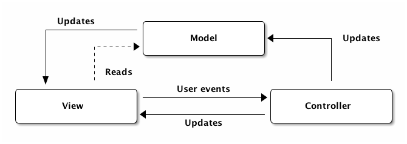
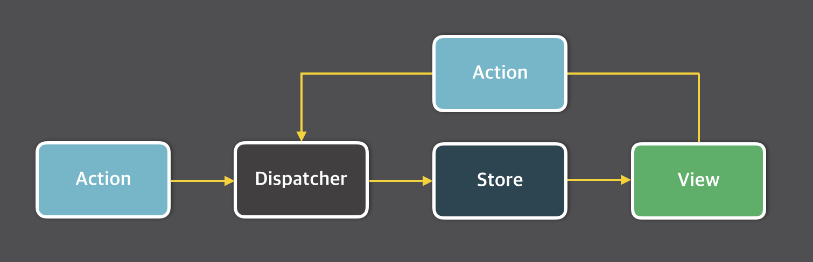
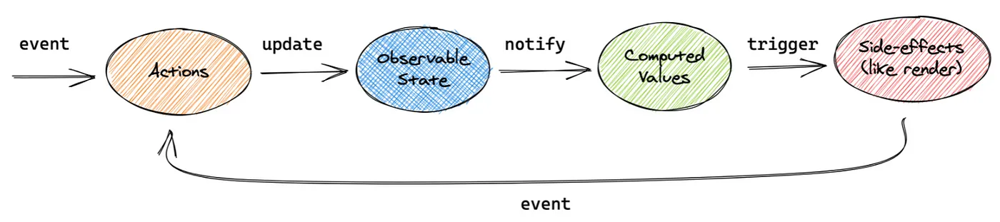
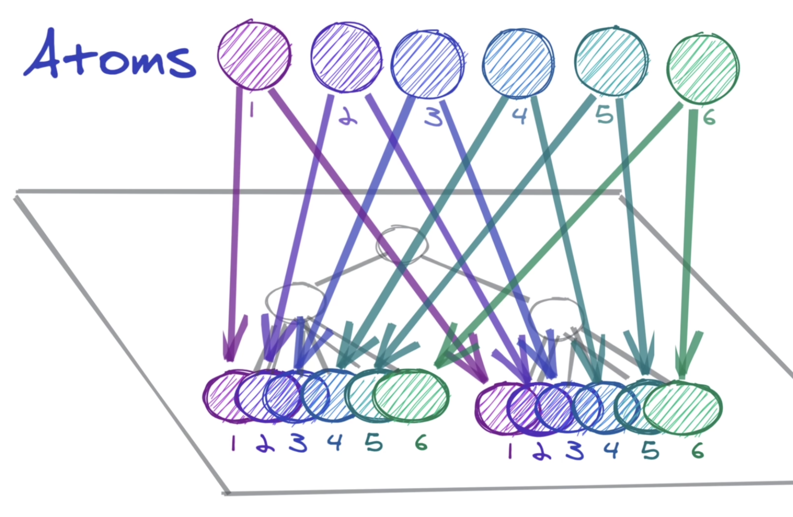

> Context API부터 시작해보는 리액트의 상태 관리 이야기.  
> Flux, Proxy, Atomic에 대해서도 알아봅시다.

&nbsp;

## 리액트 상태 관리, 왜 하는데?

&nbsp;

### 1. 단방향 바인딩

양방향 바인딩을 하는 앵귤러나 뷰와 달리, 리액트는 단방향 바인딩을 지원한다.  
즉, 부모의 상태를 자식으로 전달할 수는 있지만(props) 자식의 상태를 부모로 전달하는 방법은 없는 것이다.

> ~~물려받기만 할 줄 아는 불효자 리액트~~

자식에서 부모의 상태를 바꾸려면 상태를 바꾸는 setState도 자식에게 전달해야 하니,  
props의 개수는 점점 증가하게 된다.

&nbsp;

### 2. props drilling

`ComponentA`, 그리고 A의 자식인 `ComponentB`, 그리고 B의 자식인 `ComponentC가` 있다고 해보자.  
A의 상태값을 B에서는 사용하지 않는데 C에서는 사용한다면,  
우리는 어쩔 수 없이 B에게도 상태값을 props로 전달하게 된다.  

만약 이런 형태의 컴포넌트가 계속 깊어진다면.. 그리고 상태값도 더 많아진다면..  
props drilling으로 꽤나 고생할 수도 있다.


앱의 규모가 커질수록 이런 문제는 더욱 심각해졌고, 그렇게 상태 관리 툴이 나오게 된 것이다!

&nbsp;

## Context API를 사용하면 되잖아?

맞는 말이다!  
Context API를 사용한다면 컴포넌트의 깊이 여부와 무관하게  
데이터가 필요한 컴포넌트에서만 가져다 쓸 수 있다.  

하.지.만. 치명적인 단점이 있었으니..

앱의 규모가 커질수록 Provider의 개수가 많아져서 Provider hell이 발생할 수 있고,

더 큰 문제는, 동일한 Provider 하위에서 context를 구독하는 모든 컴포넌트는  
Provider의 value prop이 바뀔 때마다 모두 리렌더링된다는 것이다.  


위 문제를 해결하기 위해 memo를 사용할 수도 있지만, 부모 컴포넌트가 memo를 사용했다 하더라도  
그 자식이 context를 참조한다면 그 자식의 자식 컴포넌트도 리렌더링이 된다.  

어쨌거나 불필요한 리렌더링은 피할 수 없고, memo를 적절히 활용할 수 밖에 없는 상황에 처해지게 된다.

&nbsp;

그리고 놀랍게도, 근본적으로 **Context API는 상태 관리 도구가 아니다.**

&nbsp;

## 상태 관리란?

상태 관리를 한다고 말 할 수 있으려면, 다음 세 가지 역할을 수행해야 한다.
- 초기값 저장
- 현재값 읽기
- 값 업데이트

따라서 리액트의 useState와 useReducer 훅을 활용하는 것은 상태 관리라고 할 수 있다.  
- 훅을 호출해서 초기값을 저장하고,
- state로 현재값을 읽고,
- setState 또는 dispatch로 값을 업데이트한다.

&nbsp;

공식 문서에도 Context는 props 없이 데이터를 받을 수 있게 해주는 기능이라고 적혀있을 뿐,  
상태 관리를 한다는 내용은 없다.

즉, Context는 만들어진 상태를 단순히 전달할 뿐,  
실질적으로 상태를 관리하는 것은 useState와 useReducer 훅인 것이다.

&nbsp;

이제 본격적으로 상태 관리에 대해 이야기해보...기...전에....

&nbsp;

## 잠깐 MVC와 Flux 이야기를 해보자

MVC 패턴은 유저 인터페이스를 개발하기 위해 고안된 아키텍처로,  
기존 웹 애플리케이션의 대부분은 MVC 패턴으로 구현되었다.



1. View가 Controller에게 이벤트를 보내면,
2. Controller는 Model을 업데이트하고,
3. Model은 View를 업데이트한다.
4. Controller가 View를 직접 업데이트할 수도 있다.
   > 단순히 데이터를 다른 형태로 나타내기 위함 (ex. 정렬)

&nbsp;

MVC 패턴의 특징은 View와 Model 사이의 의존성이 높다는 것인데,  
이는 앱이 커지고 복잡해질수록 유지보수를 어렵게 만들었다.

또한 MVC 패턴에서 데이터 흐름은 양방향으로 이루어지는데,  
이는 단방향 데이터 흐름을 지향하는 리액트와는 맞지 않는 아키텍처였다.

&nbsp;

그렇게 페이스북이 Flux라는 새로운 아키텍처를 내놓게 되는데..



Flux 패턴에서는 데이터가 단방향으로 흐른다.  

1. View가 Dispatcher에게 Action을 보내면,  
2. Dispatcher는 해당 Dispatcher를 등록한 모든 Store에게 Action을 보내고,  
3. Store는 Action을 통해 데이터를 변경하고,  
4. 변경된 데이터는 View에 반영된다.

&nbsp;

## Flux로부터 영감을 얻은 Redux

Redux가 Flux인가? 라고 묻는다면 그럴 수도 있고, 아닐 수도 있다.  
하지만 분명 Flux로부터 영향을 받은 건 분명하다.  

> Redux = Red(ucer) + (fl)ux  
> reducer는 action과 state를 받아 새로운 state로 변환하는 함수다.

Redux는 Flux와는 다른 점들이 분명 많지만,  
Redux는 순수 함수를 통해 더 간단화된 Flux 아키텍처라고 할 수 있을 것 같다.  
[(더 자세한 내용은 공식 문서에서!)](https://ko.redux.js.org/understanding/history-and-design/prior-art/#flux)

&nbsp;

어쨌거나 Redux의 등장으로 많은 불편함이 해소되었다.  
Context API와 달리 Redux의 경우,
1. Redux 자체만으로 상태를 관리할 수 있고,  
2. 스토어의 특정 값이 변화하더라도 해당 값만 구독하고 있는 컴포넌트만 리렌더링이 발생한다.

> 만일 다른 상태 관리 라이브러리와 Redux를 비교하고자 한다면 redux-toolkit과 비교하는 게 맞을 것이다. Redux에서 권장하는 구현 방식이 redux-toolkit이다!

&nbsp;

리덕스의 사용 방법을 간단화해보자면 다음과 같다.
1. 저장할 state와 action을 만들고,
   ```ts
   export const initialState = {
      number: 0
   }

   export const add = () => {
      return {
        type: 'ADD'
      }
   }
   ```
2. action을 토대로 reducer를 만들고,
   ```ts
   export const counterReducer = (state = initialState, action) => {
      switch(action.type) {
        case 'ADD':
          return { ...state, number: state.number + 1 }
        default:
          return state
    }
   }
   ```
3. reducer들을 합치고,
   ```ts
   export const rootReducer = combineReducers({
      counterReducer
   })
   ```
4. rootReducer를 store에 저장하고,
   ```ts
   const store = createStore(rootReducer)
   ```
5. provider를 통해 store에 접근할 수 있게 한 뒤,
   ```tsx
   ReactDOM.render(
      <Provider store={store}>
        <App/>
      </Provider>
      document.getElementById('root')
   );
   ```
6. useDispatch, useSelector를 사용한다.
   ```tsx
   const dispatch = useDispatch()

   const { number } = useSelector(state => state.number)

   const addNumber = () => {
      dispatch(add())
   }

   return (
      <div>
        <span>{count}</span>
        <button onClick={addNumber}>+</button>
      </div>
   )
   ```

&nbsp;

## Redux를 보완한 MobX



1. Action이 실행되면,
2. 상태값이 업데이트되고,
3. 해당 값을 구독하는 곳에 Notify가 되고,
4. 렌더링이 트리거된다.

```tsx
class Counter {
  number = 0;

  constructor() {
    makeAutoObservable(this);
  }

  add() {
    this.number += 1;
  }
}

const counter = new Counter()

function App() {
  return (
    <div>
      <span>{count}</span>
      <button onClick={counter.add}>+</button>
    </div>
  )
}
```

리덕스에 비해 코드량이 훨씬 적고, 상당히 객체지향적인 것을 확인할 수 있다.  
리덕스에서는 리듀서를 정의하고, 리듀서를 위한 액션을 따로 만들어야했지만,  
MobX에서는 Action이 직접 상태를 업데이트할 수 있다.

이렇게 쉽고 간결한 MobX의 최대 단점은.. 커뮤니티가 작다는 것이다.


&nbsp;

## 그리고 나타난 신인, Recoil

Facebook의 Recoil은 Redux의 store과 유사하면서도 다른 atom이라는 개념을 내놓았다.  
Recoil은 Context API 기반으로 구현된 라이브러리지만, 위에서 말한 Context API의 문제점들을 해결해준다.

또한 거대한 보일러 플레이트를 작성해야하는 Redux와 달리,  
(toolkit을 사용한다면 감소하는 부분이긴 하지만)  
Recoil은 react의 useState와 유사하게 사용할 수 있으며, 굉장히 간결하게 작성할 수 있다.  

```tsx
export const numberAtom = atom({
  key: 'number',
  default: 0,
})

function App() {
  const [number, setNumber] = useRecoilState(numberAtom)

  const add = () => {
    setNumber(number + 1)
  }

  return (
    <RecoilRoot>
      <span>{count}</span>
      <button onClick={add}>+</button>
    </RecoilRoot>
  )
}
```

&nbsp;

이때까지 상태 관리를 트리 형태의 2차원적인 관점에서 바라봤다면,  
아톰이라는 개념은 3차원적인 관점이라고 볼 수 있다.



결론적으로, store라는 외부 요인이 아닌 context API 기반으로 되어있다는 것이 Redux와 MobX와의 가장 큰 차이점이라고 할 수 있겠다.

&nbsp;

## 그럼 Zustand랑 Jotai는 뭔데?

Zustand는 Redux처럼 Flux를 사용하는 친구다.  
차이점이라면,
1. SSR을 공식적으로 지원한다.
2. Redux보다 더 간단하고 직관적인 훅 기반의 API를 제공한다.
3. Provider로 감싸지 않아도 된다.

```tsx
export const useCounter = create((set) => ({
  number: 1,
  add: () => set((state) => ({ number: state.count + 1 })),
}))

function App() {
  const { number, add } = useCounter();

  return (
    <div>
      <span>{count}</span>
      <button onClick={add}>+</button>
    </div>
  )
}
```

&nbsp;

Jotai는 Recoil처럼 atomic 개념을 따르는 친구다.  
차이점이라면,  
1. SSR을 공식적으로 지원한다.
2. key를 정의할 필요가 없다.
3. 여러 Provider를 정의할 수 있다. (Provider를 사용하지 않으면 글로벌에 존재하는 atom에 저장된다.)
   > 동일한 atom이 다른 Provider를 참조하면 isolation이 가능하다.
4. store 기능으로 리액트 컴포넌트 밖에서 훅 없이 상태값을 바꿀 수 있다. (하지만 권장하지 않는다.)  

```tsx
export const numberAtom = atom(0)

function App() {
  const [number, setNumber] = useAtom(numberAtom)

  const add = () => {
    setNumber(number + 1)
  }

  return (
    <RecoilRoot>
      <span>{count}</span>
      <button onClick={add}>+</button>
    </RecoilRoot>
  )
}
```

> 그리고 결정적으로 Recoil은.. 아직도 facebookexperimental 하위에 있으며,  
> 아직도 열려있는 여러 이슈들을 보고 있자면,  ~~페이스북~~ 메타에게 버려진 게 아닌가 하는 생각이 든다..


&nbsp;

> 여튼 짧게 정리해보자면..!  
> - Flux: Redux, Zustand  
> - Proxy: Mobx, Valtio  
> - Atomic: Recoil, Jotai

&nbsp;

## 그래서 뭘 써야 하나요?

atomic 패턴을 사용하고 싶다면 jotai를,  
flux 패턴을 사용하고 싶다면 redux-toolkit이나 zustand를 사용하면 된다는 것이 결론!  

어떤 패턴, 어떤 라이브러리가 더 좋냐는 것에 대해서는 정답이 없다고 생각한다.  
프로젝트마다 규모도 다르고 성격도 다르기 때문에,  
프로젝트에 알맞은 라이브러리를 잘 선택하는 것이 정답이라 생각한다.


굳이 RTK(redux-toolkit)과 zustand를 비교해야겠다면,  
서버 상태 관리 라이브러리가 큰 갈림길이 될 것 같다.  
RTK는 RTK Query와 함께 사용되고, Zustand는 React-query와 상당히 조합이 괜찮다.

> recoil, zustand, jotai 모두 비동기 처리를 지원하긴 하지만, 현재로서는 infinite query, mutation, optimistic updates 등 react-query에서 제공하는 기능이 더 압도적으로 보인다.

&nbsp;

### 저는 개인적으로..
react-query + jotai/zustand 조합을 좋아하는 편이다!

이제껏 경험한 대부분의 프로젝트에서, 클라이언트 상태 관리에 비해 서버 상태 관리가 더 큰 비중을 차지했었다. 클라이언트 내부의 상태를 관리하는 것보다는 서버에서 받아온 데이터들에 대한 상태 관리가 더 중요한 경우가 많았다.  

jotai와 zustand에서도 비동기 상태 관리에 관한 기능을 제공하지만,  
보다 다양한 기능과 커스텀을 제공하는 react-query를 주로 사용한다.  
개인적으로도 클라이언트 상태 관리와 서버 상태 관리를 분리하는 걸 선호한다 :)

&nbsp;

클라이언트 상태 관리의 경우, 상태 관리의 경우가 크게 두 가지로 나뉜다.  
top-down 형식의 상태 관리와,  
> ex) 최상위 메뉴에서 선택된 어떤 값이라거나, 유저 및 권한 정보에 관한 상태 관리
bottom-up 형식의 상태 관리.
> ex) 하위 컴포넌트의 모달에 관한 상태 관리

&nbsp;

top-down에는 flux가, bottom-up에는 atomic이 잘 맞다고 생각한다.  
그래서 최상위에서 선택된 어떤 아이템이나, 유저 및 권한에 대한 핸들링이 개발 시 우선 사항이라면  
zustand를 사용한 뒤 이후 상태들에 따라 zustand를 유지하거나 jotai를 부분적으로 도입하고,  
그렇지 않은 경우라면 jotai로 가볍게 아톰을 선언해서 사용하는 편이다.

> zustand를 사용하든 jotai를 사용하든, props drilling이 심하지만 않다면 그냥 props로 넘기는 편이다.  
> (정말 common하게 사용되는 경우가 아니라면 굳이라는 생각!)

&nbsp;

jotai와 zustand와 같은 훅 기반의 API는 사용성도 좋을 뿐만 아니라,  
리액트의 생명주기와 동일하게 상태를 가져갈 수 있다는 장점도 가진다고 생각한다.  

Redux와 MobX의 경우, 상태가 리액트의 범위 밖에서 정의되고 핸들링된다.  
더욱 복잡한 상태 관리가 가능하다는 장점이 될 수도 있지만,  
디버깅 및 추적이 어려워질 수밖에 없다는 단점이 될 수도 있다.

> Zustand와 Jotai에서도 store라는 기능을 사용하면 리액트 없이 사용할 수 있지만, 어떤 사이드 이펙트가 발생할지 모른다는 점에서 store 지양하는 편이다.

&nbsp;


> 농담이에요 다른 의견 환영해요,,

```toc
```