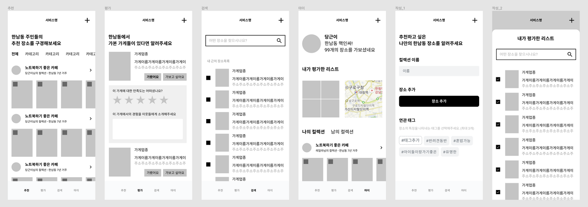
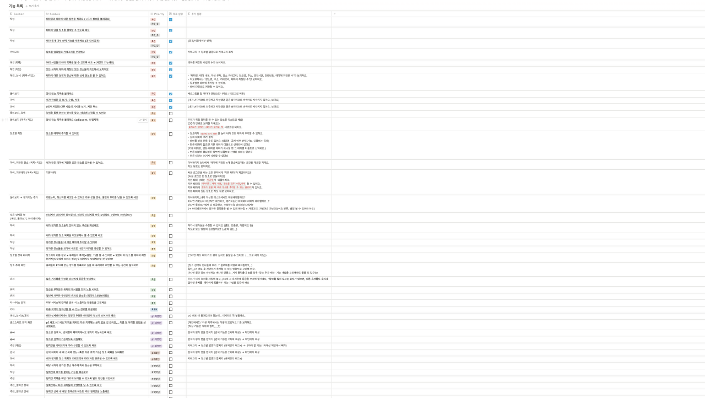
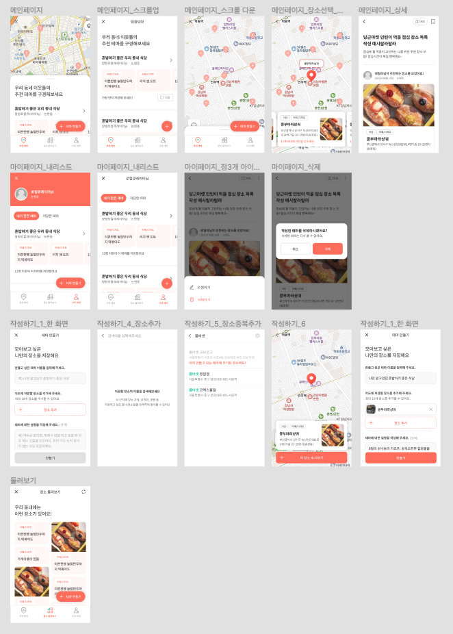
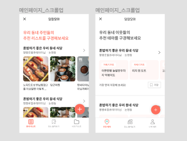
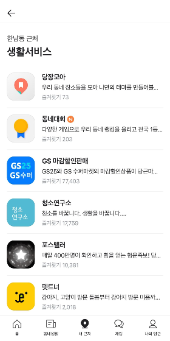

## 팀도 꾸려졌으니, 아이디어 선정해보자!
 
세 명으로 구성된 총 6개의 팀. 우리는 제공받은 기획안들을 훑어보며 서로 겹치지 않는 선에서 아이디어를 선정해야 했다. 이 과정에서 우리 팀은 큰 난관을 겪었다.

2 지망으로 골랐던 '플리마켓' 아이디어로 결정되었는데, 아이디어 구체화를 하다 보니 서비스가 생각보다 너무 크다고 느끼게 되었다. 삼사 주 내로 런칭을 해야 피드백을 받고 개선할 시간이 생길 것이라 생각했고, 그러기에는 플리마켓 아이디어가 상당히 까다롭게 느껴졌다.

"초반에 빠르게 피봇을 하자."

결론을 내렸지만 쉽게 되지 않았다. 새로 제안한 아이디어들이 또 피봇 되기 부지기수였고 그렇게 우리는 팀 이름도 정해지지 않은 채 일주일을 보내게 되었다.

일주일 동안 우리 팀은 참 많은 감정을 느꼈다. 하지만 확실한 건, 이 과정을 통해 우리가 보다 더 끈끈해졌다는 것이다. 나중 가서 일이 틀어지느니 빠르게 겪어보는 게 나을 거야, 우리는 서로를 다독이며 파이팅을 외쳤다.

그렇게 고난 끝에 만난 서비스, 당장모아였다.

> 당근마켓에서 알게 된 장소 정보를 저장하고 모아볼 수 있는 공간이 없어요!

현재 당근마켓 앱 내에서 동네 장소들을 검색하고 찾아볼 수는 있지만 저장하는 기능은 없다. 물론 동네생활에서 시도해볼 수도 있는 기능이지만, 우리는 좀 더 큐레이션에 집중하여 서비스를 단독으로 구체화해보고자 했다. 아래는 우리 1팀을 맡아주신 당근마켓의 PM 헤일리가 제안해주신 예시이다.



광고성 게시글이 아닌, 믿을 수 있는 유저로부터 추천 장소 모음을 제안받을 수 있다면 매력적이지 않을까? 그렇게 우리는 나만의 지도를 저장하고 이웃에게 공유하는 플로우를 그려보게 되었다. 원하는 장소를 자유롭게 테마로 묶어 저장하고, 지도 형태로 동네 이웃들에게 공유할 수 있는 서비스. 잘만 된다면 지속적으로 사용성 있는 서비스가 될 것 같다는 예감이 들었다.

&nbsp;

## 아이디어도 정해졌으니, 피쳐를 정해보자!



모든 피쳐들을 정의하고 우선순위를 P0부터 P3까지 나누게 되었다. P0까지 빠르게 개발하여 첫 배포를 진행하고, 유저 반응을 분석하며 P1, P2를 계속해서 업데이트해나가기로 했다.

&nbsp;

## 린하게? 너무 어려워!
 
당근마켓은 정말 린한 조직이다. 3개월 만에 서비스를 런칭하고 분석 및 업데이트까지 해야 하니 우리 또한 린하게 갈 수밖에 없었다. 양파를 잘게 다지는 건 눈만 아프고 말았지만 프로젝트를 잘게 나누는 건 심신이 고통스러웠다. 시간은 얼마 없는데 와이어프레임이 나와야 마크업을 하고 DTO가 정해져야 로직을 짤 수 있으니, 초반엔 한가하다 막바지에 시간에 쫓기는 반복을 두 달 동안 다섯 번은 반복한 것 같다. 기획에 너무 많은 시간을 쓸 수 없으니, 기획이 확실하게 잡히지 않은 채로 개발을 하다 보니 디자인과 기능이 수십 번은 갈아엎어졌다. 뼈저리게 즐거운 시간이었다.

이제껏 경험한 애자일 중 단연코 최고였다. 계속 오프라인으로 출근하여 팀원들과 작업했기에, 애자일에서 가장 중요한 협력과 피드백 주고받기를 잘 해낼 수 있었다. 하지만 그럼에도 방향성이 뚜렷하지 않은 채 린하게 작업하는 것은 너무나도 힘든 과정이었다.

&nbsp;

## 죽이 되든 밥이 되든, 일단 배포해보자
 
당근마켓의 공동 대표 폴이 해주신 말씀이다.

**"각 잡고 몇 년 동안 개발해서 런칭한 서비스는 잘 안됐어요.**  
**오히려 2-3주 만에 런칭한 서비스가 다 성공했지.**  
**우선은 유저에게 보여줘 봐요. 그래야 빠르게 피드백을 받고 고쳐나갈 수 있는 거니까."**

그래. 일단은 배포를 해보자. 그래야 뭔 결과라도 나와서 기능을 또 넣든가 말든가 하지. 그렇게 우리의 P0 프로덕션이 확정되었다.



P0임에도 생각보다 서비스의 크기가 엄청났다. 하지만 이미 시작된 일, 그렇게 와이어프레임이 어느 정도 완성된 후 1-2주 만에 개발을 완성하여 배포를 진행했다.

이렇게 글로 보니 뚝딱 만들어진 것 같지만, 엄청난 고민들이 녹아들어 간 결과물이다.

> '어떻게 해야 테마라는 키워드를 이해하기 쉽게 만들 수 있을까?'
> '생각보다 테마를 만드는 거에 큰 장벽이 있는데, 원인이 무엇일까?'
> '장소가 잘 떠오르지 않는 걸까? 그럼 동네 장소들을 랜덤으로 보여주는 기능을 넣어볼까?'
> '장소를 저장한 후 공통점을 발견하면 그때 테마를 만들 수 있는 기능을 넣어볼까?'

&nbsp;

## 그래도 계속된 험난한 여정

당장모아는 당근마켓에서 사용되는 내부 api를 쓰고 있다. 당근마켓의 동네생활에서 보면 장소 정보가 함께 있는 경우를 종종 볼 수 있는데, 이 데이터를 활용하고자 플레이스팀과 논의하여 api를 제공받을 수 있게 되었다. 하지만 큰 문제가 있었다. 내부 데이터에 가게 사진이 별로 없다는 것. 따라서 처음엔 사진을 강조하는 뷰였지만 이후 수정하게 되었다.



&nbsp;

## 어디에다 어떻게 배포했냐고?

[당근마켓 위젯](https://partner.daangn.com/docs/background)

MVP 인턴십은 당근마켓의 써드파티팀과 가까운 관계를 갖고 있다. 당근마켓 내부 미니앱의 형태로 서비스를 런칭하기 때문에 당근마켓 위젯을 활용하여 다양한 오픈 API를 사용하고 있다 덕분에 웹뷰를 앱으로 배포하는 데에 관한 지식 없이도 쉽게 띄울 수 있었다.



첫 배포가 이루어진 후, P0, P1을 거쳐 퍼널 분석을 진행하면서 다른 A/B 테스트 및 유저 인터뷰도 함께 진행했다. 그에 대한 이야기도 앞으로 간략하게 풀어나가 볼 예정이다.

```toc
```