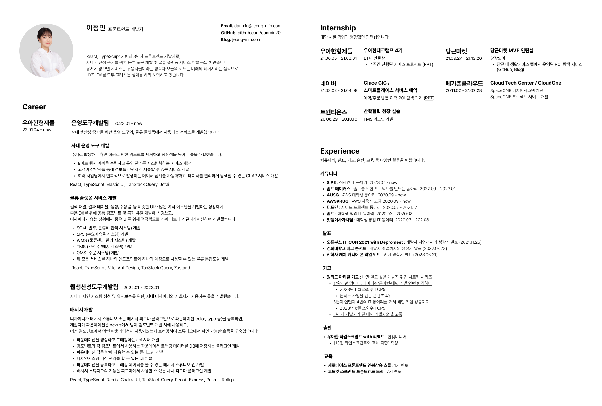
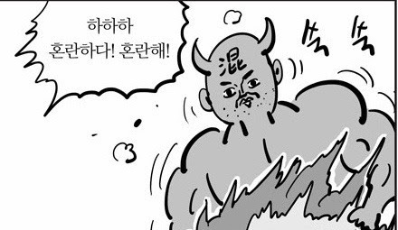
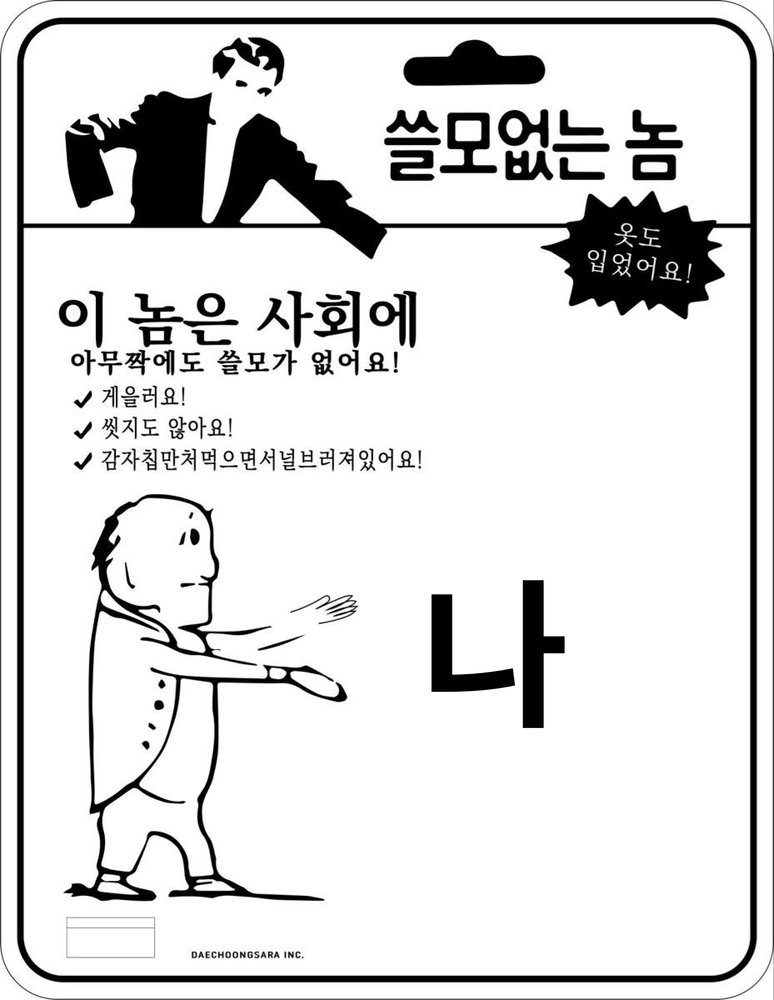
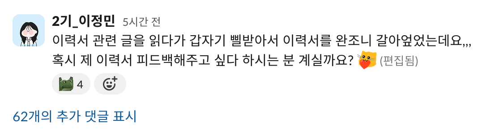
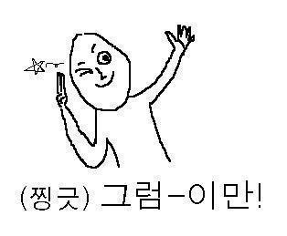

[지난 글](https://www.jeong-min.com/60-to-be-a-developer/)에 이런 문장을 썼다.
> 그렇게 내 첫 이력서로부터 취업까지는 2년이 넘는 기간이 있었고, 그 동안 내 이력서는 정말 많이 탈바꿈했다.
그래서 오랜만에 판도라의 상자를 한 번 열어보기로 마음 먹었고,  
마침 최근 이력서 업데이트도 한 번 했으니 이력서를 주제로 글을 써보기로 했다.


&nbsp;

## 나의 이력서와 포트폴리오 변천사

- [아이클라우드를 샅샅이 뒤져 찾은 자료들](https://www.figma.com/file/NGxoWcOXGqBmqAISMLxtqG/Untitled?type=design&node-id=0%3A1&mode=design&t=47znlFUPLWITmvx6-1)
  > 누구에게 보여주기 민망할 정도지만,,  
  > 벌써 4년 전 이야기니까 대학생의 귀여운 패기 정도로 봐주시길 바랍니다,,
- [벨로그 짭플루언서로 만들어 준 포트폴리오 사이트](https://first-portfolio.jeong-min.com/)
- [힙한 거 만들고 싶어서 만든 두 번째 포트폴리오 사이트](https://second-portfolio.jeong-min.com/)

&nbsp;

현재는 포트폴리오는 다른 거 다 치우고 이 블로그 하나고,  
이력서는 아래와 같다.


> [링크에서 더 자세히 볼 수 있다.](https://www.figma.com/file/dtkCl6G7G5DVe18DN2LWny/%EC%9D%B4%EC%A0%95%EB%AF%BC-%EC%9D%B4%EB%A0%A5%EC%84%9C?node-id=0%3A1)  

&nbsp;

놀랍게도, 그 전 이력서에서 현재의 이력서로 탈바꿈하는 데는 반나절이 채 걸리지 않았다.  
다 미리미리 정리해 놓은 내용이 있었던 덕분이다.

사내 중간/연말 평가 때 작성해 놓은 것들과 기존에 꾸준히 작성했던 이력서가 큰 도움이 되어주었다.  
그러니 이력서는 미리미리 잘 정리해 놓도록 하자!

여튼 이력서를 쭉 개선해 오면서 느낀 점은 아래와 같다.

&nbsp;

## 빼야 할 내용

&nbsp;

### 불필요한 정보

생년월일, 학력, 수상내역, 취득 자격증 등 개발과 직접적인 상관이 있는 게 아닌 이상 과감하게 뺐다.  
궁금하지도 않은 TMI인 것 같아서 이름, 이메일, 깃허브, 블로그 정도만 남겨두었다.

&nbsp;

### 불필요한 기술 스택

**1. 이건 기술 스택이 아니다**
   
할 줄 아는 건 뭐라도 다 쓰고 싶은 마음도 이해한다.  
하지만 GitHub, Git, Notion, Slack은 기술 스택이 아니다.


이런 것들은 과감하게 빼자.

**2. 못 하는 걸 굳이 쓸 필요는 없다**

같은 맥락이다. 본인은 프론트엔드 개발 신입 포지션으로 지원했는데  
이력서에 Spring, Java, Kotlin, Swift, Go, MySQL 등이 쓰여있으면..  
면접관이 얼마나 혼란스럽겠는가.  



그러니 면접 때 탈탈 털릴 것 같은 것들은 사전에 빼자.

짧은 소개글에 써놓은 내 기술 스택은 단 두 가지다.  
리액트와 타입스크립트.  
더 구체적인 기술 스택은 프로젝트 별로 간략히 작성했다.

&nbsp;

### 너무나 당연한 이야기

프론트엔드 개발자라면 당연한 내용들도 과감하게 뺐다.  
HTML, JS, TS, CSS는 아는 게 당연하다.  
상태관리도 할 줄 아는 게 당연하다.  
리액트 또는 뷰 쓸 줄 아는 게 당연하고,  
api 연결 할 줄 아는 것도 너무나 당연하다.

꾸역꾸역 쥐어짜내서 쓰지 말자.  
이런 내용들은 전혀 메리트가 없다. 누굴 뽑아도 할 줄 알 것 같은 내용은 쓸모가 없다.  



&nbsp;

## 보여줘야 할 내용

> 이건 나도 앞으로도 계속 보여줄 수 있도록 개선해 나가야 하는 부분이다.

### 남들과는 달라 난 달라

나만이 가지고 있는 무기를 잘 보여줄 수 있도록 해야 한다.  
커뮤니케이션 능력이 뛰어나다면 커뮤니케이션을 통해 업무 개선을 이뤄낸 경험을,  
UI/UX에 관심이 있다면 스스로 유저 경험에 큰 역할을 기여했던 경험을 보여줄 수 있도록 하자.


> 갈고 닦은 지옥참마도를 보여주자.

&nbsp;

### 구체적으로 한 것

그냥 한 일을 나열하다보면 또 너무나 당연한 이야기가 될 수밖에 없다.  
api 연동 어쩌구.. 공통 컴포넌트 어쩌구.. 빠른 시일 내에 개발 어쩌구..  
구체적이고 직관적으로 어떤 걸 어떻게 개선했는지,  
내가 팀 또는 프로젝트 안에서 명확히 어떤 것들을 기여했는지 작성해보도록 하자.

&nbsp;

## 피드백은 꼭 받자



> 이 또한 여러 커뮤니티를 하면 좋은 점이다.

본인 입장에서는 직접 참여했던 프로젝트니까 간결히 적어도 이해할 수 있지만,  
생판 처음 보는 면접관은 이게 도통 무슨 내용인지 모를 수도 있다.  
제 3자의 입장에서, 시니어의 입장에서, 면접관의 입장에서 피드백을 받을 수 있다면  
다다익선으로 받아보도록 하자.

그러니 제 피그마 이력서에 자유롭게 코멘트로 피드백 남겨주신다면,,


&nbsp;

## 도움이 되었던 레퍼런스

> 저도 두고두고 볼 목적으로 모아놓고 갑니다 총총

- [5년 만의 이력서 다시 쓰기](https://www.winterjung.dev/resume-rewriting-for-developer/)
- [Wonny | 데이터로 일하는 개발자](https://wonny-log.notion.site/Wonny-Public-c2f8051bfb574f349406a30d2bc71a45)
- [청천향로(이동욱) | 우아한형제들(배달의 민족) 개발자](https://jojoldu.github.io/)
- [이현섭 | 비바리퍼블리카(토스) 개발자](https://hyunseob.github.io/resume/)



```toc
```