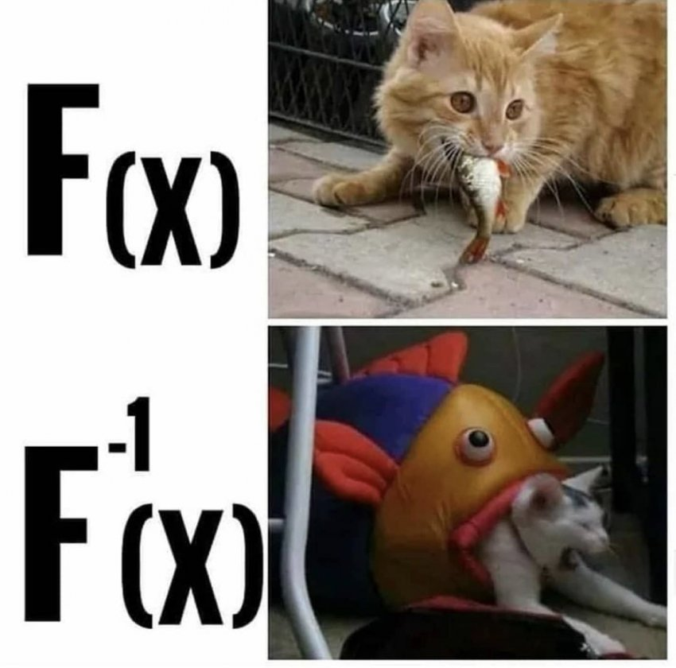

순수 함수요?  
자바스크립트로 함수형 프로그래밍이 가능하다고요?  
자바스크립트는 프로토타입 기반 프로그래밍 언어 아닌가요?


맞는 말이다. 자바스크립트는 프로토타입 기반 프로그래밍 언어로, 객체지향 프로그래밍 언어의 한 갈래다.  
하지만 순수 함수형 프로그래밍 언어가 아닌 자바나 자바스크립트로도 함수형 프로그래밍은 가능하다!  
반드시 스칼라와 같은 함수형 프로그래밍 언어를 사용해야만 함수형 프로그래밍을 한다고 말 할 수 있는 것은 아니다.

자바스크립트를 좋은 함수형 프로그래밍 언어로 보기는 어렵지만,  
몇 안 되는 함수형 기능을 살펴보도록 하자.

&nbsp;

## 순수 함수란?

순수 함수는 부수 효과가 없는 함수이며, 부수 효과를 잘 관리하는 것은 함수형 프로그래밍의 가장 큰 목적이다.
**놀랍게도** 우리는 모두 순수 함수와 가까이 지낸 적이 있는데..!    
바로 학창 시절 배웠던 수학의 함수가 모두 순수 함수다.


&nbsp;

함수 f:X -> Y 는, 집합 X의 원소를 함수 f에 대입하면 집합 Y의 원소가 나온다는 것을 의미한다.  
이 함수는 외부의 그 어떤 값도 변경하지 않으며, 동일한 인자가 주어졌을 때 항상 동일한 결과를 반복한다.  
즉, 외부 상태로부터 독립적인 순수 함수인 것이다.



&nbsp;

## 자바스크립트의 순수 함수

즉, 순수 함수는 내부적인 상태를 가지기에 동일한 인자에 대해 항상 동일한 결과를 내놓을 수 있는 것이다.

```js
let outerNum = 0

function impureAdd(a, b) {
  outerNum = a + b
  return outerNum
}

function pureAdd(a, b) {
  let innerNum = 0
  innerNum = a + b
  return innerNum
}
```

위의 예시에서, `impureAdd`는 실행마다 외부 상태인 `num`의 값을 변경하며, 매번 다른 결과를 내놓게 된다.  
반면 `pureAdd`는 동일한 인자에 대해 동일한 결과를 보장할 수 있다.  
따라서 `impureAdd`는 비순수 함수, `pureAdd`는 순수 함수로 볼 수 있다.

&nbsp;

한번 자바스크립트의 Array 내장 메서드를 위주로 순수/비순수 함수를 살펴보도록 하자.

&nbsp;

## Array 순수 메서드

### map, filter, reduce, flatMap, forEach, slice, every, forEach 등등

기본적으로 위 함수들은 배열을 인자로 복사본을 만든 후 액션을 취하여 새로운 값을 반환하는 순수 함수다.
> 하지만 위 함수들을 사용하더라도 '외부 상태를 건드리는 행위'를 한다면 그건 더 이상 순수 함수가 아니다.


여기서 forEach가 제일 덜 순수 함수 다운 메서드가 아닐까 싶다.  
**동일한 인자**에 대해 **동일한 반환값**을 가지는 것이 순수 함수인 반면,  
forEach의 경우 단순히 배열을 순회하며 액션을 취할 뿐, 반환하는 값이 없기 때문이다.  

반환값이 없는데 액션을 취한다는 것은,  
액션이 단순 출력과 같은 동작이 아니라면 다른 참조 값을 조작하는 행위일 수밖에 없고,  
이는 함수형 프로그래밍과는 맞지 않는 방향이다.

&nbsp;

## Array 비순수 메서드

### splice, push, sort, reverse 등등

위의 "Array 순수 메서드"들과 달리, 이 메서드들은 인자로 받은 외부 배열 자체를 변경한다.  
따라서 사이드 이펙트를 유발할 수 있으니 주의해서 사용해야 한다. (복사본을 만드는 것도 좋은 방법이다.)

```js
const months = ['March', 'Jan', 'Feb', 'Dec']
const sortedMonths = [...months].sort()
```

&nbsp;

### 비순수 함수가 나쁜 건가요?

그렇지 않다!  
> 비순수는 불순이 아니다!
함수형 프로그래밍에서도 중요한 건 부수 효과를 잘 관리하는 것이지 부수 효과를 전부 다 없애는 것은 아니다.  
순수 함수만으로는 ajax 호출이나 dom 조작을 할 수 없다.  
단지 사이드 이펙트가 발생할 수 있다는 것이니, 알잘딱깔센!


```toc
```