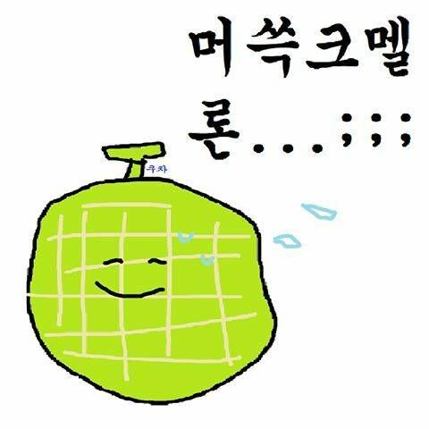

4월 25일, 리액트 19 베타가 공식적으로 나왔다!  
리액트 19에서는 뭐가 달라졌는지 이번 글에서는 Hook 위주로 한 번 살펴보도록 하자.


&nbsp;

## 들어가기 전에,

&nbsp;

### 리액트 19 설치하기 (2024/05/03 기준)

1. React 및 React DOM 최신 버전 설치
```shell
npm install react@beta react-dom@beta
```

2. TypeScript를 사용한다면 types 설치
```json
// package.json
{
  "dependencies": {
    "@types/react": "npm:types-react@beta",
    "@types/react-dom": "npm:types-react-dom@beta"
  },
  "overrides": {
    "@types/react": "npm:types-react@beta",
    "@types/react-dom": "npm:types-react-dom@beta"
  }
}
```

&nbsp;

### 리액트의 비동기 처리

리액트 19에서는 전체적으로 비동기 처리와 관련된 훅이 많이 나온 것을 볼 수 있다.  
리액트에서 흔히 사용되는 코드 패턴 중 하나는 비동기 요청을 처리한 다음 응답에 따라 상태를 업데이트하는 것인데,  
이 과정에서 신경써야 할 몇 가지가 있다.

&nbsp;

**1. Pending 상태**  
api 요청이 진행중이라는 것을 노출하기 위한 상태다.

**2. Optimistic 상태**  
api 요청이 성공할 것이라고 낙관적으로 보고, 응답을 기다리지 않고 미리 결과값을 노출하기 위한 상태다.

**3. 에러 핸들링**  
api 요청 단계에서 에러가 발생했을 때 대처하기 위한 개념이다.

**4. Forms**  
post/put 요청은 form 엘리먼트와 함께 많이 사용되곤 한다.

&nbsp;

그리고 위 네 가지와 관련해서 리액트 19에서는 비동기 트랜지션 함수를 사용하는 훅들을 제공하며,  
이런 비동기 트랜지션을 사용하는 함수를 **액션(Actions)** 이라고 부른다.  


&nbsp;

리액트 19 이전에는 다음과 같은 방식으로 코드가 짜였다.

```tsx
const updateName = async (name: string) => {
  return new Promise((resolve) => {
    setTimeout(() => {
      resolve(window.alert(`Name updated to ${name}`));
    }, 2000);
  });
};

function UpdateName() {
  const [name, setName] = useState("");
  const [newName, setNewName] = useState("");
  const [isPending, setIsPending] = useState(false);

  const handleSubmit = async () => {
    setIsPending(true);
    await updateName(name);
    setNewName(name)
    setIsPending(false);
  };

  return (
    <div>
      <p>
        Your name is: {newName}
        {isPending && " (loading..)"}
      </p>
      <input value={name} onChange={(event) => setName(event.target.value)} />
      <button onClick={handleSubmit} disabled={isPending}>
        Update
      </button>
    </div>
  );
}
```

이제 위 코드를 리액트 19의 새로운 훅을 사용해서 탈바꿈시켜보자!


&nbsp;

## useTransition

Pending 상태와 관련된 훅이다.  

```tsx
function UpdateName() {
  const [name, setName] = useState("");
  const [newName, setNewName] = useState("");
  const [isPending, startTransition] = useTransition();

  const handleSubmit = async () => {
    startTransition(async () => {
      await updateName(name);
    });
    setNewName(name)
  };

  return (
    <div>
      <p>
        Your name is: {newName}
        {isPending && " (loading..)"}
      </p>
      <input value={name} onChange={(event) => setName(event.target.value)} />
      <button onClick={handleSubmit} disabled={isPending}>
        Update
      </button>
    </div>
  );
}
```

`isPending` 상태값을 바꿔줄 필요 없이, `startTransition`에서 액션으로부터 Pending 상태 값을 가져올 수 있게 되었다.  

&nbsp;

## useActionState

액션을 사용하는 흔한 케이스들을 쉽게 다룰 수 있게 해주는 훅이다.  

```ts
const handleSubmit = async (_prevState: string, queryData: FormData) => {
  const newName = queryData.get("name") as string;
  await updateName(newName);
  return newName;
};

const [data, submitAction, isPending] = useActionState(handleSubmit, "");
```

useActionState 훅은 두 가지 아이템이 들어있는 배열을 리턴한다.  
첫 번째 요소는 폼의 현재 상태, 두 번째 요소는 액션으로 \<form> 태그에서 action prop으로 전달할 수 있는 값이다.  

폼의 현재 상태는 처음에는 설정한 초기값이었다가 폼이 제출된 후에는 액션에서 리턴하는 값이 된다.

> 사실 위 훅은 Canary 릴리즈에서 useFormState으로 소개되었는데, useActionState으로 이름이 바뀌었다!

그렇다면 form과 함께 위 코드를 사용해보자!

&nbsp;

### \<form> action

리액트 19에서는 \<form>의 피쳐가 변경되었다.  
\<form>, \<input>, \<button> 요소의 action 및 formAction props로 함수를 전달해서,  
액션을 사용하여 폼을 제출할 수 있다.

```tsx
<form action={actionFunction}>
```

즉, 위의 useActionState 예시 코드와 함께 사용해본다면 아래와 같다.

```tsx
function UpdateName() {
  const handleSubmit = async (_prevState: string, queryData: FormData) => {
    const newName = queryData.get("name") as string;
    await updateName(newName);
    return newName;
  };

  const [data, submitAction, isPending] = useActionState(handleSubmit, "");

  return (
    <form action={submitAction}>
      <p>
        Your name is: {data}
        {isPending && " (loading..)"}
      </p>
      <input name="name" />
      <button type="submit">Update</button>
    </form>
  );
}
```

&nbsp;

## useFormStatus

그리고 위의 form과 함께, form 내부의 컴포넌트에서 사용할 수 있는 훅이다.  
useFormStatus 훅은 폼의 마지막 제출에 대해서 네 가지의 정보를 제공한다.

```ts
const { pending, data, method, action } = useFormStatus();
```

이전의 코드와 함께 써본다면 아래와 같다.

```tsx
function SubmitButton() {
  const { pending } = useFormStatus();

  return (
    <button type="submit" disabled={pending}>
      Update
    </button>
  );
}

function UpdateName() {
  const handleSubmit = async (_prevState: string, queryData: FormData) => {
    const newName = queryData.get("name") as string;
    await updateName(newName);
    return newName;
  };

  const [data, submitAction, isPending] = useActionState(handleSubmit, "");

  return (
    <form action={submitAction}>
      <p>
        Your name is: {data}
        {isPending && " (loading..)"}
      </p>
      <input name="name" />
      <SubmitButton />
    </form>
  );
}
```

&nbsp;

## useOptimistic

api 요청이 성공할 것이라고 낙관적으로 보고, 응답을 기다리지 않고 미리 결과값을 노출하기 위한 훅이다.  
api 요청이 진행 중인 동안에는 임시로 설정한 값으로 렌더링되고,  
업데이트가 완료되거나 오류가 발생하면 리액트가 자동으로 인자로 넣어준 상태로 다시 바뀐다.

```tsx
function UpdateName() {
  const [name, setName] = useState("");
  const [optimisticName, setOptimisticName] = useOptimistic(name);

  const handleSubmit = async (_prevState: string, queryData: FormData) => {
    const newName = queryData.get("name") as string;
    setOptimisticName(newName);
    await updateName(newName);
    setName(newName);
    return newName;
  };

  const [_, submitAction, isPending] = useActionState(handleSubmit, "");

  return (
    <form action={submitAction}>
      <p>
        Your name is: {optimisticName}
        {isPending && " (loading..)"}
      </p>
      <input name="name" />
      <button type="submit">Update</button>
    </form>
  );
}
```

optimisticName을 사용하기 전에는 `updateName`이 완료된 후에야 변경된 이름이 노출되었지만,  
이제 네트워킹 요청을 다 기다리지 않고도 변경될 값으로 미리 보여줄 수 있게 되었다.

&nbsp;

### 잠깐만요!

```ts
const [optimisticName, setOptimisticName] = useState(name);
```
🤔 **"이렇게 작성해도 되지 않나요?"**

언뜻 보기에는 될 것 같지만, useState을 사용할 경우 렌더링 시점은 `handleSubmit` 완료 후가 되기 때문에  
await 전에 `setOptimisticName`을 해주더라도 변경된 값이 노출되지 않는다.

&nbsp;

😲 **"어라, 내용이 뭔가 빠진 것 같은데요?"**

리액트 19에서 새로 나온 훅에 관한 글이라면서, 왜 use가 없냐고?  
그야 use는 훅이 아닌 리액트 19의 새로운 API이기 때문이다!!  
(문서 읽어보기 전까지는 이름만 듣고 나도 당연히 훅인줄..)



훅을 제외한 나머지 새로운 기능들은 다음 글에서 알아보도록 하자! 👋

```toc
```