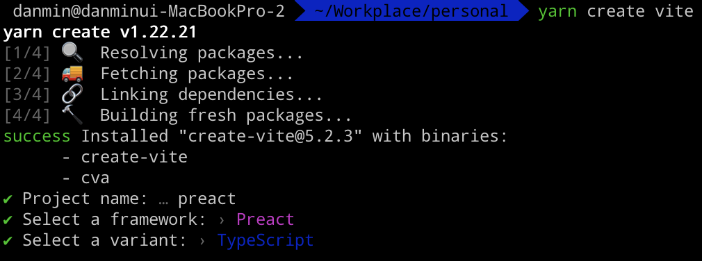

> Sign을 보내~ Signal 보내~ 찌릿 찌릿 찌릿 찌릿

&nbsp;

Signals 라는 개념을 들어본 적이 있는가?!  
평소 리액트와 뷰만 써왔다면 처음 들어보는 단어일 수도 있다.

> 글에서는 시그널(signal), 단수형으로 표현할 예정이다.  
> 한국인들에겐 언제나 단수형이 익숙한 법!

&nbsp;

## 시그널이란?

시그널은 애플리케이션에 상태(state)를 추가하는 방법이다.  
리액트의 상태가 변경될 경우 앱이 매번 리렌더링되는 반면,   
시그널 값이 변경될 경우 정말 변경이 이루어지는 UI에서 업데이트가 이루어진다.  
**렌더링도 디핑도 필요없이 말이다!!**


&nbsp;

이 시그널이라는 개념은 Preact, Angular, Solid.js를 써본 사람이라면 들어봤을 것이다.  
Preact에서 useState 훅과 signals를 모두 제공하니, 한번 Preact의 시그널을 살펴보자!

&nbsp;



> vite를 사용해서 Preact + TypeScript 프로젝트를 바로 만들 수 있다!

&nbsp;

## Preact의 시그널

자바스크립트에서, 값은 직접적으로 관찰될 수 없기 때문에 값의 변경에 대응하는 것은 꽤나 골 아픈 문제다.  
보통은 값을 변수에 저장하고 계속해서 변경 여부를 확인하곤 하는데, 이는 상당히 번거로운 방법이다.  
이때 이상적인 해결 방법을 시그널이 제공해준다!


&nbsp;

시그널은 value라는 속성을 가진 객체다.  
즉 시그널의 value가 변경되더라도, 시그널은 항상 동일한 객체다.

Preact에서 시그널을 props 또는 컨텍스트로 전달하면 시그널에 대한 참조만 전달된다.  
컴포넌트는 시그널만 알 뿐 시그널의 value는 모르기 때문에,  
value에 직접 접근하지 않는다면 value가 변경되더라도 리렌더링은 발생하지 않는다.

한 번 간단한 카운터 예제로 알아보자!


&nbsp;

### 1. Preact의 useState

```tsx
export function App() {
  const [count, setCount] = useState(0);

  return (
    // state에 접근하는 부분이 모두 리렌더링됨
    <div>
      Counter
      <Counter count={count} setCount={setCount} />
    </div>
  );
}
```
```tsx
export function Counter({
  count,
  setCount,
}: {
  count: number;
  setCount: Dispatch<StateUpdater<number>>;
}) {
  const increment = () => {
    setCount((prev) => prev + 1);
  };

  return (
    <div>
      <p>Count: {count}</p>
      <button onClick={increment}>click me</button>
    </div>
  );
}
```

위 코드에서는 **state를 선언한 곳과 실제 state를 변경해서 노출하는 곳 모두가 리렌더링된다.**

&nbsp;

### 2. Preact의 signal

```tsx
const count = signal(0);

export function App() {
  return (
    <div>
      Counter
      {/* value에 접근하는 부분만 리렌더링됨 */}
      <Counter count={count} />
    </div>
  );
}
```
```tsx
export function Counter({ count }: { count: Signal<number> }) {
  const value = count.value;

  const increment = () => {
    count.value++;
  };

  return (
    <div>
      <p>Count: {value}</p>
      <button onClick={increment}>click me</button>
    </div>
  );
}
```

위 코드에서는 **시그널의 value에 실직적으로 접근하는 컴포넌트만 리렌더링된다.**

그리고 심지어 리렌더링이 발생하지 않게 할 수도 있다.  
그냥 시그널의 value를 읽지 않으면 된다!


&nbsp;

정말이다!  
Preact는 JSX 안에서 시그널의 value를 직접 읽지 않더라도 동작하게끔 해준다.

```tsx
function Counter({ count }: { count: Signal<number> }) {
  return (
    <div>
      <p>Count: {count}</p>
      <button onClick={() => count.value++}>click me</button>
    </div>
  );
}
```

그리고 위 코드를 실행시켜 데브툴로 확인해보면, **그 어떠한 리렌더링도 발생하지 않는다.**  
정말 딱 변경이 발생하는 텍스트만 트리상에서 바뀐다.

&nbsp;

### 3. Preact의 useSignal

그냥 `signal()`을 사용할 경우, 해당 상태는 컴포넌트 밖에서도 변경이 발생할 수 있는,  
즉 Preact의 생명주기와 달리 동작하여 사이드 이펙트가 발생할 수 있는 위험이 존재하는 코드가 된다.

> 이 이야기는 [상태 관리 글](https://www.jeong-min.com/58-react-state-management/)에서도 말한 바 있다.

&nbsp;

컴포넌트 내부에서 사용되는 상태가 앱의 전역 비즈니스 로직으로 존재할 이유는 딱히 없기에,  
시그널 사용을 컴포넌트 내부로 제한하는 useSignal 훅이 제공되고 있다.

```tsx
export function Counter() {
  const count = useSignal(0);

  const increment = () => {
    count.value++;
  };

  return (
    <div>
      <p>Count: {value}</p>
      <button onClick={increment}>click me</button>
    </div>
  );
}
```

그리고 useSignal 훅은 놀랍게도 정말 간단하게 내부적으로 구현되어있다.

```tsx
function useSignal(value) {
 return useMemo(() => signal(value), []);
}
```


> 얘, 너도 빛 좋은 개살구였니?

&nbsp;

## 시그널의 미래

놀랍게도, 시그널을 현재 자바스크립트 스펙에 추가하고자 하는 움직임이 있다.  
[TC39에도 제안으로 올라와있는 상황이다.](https://github.com/tc39/proposal-signals)  
물론, 아직 0단계이기 때문에 진짜 자바스크립트 스펙에 추가되기까지는 꽤나 긴 시간이 걸릴 것으로 보인다.
> 엄청나게 관심을 많이 받고 있는 만큼, 어떻게 진행될지 상당히 기대된다!


```toc
```