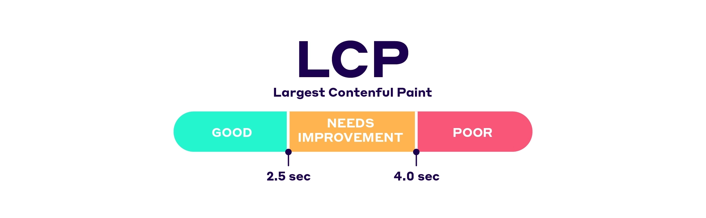

## 네비게이션 성능 향상을 위한 API


어떤 페이지에서, 사용자가 그 다음으로 이동할 페이지를 미리 가져올 수 있다면?  
사용자 경험뿐만 아니라 성능까지 향상시킬 수 있는 방법일 것이다.

> 이런 접근은 특정 리소스 파일보다는 문서 URL을 타겟으로 하기 때문에,  
> 싱글 페이지 애플리케이션(SPA)보다는 멀티 페이지 애플리케이션(MPA)에 좀 더 유용하다.

이 기능에 대해서는 두 가지 개념이 존재한다.  

&nbsp;

### 1. prefetching

> 프리패치, 프리패칭. 들어보셨죠?

prefetch가 적용된 페이지들에 대해,  
브라우저는 페이지의 하위 리소스는 다운로드하지 않고,  
응답 바디만 다운로드하여 캐시에 저장한다.  
prefetch된 문서로 이동하는 경우를 제외하고는 페이지를 떠날 때 캐시는 비워진다.

이를 위해 **\<link rel="prefetch">** 를 사용할 수 있는데,  

```html
<html lang="en">
<head>
  <meta charset="UTF-8">
  <title>Prefetch Example</title>
  <link rel="prefetch" href="/next-page" />
  <!-- 하위 CSS prefetch -->
  <link rel="prefetch" href="styles.css">
  <!-- 하위 이미지 prefetch -->
  <link rel="prefetch" href="images/next-page-image.jpg">
</head>
<body>
  <h1>현재 페이지</h1>
  <a href="next-page.html">Go to Next Page</a>
</body>
</html>
```

이 방법은 여러 한계점을 가진다.

1. 교차 사이트 탐색에 사용할 수 없다.
2. Cache-Control 헤더에 의해 차단된다.
3. 자동으로 우선순위를 낮출 수 없다.
4. 절약 모드와 같은 사용자의 설정과 호환되지 않는다.
5. prefetch된 리소스를 HTTP 캐시 내에 저장한다.

&nbsp;

### 2. prerendering

> 리렌더, 리렌더링. 들어보셨죠?

prerender가 적용된 컨텐츠들에 대해,  
브라우저는 컨텐츠를 불러오고, 보이지 않는 탭에 렌더링하고, 캐시에 저장한다.  
이 때 모든 하위 리소스도 로딩되고, 모든 자바스크립트를 실행한다.
prerender된 문서로 이동하는 경우를 제외하고는 페이지를 떠날 때 캐시는 비워진다.

prerender된 문서로 이동할 경우, 브라우저는 보이지 않던 탭을 활성화하여 현재 탭을 교체한다.  
이로써 상당한 성능 개선을 할 수 있다.

prerender의 초기 비용은 prefetch의 초기 비용보다 훨씬 크기 때문에  
prerendering은 보다 신중하게 사용하는 것이 권장된다.

&nbsp;

이를 위해 **\<link rel="prerender">** 를 사용할 수 있는데,  

```html
<html lang="ko">
<head>
  <meta charset="UTF-8">
  <title>Prerender Example</title>
  <link rel="prerender" href="https://example.com/next-page.html">
</head>
<body>
  <h1>현재 페이지</h1>
  <a href="https://example.com/next-page.html">다음 페이지로 이동</a>
</body>
</html>
```

이 방법은 여러 한계점을 가진다.

1. 자바스크립트를 통해 실행된 하위 리소스 로드가 불가능하다.
2. Cache-Control 헤더에 의해 차단된다.

일단 무엇보다, **deprecated되었다.**


&nbsp;

잠깐, 이 모든 것은 사용자 경험을 개선하기 위한 것.  
그렇다면 사용자 경험을 측정하기 위한 지표는 없을까?

&nbsp;

## 사용자 경험 개선을 위한 지표, LCP

**LCP, Largest Contentful Paint**란 페이지가 로딩되는 성능을 측정하는 지표로,  
페이지가 처음으로 로드된 시점부터 가장 큰 시각적 요소가 렌더링되기까지의 시간을 측정한다.



2.5초 이내라면 좋다고 하는데..  
아니 근데 진짜 솔직히 2.5초..는..
너무 느리지 않나..?

&nbsp;

이제부터 소개할 크롬의 새로운 API는 위 한계점들을 극복했을 뿐만 아니라,  
무려 **LCP를 20밀리초까지 줄일 수 있다**고 하는데..!


&nbsp;

## Speculation Rules API

만약 이 글을 읽고 있는 당신이 크롬 유저라면,  
놀랍게도 이 기능을 이미 경험해봤을 것이다.


크롬 주소창에 주소를 입력하면, 도메인을 미리 연결하거나 페이지를 미리 렌더링하여,  
이전보다 크롬의 페이지 로딩이 더 즉각적으로 느껴지는 경험을 할 수 있다.

&nbsp;

그렇다면 한계점은 어떻게 개선되었는지 알아보자.

### prefetch

1. 교차 사이트 탐색에 사용될 수 있다.
2. Cache-Control 헤더에 의해 차단되지 않는다.
3. 자동으로 우선순위를 낮출 수 있다.
4. 절약 모드와 같은 사용자의 설정과 호환된다.
5. prefetch된 리소스를 문서별 메모리 내 캐시에 저장하여 약간 더 빠르다.

### prerender

1. 자바스크립트를 통해 실행된 하위 리소스 및 데이터 패치도 포함한다.
2. Cache-Control 헤더에 의해 차단되지 않는다.

&nbsp;

아까의 코드를 ~~대충~~ 개선해본다면 아래와 같을 것이다.

```html
<script type="speculationrules">
  {
    "prerender": [
      {
        "where": { "href_matches": "/next" },
        "eagerness": "eager"
      }
    ],
    "prefetch": [
      {
        "source": "list",
        "requires": ["anonymous-client-ip-when-cross-origin"],
      }
    ]
  }
</script>
```

eagerness 옵션으로 어떤 조건으로 실행할 것인지 설정할 수 있다.
- **conservative**: mouse/pointer down
- **moderate**: 200ms 이상의 hover 또는 mouse/pointer down
- **immediate, eager**: 그냥 바로!

> 더 많은 JSON 옵션들에 대한 설명은 [공식문서](https://developer.mozilla.org/en-US/docs/Web/HTML/Element/script/type/speculationrules)를 참고하도록!

&nbsp;

자바스크립트 파일에서 작성해 볼 수도 있다.
> Speculation Rules API를 지원하지 않는 브라우저인지 먼저 체크하자!

```js
if (
  HTMLScriptElement.supports &&
  HTMLScriptElement.supports("speculationrules")
) {
  const specScript = document.createElement("script");
  specScript.type = "speculationrules";
  const specRules = {
    prefetch: [
      {
        source: "list",
        urls: ["/next.html"],
      },
    ],
  };
  specScript.textContent = JSON.stringify(specRules);
  document.body.append(specScript);
} else {
  const linkElem = document.createElement("link");
  linkElem.rel = "prefetch";
  linkElem.href = "/next.html";
  document.head.append(linkElem);
}
```

&nbsp;

여튼 이렇게, Speculation Rules API에 대해 찍먹해보았다.  
> 더욱 자세한 내용은 역시나 [공식문서](https://developer.mozilla.org/en-US/docs/Web/HTML/Element/script/type/speculationrules)를 참고하도록!  
여러모로 유용하게 사용할 수 있을 것 같아 기대가 많이 되는데,  
과연 이번에는 크롬에만 국한되지 않고 웹 표준으로 자리잡을 수 있을지..


만일 MPA를 개발하고 있다면, Speculation rules api를 한 번 적극적으로 사용해보길 추천한다!

&nbsp;

## 참고문서

> 모두 mdn web docs 문서입니다. mozilla 짱.

- [Speculation Rules API](https://developer.mozilla.org/en-US/docs/Web/API/Speculation_Rules_API)
- [\<script type="speculationrules">](https://developer.mozilla.org/en-US/docs/Web/HTML/Element/script/type/speculationrules)
- [rel=prefetch](https://developer.mozilla.org/en-US/docs/Web/HTML/Attributes/rel/prefetch)
- [rel=prerender](https://developer.mozilla.org/en-US/docs/Web/HTML/Attributes/rel/prerender)

```toc
```