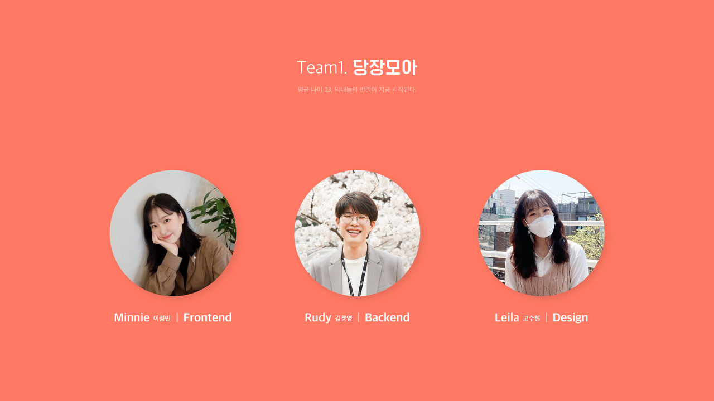
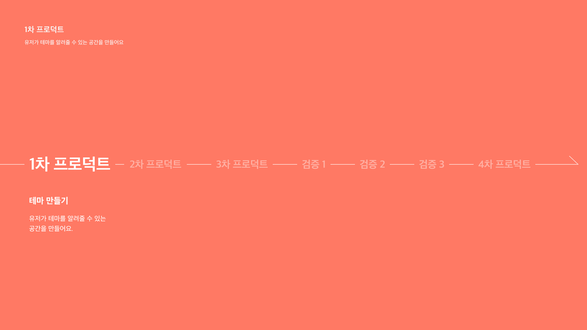
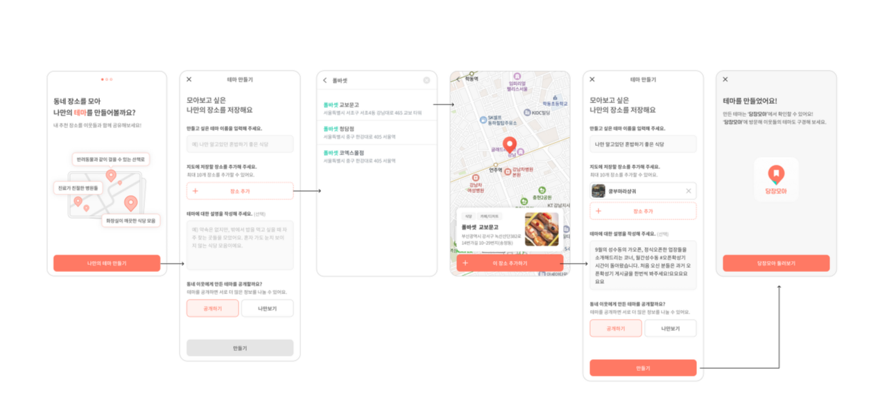
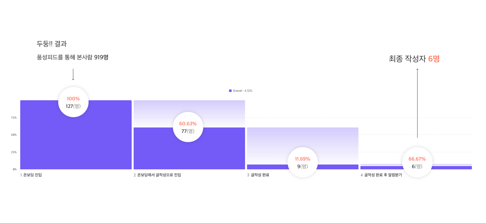

> 본격적인 세 번째 이야기를 시작하기에 앞서,
> 프론트엔드 개발자인 나, 미니
> 백엔드 개발자 루디,
> 디자이너 레일라.
> 3개월 동안 너무 고생했고 고맙고 미안하고 사랑해요!

&nbsp;

## 문제 정의
 
아이디어를 구체화하기에 앞서, 우리 팀은 문제를 정의해보았다.

**1. 당근 내부에서의 핵심문제**  
당근에서 알게된 장소 정보를 저장하고 모아볼 수 있는 영역이 없다.


**2. 당근 외부에서의 핵심 문제**  
광고성 게시글이 아닌, 믿을 수 있는 유저로부터 장소를 추천받을 수 있는 공간이 없다.  
비슷한 특징/리뷰를 가진 여러 장소들을 한꺼번에 추천받을 수 있는 공간이 없다.

그렇게 나만의 지도를 만들고 공유하는 해결책을 떠올리게 되었다.

1. 원하는 장소를 주제에 맞게 저장할 수 있다.
2. 저장된 장소들을 지도 형태로 동네 이웃들에게 공유할 수 있다.

 
> 원하는 장소를 자유롭게 주제에 맞춰 저장하고, 저장된 장소들을 지도 형태로 동네 이웃들에게 공유해보면 어떨까?
> 나아가 지도를 만든 사람을 구독하거나 세부 장소를 따로 저장할 수 있도록 하면 어떨까?

다양한 테마 지도들이 만들어지고 이를 소비한 유저들이 또 자신만의 추천 장소를 제안하는 구조를 통해 지속적으로 "정보가 재생산"될 수 있도록 해서, 유저들이 당근마켓에서 다양한 장소 정보를 공유하고 소비할 수 있도록 만들고자 했다.

그렇게 본격적으로 나만의 지도 프로덕트를 구현하기에 앞서, 테마 지도에 대한 공급과 수요를 검증하고자 했다. 우선 공급을 확보할 수 있는지, 그리고 공급된 글을 보여주면 수요가 있는지를 살펴보고, 유저의 반응을 확인하는 순서로 검증을 진행했다.

그렇게 우리는 3개월 동안 **4차례의 프로덕트 개선**과 **3번의 검증 과정**을 거치게 되었다. 이에 대해 지금부터 차근차근 설명해보려 한다 :)

&nbsp;

## 1차 프로덕트

### 유저가 테마를 알려줄 수 있는 공간을 만들어요



최대한 프로젝트를 잘게 쪼개서 빠르게 배포를 하고자 했기에, 1차 프로덕트를 **테마를 작성하는 기능**으로 가져갔다. 테마를 알려줄 수 있는 공간을 제공하는 것이 바로 1차 프로덕트의 목표였다.

테마 공급에 대한 검증을 위해,
> 동네에서 추천해주고 싶은 장소들이 있을 것이고, 그걸 모아서 알려주고 싶을 것이다.
라는 가설을 세웠다.

그래서 어느 주제에 대한 장소들을 알고 있는지, 알려줄 의향이 있는지를 알기 위한 1차 프로덕트를 구현해서 **풍성피드**(당근마켓 피드에 띄우는 광고글)를 띄워보기로 했다.



온보딩에서 작성으로 넘어간 후, 테마 제목을 입력하고, 장소들을 검색해서 추가하고, 테마에 대한 설명글을 입력하고, 공개 여부를 설정하는 플로우를 갖고 있다.

&nbsp;

### 1차 프로덕트의 결과는...?



참담했다...!

풍피를 띄운 11월 2일부터 11월 8일의 기간 동안 풍피가 총 919명에게 노출되었는데, 그중 127명이 풍피를 클릭해서 들어왔고, 그중 77명이 테마 작성 페이지로 넘어갔다. 그중 단 9명이 작성을 시도했으며, **최종적으로 작성한 유저는 6명**에 그쳤다. 심지어 그중 3명은 당근 직원이었다.

우리는 큰 고민에 빠지게 되었다.
> 대체 왜 유저가 작성해주지 않았을까...?
 
**" 테마 작성이 어려운 게 아닐까요? "**  
그럼 어떤 식으로 작성하면 되는지 예시를 보여주면 어떨까?

**" 저장할 만한 장소가 떠오르지 않는 게 아닐까요? "**  
그럼 동네 장소들을 여러 개 보여주면 어떨까?

**" 만든 테마를 볼 수 있는 곳이 없어서가 아닐까요? "**  
그럼 만든 테마를 볼 수 있는 공간을 제공해주면 어떨까?

&nbsp;

### 그렇게 이 기능들을 추가한 2차 프로덕트 구체화를 시작하게 되었다.

```toc
```