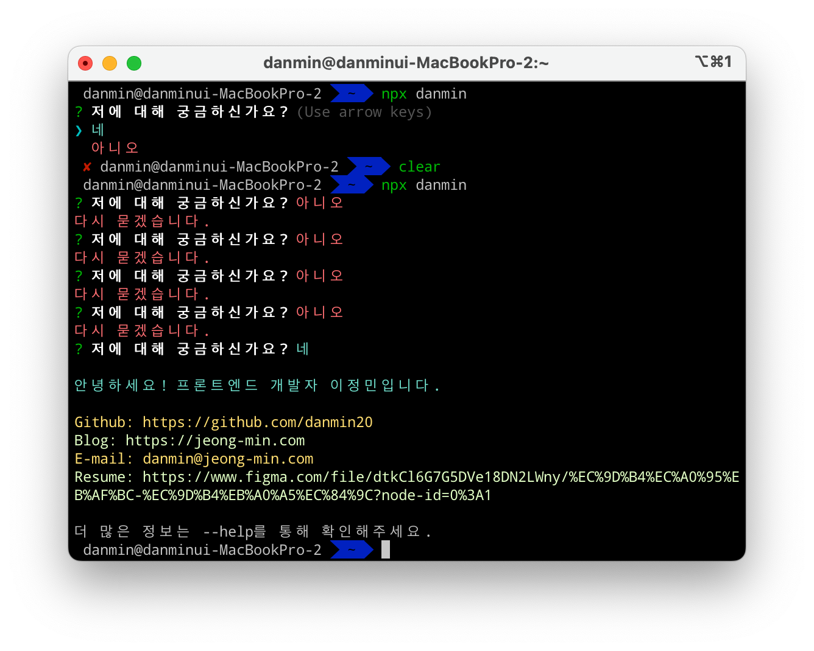
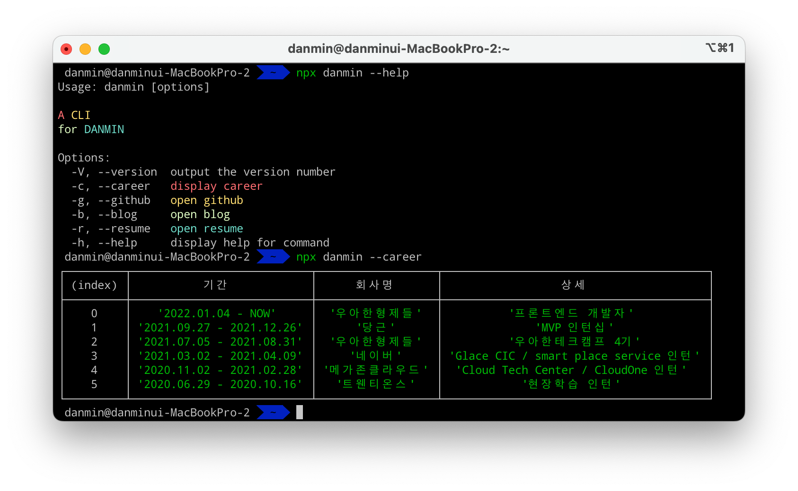

## CLI, 우리는 이미 사용하고 있다.

**Command line interface**  
개발을 조금이라도 해봤다면 한 번쯤은 써봤을 것이다.  
터미널에서 명령어와 파라미터로 조작하는 CLI,  
git과 aws를 터미널에서 사용해봤다면 당신은 이미 CLI 마스터!


&nbsp;

## CLI, 직접 한 번 만들어보자.

최근 CLI를 실행하면 자기 소개 몇 줄을 출력하는 식으로 포트폴리오(?)를 만드신 분을 봤는데,  
이에 큰 감명을 받아 여기에 몇 가지 기능을 더 추가한 나만의 CLI를 만들어보려고 한다.


&nbsp;

### 1. 환경 세팅

~~프론트엔드 개발자는 뭐다? 자바스크립트 개발자다~~

당연히 node.js 기반의 CLI를 만들고자 했고,  
타입스크립트 및 최신 문법 사용을 위해 **babel**을 함께 사용했다.  
그리고 라이브러리를 만들 때 주로 사용되는 **rollup**을 번들러로 선택했다.

CLI 프로그램 개발을 위한 툴로는 **commander, inquirer, chalk**를 사용했다.  
- commander: node.js 기반의 CLI를 만드는 데에 사용된다.
- inquirer: 문답형 CLI를 만드는 데에 사용된다.
- chalk: CLI 글씨에 색상을 입힐 수 있다.

```json
{
  "name": "danmin",
  "author": "danmin20",
  "version": "1.0.0",
  "description": "CLI for danmin",
  "license": "ISC",
  "main": "bin/index.js",
  "scripts": {
    "start": "node bin/index.js", // 빌드 후 npm run start danmin 으로 로컬에서 실행 가능
    "clean": "rimraf bin",
    "build": "pnpm clean && rollup -c rollup.config.js --bundleConfigAsCjs"
  },
  "bin": {
    "danmin": "bin/index.js"
  },
  "files": [
    "bin"
  ],
  "peerDependencies": {
    "rollup": "^4.18.0",
    "typescript": "^5.5.2"
  },
  "devDependencies": {
    "@babel/cli": "^7.24.7",
    "@babel/core": "^7.24.7",
    "@babel/preset-env": "^7.24.7",
    "@babel/preset-typescript": "^7.24.7",
    "@types/inquirer": "^9.0.7",
    "rimraf": "^5.0.7",
    "tslib": "^2.6.3"
  },
  "dependencies": {
    "@rollup/plugin-babel": "^6.0.4",
    "@rollup/plugin-commonjs": "^26.0.1",
    "@rollup/plugin-json": "^6.1.0",
    "@rollup/plugin-node-resolve": "^15.2.3",
    "@rollup/plugin-terser": "^0.4.4",
    "@rollup/plugin-typescript": "^11.1.6",
    "chalk": "^5.3.0",
    "commander": "^12.1.0",
    "inquirer": "^9.3.2",
    "rollup-plugin-peer-deps-external": "^2.2.4",
    "rollup-plugin-typescript2": "^0.36.0"
  }
}
```

package.json은 대충 위와 같다.  
그리고 입맛에 맞게 tsconfig과 rollup.config를 작성해주었다.

&nbsp;

### 2. 문답형 CLI 만들기

우선, 프로그램을 실행하면 나에 대해 궁금하냐는 질문에 답변을 하는 기능부터 만들어보려고 한다.  
만약 "아니오"라고 답한다면, **프로그램이 종료될 때까지 질문은 계속 될 것이다.**


```ts
const init = async () => {
  const questions = [
    {
      type: "list",
      name: "action",
      message: "저에 대해 궁금하신가요?",
      choices: [colorize.blue("네"), colorize.red("아니오")],
    },
  ];

  return inquirer.prompt(questions).then((result) => {
    if (result.action === colorize.red("아니오")) {
      console.log(colorize.red("다시 묻겠습니다."));
      init();
    } else {
      console.log(
        colorize.blue("\n안녕하세요! 프론트엔드 개발자 이정민입니다.\n")
      );
      console.log(colorize.yellow(`Github: ${url.github}`));
      console.log(colorize.green(`Blog: ${url.blog}`));
      console.log(colorize.yellow("E-mail: danmin@jeong-min.com"));
      console.log(colorize.green(`Resume: ${url.resume}`));
      console.log("\n더 많은 정보는 --help를 통해 확인해주세요.");
    }
  });
};

init();
```

> colorize 함수는 chalk 인스턴스를 리턴하도록 만든 함수입니다.



~~집착광공~~


&nbsp;

### 3. CLI 옵션 만들기

만능 옵션, --help는 다들 써봤을 것이다.  
이런 기본 옵션 외에도 다양한 옵션을 직접 만들 수 있다.

우선 나는 career, github, blog, resume 옵션을 만들어서,  
각각 해당하는 정보를 출력하거나, 크롬 창을 여는 기능을 만들어보려 한다.

```ts
const careers = [
  // 어쩌구 저쩌구
];

export const logCareers = () => {
  console.table(careers);
  process.exit();
};

export const open = (type: string) => {
  exec(`open -a Google\\ Chrome ${url[type]}`);
  process.exit();
};
```

```ts
const program = new Command();

program
  .version("1.0.0")
  .description(
    `${colorize.red("A")} ${colorize.yellow("CLI")} ${colorize.green(
      "for"
    )} ${colorize.blue("DANMIN")}`
  )
  .option("-c, --career", colorize.red("display career"))
  .option("-g, --github", colorize.yellow("open github"))
  .option("-b, --blog", colorize.green("open blog"))
  .option("-r, --resume", colorize.blue("open resume"))
  .parse(process.argv);

const options = program.opts();

if (options.career) {
  logCareers();
}
if (options.github) {
  open("github");
}
if (options.blog) {
  open("blog");
}
if (options.resume) {
  open("resume");
}
```



그리고 터미널에서 npm에 로그인 후 배포해주면,,~

```bash
npm login
npm publish
```


두둥! 이제 설치해서 써볼 수 있는 라이브러리가 되었다.

정말 생각보다 간단했던 CLI 프로그램 개발과 npm 배포,  
나만의 CLI 프로그램을 한 번 만들어보는 것도 추천드립니다!

```toc
```