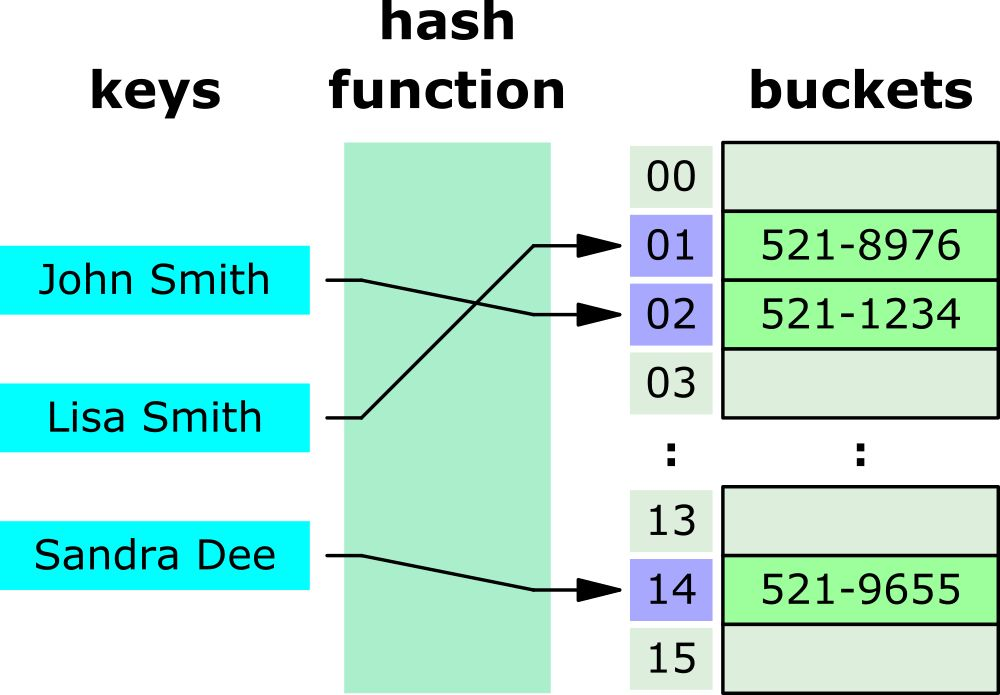
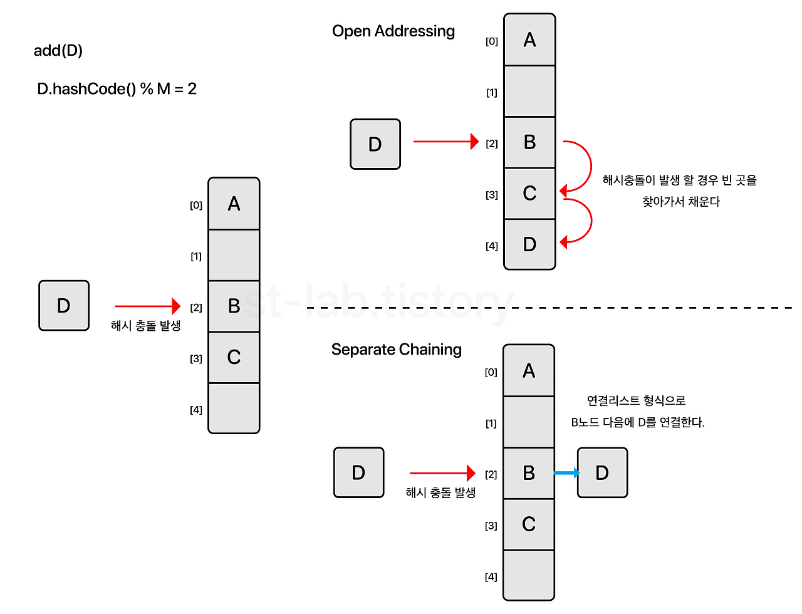

## 해시 테이블이란?



**해시 테이블**은 키-값 쌍을 저장하는 자료구조다.  
해시 테이블은 평균 O(1)의 시간 복잡도로 삽입, 검색, 삭제 연산을 수행하기에 매우 유용하다.  
해시 테이블의 대표적인 예로는 파이썬의 dictionary, 루비의 hash 자바의 map을 들 수 있겠다.

해시 테이블은 해시 함수를 사용하여 키를 배열의 인덱스로 변환한다. 이 과정을 **해싱**이라고 한다.  
**해시 함수**는 같은 입력에 대해 항상 같은 출력을 반환해야 하며,  
다른 입력에 대해서는 최대한 다른 출력을 반환하도록 설계되어야 한다.  
그렇지 않으면 최악의 경우 O(n)의 시간 복잡도를 갖게될 수도 있다.  
즉, 해시 함수의 품질에 따라 성능이 크게 좌우된다.

&nbsp;

해시 함수가 다른 입력에 대해 동일한 출력을 반환한다면 **해시 충돌**이 발생한다.  
해시 충돌을 완화하는 방법도 존재한다.

- 개방 주소법 (open addressing): 고정된 해시 테이블 내에서 저장 위치를 잘 찾기
- 분리 연결법 (separate chaining): 해시 테이블의 크기를 유연하게 만들기



&nbsp;

### 자바스크립트로 해시 테이블 구현해보기

우선 간단한 해시 함수를 구현해보자!

```js
function hash(key, arrayLen) {
  let total = 0;
  for (let char of key) {
    let value = char.charCodeAt(0) - 96;
    total = (total + value) % arrayLen;
  }
  return total;
}
```

위 해시 함수를 바탕으로 해시 테이블 클래스를 구현해보자!

```js
class HashTable {
  constructor(size = 53) {
    this.keyMap = new Array(size);
  }

  _hash(key) {
    return hash(key, this.keyMap.length);
  }

  set(key, value) {
    let index = this._hash(key);
    if (!this.keyMap[index]) {
      this.keyMap[index] = [];
    }
    this.keyMap[index].push([key, value]); // Separate Chaining
  }

  get(key) {
    let index = this._hash(key);
    if (this.keyMap[index]) {
      for (let i = 0; i < this.keyMap[index].length; i++) {
        if (this.keyMap[index][i][0] === key) {
          return this.keyMap[index][i][1];
        }
      }
    }
    return undefined;
  }
}
```

위 구현에서는 Separate Chaining을 사용하여 충돌을 처리했다.  
같은 인덱스에 여러 키-값 쌍이 해시될 경우, 해당 인덱스에 배열을 만들어 저장하는 것을 볼 수 있다.

&nbsp;

## Object는 해시 테이블일까?

키-값 쌍을 저장하는 자료구조라고 한다면, 자바스크립트에서 떠오르는 것은 Object다.  
실제로 여러 글에서 자바스크립트의 Object를 해시 테이블과 같다고 말하고 있는 걸 볼 수 있다.

자바스크립트의 Object가 해시 테이블과 유사해보이긴 하지만,  
V8을 포함한 대부분의 자바스크립트 엔진에서 Object는 일반적인 해시 테이블로 구현되지는 않는다.  
해시 테이블과 유사하지만, 일반적인 해시 테이블보다 더 자바스크립트에 적합한 방법으로 Object를 구현한다고 불 수 있다.

> 일반적인 해시 테이블의 경우 프로퍼티에 접근하기 위해 동적 탐색을 수행하는데,  
> 동적 타이핑 언어인 자바스크립트의 경우, 런타임에서 데이터가 저장된 위치가 바뀌거나 수정될 수 있다.  
> 따라서 자바스크립트 Object에서 동적 탐색을 사용한다면 매우 비효율적이다.  
> [V8에서는 동적 탐색을 줄일 수 있도록 Hidden class를 사용하고 있다.](https://v8.dev/blog/hash-code)

&nbsp;

## Map, Set, WeakMap, WeakSet은 해시 테이블일까?

[실제로 ECMAScript에서 해시 테이블과 함께 위 네가지를 언급하고 있다.](https://tc39.es/ecma262/#sec-map-objects)  
하지만 이 또한 자바스크립트를 실제로 실행하는 엔진이 내부적으로 어떻게 구현하느냐에 따라 달렸다.

Map, Set, WeakMap, WeakSet의 메서드들의 시간 복잡도가 O(1)이기 때문에 해시 테이블과 유사한 것이지,  
내부 구현은 일반적인 해시 테이블과 다를 수 있다는 것.

&nbsp;

## 해시 테이블을 직접 구현하긴 싫은데, 뭘 써야할까?

해시 테이블과 유사한 자바스크립트 내장 문법을 사용하고 싶다면,  
Object보다는 Map을 사용하는 게 권장되고 있다.

데이터 삽입/삭제가 잦을 수록 성능이 더 좋을 뿐만 아니라,  
그 자체로 이터러블하다는 점에서도 유용하다.

&nbsp;


> 생각보다 자바스크립트 Object에 대한 내부 구현과 관련된 글을 찾기 힘들었다.  
> 따라서 잘못된 내용 있을 수 있음 주의.. 생략된 내용 많음 주의..  
> [해당 문서](https://positiveko-til.vercel.app/til/cs/hashtable.html#%E1%84%8C%E1%85%A5%E1%86%BC%E1%84%8B%E1%85%B4)를 많이 참고했다.  

```toc
```