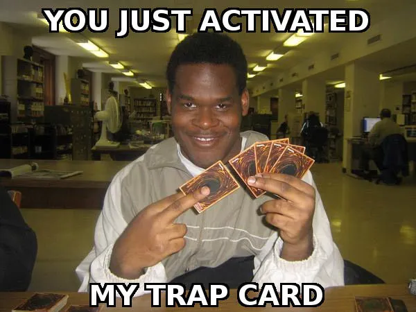
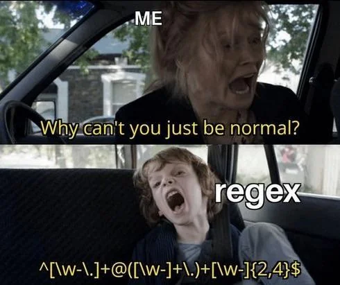

자바스크립트로 문자열을 뒤집고 싶다면 어떻게 할 것인가?  
다들 `.split('').reverse().join('')`를 떠올렸을 것이다.  
하지만 여기에 이모지가 포함되어 있다면?



&nbsp;

물론 `split()` 말고 스프레드 연산자나 `Array.from()`을 떠올린 사람도 있을 것이다.  
여튼, 어떤 방법을 쓰냐에 따라 결과가 크게 달라질 수 있는데...

&nbsp;

```js
const text = '흑백요리사🧑‍🍳';
const reversed = text.split('').reverse().join('');
console.log(reversed);
```

위 코드를 실행하면 어떤 글자가 출력될까?

```
��‍��사리요백흑
```
라는 아주 끔찍한 결과가 나온다.

&nbsp;

반면 스프레드 연산자나 `Array.from()`을 사용한다면?

```js
const text = '흑백요리사🧑‍🍳';
const reversed = [...text].reverse().join('');
console.log(reversed);
```
```
🍳‍🧑사리요백흑
```

&nbsp;

이 차이는 자바스크립트에서 문자열과 이모지, 특히 ZWJ(Zero Width Joiner) 시퀀스를 처리하는 방식 때문에 발생한다.

&nbsp;

## 잠깐! ZWJ는 뭔데?

ZWJ(Zero Width Joiner)는 유니코드 문자 U+200D로,  
이모지들을 결합하여 새로운 의미를 만드는 특수한 **보이지 않는 결합 문자**다.  

```js
// 기본 이모지들
console.log('👩'); // 여성
console.log('👨'); // 남성
console.log('👶'); // 아기

// ZWJ로 결합된 이모지들
console.log('👨‍👩‍👦'); // 가족 (남성 + ZWJ + 여성 + ZWJ + 아들)
console.log('👩‍💻'); // 노트북 사용하는 여성 (여성 + ZWJ + 노트북)
console.log('👨‍🦰'); // 빨간 머리 남성 (남성 + ZWJ + 빨간 머리)
```

> 이러한 결합 이모지를 ZWJ 시퀀스라고 한다.

ZWJ는,
1. 시각적으로 보이지 않고
2. 개별 이모지들을 하나로 결합하는데
3. 이는 플랫폼마다 지원하는 조합이 다를 수 있다.

&nbsp;

하나의 기본 이모지는 두 개의 UTF-16 코드 유닛으로 이루어져 있기 때문에 길이가 2로 출력되기 때문에,  
ZWJ로 결합된 이모지들은 더욱 길게 길이가 출력된다.

```js
console.log('👨'.length) // 2

const family = '👨‍👩‍👦';
console.log([...family]); // ['👨', '‍', '👩', '‍', '👦']
console.log(family.length); // 8
```

> 유니코드는 각 문자에 고유한 번호(코드 포인트)를 부여하고, 기본 이미지는 하나의 코드 포인트를 가진다.  
> 하지만 자바스크립트는 내부적으로 UTF-16 인코딩을 사용하기 때문에 발생하는 현상이다.

&nbsp;

### 문자열을 분리하는 기준이 다르다

```js
console.log('👩‍💻'.split(''))
// ['\uD83D', '\uDC69', '‍', '\uD83D', '\uDCBB']
```

`split('')`은 문자열을 **UTF-16 코드 유닛 단위**로 분리한다.  
이모지와 ZWJ 시퀀스는 여러 코드 유닛으로 구성되어 있는데,  
이를 개별 코드 유닛으로 분리하니 이모지의 구조가 깨지게 되는 것이다.

&nbsp;

```js
console.log([...'👩‍💻'])
// ['👩', '‍', '💻']
```

스프레드 연산자`(...)`는 문자열을 **유니코드 코드 포인트 단위**로 분리한다.  
기본 이모지는 하나의 코드 포인트를 가지기 때문에, ZWJ 시퀀스의 구조가 보존될 수 있는 것이다.

따라서 이모지나 특수 문자가 포함된 문자열을 다룰 때는  
유니코드 코드 포인트를 올바르게 처리하는 스프레드 연산자 또는 `Array.from()`을 사용하도록 하자!

&nbsp;

## ZWJ 시퀀스를 분리하지 않고 그대로 문자열을 뒤집을 수는 없을까?

당연히 가능하다! 규식이와 함께라면!



&nbsp;

정규식을 사용하여 이모지와 일반 텍스트를 분리해보자!

```ts
const reverseTextPreserveEmoji = (text: string) => {
  // 이모지(ZWJ 시퀀스 포함)를 매칭하는 패턴
  // \p{Extended_Pictographic} : 기본 이모지를 매칭
  // (?:\u200d\p{Extended_Pictographic})* : ZWJ로 연결된 추가 이모지들을 매칭 (있는 경우)
  const emojiPattern = /(\p{Extended_Pictographic}(?:\u200d\p{Extended_Pictographic})*)/gu;
  
  // 텍스트와 이모지를 토큰화
  const tokens = text.split(emojiPattern)
    // 빈 문자열 제거
    .filter(Boolean)
    // 이모지인지 여부에 따라 타입 지정
    .map(token => ({
      type: emojiPattern.test(token) ? 'emoji' : 'text',
      content: token
    }));
      
  // 전체 토큰을 뒤집고, 텍스트만 내부적으로 뒤집어서 결합
  return tokens
    .reverse()
    .map(({type, content}) => 
      type === 'text' 
        ? [...content].reverse().join('') 
        : content
    )
    .join('');
};

console.log(reverseTextPreserveEmoji('흑백요리사🧑‍🍳🥬')); // 🥬🧑‍🍳사리요백흑
console.log(reverseTextPreserveEmoji('흑백🧑‍🍳요리사🥬')); // 🥬사리요🧑‍🍳백흑
console.log(reverseTextPreserveEmoji('🧑‍🍳흑백🥬요리사')); // 사리요🥬백흑🧑‍🍳
```

> 이제 문자열이 이븐하게 있지 않더라도 우리는 문자열을 뒤집을 수 있게 되었다!

```toc
```