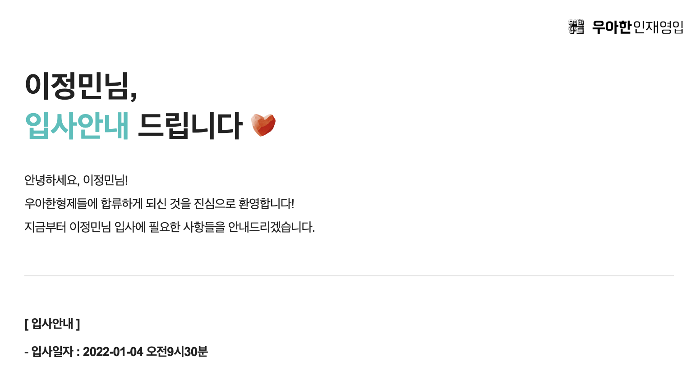
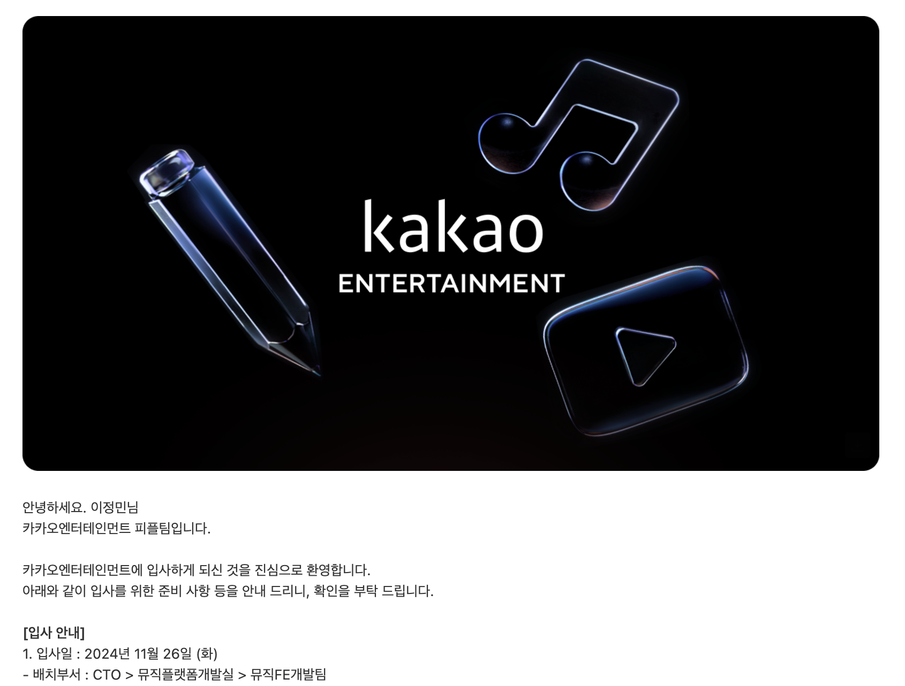

| | |
| - | - |
|  |  |

> 2022년 1월 4일부터 2024년 11월 18일까지, 약 3년을 우아한형제들과 함께해서 즐거웠습니다 :)

&nbsp;

### 왜 떠나는가?

사실 **이직해야지!** 하고 결심해서 시작한 것은 아니었다. 3-4년차가 이직하기 참 좋을 때라는데, 나는 과연 이직을 할 수 있을까에 대한 궁금증이 제일 컸다. 부업으로 꾸준히 멘토링을 하는 입장에서 취업/이직이 점점 어려워지고 있구나도 많이 느낄 수 있었다.

물론 연차를 더 쌓은 후 이직을 하는 길도 있었다. 하지만 우아한형제들이 첫 회사인 나는, 약 3년이라는 기간동안 대부분 회사 내부 서비스만을 개발했다. 디자인시스템, 어드민, 운영 도구 등등.. 어떻게 보면 서비스 회사에서 서비스 개발은 해보지 않은 셈이다. 이러다가 더 연차가 쌓였을 때, 만일 서비스 회사에 지원을 하게 된다면 서비스 경험이 없는 나를 과연 뽑을지에 대한 의문이 컸다. 주니어라면 와서 배우면 되는 부분이지만, 시니어라면 팀을 이끄는 역량이 필요할지도 모르는데 경험조차 없다면.. 계속 개발을 할 것이라면, IT 기업에 소속되어 회사원으로 일 할 것이라면, **커리어 전환이 한 번 필요하겠다** 싶었다.

게다가 IT 겨울이 시작되면서, 대부분의 회사가 그렇듯 회사 대내외적으로 뒤숭숭한 일들이 많았다. 어차피 모든 **회사**의 상황이 좋지 않다면, 적어도 **내 커리어**의 상황은 좋게 만드는 게 정답이 아닐까 싶었다. 신임 대표의 갑작스런 퇴사와 더불어, 이 회사가 이루고자 하는 목표는 무엇일까에 대한 의문이 들었다. 서비스와 조금 동떨어진 업무에 속해있었기에 더 답답했던 것 같기도 하다.

물론 우아한형제들은 그럼에도 불구하고 여전히 너무나도 좋은 회사다. 주 1회 출근과 주 32시간 근무라는 엄청난 조건의 복지는, 이직을 했을 때 높은 확률로 금전적, 워라밸적으로 더 안좋아질 수밖에 없게 만드는 요소다. (32시간 계약 연봉을 40시간으로 올려서 맞춰주는 회사는 거의 없을 것이다.) 하지만 안락한 근무 환경, 어드민 개발이라는 보다 근무 강도가 낮은 업무가 앞으로의 내 커리어 발전에 과연 도움이 될까? 돈과 복지는 시니어 때 챙길 수 있는 것이고, 그러려면 **주니어 때 많은 경험을 쌓는 게 우선** 아닐까?

물론 남아서 더 해볼 수 있는 것들도 있을 것이다. 우아콘 연사, 사내 기술 블로그 기고 등 업무 외적으로도 도전해볼 수 있는 것들은 많았다. 하지만 4년차를 코 앞에 둔 나에게 필요한 것은 멋있는 활동이 아닌, **실질적으로 회사에서 업무적으로 해내는 것들**이었다. (물론 다 해냈다면 좋았겠죠 ᴗ_ᴗ̩̩) 사내 운영도구 개발을 목적으로 구성된 팀이었지만, 어느 샌가 물류 어드민 쪽 업무가 더 많아졌고, 매일 검색 패널과 테이블만 복붙하고 있는 업무에서 이제는 벗어나야 하지 않나 싶었다.

사실 나는 **"저는 회사에서 이런 걸 하고 싶어요!!"** 라고 외치는 타입은 아니다. 회사는 내가 하고 싶은 일을 하는 곳이 아니라, 회사에 필요한 것들을 각자 맡아서 해내는 곳이라고 생각한다. 내가 하고 싶은 것만 한다면 그건 사이드나 창업을 해야 하지 않을까. (물론 회사의 큰 그림 내에서 내가 기술적으로 해볼 수 있는 것들을 시도하는 것은 당연히 해야 한다. *그리고 사이드와 창업이 하고 싶은 것만 하는 재밌기만 한 것이라는 뜻도 절대 아니다.*) 조금은 수동적으로 비춰질 수도 있겠지만, 서비스 개발이 하고 싶어서라기보다는 서비스 개발이라는 경험을 내 커리어에 포함시키고 싶어서 떠나는 것이라 할 수 있겠다. (행위와 과정 자체가 목적인 느낌이다.)

&nbsp;

### 어디로 가는가?

인생이 어떻게 흘러갈지는 모르겠지만, 언젠가는 프리랜서로 일하며 디지털 노마드의 삶을 살아보고 싶다는 목표가 있다. 외주든 강사든 프리랜서를 하려면 이름값이 있어야 한다고 생각했고, 그러려면 이름값 있는 회사들을 다니는 것이 좀 더 유리하겠다라는 생각을 했다. (유명한 회사를 다닌다고 잘하는 것도, 유명하지 않은 회사를 다닌다고 못하는 것도 절대 아니다. 어떤 회사를 들어가도 내가 상상한 것과 다른 커리어를 쌓을 수 있기 때문에 이름값 있는 회사를 선택하는 것이 머나먼 미래를 고려했을 때는 좀 더 안전한 선택이 아닐까하는 것일 뿐)

두 번째 회사까지는 인지도가 높은 회사를 다니고, 세 번째 회사부터는 스타트업에서 도전적인 경험을 쌓아보고 싶다는 막연한 계획만 있었다. 그렇게 지원 자체는 흔히 말하는 네카라쿠배당토 범위 내에서 다섯 군데 정도 했고, 결국 **카카오엔터테인먼트**로 가게 되었다. **뮤직FE개발팀**에 소속되어 서비스, 어드민 가리지 않고 일을 하게 될 예정이다. 어쨌거나 서비스 개발 경험을 많이 쌓을 수 있길 기대중이다.



&nbsp;

> 주 1회 출근에서 주 1회 재택으로, 도어투도어 15분에서 1시간으로, 월요일 1시 출근에서 오전 출근으로.. 생각해보니 이제서야 찐 직장인이 되는 것 같기도 하다. (이직이 아니라 취업일지도) 지인들은 이제껏 편하게 일했으니 고생 좀 해봐야 한다는 반응이다(ㅋㅋ)

> 퇴사 후 입사까지 여유 기간이 일주일밖에 안 되어서 그런지 안 쉬냐고 걱정들을 많이 해주셨는데, 퇴사 전에 남은 휴가 털어서 8박 10일 튀르키예 여행을 갔다 왔기에.. 더 쉬어서 뭐하나 돈 벌어야지 하는 생각이다.

&nbsp;

### 이직은 어땠는가?

나 말고도 주변에 이직러들은 많았기에.. 이직 시장이 꽁꽁 얼어붙었다곤 할 수 없을 것 같다. (다들 잘만 이직하더라) 하지만 적어도 나에겐, 연봉 상승에는 이직이 답이라는 말이 무색할 정도로 금전적인 레벨업은 하지 못했다. ~거품 낀 금액으로 취업한 사람이 거품 빠진 금액으로 이직을 해서 그런가 싶었다.~ (물론 잘 높여서 가시는 분들도 많을 것이다. 다 제가 부족한 탓입니다 ꌩ-ꌩ)

7월 초부터 시작된 이직 준비는 9월 말이 되어서야 끝이 났다. 생각보다 프로세스가 많이 길었다. (결과 나오고 일정 잡고의 무한 반복) 8월 쯤엔 새로운 회사에 있을 거라 생각했는데, 결국 11월 말 입사가 되었다. (그래서 3년을 아깝게 못 채워서 뱉어내야 하는 돈이 좀 있다 ᴗ_ᴗ̩̩ 넘 아까버..)

카카오엔터테인먼트에 최종 합격하고서부터는 더 이상의 지원은 하지 않았다. **내가 경험해보고 싶은 것들을 이룰 수 있는 환경인가**에 대해 그렇다고 결론 내릴 수 있었던 시점에서 끝난 것 같다. 물론 아쉬운 점들도 있었다. 채용이 닫혀있던 곳이 뒤늦게 열린 경우도 있었고.. 좀 더 여러 카드를 준비해서 높은 처우를 노려볼 수도 있었을 것 같고.. 하지만 기회는 또 있을 테니까. 아쉬움이 있다면 그것은 그 다음 이직에서 극복할 수 있으리라 생각한다.

여튼 이직을 하면서 정말 오랜만에 많은 공부를 했다. [이력서를 갈아 엎으면서](https://www.figma.com/file/dtkCl6G7G5DVe18DN2LWny/%EC%9D%B4%EC%A0%95%EB%AF%BC-%EC%9D%B4%EB%A0%A5%EC%84%9C?node-id=0%3A1) 2년 전 코드를 뜯어보기도 하고, 트러블슈팅 문서를 뒤져보기도 하고, 알고리즘 문제도 많이 풀어보고, 한번도 궁금해하지 않았던 것들도 찾아서 공부했다. 3년 동안 뭐했나 하는 생각이 들 정도로 이직 준비를 하면서 한 단계 성장을 또 한 것 같다. **앞으로는 제발 꾸준히 열심히 공부하자..** °˚( ˙꒳ˁ　)˒˒

> 팁이라고 한다면, 경력 채용에서도 알고리즘 코테, 과제 코테가 첫 번째 관문인 건 마찬가지이므로 미리 준비를 해놔야 한다. 솔직히 말하면 취준 때 알고리즘 공부를 하나도 안 했어서 이번에 알고리즘 공부를 정말 처음 해본 건데, 정말 매일 푸니까 늘긴 늘더라. 수학 머리 없는 내가 알고리즘 코테를 통과할 수 있는 사람이라는 걸 처음 알게 되어서 감격스러울 정도였다. 그리고 면접에서도 CS 지식과 기본 JS 지식을 깊게 묻는 경우도 많으니 (특히 주니어일수록) 미리 공부를 많이 해놔야 한다. 한 번도 생각해보지 못했던 것들에 대해서 질문을 받은 것들도 많았다. 면접 자체로도 정말 공부가 많이 되었다.

&nbsp;

### 글을 마치며

인생이 3-4년 간격으로 크게 바뀌는 것 같다. 대입, 취업 그리고 이직. 과거의 그 선택이 좋은 선택이었을까에 대한 답은 미래의 내가 만들어나가는 것이라 생각한다. 3년 동안 우아한형제들에서 정말 좋은 환경 속에서 정말 좋은 동료들과 함께 일할 수 있어 영광이었다. 새로운 챕터에서도 영광스러운 이야기들이 펼쳐질 수 있길 기대해본다.


> 재미지게 일하기 끝!

```toc
```