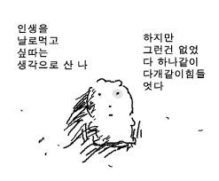
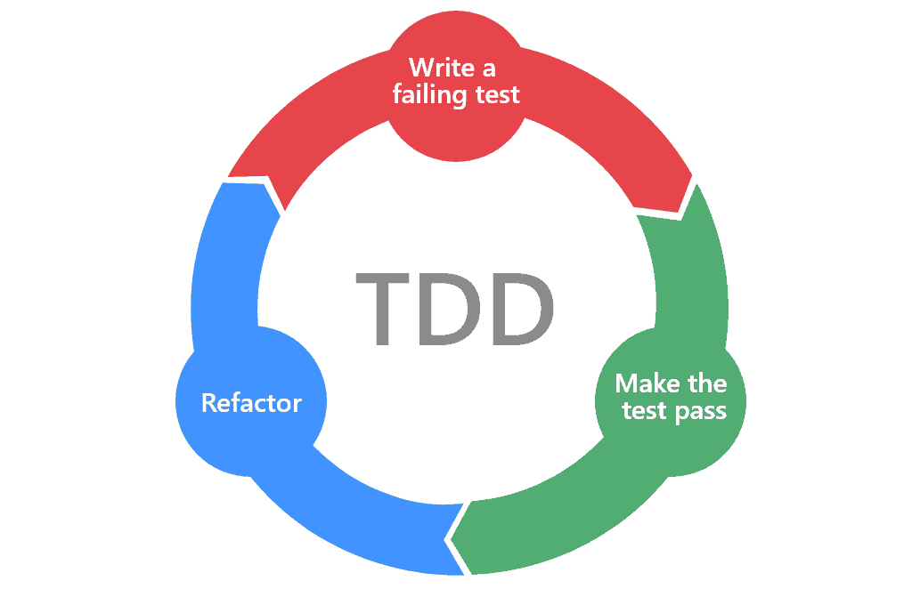
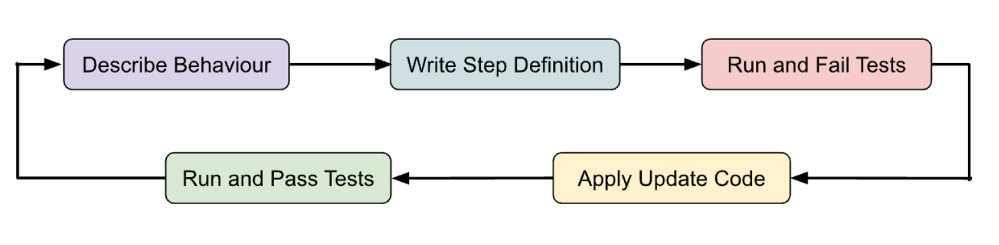
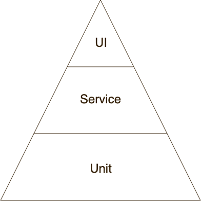
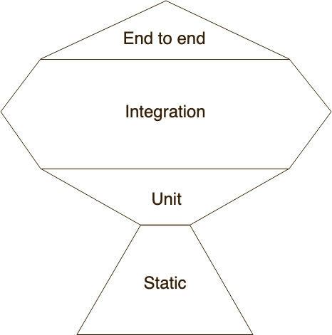
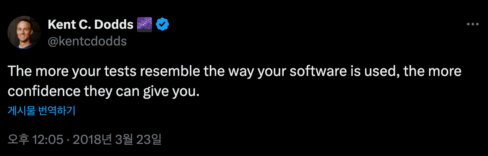

*테스트 코드를 작성해야 한다~ TDD를 해야 한다~ 프론트에서는 테스트 코드 쓸모 없다~*  
참 말 많은 테스트!  
우선은 공부해봐야 뭐라도 알겠지?  
테스트 계의 거장들과 함께 테스트에 대해 한 번 알아보자!

&nbsp;

## Kent Beck의 TDD

한 번 쯤은 들어봤을, 그리고 표지 디자인은 꽤나 익숙할 바로 그 책이다.  
다들 읽어봤을지는 모르겠지만.. 최근 1회독을 해 본 내 짧은 후기는 다음과 같다.

**문장이 상당히 산만한데다 번역체까지 더해지니 살짝 아찔하다.**


&nbsp;

책 두께의 반 이상을 예시 코드와 개념 설명이 차지하고 있기에,  
책을 관통하는 내용은 문장 몇 개로 정리할 수 있었다.

1. TDD의 리듬은 다음과 같다. (**빨강 → 초록 → 리팩토링**)
   - 우선 테스트를 작성한다.
   - 실패하는 구현을 짠다. (빨강)
   - 성공하는 구현을 한다. 성공하기만 하면 된다. 가짜로 구현해도 된다. (초록)
   - 올바르게 리팩토링 한다. 명백하게 구현해야 한다.
2. 테스트들의 단계는 작게 분리되어야 한다. 그래야 테스트들 간에 서로 영향이 없다. **테스트를 격리**하기 위한 작업은 결과적으로 응집도는 높고 결합도는 낮은 객체의 모음으로 시스템이 구성되도록 한다.
3. 테스트의 목적과 결과는 **자신감**이다.
4. 앱의 규모와 TDD의 효율은 상관없다. 앱이 크다면 중복을 제거하여 더 작은 객체들을 만들 수 있고, 그러면 앱 크기와 무관하게 독립적으로 테스트할 수 있다.
5. 테스트는 작아야 하지만(예: 단위 테스트), 작은 큐모의 테스트는 프로그래머 입장에서 작성되기에 사용자가 원하지 않는 방향으로 테스트할 수도 있다는 문제가 있다. 반면 앱 수준의 테스트는 사용자가 원하는 것을 테스트로 작성할 수 있다. 하지만 그 고정된 유저 시나리오를 만들고 다루는 것이 어렵다.
6. TDD의 장점
   - **더 적은 결함과 더 깨끗한 설계**를 가능하게 한다.
   - **지속적인 통합**이 가능하다. (빠르게 테스트를 통과하는 코드를 작성한 후 반영)
   - 자신감은 **시스템의 수명 연장**으로 이어진다.
   - 한 번에 딱 하나의 작업에만 집중할 수 있다.

&nbsp;

자, 이제 위 내용을 읽은 사람들은 TDD 책을 다 읽었다고 할 수 있다!
> 반은 진심이지만, 반은 농담입니다. 한 번 읽어보시길 추천드립니다.


&nbsp;

## 그래서 TDD가 뭔데?



> 테스트 작성 (실패) → 테스트 통과 → 리팩토링

TDD는 Test Driven Development로, **테스트 주도 개발**을 말한다.  
테스트를 주도하는 개발이기에, **테스트 작성 및 실패 → 테스트 통과 → 리팩토링**의 사이클이 반복된다.

이런 사이클은 입력값에 대해 예상되는 출력이 있는 경우 더욱 효과적인데,  
벡앤드의 경우 입출력값을 데이터로 검증 가능한 경우가 많다.  
반면 프론트엔드는 입력값이 사용자 액션, 출력값이 화면 인터렉션이기 때문에,  
TDD를 있는 그대로 도입하기에는 어려움이 있을 수 있다.

프론트엔드의 역할은 무엇인가? **애플리케이션이 사용자의 의도대로 동작하도록 하는 것**이다.  
생성된 HTML과 CSS 코드의 내용을 비교하는 것은 서비스의 동작을 테스트하는 것과는 거리가 멀다.  
브라우저가 렌더링한 화면을 캡처해서 이미지로 비교하는 시각적 회귀 테스트를 하는 것도  
과연 의미 있는 변경에 대한 테스트일지에 대한 신뢰성이 떨어진다.

프론트엔드에서 TDD를 이상적으로 적용하는 것은 조금 애매한 감이 있어 보인다.  
다른 방법이 없을까?

&nbsp;

### BDD & ATDD



> **유저 시나리오 작성 → 단계 정의 →** 테스트 작성 (실패) → 테스트 통과 → 리팩토링

BDD와 ATDD 또한 TDD에서 파생되어 나온 방법론이다.  
BDD는 Behavior Driven Development로 **행위 주도 개발**을,  
ATDD는 Acceptance Test Driven Development로 **인수 테스트 주도 개발**을 말한다.  
두 방법론은 혼용되어 사용되기도 하기 때문에 같이 살펴도보록 하자.

BDD는 유저의 시나리오를 검증하는 단계를 추가적으로 가진다.  
즉 **애플리케이션이 유저의 의도대로 동작하는가**에 초점을 두는 TDD로 볼 수 있다.

TDD가 입력값에 대한 출력값을 비교하는 것이라면,
- `add(1, 2)`의 결과가 3인지 확인
BDD는 유저의 행동에 대한 결과를 비교하는 것이라고 볼 수 있다.
- 사용자가 `=` 버튼을 눌렀을 때 3이 화면에 나타나는지 확인

&nbsp;

## 그래서 뭘 테스트하는데?

테스트라고 한다면 모두들 아래의 세 가지 개념을 한 번 이상은 들어봤을 것이다.
- 단위 테스트 (또는 유닛 테스트)
- 통합 테스트
- 인수 테스트 (또는 E2E 테스트)

&nbsp;

### 1. 단위 테스트

단위 테스트는 복잡한 비즈니스 로직을 테스트하는 것으로,  
순수 함수, 유틸리티 함수, 훅을 테스트하는 데에 용이하다.
> 예: 날짜 포맷팅 함수 테스트

### 2. 통합 테스트

통합 테스트는 사용자 시나리오를 기반으로, 여러 컴포넌트의 상호작용을 테스트한다.
> 예: 로그인 폼 작성 → 제출 → 결과 확인 같은 flow 테스트

### 3. E2E 테스트

E2E 테스트는 실제 유저 플로우를 테스트하는 것으로,  
실제로 동작하는 전체 앱을 테스트하는 것으로 볼 수 있다.  
따라서 테스트를 실행하고 유지하는 데에 인프라가 소모된다.

&nbsp;

그렇다면 우리는 어떤 테스트에 더 집중을 해야 하는 것일까?

테스트 접근 방식이라고 했을 때 제일 유명한 그림은 아래의 테스트 피라미드일 것이다.


> Mike Cohn의 테스트 피라미드

UI 테스트는 작성이 느린데다 비용이 가장 많이 드는 반면,  
단위 테스트는 작성이 빠른데다 비용이 가장 적게 든다.  
따라서 단위 테스트를 많이 작성하고 UI 테스트는 적게 작성해야 한다는 것이다.

하지만 프론트엔드에서 단위 테스트를 수행하는 것이 서비스의 동작을 테스트하는 것과 큰 의미가 있을까?

프론트엔드에서는 UI 세부 변경으로 인해 단위 테스트가 실패하는 경우가 잦다.  
분명 단위 테스트를 많이 작성하라고 해서 했는데,  
애플리케이션이 제대로 작동하는 것에 대한 확신은 없게되는 기이한 현상이 발생하는 것이다.

&nbsp;

프론트엔드에서는 다른 테스트 접근 방식이 필요할지도 모르겠다.

&nbsp;

## Kent C. Dodds의 테스트 트로피



테스트 트로피를 밑에서부터 한 번 살펴보자.

1. **정적 분석**
   - 구문 오류, 잘못된 관행 및 API의 잘못된 사용을 포착한다.
   - Prettier, ESLint, TypeScript 등
2. **단위 테스트**
   - 까다로운 알고리즘이 올바르게 작동하는지 확인한다.
3. **통합 테스트**
   - 앱의 모든 기능이 예상대로 작동하는지 확인한다.
   - 백엔드, 실제 DB 또는 실제 브라우저를 사용하지 않는다.
      - 액션 후 올바른 네트워크 요청이 전송되었는지 확인하지만 실제로 네트워크 요청을 하지는 않는다.
4. **E2E 테스트**
   - 애플리케이션의 프론트엔드, 백엔드, DB, 그리고 그 외 모든 것이 전체적으로 작동하는지 확인한다.

&nbsp;

이중 통합 테스트는 E2E 테스트보다 비용은 낮으면서도 앱이 예상대로 작동한다는 확신을 줄 수 있기 때문에,  
Kent C는 **통합 테스트를 작성하는 데 가장 많은 시간을 할애해야 한다**고 말한다.

&nbsp;

자, 이제 뭘 테스트해야 하는지는 감을 좀 잡은 것 같다.  
그렇다면 어떻게 테스트해야 할까?

&nbsp;

## 프론트엔드의 테스트

우리는 왜 테스트를 하는가?  
**사용자가 애플리케이션을 사용할 때 제대로 작동할 것이라는 확신을 갖기 위해서**다.  
따라서 우리는 **코드 자체가 아닌, 코드의 사용 사례에 대해 더 많이 생각해보아야 한다.**



> 테스트가 소프트웨어의 사용 방식과 유사할수록 테스트의 신뢰도는 높아집니다.  
> But your tests랑 같이 있으면 I am신뢰에요~

&nbsp;

켄트 백은 앱 수준의 테스트는 사용자가 원하는 것을 테스트로 작성할 수 있으나,  
고정된 유저 시나리오를 만들고 다루는 것이 어렵다고 말했다.  
우리는 유저 시나리오를 다루는 것이 어렵더라도, 사용자가 원하는 것을 테스트해야 한다.

> 켄트 백의 TDD에 GUI TDD에 관한 내용이 나오기는 하나,  
> MVC 패턴에 적합할 만한 내용이기에 여기서 다루진 않겠습니다.

&nbsp;

### 테스트는 외부 동작을 확인하면서도 구현 세부 정보는 알 수 없어야 한다.

이는 프론트엔드에만 국한된 내용은 아니다.  
켄트 벡의 TDD에서도 추상화, 캡슐화 등을 통해 테스트와 구현이 긴밀하게 연결되지 않도록 하기를 권고한다.

그렇다면 구현 세부에 접근하는 테스트 예시를 보자.  
이메일 입력하여 제출하면 성공 메시지가 나타나는 구현을 테스트하려고 한다.
```ts
test('shows a success message after submission', () => {
  const wrapper = mount(<SubscriptionForm />);
  wrapper.instance().handleEmailChange('hello@example.com');
  wrapper.instance().handleSubmit();
  expect(wrapper.state('isSubmitted')).toBe(true);
});
```

언뜻 보면 해당 테스트대로 구현 코드를 작성하면 완벽하게 동작할 것 같지만, 문제가 있다.  

위 테스트는 상태 필드, 메서드 이름을 그대로 사용하고 있다.  
만일 로직이 동일하더라도 네이밍이나 상태 처리 방식이 바뀌면 테스트는 실패하게 된다.  
이 경우를 동작이 동일하더라도 테스트가 실패하는 **False negative**라고 한다.

또한 구현이 동작하지 않더라도 테스트가 통과할 수 있다.  
폼이 메서드와 연결되지 않았을 수도, 제출 후 메시지가 나타나지 않을 수도 있지만 테스트는 통과한다.  
이 경우를 코드가 깨졌어도 테스트가 통과하는 **False Positive**라고 한다.

&nbsp;

구현 세부 정보는 일반적으로 사용자가 사용하거나 보거나 알지 못하는 정보라고 할 수 있다.


> 이게 뭔 구현이여.. 오옹?

&nbsp;

그렇다면 리액트 컴포넌트의 사용자는 누구라고 볼 수 있을까?

- 최종 사용자: render 결과물을 보고 상호작용한다.
- 개발자: 컴포넌트에 전달한 props를 보고 상호작용한다.

따라서 최종 사용자는 실제 애플리케이션이 어떻게 동작하는지에 대한 내부 구현을 몰라야 하고,  
개발자는 props가 전달되기 전까지 어떻게 핸들링되었는지에 대한 구현을 몰라야 한다.

만일 구현 세부 정보에 접근하여 내부 구성 요소를 테스트하는 테스트 코드가 있다면,  
그것은 단순 테스트 코드가 아닌 세 번째 사용자라고 봐야할 것이다.

&nbsp;

### 테스트는 환경에 의존하지 않아야 한다.

테스트가 돌아가는 환경과 실제 구현이 작동하는 환경이 다르다면?  
테스트의 신뢰도는 낮아질 것이다.

따라서 서버 API 호출, DB와 같은 경우에는 MSW와 같은 모킹을 활용하고,  
비동기 동작을 테스트하는 경우에는 Timeout이 아닌 폴링 기법을 사용하도록 하자.  
(React Testing Library에서 폴링 메서드들을 많이 제공해주고 있다.)

&nbsp;

### 코드 커버리지 100%는 무의미하다.

위에서도 말했듯이, 우리는 코드 자체가 아닌, 코드의 사용 사례에 대해 더 많이 생각해보아야 한다.  
커버된 코드는 테스트 실행 중에 코드가 실행되었음을 의미하지,  
테스트가 실제로 이 코드가 하는 일을 검증했음을 의미하지는 않는다.  
코드 자체를 테스트하려고 하다보면 테스트가 코드의 구현 세부 정보에 접근할 확률이 높아진다.

코드 커버리지가 아닌 **코드 유즈케이스 커버리지**를 고려하는 테스트를 작성하도록 하자.  
라이프 사이클 메서드, 엘리먼트 이벤트 핸들러, 내부 컴포넌트 상태 등과 같은 코드 구현 세부가 아닌,  
유저 인터렉션, props 변경, 컨텍스트 변경, 구독 변경 등과 같은 코드 동작에 대해 테스트해야 한다.

&nbsp;

실제 구현 코드에 끼워 맞춰 테스트 코드를 수정하게 되는 의미없는 행위가 발생한다고들 한다.  
기획 변경에 따른 테스트 코드 수정은 불가피하며 필수적이다. 유저 시나리오가 변경된 것이니 말이다.  
하지만 코드 로직을 수정했는데 테스트가 깨진다면, 한 번 생각해보자.  
테스트가 코드 내부 구현을 사용하고 있지는 않은가? 잘못된 테스트가 작성되었던 것은 아닐까?


> 테스트 짜기 전에 생각했나요?

&nbsp;

## 테스트 라이브러리

그렇다면 각각의 테스트에 어떤 도구를 사용하는 것이 적합할까?  
딱 아래와 같이 정리해볼 수 있겠다.

1. 단위 테스트 → vitest, jest
2. 통합 테스트 → vitest, jest + Enzyme, React Testing Library
3. E2E 테스트 → Cypress, Playwright

이 중에서 특히 더 살펴봐야 할 도구가 있다.  
바로 테스트 트로피를 제안한 Kent C. Dodds의 React Testing Library다.

&nbsp;

> 🤔 "스토리북은 테스트 도구가 아닌가요?"  
> 
> 스토리북은 테스트 도구이기 보다는 컴포넌트 단위로 프로젝트를 쪼개고, 문서화를 할 수 있도록 지원하는 디자인 도구라고 볼 수 있다.
> 따라서 디자인시스템 개발 시 용이하다.  
> 
> 기본적으로 테스트 툴이라면 만든 결과값과 실제 결과를 자동적으로 비교해줄 수 있어야 하는데, 스토리북은 그런 비교를 해주진 않는다.
> 사용자가 직접 수동적으로 렌더링 된 컴포넌트를 확인하면서 테스트를 진행해야 한다.

&nbsp;

### React Testing Library

RTL의 등장 이전, 대부분의 프론트엔드 통합 테스트에는 Enzyme이 사용되었다.  
Enzyme의 단점은 명확하다. Enzyme의 유틸리티는 구현 세부 사항 테스트를 허용하고 장려한다.  
따라서 테스트라는 세 번째 사용자를 만드는 사이드 이펙트를 만들게 된다.

위에서도 말했듯 우리는 테스트는 구현 상세가 아닌 외부 동작을 테스트해야 한다.  
RTL은 테스트하는 구성 요소의 내부와 같은 구현 세부 사항을 테스트하지 않도록 권장한다.

켄트 C는 말한다. RTL은 Enzyme의 대체제라고!

&nbsp;

RTL은 리액트 구성 요소를 테스트하기 위한 솔루션이다.  
RTL의 주 목적은 사용자가 사용하는 방식으로 구성 요소를 테스트하여 테스트에 대한 확신을 높이는 것이다.  
테스트는 실제 DOM 노드에서 작동하고, 사용자가 하는 것과 같은 방식으로 DOM을 쿼리한다.

1. **사용자 중심적 접근**
   - RTL은 사용자가 어떻게 소프트웨어와 상호작용하는가에 초점을 맞춘다.
   - DOM 요소를 getByRole, getByText 같은 접근성 친화적인 쿼리로 찾도록 장려한다.
   - 사용자가 원하는 것을 테스트할 수 있다.
2. **구현 세부사항 배제**
   - 내부 상태나 prop 등의 구현 세부사항이 아닌 DOM 동작을 테스트한다.
   - 이는 리팩토링 내성이 높은 테스트를 작성하게 해준다.

&nbsp;

## 통합 테스트와 E2E 테스트

통합 테스트와 E2E 테스트의 공통점은 둘다 유저 시나리오를 바탕으로 테스트한다는 것,  
차이점은 E2E 테스트는 실제 인프라를 사용한다는 것이다.  
따라서 E2E 테스트를 사용하면 실제 사용자 행동과 더 유사한 테스트를 수행할 수 있다.

E2E 테스트 도구로 제일 유명한 것은 Cypress와 Playwright다.  
Playwright는 Cypress, Cypress Testing Library, start-server-and-test의 조합과 비슷하다.  
여러 툴을 같이 사용해야 하는 Cypress에 비해 Playwright는 하나로 모든 기능을 사용할 수 있고,  
병렬 테스트가 가능하기에 앱의 규모가 클수록 속도도 더 빨라진다는 장점이 있다.

> Cypress와 Playwright에 관한 더 자세한 내용은 공식 문서를 참고 바랍니다.

&nbsp;

**"그렇다면 무조건 E2E 테스트를 짜는 게 더 좋은 거 아니야?"**  
라고 할 수 있겠지만..

&nbsp;

## 모든 것은 Trade Off

테스트 트로피에서, 올라갈수록 실패 지점은 많아지고 속도는 느려지며 비용은 더 많이 든다.  
하지만 내려갈수록 실제 사용자의 사용 방식과는 거리가 멀어지기에 신뢰도가 떨어지게 된다.

정적 분석 도구는 비즈니스 로직에 대한 확신을 줄 수 없기에 단위 테스트가 필요하고,  
단위 테스트는 종속성이 있는 경우를 제대로 테스트할 수 없기에 통합 테스트가 필요하고,  
통합 테스트는 실제 백엔드에 대해 테스트할 수 없기에 E2E 테스트가 필요하다.

하지만,

특정 상호작용을 위해 E2E 테스트를 수행하는 것은 오버헤드를 유발하기에 통합 테스트가 나을 수 있고,  
특정 엣지 케이스를 위해 통합 테스트를 수행하는 것은 오버헤드를 유발하기에 단위 테스트가 나을 수 있고,  
타입을 확인하기 위해 단위 테스트를 수행하는 것은 오버헤드를 유발하기에 정적 분석 도구가 나을 수 있다.

&nbsp;

Kent C. Dodds는 말한다. **“테스트를 작성하라. 너무 많지 않게, 대부분 통합으로”**  
중요한 것은 투자 대비 좋은 수익을 얻는 것이다. 수익은 자신감, 투자는 시간이다.  
시간이 무한하다면 영원히 테스트를 작성하겠지만 현실은 그렇지 않으니 노력을 어디에 투자할지가 중요하다.


&nbsp;

> E2E 테스트로 TDD를 적용하는 것은 많이 어렵다.
> 아직 서버 API도 나오지 않은 상황에서 실제 인프라를 사용하여 E2E 테스트를 진행하는 것은 불가능하다.
> 
> 프로덕션 배포 직전에, QA 인력을 E2E 테스트로 완벽히 대체하고자 한다면 유의미할지도 모르겠다.
> 실제 백엔드에 올바른 데이터를 전달하고 오류에 올바르게 응답하고 구문 분석을 하는지를 위해 그만큼의 리소스를 투자할 가치가 있을지 고민해봐야 할 것이다.
> 
> 필요 시, 별도의 E2E 테스트 툴을 도입하는 것이 아닌 기존의 통합 테스트 툴을 활용하여 E2E 테스트와 유사한 규모의 테스트를 작성할 수도 있을 것이다.

&nbsp;

Kent C. Dodds는 테스트를 구분하는 것에는 별로 신경쓰지 않는다고 한다.  
어떤 테스트를 어떻게 짤 것이냐보다 궁극적으로 중요한 것은,  
**코드가 비즈니스 요구 사항을 충족하는지 확신하는 것**이다.  
그리고 이를 위해서는 특정 방법이 아닌, 다양한 테스트 전략을 혼합할 수도 있을 것이다.

&nbsp;

> [Kent C. Dodds의 블로그](https://kentcdodds.com/blog?q=test) **강추**드립니다 :)  
> (Test 관련 글로 필터링 걸어둔 링크입니다.)