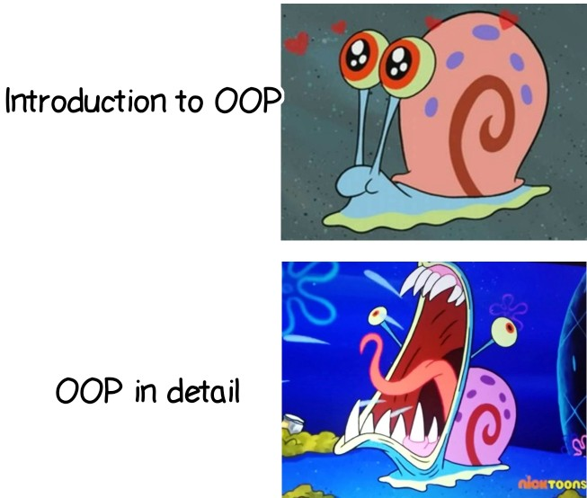
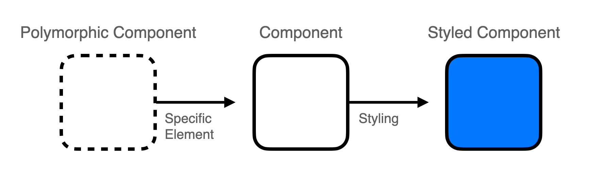

어떤 프로덕트를 만들든, 어떤 디자인 시스템을 만들든, 공통 컴포넌트를 개발하는 일은 정말 흔하다.
공통 컴포넌트를 만들 때 제일 고민이 되는 부분은, 단연코 다형성과 추상화라고 할 수 있을 것 같다.

> 컴포넌트 또한 객체지향의 관점에서 보자면 하나의 독립적인 객체이며, 컴포넌트 합성은 객체들 간의 협업이라고 볼 수 있으니 말이다.


> 객체지향 이야기는 여기에서 그만!

&nbsp;

공통 버튼 컴포넌트를 만드는 상황을 떠올려보자.

```tsx
const Button = (props: ButtonHTMLAttributes<HTMLButtonElement>) => {
  return <button {...props} />;
};

const App = () => {
  return (
    <div>
      <Button onClick={() => alert('Hi!')}>Hello World!</Button>
    </div>
  );
};
```

위 컴포넌트는 (좀 더 고도화는 되어야겠지만) 꽤나 확장성있게 사용될 수 있을 것 같다. 그러나 만일 버튼에 링크를 추가하고 싶다면 어떻게 해야 할까?  

*App에서 버튼을 사용할 때 \<a> 태그로 감싸야할까?*  
*\<a> 태그로 감싸진 별도의 LinkButton을 구현할까?*
*isLink 같은 옵션을 받아 분기 처리를 할까?*

하지만 그럴 경우, \<a> 태그가 확장되지 않는다는 문제점과 컴포넌트의 의존 관계가 새롭게 추가된다는 문제점이 있다.
컴포넌트의 내부 로직도 쓸데없이 복잡해질 수 있다.
게다가 react-router나 Next.js의 Link 컴포넌트를 사용한다면 또 새로운 컴포넌트를 만들거나 또 새로운 분기처리가 발생하게 된다.

이 문제의 해결법으로 Polymorphic 컴포넌트를 이야기해볼 수 있다.

&nbsp;

## Polymorphic Component

Polymorphism은 다형성이다. 객체지향에 조금이라도 관심이 있는 사람이라면 귀가 닳도록 들어봤을 것이다.
다형성이란 무엇인가? 여러 가지의 형태를 가지는 것이다.
프로그래밍에서의 다형성이라고 한다면, 여러 형태로 다루어질 수 있는 객체 정도로 볼 수 있겠다.
그럼 Polymorphic한 컴포넌트란 다양한 형태로 표현될 수 있는 컴포넌트라고 말할 수 있을 것이다.

다양한 속성, 시멘틱, 스타일 등등을 표현할 수 있는 컴포넌트. 가장 추상적인 컴포넌트.
Polymorphic 컴포넌트에 특정 요소들을 주입하면 우리가 일반적으로 부르는 컴포넌트가,
그리고 컴포넌트에 스타일을 주입하면 최종적으로 화면에 보여지는 Styled 컴포넌트가 되는 것이라고 볼 수 있다.



Polymorphic 컴포넌트는 생각보다 널리 사용되고 있는 패턴이다.
MUI의 Box 컴포넌트와 Mantine의 Box 컴포넌트의 경우, Box라는 Polymorphic한 컴포넌트로 재사용성과 확장성을 높이고 있다.

위의 두 Box 컴포넌트는 `component`라는 속성을 통해 컴포넌트 내부에서 렌더링 되는 엘리먼트를 동적으로 결정한다.
component는 너무 기니까, `as`라는 속성을 가지는 Polymorphic 컴포넌트를 한 번 만들어보자.

&nbsp;

### JavaScript로 구현하기

자바스크립트는 타입으로부터 자유롭기 때문에 좀더 쉽게 Polymorphic 컴포넌트를 구현할 수 있다.

```jsx
const Polymorphic = forwardRef(({ as, ...props }, ref) => {
  const Element = as || 'div';
  return <Element ref={ref} {...props} />;
});
```

`as`를 통해 어떠한 컴포넌트로도 될 수 있으며, 필요한 속성을 자유롭게 넘길 수 있고, forwardRef를 통해 부모 컴포넌트에서 요소에 접근할 수 있다.

위 Polymorphic을 활용하면 아까 발생했던 문제점을 해결할 수 있다.

```jsx
const Button = ({ as, ...props }) => {
  return <Polymorphic as={as || 'button'} {...props} />;
};

const App = () => {
  return (
    <div>
      <Button as="a" href="">Hello World!</Button>
    </div>
  );
}
```

새로운 LinkButton을 추가하는 대신, Polymorphic 컴포넌트로 더 유연하게 컴포넌트를 사용할 수 있게 되었다.

&nbsp;

### TypeScript로 구현하기

자바스크립트로 구현할 경우, 잘못된 값을 as로 넘겨주는 문제가 발생할 수도 있다.

한 번 타입스크립트로 안전한 Polymorphic 컴포넌트를 구현해보자.
제네릭을 활용하여 구현할 수 있다.

```tsx
type AsProp<T extends React.ElementType> = {
  as?: T;
};

type PolymorphicRef<T extends React.ElementType> =
  React.ComponentPropsWithRef<T>['ref'];

type PolymorphicComponentProps<
  T extends React.ElementType,
  Props = {},
> = AsProp<T> &
  React.ComponentPropsWithoutRef<T> &
  Props & {
    ref?: PolymorphicRef<T>;
  };

const Polymorphic = <T extends React.ElementType = 'div'>({
  as,
  ...props
}: PolymorphicComponentProps<T>) => {
  const Element = as || 'div';
  return <Element {...props} />;
};

const App = () => {
  return (
    <div>
      <Polymorphic as="a" href="">
        Hello World!
      </Polymorphic>
    </div>
  );
};
```

&nbsp;

코드가 벌써부터 복잡하다. 하지만 아직 끝나지 않았다. forwardRef를 통해 부모 컴포넌트에서 요소에 접근할 수 있어야 한다.

```tsx
type PolymorphicProps<T extends React.ElementType> = {
  as?: T;
} & React.ComponentPropsWithoutRef<T>;

type PolymorphicComponent = <C extends React.ElementType = 'div'>(
  props: PolymorphicProps<C> & {
    ref?: React.ComponentPropsWithRef<C>['ref'];
  },
) => React.ReactNode;

const Polymorphic = forwardRef(
  <T extends React.ElementType = 'div'>(
    { as, ...props }: PolymorphicComponentProps<T>,
    ref: React.Ref<T>,
  ) => {
    const Element = as || 'div';
    return <Element ref={ref as any} {...props} />; // LegacyRef와 관련된 타입에러로 인한 any 단언문
  },
);

const App = () => {
  const ref = useRef<HTMLAnchorElement>(null);

  return (
    <div>
      <Polymorphic as="a" href="" ref={ref}>
        Hello World!
      </Polymorphic>
    </div>
  );
};
```

&nbsp;

타입스크립트로 Polymorphic 컴포넌트를 작성해보았다.
이제 한 번 버튼 컴포넌트를 Polymorphic하게 작성해보자.

```tsx
type ButtonProps<T extends React.ElementType> = PolymorphicComponentProps<
  T,
  ButtonHTMLAttributes<T>
>;

type ButtonComponent = <T extends React.ElementType = 'button'>(
  props: ButtonProps<T>,
) => React.ReactElement | null;

const Button: ButtonComponent = forwardRef(
  <T extends React.ElementType = 'button'>(
    { as, ...props }: ButtonProps<T>,
    ref: PolymorphicRef<T>['ref'],
  ): React.ReactElement | null => {
    const Element = as || 'button';
    return <Element ref={ref} {...props} />;
  },
) as ButtonComponent;

const App = () => {
  const anchorRef = useRef<HTMLAnchorElement>(null);
  const buttonRef = useRef<HTMLButtonElement>(null);

  return (
    <div>
      <Button as="button" ref={buttonRef}>
        asdf
      </Button>
      <Button as="a" href="" ref={anchorRef}>
        asdf
      </Button>
    </div>
  );
};
```

> ~~사실 코드를 작성하면서도 이게 제대로 된 타이핑인지 의심이 가긴 한다~~

어쨌거나 렌더링을 해보면..


잘 동작하는 것을 확인할 수 있다.

&nbsp;


> 추상화, 참 쉽죠?

&nbsp;

Polymorphic 컴포넌트를 활용하면 하나의 컴포넌트로 여러 요소와 속성을 사용할 수 있고,
다른 컴포넌트를 합성하는 것도 가능하다. 따라서 가장 추상화된 형태의 컴포넌트를 만들 수 있다.

하지만 확실히 모호한 부분이 있다. 위 코드를 봤을 때만 하더라도 정확히 어떻게 렌더링되는 것인지 알기 쉽지 않다.
타입 추론 또한 어려운 부분이 있다.

이에 대한 대안으로 **Render Delegation**이 등장했으니, 다음 시간에 알아보도록 하자!

&nbsp;

> ### Reference
> - [Polymorphic한 React 컴포넌트 만들기](https://kciter.so/posts/render-delegation-react-component/)

```toc
```