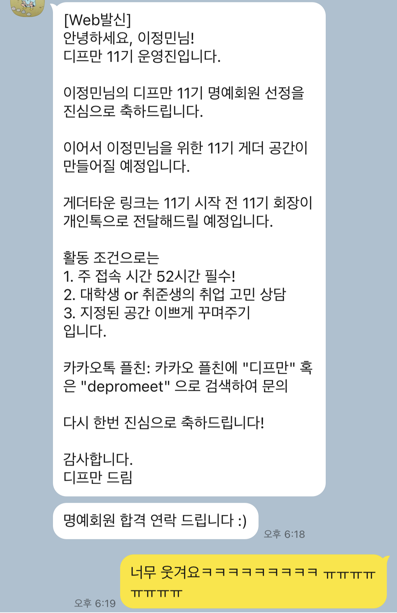

# 입학

나는 경희대학교 컴퓨터공학과에 18학번으로 입학했었다.


사실 컴퓨터공학과에 생각이 있었던 건 아니다. 당시엔 개발 붐이 일어나기 전이었기에, 컴공이라는 과를 떠올리지도 못했다. 수시파 친구들의 경우 생기부와 자소서를 3년 내내 관리해야 하다 보니 자연스레 진로를 일찍부터 고민하게 되는데, 나의 경우 100% 정시파였고 (내신은 거의 4등급 정도 됐었던 걸로 기억한다..ㅎㅎ) 미래에 대해서는 딱히 아무 생각이 없었다. 어떻게든 되겠지~했던 안일했던 나..

고등학생 시절 제일 좋아했던 과목은 생물이었다. 교육과정에 해당하는 내용 뿐만 아니라 따로 미생물학, 세포학 쪽으로 추가적인 공부를 했을 만큼 관심이 많았다. 생물을 좋아하게 된 계기는 학원 선생님 때문이었지만.. 그래서 그냥 생물학과 가서 연구원을 하고 싶다는 막연한 생각이 있었다.

그런데 막상 수능이 끝나고 정시 원서를 내려니, 겁이 나기 시작했다. 지식인에 생물학과 전망을 검색하니 암울하다는 내용 뿐이었다.(학과 비하 발언 아닙니다.) 대학교 4년이라는 시간이 짧은 시간이 아닌데, 그리고 등록금도 한 두 푼 하는 게 아닌데, 전공을 살리지 못한다면 그 시간과 돈이 너무 아까울 것 같다는 생각이 들었다. 그렇다면 전공이 유망한 과가 어디지? 일단 공대를 가야 하는 건가? 근데 물리랑 수학은 죽어도 하기 싫은데, 좀 덜 하는 과가 있나? 해서 찾은 게 컴퓨터공학과였다. 학교마다 차이는 있겠지만, 경희대 컴공의 경우 수학/물리 과목의 비중이 다른 과에 비해 절대적으로 적었다.

그래도 적성에 안 맞는데 무턱대고 원서를 넣을 수는 없으니, 코드카데미에 들어가서 며칠 동안 코딩을 해봤던 기억이 난다. 그땐 자바하면 자바칩 프라푸치노밖에 모르던 시절이었는데..

&nbsp;

# 1학년

1학년은 광기 그 자체였다. 수업도 잘 안 듣고 술만 마시고 놀았다. 3년 내내 억눌렀던 자아가 튀어나와 고삐 풀린 망아지마냥 놀아제꼈다. 지금 생각하면 참 부끄럽기도 하고 후회되기도 하는 장면들이 스쳐 지나가지만, 그래도 그렇게 최선을 다해 놀았기에 다시 독하게 마음먹고 정신을 차릴 수 있었던 게 아닐까 싶다.

1학년은 정말 빠르게 지나갔다. 그냥 술먹고 놀다 보니 봄에서 겨울이 되어 있었다. 영통에서 술만 먹고 놀 게 아니라, 여행도 좀 다니고 이것저것 많이 해봤더라면 얼마나 좋았을까. 지금은 가려고 해도 상황이 영 따라주지 않는데 말이다. 여행 귀찮다며 방에 틀어박혀 미드 정주행이나 했던 내가 조금은 원망스럽기도 하다.

&nbsp;

# 2학년

하루하루가 즐겁고 자극적이었던 1학년 때와는 달리, 2학년 때는 걱정도 많아졌던 시기였다. 교우 관계에도 스트레스를 많이 받았고(물론 오해였고 잘 풀렸지만) 전공 공부를 어떻게 해나가야 할지 도무지 감이 잡히지 않아 많이 힘들었었다. 그래도 별 수 있나, 그냥 적당히 학교 공부하고 적당히 놀면서 1년을 보냈다. 열심히 공부했지만 전공 성적은 생각보다 잘 나오지 않았다. 컴퓨터공학이 나한테 맞는 길일까? 하는 고민도 수도 없이 했다. 걱정은 많았지만 정작 실천한 것은 없었던 1년이었다.

2학년 2학기에 나는 구세주와도 같은 수업을 만나게 된다. 오픈소스SW프로젝트라는 과목이었는데, 깃, 노드, aws 등 새롭고 신기한 기술들을 가르쳐주는 수업이었다. 맨날 시간 복잡도니, 포인터니 따분한 것만 하다가 그런 걸 배우니 새로운 세상에 눈 뜬 것 같았다. 그 수업에서 나는 js, css, html을 처음 만났다. 그리고 결과물이 눈에 바로 보이니 너무 신기하고 재밌었다. 그렇게 프론트엔드에 눈을 뜨기 시작했다. 지금에야 그 수업이 정말 중요했음을 알지만, 그 당시에는 깨닫지 못했다. 그래서 깃을 대체 언제 쓰는데? ec2, s3는 뭐 어디서 쓰이는 건데? 하는 의문점이 가득한 채로 무지성으로 실습을 따라 할 뿐이었다. 좀 더 이해하며 했으면 좋았을 텐데. 그래도 그 수업이 내 인생의 전환점이 되어준 것은 틀림없는 사실이다.

그렇게 2학년이 끝나고 겨울방학이 찾아왔을 때, 또 한 번의 두려움을 느끼게 된다. 이렇게 대학 생활의 반이 지나갔는데 정작 내 머리에 남은 것은 아무 것도 없다는 현실. 그리고 나머지 2년도 이렇게 지나간다면 정말 아무것도 머리에 들지 않은 채로 졸업을 하게 될 것이라는 것. 뭐라도 해야 했다. 그래서 다짜고짜 프론트엔드를 더 파기 시작했다. 겨울방학을 맞이한 그 순간부터, 하루도 빠짐없이 노트북을 열어서 강의를 듣고 코딩을 했다. 노마드코더가 특히 큰 도움이 되었다. 입문자가 개발에 재미를 붙이는 데에는 그만한 강의가 없는 것 같다.

이런다고 내가 성장을 할 수 있을까?하는 의심이 수도 없이 들었지만, 그냥 닥치는 대로 했다. 매일 하다 보면 어제의 나보다 조금이라도 나아지는 게 있겠지. 방학 내내 1일 1 커밋을 하며 보냈다. 그렇게 2학년 겨울방학을 지냈다.

&nbsp;

# 3학년

### 1. 멋쟁이사자처럼
이제 정말 딱 반이 남았다. 더욱더 뭐라도 해야 했다. 'IT 동아리를 해봐야겠다.' 처음엔 교내 멋쟁이사자처럼이었다. 하지만 워낙 학교 별로 분위기가 상이했고, 경희대 멋사는 휘청거리던 시기였기에 제대로 운영이 되지 않은 채 끝나게 되었다. 좀 더 크고 체계적인 동아리를 찾아봐야겠다. 그래서 찾은 게 솝트였다.

### 2. 솝트 + 스타트업 현장실습
지금은 솝트에 웹 파트가 있지만, 내가 YB로 참여했던 당시에는 웹 파트가 없었다. 그래서 노드로 하는 서버 파트와 같은 클라이언트 쪽인 안드로이드 파트 중에 고민하다가 안드로이드에 지원하게 되었다. 당시 친한 친구들과 다 같이 솝트에 지원했는데, 나 혼자 붙었다. 왜 붙었는지는 모르겠지만 그만큼 간절해 보이긴 했나 보다.


웹 프론트엔드만 하다가 안드로이드를 하려니 생각보다 고역이었다. 언어도 아예 다르고 개발 환경도 아예 다르니 도무지 적응이 되질 않았다. 다시 프론트로 돌아가고 싶은 심정뿐이었다. 그래도 많이 놀았으면 몰라, 솝트 행사는 주로 서울에서 열렸고 나는 수원 영통에 거주 중이었다. 술을 그렇게 좋아하던 내가 솝트 모임에는 가질 못했다. 그래도 이왕 시작한 거 끝까지 해보자 싶었고 솝트의 꽃, 솝트의 해커톤인 앱잼까지 참여하게 되었다.

나는 당시 앱잼이 좋은 기억으로 남아 있지는 않다. 3-1이 끝나고 산학학점을 따기 위해 스타트업 현장 실습을 나가 일을 하던 상황이었기에 많이 바빴고, 다 같이 합숙하는 분위기에 내가 낄 자리는 없었다. 나 빼고 다 친한 것 같은 분위기 속에서 심지어 나는 안드로이드 개발을 잘 하지도 못했다. 해야 할 일도 제대로 못 쳐내, 숙소에 자주 오지도 않아, 나만 동떨어진 기분이었다. 정말 스트레스를 많이 받았던 시기였다.

| | |
| - | - |
|  |  |

그래도 대상은 받았다.

### 3. 디프만 + 스타트업 파트타임
앱잼이 끝나갈 무렵, 다른 동아리 모집 공고를 보게 되었다. '디프만'. 개발로 날고 긴다는 선배들이 활동하는 동아리라는 인식이 컸기에 디프만은 꿈의 동아리였다. 실제로 2학년 때 깃허브도 없던 시절 지원을 했다가 칼같이 떨어졌다. 그래도 혼자 프론트 개발도 열심히 해봤고, 외부 동아리도 두 번 해봤는데 이번엔 붙을 수도 있지 않을까..?하는 마음에 지원했다. 그리고 붙었다. 혼자 더 어떻게 개발을 해야 할지도 모르겠고 지금 더 배울 수 있는 곳이 보이지 않던 암흑과도 같은 곳에서의 한 줄기 빛이었다.

| | | |
| - | - | - |
|  |  |  |

지금은 개발자만 거의 70명 뽑고 있는데, 정말 적게 뽑았었구나 싶다. 지금은 개발자 지원자만 700명인데...

디프만 면접 당시, 왼쪽에는 배민 프론트 개발자가, 오른쪽에는 KT 프론트 개발자가 있었다.(어떻게 붙은 거지) 맨날 대학생들끼리만 있다가 현직자들을 보니 신기할 따름이었다. 어쨌거나 지금은 내가 현직자가 되어있네. 이것도 신기할 따름이다ㅎㅎ

앱잼과 단기 현장실습이 끝이 나고, 디프만이 시작되었다. 그렇게 여름 방학이 끝이 났다. 그리고 코로나가 본격적으로 시작되었다. 학교는 전면 비대면으로 전환되었다. 개강을 했는데 학교를 갈 일이 없었다. 그래서 현장실습을 진행했던 곳에서 파트타임으로 계속 일하지 않겠냐는 제의를 받았다. 회사에서 일하다가 수업 듣고, 이만한 꿀이 어딨겠나 싶었다. 그렇게 업무와 학업을 병행하는 삶이 시작되었다.

디프만은 8기를 거쳐 9기 운영진, 10기 운영진으로까지 참여했다. 그만큼 애정도 깊은 동아리다. 디프만 사이트를 만들기도 했었고 컨퍼런스를 진행하기도 했었다. 디프만에서 만난 인간관계가 현재 내 인간관계의 주축을 이루고 있을 정도로 디프만은 내 삶에 큰 영향을 끼쳤다. 디프만에서 난 정말 많은 성장을 이룰 수 있었다. 글을 쓰는 시점에서, 곧 11기가 시작될 예정이다. 그리고 나는 11기 명예회원(?)이 되었다 ㅋㅋㅋ



### 4. AUSG + 메가존클라우드 + 솝트
아우쓱은 aws 대학생 동아리다. 친한 친구가 모집공고를 발견하고는 같이 해보지 않겠냐해서 지원하게 되었다. 프로젝트를 진행하는 빡센 동아리기 보다는, 커뮤니티 성의 잔잔하고 끈끈한 느낌의 동아리였다. 좋은 사람들과 좋은 만남을 가지던 중, 거기서 친해진 언니가 본인의 회사에서 인턴을 해 볼 것을 권유했다. 나야 너무 좋은 제안이었다. 바로 서류를 내고 면접을 보고 퇴사를 하고 입사를 했다.


AUSG 덕에 좋은 사람들을 만날 수 있었고, 좋은 기회들을 얻을 수 있었다. 하지만 문제는 내 자존감이었다. 아우쓱은 대학생 동아리임에도 불구하고 현직자의 비중이 높았다. 학교를 다니면서 정직원으로 근무하는 미친 커리어의 실력자들이 많았다. 그리고 나는 그 사람들과 나를 비교하기 시작했다. 저 사람들은 저렇게 번듯한 개발자로서 일하고 있는데, 나는 지금 뭘 하고 있는 거지? 나도 정직원으로서 학업과 업무를 병행하고 싶었다. 하지만 현실은 그렇지 않았다. 그렇다고 내가 극복할 수 있는 방법이 딱히 보이는 것도 아니었다. 그래서 동아리 활동을 줄이기 시작했다. 저 사람들이 아주 특별한 케이스인 걸 알지만, 그래도 내가 못나 보이는 건 어쩔 수 없었다.

와중에 이번 솝트 새로운 기수에는 웹 파트가 생겼다는 소식을 듣게 되었다. 그럼 비활OB로 앱잼에만 참여해볼까? 안드로이드 말고, 정말 내가 하고 있는 웹으로 솝트에서 프로젝트를 해보고 싶었다. 그렇게 쿠키파킹을 만들게 되었다.

하지만 쿠키파킹 역시 내가 기여한 몫이 많았냐고 묻는다면 그렇다고 말 할 순 없을 것 같다. 회사와 앱잼을 병행하는 것은 생각보다 힘든 일이었다. 그래도 내 목표는 '내가 쓰는 서비스를 만드는 것'이었고, 나는 1년이 지난 지금도 쿠키파킹을 매일 쓰고 있다. 그 자체로도 고마운 경험이 되어준 프로젝트다 :)

&nbsp;

# 4학년
더 이상 재학생을 인턴으로 받지 않겠다는 메클의 통보로, 나는 4-1의 시작과 함께 새로운 길을 찾아야 했다. 그리고 타이밍 좋게 네이버 인턴에 합격했다. 처음으로 해보는 전환형 인턴. 이것만 잘 되면 나는 꿈에 그리던 '학생 직장인'이 가능해지는 것이었다. 6주를 최선을 다해 보냈다. 하지만 전환에 실패하고 말았다. 이제 어떡해야 하나 걱정하던 와중, 아우쓱에서 친해진 당근마켓 프론트엔드 개발자 지인의 추천을 받고 당근마켓 면접을 보게되었다, 결과는 또 탈락이었다. '아 내가 아직 정직원이 될 만한 수준의 실력은 아니구나.'를 명백히 깨달았던 순간들이었다. 엄청난 좌절감에 휩싸였다. 난 어떻게 더 공부를 해야 하는 거지? 사이드 프로젝트도 여러 번 했어, 동아리도 여러 개 했어, 인턴도 여러 번 했어. 그럼 면접 실력을 키워봐야겠다. 그렇게 나의 서류 던지기가 시작됐다.

던지기..는 장난식 표현이고, 평소 눈여겨보던 회사들에 서류를 냈다. 서류는 신입의 것 치고는 나쁘지 않은 편이었던 것 같다. 서류는 대부분 통과할 수 있었다. 문제는 면접이었다. 경력직 채용에도 지원을 많이 했기에 면접의 난이도가 높은 편이었다. 줄줄이 떨어졌다. 정직원 채용에서 최종 합격한 유일했던 곳은 신입 채용이었다. 하지만 이번에는 연봉협상이 잘 되지 않았다. 끝인 줄 알았는데 다시 시작이었다. 난 진짜 안 되는 사람인 걸까?

### 1. 우아한테크캠프
라고 생각할 때, 우테캠에 합격했다. 사실 우테캠 합격 소식이 마냥 기쁘지만은 않았다. 또 인턴이라니... 인턴만 네 번째니 진이 빠지는 느낌이었다. 그래도 별 수 있나, 이게 마지막이 되었으면 좋겠다는 생각으로 최선을 다할 수밖에 없었다.

### 2. 당근마켓 + 막 학기
우테캠이 막바지를 향해 달려가고 있을 때 쯤, 당근마켓 mvp 인턴십 공고가 떴다. 그리고 당시 친했던 우테캠 동기들 중 한 명을 꼬드겨 같이 지원했다. 결과는 둘 다 합격이었고, 나는 '당장모아'라는 서비스로 3개월 동안 열심히 달리게 되었다. 당근마켓 인턴도 참 다사다난했다. 프로젝트도 난황을 겪는 와중 우아한형제들 전환 면접도 준비해야 했다. 육체적으로도 정신적으로도 스트레스를 많이 받았었다. 그래도 다 끝난 지금 시점에서 보면, 정말 하길 잘 했다는 생각이 들 뿐이다. 소중한 사람들도 얻을 수 있었고, 다른 무엇과도 비교하지 못할 경험도 얻을 수 있었다.

당시 그 동기가 했던 말이 있다. '아, 당근마켓 인턴 붙었는데 우형 최종도 붙어서 더 적은 월급 받으면서도 행복해하고 싶다~'

근데 그 말이 사실이 되었다. 우형 최종 면접에도 합격하게 되었다. 그렇게 막 학기는 더 이상의 취준 걱정 없이, 당근마켓과 병행하며 보내게 되었다.

**12월, 당근마켓과 막 학기가 끝났다.**
**1월, 우아한형제들에 입사했다.**
**2월, 경희대학교를 졸업했다.**

사진 잘 나왔으니까 올려야지 희희

| | | |
| - | - | - |
|  |  |  |

| | | |
| - | - | - |
|  |  |  |


여하튼, 정말로 다사다난했던 4년이었다. 방금 전화 통화한 친구가 술에 취해서 한 말이 있다.

"너처럼 살지 말되, 너처럼 살기로 했어."

내 저학년의 모습은 별로고 내 고학년의 모습은 좋다는 거겠지. 그만큼 극적인 변화를 스스로에게 주면서 시간을 보냈던 것 같다.

이제 정말 끝! 대학생 안녕~~~~~

```toc
```